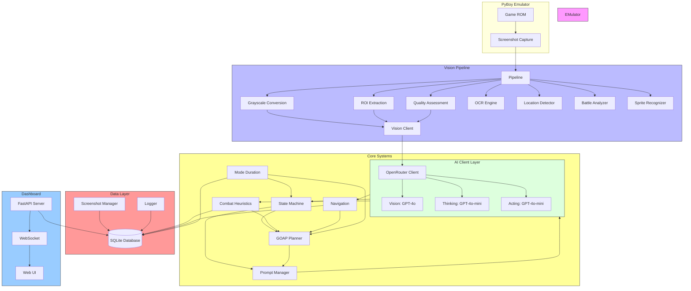
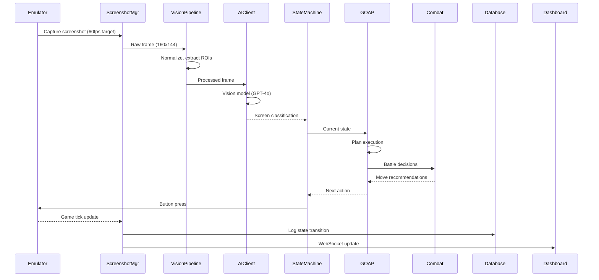
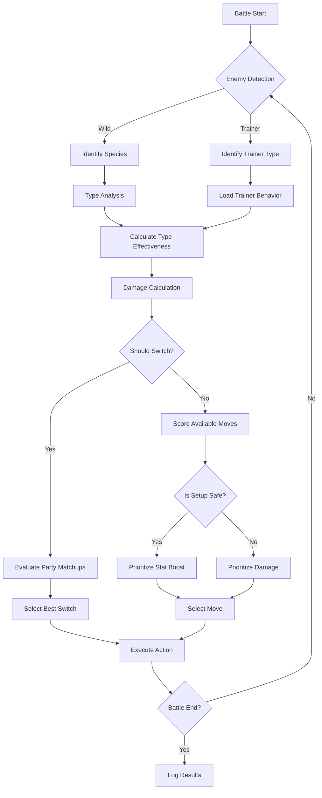
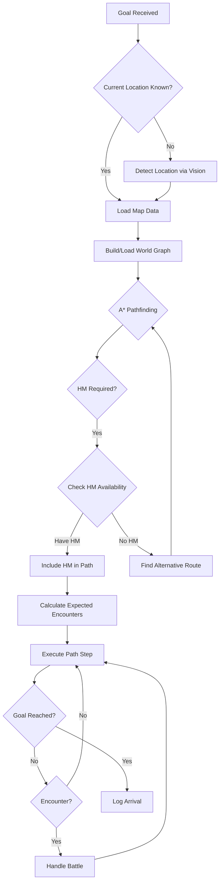
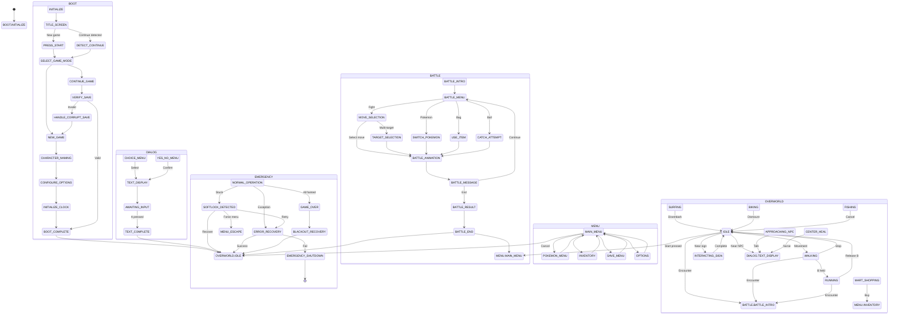

# PTP-01X Architecture Documentation

## 1. System Overview

PTP-01X is an Orchestrated Intelligence Framework for autonomous Pokémon gameplay, implementing a sophisticated pipeline that transforms raw emulator screenshots into strategic decisions and tactical actions. Unlike traditional reinforcement learning approaches that require millions of training episodes, PTP-01X leverages modern vision-language models to achieve competent gameplay through perceptual understanding and reasoning. The system operates at approximately 2 ticks per second, balancing thorough analysis with responsive gameplay.

The architecture follows a cyclical data flow pattern: **Screenshot Capture → Vision Analysis → Strategic Reasoning → Tactical Decision → Action Execution → Logging**. Each stage in this pipeline contributes specific capabilities to the overall decision-making process. The vision layer interprets visual game state through both local heuristics and cloud-based multimodal models. The reasoning layer maintains strategic context and long-term objectives using a goal-oriented action planning (GOAP) system. Finally, the tactical layer converts high-level plans into immediate button presses based on current battle conditions.

PTP-01X differentiates itself from RL-based approaches in several fundamental ways. First, it requires zero training data specific to Pokémon gameplay—general-purpose vision-language models provide the perceptual foundation. Second, it offers transparent reasoning: every decision can be traced back to explicit strategic considerations rather than opaque neural network activations. Third, it adapts dynamically: the GOAP planner can replan mid-execution when conditions change, and the mode duration tracking system learns expected time distributions for different game states to detect anomalies. Finally, it supports multi-model coordination, allowing different specialized models to handle vision, strategic planning, and tactical decisions based on their respective strengths.

## 2. Component Diagram



The component diagram illustrates the six primary layers of PTP-01X. The PyBoy emulator provides the game execution environment and screenshot capture interface. The Vision Pipeline preprocesses images and routes them to appropriate analysis modules. The AI Client Layer coordinates with OpenRouter to access multiple specialized models. Core Systems contain the state machine, GOAP planner, combat heuristics, navigation, and mode duration tracking. The Data Layer persists all game state, logs, and screenshots to SQLite. The Observability Dashboard provides real-time monitoring via FastAPI and WebSockets.

## 3. Core Modules Detail

### 3.1 Hierarchical State Machine (69 states)

The Hierarchical State Machine (HSM) implementation spans `src/core/state_machine.py` and provides the behavioral backbone for game state management. It organizes 69 states across 8 high-level categories: BOOT (13 states), TITLE (3 states), MENU (8 states), DIALOG (5 states), OVERWORLD (13 states), BATTLE (11 states), EMERGENCY (9 states), and TRANSITION.

```python
# State type categories define high-level behavior
class StateType(Enum):
    BOOT = auto()
    TITLE = auto()
    MENU = auto()
    DIALOG = auto()
    OVERWORLD = auto()
    BATTLE = auto()
    EMERGENCY = auto()
    TRANSITION = auto()

# Bootstrap sequence states
class BootSubState(Enum):
    INITIALIZE = auto()
    TITLE_SCREEN = auto()
    PRESS_START = auto()
    DETECT_CONTINUE = auto()
    SELECT_GAME_MODE = auto()
    NEW_GAME = auto()
    CONTINUE_GAME = auto()
    VERIFY_SAVE = auto()
    CHARACTER_NAMING = auto()
    CONFIGURE_OPTIONS = auto()
    INITIALIZE_CLOCK = auto()
    BOOT_COMPLETE = auto()
    HANDLE_CORRUPT_SAVE = auto()
```

The HSM enforces legal transitions between states, preventing impossible game state sequences. For example, the bootstrap sequence must proceed through INITIALIZE → TITLE_SCREEN → PRESS_START → SELECT_GAME_MODE before reaching BOOT_COMPLETE. Battle transitions are similarly constrained: BATTLE_MENU can transition to MOVE_SELECTION, SWITCH_POKEMON, USE_ITEM, or CATCH_ATTEMPT, but not directly to BATTLE_RESULT.

Emergency states form a safety net for handling softlocks, errors, and game-over conditions. The EMERGENCY.SOFTLOCK_DETECTED state can transition to ERROR_RECOVERY, MENU_ESCAPE, or OVERWORLD.IDLE depending on the detected condition. The HSM also maintains state transition history for debugging and can trigger callbacks on any transition, enabling integration with logging and monitoring systems.

### 3.2 Mode Duration Tracking (10 classes)

The Mode Duration Tracking system in `src/core/mode_duration.py` monitors how long the AI spends in various game modes, learning expected durations and detecting anomalies. It comprises 10 interconnected classes that provide comprehensive temporal awareness.

| Class | Purpose |
|-------|---------|
| `ModeClassifier` | Determines current game mode from state |
| `DurationTracker` | Tracks entry/exit times for modes |
| `DurationProfileLearner` | Learns expected durations per mode |
| `DurationProfileStore` | Persists duration profiles to JSON |
| `AnomalyDetector` | Detects deviations from learned profiles |
| `AnomalyResponseSelector` | Selects appropriate response to anomalies |
| `BreakoutManager` | Executes breakout strategies |
| `BreakoutAnalytics` | Tracks breakout success rates |
| `ModeDurationEscalation` | Manages escalation tiers |
| `ModeDurationTrackingSystem` | Coordinates all components |

The system learns duration profiles using exponential smoothing, with a default alpha of 0.3 for adaptive learning. Default thresholds exist for common modes: battles have a 300-second warning threshold, dialog 60 seconds, navigation 300 seconds. When durations exceed thresholds, the AnomalyDetector generates alerts that trigger escalation through five tiers: NONE, ENHANCED_MONITORING, PLAN_SIMPLIFICATION, EMERGENCY_PROTOCOL, and RESET_CONDITION.

### 3.3 Vision & Perception Engine (6 modules)

The Vision Pipeline in `src/vision/pipeline.py` and related modules process screenshots through multiple specialized stages. The six core modules are:

| Module | File | Function |
|--------|------|----------|
| `VisionPipeline` | `pipeline.py` | Normalization, ROI extraction |
| `OCREngine` | `ocr.py` | Text extraction from dialog/menus |
| `SpriteRecognizer` | `sprite.py` | Pokemon sprite identification |
| `BattleAnalyzer` | `battle.py` | Battle state analysis |
| `LocationDetector` | `location.py` | Overworld location identification |

```python
# VisionPipeline processing stages
class VisionPipeline:
    TARGET_SIZE = (224, 224)
    NATIVE_RESOLUTION = (160, 144)
    ASPECT_RATIO = 160 / 144

    def process(self, raw_screenshot, extract_rois=True):
        frame_hash = self._compute_frame_hash(raw_screenshot)
        is_duplicate = self._check_duplicate(frame_hash)
        normalized = self._normalize_aspect_ratio(raw_screenshot)
        grayscale = self._convert_to_grayscale(normalized)
        resized = self._resize_to_target(grayscale)
        # ROI extraction for battle menu, dialog box, HUD
        roi_battle_menu = self._extract_battle_menu(resized) if extract_rois else None
        roi_dialog_box = self._extract_dialog_box(resized) if extract_rois else None
        roi_hud = self._extract_hud(resized) if extract_rois else None
        return PreprocessingResult(...)
```

The pipeline uses perceptual hashing (pHash) for duplicate frame detection, preventing redundant analysis of static screens. Softlock detection triggers when more than 10 consecutive frames appear unchanged, signaling potential AI confusion or game hang.

### 3.4 Tactical Combat Heuristics (5 core classes)

The Combat system in `src/core/combat.py` implements battle decision-making through five specialized classes:

| Class | Purpose |
|-------|---------|
| `TypeChart` | 18-type effectiveness matrix (306 interactions) |
| `DamageCalculator` | Gen 1 exact damage formula |
| `MoveSelector` | Move scoring with STAB, effectiveness, accuracy |
| `EnemyPredictor` | Enemy behavior and move set prediction |
| `BattleStrategist` | Switch decisions, catch probability, risk assessment |

```python
# Gen 1 damage calculation
class DamageCalculator:
    def calculate_base_damage(self, level, power, attack, defense,
                               stab=1.0, type_effectiveness=1.0,
                               is_critical=False, random_factor=1.0):
        base_damage = (((2 * level / 5 + 2) * power * attack / defense) / 50) + 2
        modifier = stab * type_effectiveness * random_factor
        if is_critical:
            modifier *= 2.0
        final_damage = int(base_damage * modifier)
        return max(1, final_damage)
```

The TypeChart implements Generation I mechanics with 18 types and 306 type interactions. Effectiveness values include: 0.0 (immune), 0.5 (not very effective), 1.0 (neutral), 2.0 (super effective), and 4.0 (very super effective against dual types). The MoveSelector scores available moves using a weighted formula: base_score = power/10 × effectiveness_multiplier × accuracy_factor × coverage_bonus, with additional modifiers for STAB, guaranteed KOs, and priority moves.

### 3.5 World Navigation (A*, HM dependencies)

The Navigation system in `src/core/navigation.py` implements tile-based pathfinding with Hidden Machine move dependencies:

```python
# A* pathfinding with HM-aware cost calculation
class AStarPathfinder:
    def find_path(self, start, goal, context):
        open_set: List[Tuple[float, Position]] = []
        came_from: Dict[Position, Position] = {}
        g_score: Dict[Position, float] = {start: 0.0}
        f_score: Dict[Position, float] = {start: start.manhattan_heuristic(goal)}

        while open_set:
            _, current = heappop(open_set)
            if current == goal:
                return self._reconstruct_path(start, goal, came_from, ...)
            for edge in self.graph.get_neighbors(current, context):
                tentative_g = g_score[current] + self._calculate_movement_cost(...)
                if tentative_g < g_score.get(neighbor, float('inf')):
                    came_from[neighbor] = current
                    g_score[neighbor] = tentative_g
                    heappush(open_set, (f_score[neighbor], neighbor))
```

The navigation graph encodes tile types (PASSABLE, BLOCKING, LEDGE, WATER, HM_BLOCK, WARP, TALL_GRASS, TRAINER_VISION, etc.) and HM requirements. Movement costs vary by terrain: tall grass increases encounter likelihood and thus cost (2.0x by default, 5.0x if avoiding encounters). Water tiles require Surf (HM03) unless Flash is available. Ledges have asymmetric costs (down is 0.9x, up is 2.0x).

### 3.6 GOAP Decision Core (6 goals, 4 action types)

The Goal-Oriented Action Planning system in `src/core/goap.py` manages high-level decision-making through six goal types and four action categories:

| Goal Type | Purpose |
|-----------|---------|
| `DefeatGymGoal` | Challenge and defeat gym leaders |
| `CatchPokemonGoal` | Capture specific species |
| `ReachLocationGoal` | Navigate to objectives |
| `HealPartyGoal` | Visit Pokemon Centers |
| `TrainPokemonGoal` | Level grinding |
| `ObtainItemGoal` | Acquire items from shops |

| Action Type | Purpose |
|-------------|---------|
| `NavigateAction` | World movement via A* |
| `BattleAction` | Combat engagement |
| `MenuAction` | Inventory and menu operations |
| `DialogAction` | NPC interactions |

```python
# Goal prioritization with multi-factor scoring
class GoalPriorityCalculator:
    def calculate_priority(self, goal, state):
        base_priority = goal.priority
        temporal = self._calculate_temporal_multiplier(goal, state)
        dependency = self._calculate_dependency_multiplier(goal)
        efficiency = self._calculate_efficiency_multiplier(goal, state)
        success = self._calculate_success_multiplier(goal)
        risk_penalty = self._calculate_risk_penalty(goal, state)
        return (base_priority * temporal * dependency *
                efficiency * success) - risk_penalty
```

The HierarchicalPlanner decomposes goals into action sequences, validates preconditions, and monitors execution. PlanMonitor handles failures through retry logic and automatic replanning, with a maximum of 10 replans before entering emergency mode.

### 3.7 Observability Dashboard (FastAPI + WebSocket)

The Dashboard in `src/dashboard/main.py` provides real-time monitoring via REST endpoints and WebSocket streams:

```python
# FastAPI endpoints for session control
@app.post("/control/start")
async def start_session(session_id: str, save_dir: str = "./game_saves"):
    dashboard_sessions[session_id] = DashboardSession(session_id, save_dir)
    dashboard_sessions[session_id].start()
    return {"status": "started", "session_id": session_id}

@app.websocket("/ws/screenshots/{session_id}")
async def websocket_screenshot(websocket: WebSocket, session_id: str):
    await websocket.accept()
    while True:
        screenshot = get_latest_screenshot(session_id)
        await websocket.send_json({
            "type": "screenshot",
            "image": base64_image,
            "tick": session.tick_count,
            "state": session.current_state
        })
        await asyncio.sleep(0.5)
```

Key endpoints include: GET /status (session state), GET /screenshots/latest (current frame), GET /metrics (performance stats), POST /control/pause|resume|stop (session control), and WebSocket endpoints for streaming screenshots and metrics at configurable intervals.

## 4. Data Flow Diagrams

### 4.1 Main Loop Data Flow



The main loop operates at approximately 2 ticks per second, with each tick taking roughly 500ms for full analysis. The loop begins with screenshot capture from the PyBoy emulator, followed by preprocessing through the Vision Pipeline. The processed frame is sent to the AI Client for vision-language model analysis, which returns a structured game state classification.

This classification drives the Hierarchical State Machine, which determines the current behavioral context. The GOAP planner uses this context to execute or continue plans, potentially consulting Combat Heuristics for battle decisions. The resulting action (button press) is sent to the emulator, advancing the game state. All state transitions and metrics are logged to the SQLite database and broadcast to the Dashboard via WebSocket.

### 4.2 Battle Flow



The battle flow begins with enemy identification, distinguishing wild Pokémon from trainers. For wild encounters, the species determines expected move sets. For trainers, behavior patterns (aggression, heal threshold, switch frequency) are loaded from a database. Type analysis calculates effectiveness against the player's active Pokémon using the TypeChart, then damage ranges are computed for each available move.

The BattleStrategist evaluates whether switching would improve the matchup by scoring defensive type advantages and offensive potential. If staying, MoveSelector scores available moves considering STAB, type effectiveness, accuracy, and PP. Setup opportunities are assessed based on incoming damage prediction; if the player can survive 3+ hits, stat-boosting moves may be prioritized.

### 4.3 Navigation Flow



The navigation flow starts with goal reception and current location detection (via vision if unknown). The WorldGraph is built or loaded from persistent storage, encoding tile types, warp points, HM obstacles, and points of interest. A* pathfinding generates the optimal route, considering movement costs that vary by terrain.

If the path requires an HM move (Cut, Surf, Strength, etc.), the system checks availability. Without required HMs, an alternative route avoiding that obstacle is sought. Expected wild encounters are calculated based on tall grass tile density, informing potential replanning if the party is low on HP. Each path step is executed via NavigateAction, with battle interruptions handled and returned from before continuing.

## 5. State Machine Diagram



The state machine follows strict transition rules enforced by the `can_transition` method in `HierarchicalStateMachine`. Bootstrap states (13 total) must complete sequentially before reaching BOOT_COMPLETE. Overworld navigation (13 states) supports multiple movement modes with appropriate entry/exit transitions. Battle states (11 states) handle the complete combat lifecycle from intro to end. Menu states (8 states) provide access to party, inventory, save, and options. Dialog states (5 states) manage text display and choice menus. Emergency states (9 states) provide recovery paths for softlocks, errors, and game-over conditions.

## 6. Memory Architecture

PTP-01X implements a tri-tier memory system that separates concerns across temporal scales:

```mermaid
graph TB
    subgraph Observer["Observer Tier (Tick-Level)"]
        V1[Vision Snapshots]
        S1[State Transitions]
        A1[Action Log]
        M1[Mode Duration]
    end

    subgraph Strategist["Strategist Tier (Session-Level)"]
        G[Goals Stack]
        P[Plans]
        J[Journey Summary]
        F[Failure Log]
    end

    subgraph Tactician["Tactician Tier (Persistent)"]
        L[Learned Patterns]
        K[Knowledge Base]
        H[Historical Stats]
    end

    Observer --> Strategist: Consolidation
    Strategist --> Tactician: Archival
    Tactician --> Observer: Retrieval
```

**Observer Tier** captures tick-level data: vision snapshots (screen classifications), state transitions with timestamps, action history with confidence scores, and mode duration measurements. This tier enables real-time decision-making and immediate response to game state changes. Data in this tier is volatile, lasting only for the current session.

**Strategist Tier** maintains session-level context: the GOAP goal stack with active and pending goals, current plan execution status, journey narrative summary, and failure patterns to avoid. This tier enables coherent long-term planning across multiple game sessions. Data persists for the current experiment run.

**Tactician Tier** stores persistent learned patterns: successful strategy patterns, type effectiveness observations, location databases, and historical statistics (win rates, catch rates, encounter frequencies). This tier enables learning across runs, improving performance over time. Data persists indefinitely in SQLite.

Memory consolidation flows upward: Observer data is periodically summarized into Strategist insights (e.g., "most encounters are on Route 1 tall grass"), and Strategist achievements are archived to Tactician (e.g., "learned that Graveler is vulnerable to Water"). Retrieval flows downward: Tactician knowledge is used to initialize Observer heuristics, and Strategist context frames current tactical decisions.

## 7. Technology Stack

| Layer | Technology | Purpose |
|-------|------------|---------|
| Runtime | Python 3.12+ | Primary implementation language |
| Emulation | PyBoy | GB/GBC emulator interface |
| AI Models | OpenRouter API | Multimodal and text models |
| Vision Models | GPT-4o | Screenshot analysis |
| Thinking Models | GPT-4o-mini | Strategic planning |
| Acting Models | GPT-4o-mini | Tactical decisions |
| Database | SQLite | Persistent storage |
| Web Framework | FastAPI | Dashboard API server |
| Image Processing | OpenCV, PIL | Screenshot preprocessing |
| Numeric Computing | NumPy | Array operations |
| HTTP Client | requests | OpenRouter API calls |

The system requires Python 3.12 or higher for type system support. PyBoy provides low-level emulator access including memory reading and input injection. OpenRouter serves as the unified API gateway to multiple model providers, currently configured for OpenAI's GPT-4o family. SQLite stores all persistent data in a single file (`game_data.db`), avoiding complex database administration.

## 8. Key Design Patterns

### 8.1 Goal-Oriented Action Planning (GOAP)

GOAP provides a declarative framework for specifying goals and deriving action sequences. Goals declare prerequisites, effects, and costs; the planner finds valid action sequences that satisfy preconditions and achieve effects.

```python
# Goal definition with feasibility checking
class Goal:
    def is_feasible(self, state) -> Tuple[bool, Dict[str, Any]]:
        missing = {}
        for resource, required in self.required_resources.items():
            if resource == "money" and state.money < required:
                missing["money"] = required - state.money
            elif resource == "badges" and state.badges < required:
                missing["badges"] = required - state.badges
        return len(missing) == 0, missing
```

### 8.2 Hierarchical State Machine (HSM)

HSM organizes behavior into nested states with explicit transition rules, enabling context-dependent action selection and clean separation of concerns.

```python
# State transition validation
def can_transition(self, from_state, to_state):
    if from_state == "None":
        return True
    allowed = self._legal_transitions.get(from_state, set())
    return to_state in allowed
```

### 8.3 Memory Hierarchy

The three-tier memory system separates concerns across temporal scales, enabling both reactive decision-making and long-term learning.

### 8.4 Model Coordination

Vision, thinking, and acting models are coordinated through specialized interfaces, with prompt engineering tailoring each model's output to its specific task.

```python
# Model routing based on task type
class GameAIManager:
    def analyze_screenshot(self, screenshot):
        return self.client.get_vision_response(self.prompts["vision_analysis"], screenshot)

    def make_tactical_decision(self, battle_state, turn):
        return self.client.get_text_response(
            self.prompts["tactical_decision"].format(turn=turn),
            model=self.acting_model
        )
```

## File Reference

| Component | File Path |
|-----------|-----------|
| State Machine | `src/core/state_machine.py` (715 lines) |
| GOAP Planner | `src/core/goap.py` (1125 lines) |
| Combat Heuristics | `src/core/combat.py` (1132 lines) |
| Navigation | `src/core/navigation.py` (1120 lines) |
| Mode Duration | `src/core/mode_duration.py` (1052 lines) |
| Vision Pipeline | `src/vision/pipeline.py` (268 lines) |
| AI Client | `src/core/ai_client.py` (833 lines) |
| Dashboard | `src/dashboard/main.py` (451 lines) |