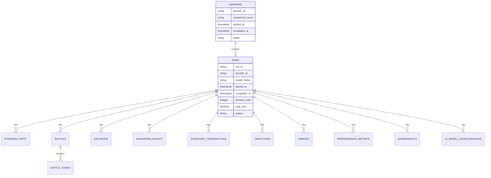

# PTP-01X CLI Control Infrastructure & Data Aggregation Specification

**Version:** 2.0  
**Date:** December 31, 2025  
**Status:** COMPLETE SPECIFICATION  
**Classification:** OPERATIONAL INFRASTRUCTURE

---

## Table of Contents

1. [Executive Summary](#1-executive-summary)
2. [CLI Flag Specifications](#2-cli-flag-specifications)
3. [Observability & Diagnostics](#3-observability--diagnostics)
4. [Data Aggregation Architecture](#4-data-aggregation-architecture)
5. [Schema & Config Evolution](#5-schema--config-evolution)
6. [Failure Modes & Recovery](#6-failure-modes--recovery)
7. [Implementation Roadmap](#7-implementation-roadmap)
8. [Appendices](#8-appendices)

---

## 1. Executive Summary

This specification defines the control infrastructure for the PTP-01X autonomous Pokemon AI system. It covers CLI flags for run control, snapshot management, parallel execution, real-time observability, data aggregation across runs, and long-term schema/config evolution management.

### 1.1 Design Philosophy

The control infrastructure follows these core principles:

1. **Reproducibility First**: Every run must be uniquely identifiable and reproducible
2. **Observability Always**: Current state and history must always be queryable
3. **Graceful Degradation**: System must handle failures without data loss
4. **Evolution Ready**: Schema and config changes must be managed over time
5. **Scale Agnostic**: Same interface for 1 run or 10,000 runs

### 1.2 Architecture Overview

```
┌─────────────────────────────────────────────────────────────────┐
│                    CLI CONTROL PLANE                             │
│  ┌─────────────┐ ┌─────────────┐ ┌─────────────────────────────┐│
│  │ Run Control │ │ Experiment  │ │ Snapshot Management         ││
│  │ (Single Run)│ │ Orchestration│ │ (Save/Restore/Rollback)    ││
│  └─────────────┘ └─────────────┘ └─────────────────────────────┘│
└─────────────────────────────────────────────────────────────────┘
                              │
                              ▼
┌─────────────────────────────────────────────────────────────────┐
│                   OBSERVABILITY LAYER                            │
│  ┌─────────────┐ ┌─────────────┐ ┌─────────────────────────────┐│
│  │ Real-Time   │ │ Screenshot  │ │ Action Log Stream           ││
│  │ Dashboard   │ │ Viewer      │ │ (All decisions)             ││
│  └─────────────┘ └─────────────┘ └─────────────────────────────┘│
└─────────────────────────────────────────────────────────────────┘
                              │
                              ▼
┌─────────────────────────────────────────────────────────────────┐
│                  DATA AGGREGATION PLATFORM                       │
│  ┌─────────────┐ ┌─────────────┐ ┌─────────────────────────────┐│
│  │ Per-Run     │ │ Ingestion   │ │ Central Analytics DB        ││
│  │ SQLite      │ │ Pipeline    │ │ (PostgreSQL)                ││
│  └─────────────┘ └─────────────┘ └─────────────────────────────┘│
└─────────────────────────────────────────────────────────────────┘
                              │
                              ▼
┌─────────────────────────────────────────────────────────────────┐
│                 VERSION MANAGEMENT LAYER                         │
│  ┌─────────────┐ ┌─────────────┐ ┌─────────────────────────────┐│
│  │ Schema      │ │ Config      │ │ Drift Detection             ││
│  │ Registry    │ │ Registry    │ │ (Compatibility Checking)    ││
│  └─────────────┘ └─────────────┘ └─────────────────────────────┘│
└─────────────────────────────────────────────────────────────────┘
```

### 1.3 Key Metrics

| Metric | Target |
|--------|--------|
| CLI flag parsing | <100ms |
| Run startup time | <5s |
| Screenshot capture | <50ms (async) |
| Snapshot save | <100ms (memory) / <1s (disk) |
| Query response (simple) | <100ms |
| Query response (complex) | <10s |
| Ingestion throughput | 100 runs/minute |
| Schema migration time | <1min per 1GB |
| Recovery time (rollback) | <5s |
| Dashboard update latency | <1s |

---

## 2. CLI Flag Specifications

### 2.1 Tick Rate Control

#### 2.1.1 Flag Definitions

| Flag | Type | Default | Description |
|------|------|---------|-------------|
| `--tick-rate-base` | int | 10 | Base tick rate for overworld exploration (ticks/second) |
| `--tick-rate-battle` | int | 2 | Tick rate during battle sequences (ticks/second) |
| `--tick-rate-timeout` | int | 30 | Maximum seconds without state change before timeout |
| `--tick-rate-adaptive` | bool | False | Auto-adjust rate based on decision latency |
| `--tick-rate-budget` | enum | None | Cost budget mode: `hourly`, `daily`, or `run` |
| `--tick-rate-budget-limit` | float | None | Maximum budget in dollars per period |

#### 2.1.2 Behavior Specification

**Base Tick Rate:**
- Controls normal game loop execution speed
- Affects overworld navigation, NPC interaction, item use
- Higher rates = faster execution = higher API costs

**Battle Tick Rate:**
- Overrides base rate during active battles
- Battle decisions require more reasoning time
- Lower rate prevents API timeout during complex combat

**Adaptive Mode:**
```
WHEN tick_rate_adaptive IS True:
    actual_rate = min(base_rate, 1000 / avg_decision_latency_ms)
    IF current_cost > budget_limit:
        actual_rate = base_rate * 0.5  # Reduce load
```

**Budget Mode:**
```
TIER 1 (hourly): Reset budget every hour at :00
TIER 2 (daily): Reset budget every day at midnight
TIER 3 (run): Single budget for entire run

ON budget_exceeded:
    Log warning
    If grace_period > 0: continue for grace_period seconds
    Else: execute on_limit action
```

#### 2.1.3 Usage Examples

```bash
# Normal exploration mode
ptp run --tick-rate-base 10

# Slow mode for debugging
ptp run --tick-rate-base 2

# Budget-aware execution ($5/hour max)
ptp run --tick-rate-budget hourly --tick-rate-budget-limit 5.00

# Adaptive mode (auto-adjust to decision speed)
ptp run --tick-rate-base 10 --tick-rate-adaptive

# Battle-heavy run (slower battle decisions)
ptp run --tick-rate-base 15 --tick-rate-battle 1
```

### 2.2 Screenshot Control

#### 2.2.1 Flag Definitions

| Flag | Type | Default | Description |
|------|------|---------|-------------|
| `--screenshot-interval` | int | 100 | Base screenshot interval (ticks) |
| `--screenshot-battle-turn` | int | 1 | Screenshots per battle turn |
| `--screenshot-on-error` | int | 1 | Screenshots per error tick |
| `--screenshot-on-change` | bool | False | Capture on any state transition |
| `--screenshot-quality` | int | 85 | JPEG quality (0-100) |
| `--screenshot-max-storage` | float | 50.0 | Maximum storage in GB |
| `--screenshot-async` | bool | False | Non-blocking screenshot capture |
| `--screenshot-compress` | bool | False | Compress old screenshots |

#### 2.2.2 Behavior Specification

**Base Interval:**
- Screenshots captured every N ticks during normal gameplay
- Lower values = more storage, better debugging
- Higher values = less storage, harder to debug

**Event-Triggered Screenshots:**
```
BATTLE: Every turn (overrides interval)
ERROR: Every tick (overrides interval)
STATE_CHANGE: On transition (overrides interval)

Priority: ERROR > BATTLE > STATE_CHANGE > INTERVAL
```

**Storage Management:**
```
ON screenshot_capture:
    current_storage += file_size
    
    IF current_storage > max_storage:
        Compress oldest screenshots
        IF still > max_storage:
            Delete oldest screenshots
            Log warning
```

**Async Mode:**
```
NORMAL (screenshot_async=False):
    Wait for screenshot to complete
    Add latency: screenshot_time + processing_time
    
ASYNC (screenshot_async=True):
    Queue screenshot and continue
    No added latency
    Risk: Some screenshots may be dropped under load
```

#### 2.2.3 Usage Examples

```bash
# Minimal screenshots (every 500 ticks)
ptp run --screenshot-interval 500 --screenshot-quality 70

# Debug mode (frequent screenshots)
ptp run --screenshot-interval 10 --screenshot-on-change --screenshot-quality 95

# Battle analysis mode (every turn)
ptp run --screenshot-battle-turn 1 --screenshot-interval 1000

# Storage-constrained environment
ptp run --screenshot-max-storage 10.0 --screenshot-compress

# High-performance mode (no screenshot blocking)
ptp run --screenshot-interval 100 --screenshot-async
```

### 2.3 Command Buffer Control

#### 2.3.1 Flag Definitions

| Flag | Type | Default | Description |
|------|------|---------|-------------|
| `--command-buffer-size` | int | 10 | Maximum queued commands |
| `--command-timeout` | int | 5 | Maximum seconds a command can wait |
| `--command-validate` | bool | False | Validate commands before execution |
| `--command-rollback-history` | int | 100 | Commands stored for potential rollback |
| `--command-interrupt-battle` | bool | True | Clear buffer when battle starts |
| `--command-stale-threshold` | int | 2 | Seconds before command is considered stale |

#### 2.3.2 Behavior Specification

**Buffer Size:**
```
Maximum commands that can be queued before blocking:
- Size 1: Execute one at a time (no buffering)
- Size 10: Queue 10 commands, then block
- Size 100: Queue 100 commands

RECOMMENDED: 5-10 for normal operation
RECOMMENDED: 50-100 for high-latency API calls
```

**Timeout:**
```
ON command_in_buffer > timeout_seconds:
    Remove command from buffer
    Log warning: "Command timed out"
    Continue to next command
```

**Validation:**
```
IF command_validate IS True:
    FOR each command in buffer:
        IF command.context != current_state:
            Log warning: "Command may be invalid"
            Optionally: remove invalid commands
```

**Battle Interrupt:**
```
ON random_battle_encounter:
    IF command_interrupt_battle IS True:
        Clear entire command buffer
        Log: "Battle started, cleared N queued commands"
        
    IF command_interrupt_battle IS False:
        Process commands until battle state detected
        THEN clear buffer
```

**Rollback History:**
```
Command history stored for potential rollback:
- Max N commands stored
- Memory usage: N * avg_command_size
- Use case: Undo bad AI decisions

ON rollback_request:
    Pop N commands from history
    Revert game state
    Clear command buffer
```

#### 2.3.3 Usage Examples

```bash
# Normal operation (light buffering)
ptp run --command-buffer-size 10 --command-timeout 5

# High-latency mode (heavy buffering)
ptp run --command-buffer-size 50 --command-timeout 30 --command-rollback-history 200

# Strict validation (no invalid commands)
ptp run --command-validate --command-stale-threshold 1

# No battle interrupt (dangerous but useful for scripted sequences)
ptp run --command-interrupt-battle False
```

### 2.4 Run Limits

#### 2.4.1 Flag Definitions

| Flag | Type | Default | Description |
|------|------|---------|-------------|
| `--max-time` | int | None | Maximum real time in seconds |
| `--max-ticks` | int | None | Maximum game ticks |
| `--max-cost` | float | None | Maximum cost in dollars |
| `--max-pokemon-caught` | int | None | Stop after N Pokemon caught |
| `--max-badges` | int | None | Stop after N badges earned |
| `--max-level` | int | None | Stop when Pokemon reaches level |
| `--on-limit` | enum | save-and-exit | Action on limit: `save-and-exit`, `save-only`, `abort` |
| `--limit-grace-period` | int | 30 | Seconds to finish current decision |

#### 2.4.2 Behavior Specification

**Limit Checking:**
```
EVERY tick:
    IF max_time AND elapsed_time > max_time:
        trigger_limit()
    IF max_ticks AND tick_count > max_ticks:
        trigger_limit()
    IF max_cost AND total_cost > max_cost:
        trigger_limit()
    IF max_pokemon_caught AND caught_count >= max_pokemon_caught:
        trigger_limit()
    IF max_badges AND badge_count >= max_badges:
        trigger_limit()
    IF max_level AND max(party_levels) >= max_level:
        trigger_limit()
```

**Limit Actions:**
```
SAVE_AND_EXIT:
    1. Create final snapshot
    2. Save all data
    3. Generate final report
    4. Exit with code 0
    
SAVE_ONLY:
    1. Create final snapshot
    2. Save all data
    3. Exit with code 0 (no report)
    
ABORT:
    1. Emergency snapshot (if possible)
    2. Exit with code 1 (error)
    3. No graceful shutdown
```

**Grace Period:**
```
ON trigger_limit:
    IF grace_period > 0:
        Log: "Limit reached, finishing current decision..."
        Allow current decision to complete
        THEN execute on_limit action
        
    IF grace_period == 0:
        Execute on_limit action immediately
```

#### 2.4.3 Usage Examples

```bash
# 1-hour test run
ptp run --max-time 3600

# 100K tick benchmark
ptp run --max-ticks 100000

# $10 budget
ptp run --max-cost 10.00 --on-limit save-and-exit

# Complete game (8 badges)
ptp run --max-badges 8 --max-level 100

# Pokemon collection run
ptp run --max-pokemon-caught 150 --on-limit save-and-exit

# No grace period (immediate stop)
ptp run --max-time 3600 --limit-grace-period 0
```

### 2.5 Snapshot Management

#### 2.5.1 Flag Definitions

| Flag | Type | Default | Description |
|------|------|---------|-------------|
| `--snapshot-memory` | int | 10 | Number of RAM snapshots (instant restore) |
| `--snapshot-disk` | int | 1000 | Interval for disk snapshots (ticks) |
| `--snapshot-on-event` | list | [] | Event triggers: `catch`, `battle`, `badge`, `death` |
| `--snapshot-max-disk` | float | 20.0 | Maximum storage for snapshots in GB |
| `--snapshot-compress` | bool | False | Compress disk snapshots |
| `--snapshot-validate` | bool | False | Validate snapshots can be restored |
| `--rollback-on-error` | bool | False | Auto-rollback on crash detection |
| `--rollback-grace` | int | 3 | Maximum rollback depth |
| `--snapshot-share` | bool | False | Allow sharing snapshots via network |
| `--snapshot-name` | str | None | Name for named snapshot |

#### 2.5.2 Behavior Specification

**Memory Snapshots:**
```
Store N most recent snapshots in RAM:
- Instant restore (<10ms)
- Lost on process termination
- Used for quick rollback during normal operation

Circular buffer:
- snapshot_0 = oldest
- snapshot_N = newest
- On new snapshot: discard snapshot_0, shift others
```

**Disk Snapshots:**
```
Save to disk every N ticks:
- Persistent across process restarts
- Slower restore (1-5 seconds)
- Used for recovery from crashes

Compression:
IF snapshot_compress IS True:
    Use LZ4 compression (fast)
    Expected: 50-70% size reduction
    
Validation:
IF snapshot_validate IS True:
    After save: attempt restore in memory
    IF restore fails: log error, retry
```

**Event Triggers:**
```
ON Pokemon caught:
    IF "catch" in snapshot_on_event:
        Create named snapshot: "catch-{pokemon_name}"
        
ON Battle start:
    IF "battle" in snapshot_on_event:
        Create snapshot: "battle-{turn_number}"
        
ON Badge earned:
    IF "badge" in snapshot_on_event:
        Create snapshot: "badge-{badge_number}"
        
ON Pokemon faints:
    IF "death" in snapshot_on_event:
        Create snapshot: "death-{pokemon_name}"
```

**Rollback:**
```
ON rollback_request(count=N):
    Restore to snapshot_N back
    Clear command buffer
    Log: "Rolled back N snapshots"
    
Automatic rollback:
IF rollback_on_error IS True:
    ON error detected:
        Rollback to last good snapshot
        Retry action
        IF same error 3 times:
            Log fatal error, stop
```

**Named Snapshots:**
```
CREATE:
ptp snapshot create --name "before-gym-2" --message "Ready for gym battle"

RESTORE:
ptp snapshot restore "before-gym-2"

LIST:
ptp snapshot list

DELETE:
ptp snapshot delete "before-gym-2"
```

#### 2.5.3 Usage Examples

```bash
# Normal operation (light snapshots)
ptp run --snapshot-memory 10 --snapshot-disk 5000

# Debug mode (frequent snapshots)
ptp run --snapshot-memory 50 --snapshot-disk 500 --snapshot-on-event catch,battle,badge

# Long-running experiment
ptp run --snapshot-disk 10000 --snapshot-compress --snapshot-max-disk 50.0

# Auto-rollback on errors
ptp run --snapshot-memory 20 --rollback-on-error --rollback-grace 5

# Create named checkpoint
ptp snapshot create --name "pre-elite-four" --message "Ready for elite four"
```

### 2.6 Experiment Orchestration

#### 2.6.1 Flag Definitions

| Flag | Type | Default | Description |
|------|------|---------|-------------|
| `--experiment-name` | str | "default" | Experiment identifier for grouping |
| `--parallel-workers` | int | 1 | Maximum concurrent game instances |
| `--sequential-retry` | int | 3 | Number of retries on failure |
| `--parallel-memory-limit` | float | 8.0 | Per-worker memory limit in GB |
| `--parallel-api-rate-limit` | int | 100 | Max API calls per minute (all workers) |
| `--aggregate-stats` | bool | False | Calculate mean/stddev for parallel runs |
| `--fail-mode` | enum | continue | On failure: `continue`, `fast-fail`, `retry` |
| `--checkpoint-frequency` | int | 10000 | Checkpoint between sequential runs |
| `--resume-from` | str | None | Resume from checkpoint directory |
| `--experiment-config` | str | None | Load experiment settings from YAML file |
| `--export-results` | bool | False | Export aggregated results |
| `--results-format` | enum | json | Output format: `json`, `csv`, `parquet` |

#### 2.6.2 Behavior Specification

**Parallel Execution:**
```
MAX workers = min(parallel_workers, available_cores, memory_limit / per_worker_memory)

Resource allocation:
    Worker 1: 1 core, 8GB memory, 100 API calls/min
    Worker 2: 1 core, 8GB memory, 100 API calls/min
    ...
    Total: N cores, N*8GB memory, N*100 API calls/min

Rate limiting:
    IF total_api_calls > parallel_api_rate_limit:
        Queue excess calls
        Process in order
```

**Sequential Execution:**
```
FOR run IN experiment_runs:
    IF checkpoint_frequency > 0:
        AND run_number % checkpoint_frequency == 0:
            Create checkpoint
            Save all data
            Log progress
    
    Run game
    
    IF run fails AND sequential_retry > 0:
        Retry up to sequential_retry times
        IF still fails:
            Log error
            Continue to next run (if fail_mode=continue)
```

**Fail Modes:**
```
CONTINUE (default):
    On failure: log error, continue to next run
    Result: Partial completion, some data available
    Use: When some runs can succeed
    
FAST_FAIL:
    On failure: stop entire experiment
    Result: All or nothing
    Use: When all runs must succeed for valid experiment
    
RETRY:
    On failure: retry up to sequential_retry times
    THEN fail if still failing
    Result: Transient failures handled, permanent failures stop
    Use: Unreliable environments
```

**Checkpoint & Resume:**
```
CHECKPOINT (after every N runs):
    Save: run configuration, current progress, partial results
    Format: experiment_checkpoints/{name}/{run_number}.checkpoint
    
RESUME:
    ptp experiment run --experiment-name my-exp --resume-from experiment_checkpoints/my-exp/latest
    Resumes from last checkpoint
    Skips completed runs
```

**Result Aggregation:**
```
IF aggregate_stats IS True:
    FOR parallel runs:
        Calculate: mean, stddev, min, max, percentiles
    Generate: statistical report
        
IF export_results IS True:
    Format: {results_format}
    Include: all runs, aggregated stats, configuration
    Output: experiment_results/{name}/{timestamp}
```

#### 2.6.3 Usage Examples

```bash
# Single run (default)
ptp run --experiment-name "test-run-001"

# Parallel execution (4 workers)
ptp experiment run --parallel-workers 4 --aggregate-stats

# Sequential with retry (5 runs)
ptp experiment run --parallel-workers 1 --sequential-retry 3

# Large experiment (100 runs, checkpoints)
ptp experiment run --parallel-workers 8 --checkpoint-frequency 10 --export-results --results-format parquet

# Resume from checkpoint
ptp experiment run --resume-from experiment_checkpoints/my-exp/latest

# Load config file
ptp run --experiment-config config/experiment-001.yaml
```

### 2.7 System Flags

| Flag | Type | Default | Description |
|------|------|---------|-------------|
| `-v`, `--verbose` | bool | False | Enable verbose output |
| `-q`, `--quiet` | bool | False | Suppress all output except errors |
| `--log-file` | str | None | Write logs to file |
| `--config-file` | str | None | Load additional config from YAML file |
| `--random-seed` | int | None | Random seed for reproducibility |
| `--help` | bool | False | Show help message |
| `--version` | bool | False | Show version information |

### 2.8 Complete Usage Examples

#### Example 1: Production Benchmark Run
```bash
ptp experiment run \
    --experiment-name "gpt-4o-benchmark-001" \
    --parallel-workers 4 \
    --max-time 7200 \
    --max-cost 50.00 \
    --tick-rate-base 10 \
    --tick-rate-adaptive \
    --screenshot-interval 500 \
    --screenshot-compress \
    --snapshot-disk 5000 \
    --aggregate-stats \
    --export-results \
    --results-format parquet
```

#### Example 2: Debug Session with Frequent Snapshots
```bash
ptp run \
    --verbose \
    --experiment-name "debug-catch-bug" \
    --max-time 1800 \
    --tick-rate-base 5 \
    --screenshot-interval 10 \
    --screenshot-on-change \
    --screenshot-quality 95 \
    --command-validate \
    --snapshot-on-event catch,battle \
    --rollback-on-error \
    --snapshot-name "debug-session"
```

#### Example 3: Budget-Constrained Test
```bash
ptp run \
    --experiment-name "budget-test" \
    --max-cost 5.00 \
    --on-limit save-and-exit \
    --limit-grace-period 60 \
    --tick-rate-budget hourly \
    --tick-rate-budget-limit 5.00 \
    --screenshot-interval 1000 \
    --screenshot-quality 70 \
    --snapshot-disk 10000
```

#### Example 4: Long-Running Collection Experiment
```bash
ptp experiment run \
    --experiment-name "pokedex-complete-001" \
    --parallel-workers 2 \
    --max-pokemon-caught 150 \
    --max-time 259200 \
    --max-cost 200.00 \
    --tick-rate-base 12 \
    --screenshot-interval 200 \
    --snapshot-disk 2000 \
    --snapshot-on-event catch \
    --aggregate-stats \
    --fail-mode continue \
    --export-results
```

---

## 3. Observability & Diagnostics

### 3.1 Real-Time Dashboard API

#### 3.1.1 Endpoints

| Endpoint | Method | Description |
|----------|--------|-------------|
| `/api/v1/status` | GET | Current game state |
| `/api/v1/screenshots/latest` | GET | Latest screenshot |
| `/api/v1/screenshots/{id}` | GET | Specific screenshot |
| `/api/v1/actions` | GET | Action log stream |
| `/api/v1/metrics` | GET | Performance metrics |
| `/api/v1/snapshot/list` | GET | List snapshots |
| `/api/v1/snapshot/restore/{id}` | POST | Restore snapshot |
| `/api/v1/config` | GET | Current configuration |

#### 3.1.2 Status Endpoint Response

```json
{
  "run_id": "abc123-def456",
  "experiment_name": "test-run-001",
  "started_at": "2024-01-15T10:30:45Z",
  "elapsed_seconds": 1234,
  "current_state": {
    "screen_type": "battle",
    "location": "Route 1",
    "coordinates": {"x": 42, "y": 17},
    "party": [
      {
        "name": "Pikachu",
        "level": 5,
        "hp": 35,
        "max_hp": 35,
        "status": null
      }
    ],
    "inventory": {
      "pokeballs": 5,
      "potions": 2
    },
    "badges": 0,
    "pokemon_caught": 2
  },
  "decision_pipeline": {
    "last_decision_at": "2024-01-15T10:51:19Z",
    "last_decision_type": "BATTLE_MOVE",
    "last_decision_confidence": 0.87,
    "last_decision_latency_ms": 1250,
    "tokens_this_decision": 450,
    "cost_this_decision": 0.045,
    "current_decision_status": "completed"
  },
  "system_health": {
    "tick_rate_actual": 9.8,
    "tick_rate_target": 10,
    "memory_usage_mb": 1024,
    "api_calls_remaining": 4500,
    "error_count": 0,
    "snapshot_count": 12
  }
}
```

#### 3.1.3 Action Log Endpoint

```json
{
  "actions": [
    {
      "timestamp": "2024-01-15T10:30:45.123",
      "action": "MOVE_UP",
      "context": {
        "from": {"x": 41, "y": 17},
        "to": {"x": 41, "y": 16}
      },
      "confidence": 0.95,
      "latency_ms": 45,
      "cost": 0.001
    },
    {
      "timestamp": "2024-01-15T10:30:46.234",
      "action": "ENCOUNTER",
      "context": {
        "pokemon": "Pidgey",
        "level": 3
      },
      "confidence": null,
      "latency_ms": null,
      "cost": null
    },
    {
      "timestamp": "2024-01-15T10:30:46.567",
      "action": "BATTLE_START",
      "context": {
        "enemy": "Pidgey",
        "enemy_level": 3,
        "party_index": 0
      },
      "confidence": null,
      "latency_ms": null,
      "cost": null
    }
  ],
  "total_count": 12345,
  "page": 1,
  "page_size": 100
}
```

### 3.2 Screenshot Viewer

#### 3.2.1 Screenshot Metadata

```json
{
  "screenshot_id": "shot_001234",
  "timestamp": "2024-01-15T10:51:19.567",
  "tick": 12345,
  "screen_type": "battle",
  "resolution": {"width": 160, "height": 144},
  "file_size_bytes": 45678,
  "compression": "jpeg",
  "quality": 85,
  "annotations": {
    "detected_text": [
      {"text": "Pikachu Lv.5", "bbox": [10, 100, 80, 120], "confidence": 0.99},
      {"text": "Pidgey Lv.3", "bbox": [100, 20, 150, 40], "confidence": 0.97}
    ],
    "detected_sprites": [
      {"type": "pokemon", "name": "pikachu_back", "bbox": [20, 50, 70, 100], "confidence": 0.95},
      {"type": "pokemon", "name": "pidgey_front", "bbox": [100, 50, 140, 90], "confidence": 0.92}
    ],
    "menu_regions": [
      {"type": "battle_menu", "bbox": [10, 120, 150, 144], "confidence": 0.99}
    ]
  }
}
```

#### 3.2.2 Screenshot Timeline API

```json
{
  "screenshots": [
    {
      "id": "shot_001230",
      "timestamp": "2024-01-15T10:51:15.000",
      "screen_type": "battle",
      "thumbnail_url": "/api/v1/screenshots/shot_001230/thumbnail"
    },
    {
      "id": "shot_001231",
      "timestamp": "2024-01-15T10:51:16.000",
      "screen_type": "battle",
      "thumbnail_url": "/api/v1/screenshots/shot_001231/thumbnail"
    }
  ],
  "total_count": 123,
  "page": 1,
  "page_size": 20
}
```

### 3.3 Metrics Dashboard

#### 3.3.1 Performance Metrics

| Metric | Description | Update Frequency |
|--------|-------------|------------------|
| `tick_rate_actual` | Current ticks per second | Every tick |
| `tick_rate_target` | Configured tick rate | On config change |
| `decision_latency_avg` | Average decision latency (ms) | Every 10 seconds |
| `decision_latency_p95` | 95th percentile latency | Every 10 seconds |
| `api_calls_per_minute` | Current API usage | Every minute |
| `api_cost_per_hour` | Estimated hourly cost | Every minute |
| `memory_usage_mb` | Current memory usage | Every 5 seconds |
| `screenshot_queue_size` | Pending screenshots | Every tick |
| `error_rate` | Errors per 1000 ticks | Every minute |

#### 3.3.2 Game Metrics

| Metric | Description |
|--------|-------------|
| `pokemon_caught` | Total Pokemon caught |
| `battles_won` | Total battles won |
| `battles_lost` | Total battles lost |
| `battles_fled` | Total battles fled |
| `badges_earned` | Total badges earned |
| `current_level` | Highest party member level |
| `pokemon_party_size` | Current party size |
| `money` | Current money |

### 3.4 CLI Diagnostic Commands

```bash
# Show current status
ptp status

# Stream actions in real-time
ptp actions --stream

# Show latest screenshot
ptp screenshot latest

# Show screenshot timeline
ptp screenshot list --page 1 --page-size 20

# Show performance metrics
ptp metrics

# Show all snapshots
ptp snapshot list

# Restore to snapshot
ptp snapshot restore shot_001230

# Export current state
ptp export --format json --output state.json

# Show configuration
ptp config show

# Tail logs
ptp logs --follow
```

---

## 4. Data Aggregation Architecture

### 4.1 Per-Run Database Schema

Each game run generates a SQLite database with the following schema:

#### 4.1.1 Core Tables

```sql
-- Schema version tracking
CREATE TABLE _schema_version (
    version TEXT PRIMARY KEY,
    created_at TIMESTAMP DEFAULT CURRENT_TIMESTAMP
);

-- Sessions (one per run)
CREATE TABLE sessions (
    session_id TEXT PRIMARY KEY,
    experiment_name TEXT,
    started_at TIMESTAMP,
    completed_at TIMESTAMP,
    random_seed INTEGER,
    config_snapshot TEXT,  -- JSON of CLI flags
    status TEXT,  -- running/completed/crashed/manual_stop
    error_message TEXT
);

-- Runs (one per game instance)
CREATE TABLE runs (
    run_id TEXT PRIMARY KEY,
    session_id TEXT,
    model_name TEXT,
    rom_hash TEXT,
    started_at TIMESTAMP,
    completed_at TIMESTAMP,
    duration_ticks INTEGER,
    final_level INTEGER,
    total_cost DECIMAL(10,4),
    status TEXT
);

-- Pokemon Party
CREATE TABLE pokemon_party (
    party_id TEXT PRIMARY KEY,
    run_id TEXT,
    pokemon_id TEXT,  -- Internal ID
    species TEXT,
    nickname TEXT,
    level INTEGER,
    current_hp INTEGER,
    max_hp INTEGER,
    experience INTEGER,
    moves TEXT,  -- JSON array
    status TEXT,  -- alive/fainted/boxed
    caught_at TIMESTAMP,
    catch_location TEXT
);

-- Battles
CREATE TABLE battles (
    battle_id TEXT PRIMARY KEY,
    run_id TEXT,
    started_at TIMESTAMP,
    ended_at TIMESTAMP,
    battle_type TEXT,  -- wild/trainer/gym
    enemy_species TEXT,
    enemy_level INTEGER,
    enemy_trainer TEXT,
    outcome TEXT,  -- win/loss/flee/draw
    turns_taken INTEGER,
    player_pokemon TEXT,
    used_items TEXT,  -- JSON array
    money_earned INTEGER
);

-- Battle Turns
CREATE TABLE battle_turns (
    turn_id TEXT PRIMARY KEY,
    battle_id TEXT,
    turn_number INTEGER,
    timestamp TIMESTAMP,
    player_action TEXT,  -- move/item/switch/run
    player_move TEXT,
    player_target TEXT,
    player_damage INTEGER,
    enemy_action TEXT,
    enemy_move TEXT,
    enemy_damage INTEGER,
    player_hp_after INTEGER,
    enemy_hp_after INTEGER,
    turn_result TEXT
);

-- Decisions (all AI decisions)
CREATE TABLE decisions (
    decision_id TEXT PRIMARY KEY,
    run_id TEXT,
    timestamp TIMESTAMP,
    tick INTEGER,
    game_state TEXT,  -- JSON snapshot
    decision_type TEXT,  -- BATTLE_MOVE/NAVIGATION_MOVE/ITEM_USE/etc
    decision_context TEXT,  -- JSON
    reasoning TEXT,  -- AI's explanation
    confidence_score DECIMAL(5,4),
    decision_latency_ms INTEGER,
    tokens_used INTEGER,
    api_cost DECIMAL(10,6),
    model_used TEXT,
    execution_status TEXT,  -- success/failed/partial
    execution_error TEXT
);

-- Navigation Events
CREATE TABLE navigation_events (
    event_id TEXT PRIMARY KEY,
    run_id TEXT,
    timestamp TIMESTAMP,
    tick INTEGER,
    event_type TEXT,  -- move/interact/encounter
    from_location TEXT,
    to_location TEXT,
    direction TEXT,
    map_name TEXT,
    coordinates TEXT,  -- JSON {x, y}
    encountered_pokemon TEXT
);

-- Inventory Transactions
CREATE TABLE inventory_transactions (
    transaction_id TEXT PRIMARY KEY,
    run_id TEXT,
    timestamp TIMESTAMP,
    action TEXT,  -- add/remove/use
    item TEXT,
    quantity INTEGER,
    source TEXT,  -- pickup/shop/reward
    context TEXT  -- JSON
);

-- Objectives
CREATE TABLE objectives (
    objective_id TEXT PRIMARY KEY,
    run_id TEXT,
    objective_type TEXT,  -- badge/catch/evolution/region
    target TEXT,  -- e.g., "Badge 1"
    status TEXT,  -- pending/in_progress/completed/failed
    started_at TIMESTAMP,
    completed_at TIMESTAMP,
    progress TEXT  -- JSON
);

-- Errors
CREATE TABLE errors (
    error_id TEXT PRIMARY KEY,
    run_id TEXT,
    timestamp TIMESTAMP,
    error_type TEXT,
    error_message TEXT,
    stack_trace TEXT,
    context TEXT,  -- JSON
    recovered BOOLEAN,
    recovery_action TEXT
);

-- Performance Metrics
CREATE TABLE performance_metrics (
    metric_id TEXT PRIMARY KEY,
    run_id TEXT,
    timestamp TIMESTAMP,
    tick INTEGER,
    metric_type TEXT,  -- tick_rate/latency/memory/cost
    value DECIMAL(10,4),
    unit TEXT
);

-- AI Model Configurations
CREATE TABLE ai_model_configurations (
    config_id TEXT PRIMARY KEY,
    run_id TEXT,
    model_name TEXT,
    temperature DECIMAL(4,2),
    max_tokens INTEGER,
    system_prompt TEXT,
    model_parameters TEXT  -- JSON
);

-- Screenshots (metadata only, images stored separately)
CREATE TABLE screenshots (
    screenshot_id TEXT PRIMARY KEY,
    run_id TEXT,
    timestamp TIMESTAMP,
    tick INTEGER,
    screen_type TEXT,
    file_path TEXT,
    file_size_bytes INTEGER,
    annotations TEXT  -- JSON
);
```

### 4.2 Central Aggregator Database Schema

#### 4.2.1 Aggregated Tables (Read-Only)

```sql
-- Aggregated runs (materialized from individual run DBs)
CREATE TABLE aggregated_runs (
    run_id UUID PRIMARY KEY,
    experiment_id UUID,
    model_name VARCHAR(100),
    rom_hash VARCHAR(64),
    started_at TIMESTAMP,
    completed_at TIMESTAMP,
    duration_seconds INTEGER,
    duration_ticks INTEGER,
    total_cost DECIMAL(10,4),
    final_level INTEGER,
    pokemon_caught INTEGER,
    battles_won INTEGER,
    battles_lost INTEGER,
    badges_earned INTEGER,
    errors_count INTEGER,
    status VARCHAR(50),
    config_snapshot JSONB,
    imported_at TIMESTAMP DEFAULT CURRENT_TIMESTAMP
);

-- Aggregated decisions
CREATE TABLE aggregated_decisions (
    decision_id UUID PRIMARY KEY,
    run_id UUID,
    experiment_id UUID,
    model_name VARCHAR(100),
    decision_type VARCHAR(50),
    timestamp TIMESTAMP,
    tick INTEGER,
    latency_ms INTEGER,
    tokens_used INTEGER,
    cost DECIMAL(10,6),
    confidence DECIMAL(5,4),
    was_correct BOOLEAN,
    context JSONB,
    imported_at TIMESTAMP DEFAULT CURRENT_TIMESTAMP
);

-- Aggregated battles
CREATE TABLE aggregated_battles (
    battle_id UUID PRIMARY KEY,
    run_id UUID,
    experiment_id UUID,
    model_name VARCHAR(100),
    battle_type VARCHAR(20),
    pokemon_enemy VARCHAR(100),
    pokemon_enemy_level INTEGER,
    outcome VARCHAR(20),
    turns_taken INTEGER,
    pokemon_died BOOLEAN,
    items_used JSONB,
    moves_used JSONB,
    imported_at TIMESTAMP DEFAULT CURRENT_TIMESTAMP
);

-- Model performance summary (updated nightly)
CREATE TABLE model_performance (
    model_name VARCHAR(100) PRIMARY KEY,
    total_runs INTEGER,
    avg_cost DECIMAL(10,4),
    avg_duration_seconds INTEGER,
    avg_battles_won DECIMAL(5,2),
    avg_badges_earned DECIMAL(5,2),
    win_rate DECIMAL(5,4),
    error_rate DECIMAL(8,6),
    last_updated TIMESTAMP
);
```

#### 4.2.2 Materialized Views

```sql
-- Model comparison view
CREATE MATERIALIZED VIEW model_comparison AS
SELECT 
    model_name,
    COUNT(*) as runs,
    ROUND(AVG(total_cost)::numeric, 4) as avg_cost,
    ROUND(AVG(duration_seconds)::numeric, 0) as avg_duration,
    ROUND(AVG(battles_won)::numeric, 2) as avg_wins,
    ROUND(AVG(badges_earned)::numeric, 2) as avg_badges,
    ROUND((SUM(CASE WHEN status = 'completed' THEN 1 ELSE 0 END)::numeric / COUNT(*))::numeric, 4) as completion_rate,
    PERCENTILE_CONT(0.5) WITHIN GROUP (ORDER BY duration_seconds) as median_duration,
    PERCENTILE_CONT(0.95) WITHIN GROUP (ORDER BY duration_seconds) as p95_duration
FROM aggregated_runs
GROUP BY model_name;

-- Battle analysis view
CREATE MATERIALIZED VIEW battle_analysis AS
SELECT 
    model_name,
    battle_type,
    COUNT(*) as battles,
    ROUND(AVG(turns_taken)::numeric, 2) as avg_turns,
    SUM(CASE WHEN outcome = 'win' THEN 1 ELSE 0 END)::numeric / COUNT(*) as win_rate,
    ROUND(AVG(CASE WHEN outcome = 'win' THEN turns_taken END)::numeric, 2) as avg_win_turns
FROM aggregated_battles
GROUP BY model_name, battle_type;

-- Cost analysis view
CREATE MATERIALIZED VIEW cost_analysis AS
SELECT 
    model_name,
    date_trunc('hour', timestamp) as hour,
    SUM(cost) as total_cost,
    COUNT(*) as decisions,
    ROUND(AVG(cost)::numeric, 6) as avg_cost_per_decision
FROM aggregated_decisions
GROUP BY model_name, date_trunc('hour', timestamp);
```

### 4.3 Ingestion Pipeline

#### 4.3.1 Single Run Ingestion

```python
def ingest_run(run_dir: Path) -> Dict[str, Any]:
    """
    Ingest a single run directory into the central database.
    
    Steps:
    1. Validate run directory structure
    2. Check schema version compatibility
    3. Copy SQLite database to staging
    4. Validate data integrity
    5. Extract aggregated metrics
    6. Insert into central database
    7. Update materialized views
    """
    # Step 1: Validate structure
    required_files = ["game_data.db", "config.yaml", "metadata.json"]
    for f in required_files:
        if not (run_dir / f).exists():
            raise ValueError(f"Missing required file: {f}")
    
    # Step 2: Check schema version
    db = connect_sqlite(run_dir / "game_data.db")
    schema_version = db.execute("SELECT version FROM _schema_version").fetchone()[0]
    
    if schema_version not in COMPATIBLE_VERSIONS:
        raise SchemaMismatchError(f"Incompatible schema version: {schema_version}")
    
    # Step 3: Validate data integrity
    validate_referential_integrity(db)
    validate_required_columns(db)
    
    # Step 4: Extract aggregated metrics
    run_summary = extract_run_summary(db)
    decision_summary = extract_decision_summary(db)
    battle_summary = extract_battle_summary(db)
    
    # Step 5: Insert into central DB
    with central_db.transaction():
        run_id = central_db.insert_run(run_summary)
        central_db.insert_decisions(run_id, decision_summary)
        central_db.insert_battles(run_id, battle_summary)
    
    # Step 6: Refresh views
    central_db.refresh_materialized_views()
    
    return {"run_id": run_id, "status": "success"}
```

#### 4.3.2 Batch Ingestion

```python
def ingest_runs(pattern: str, validate: bool = True, 
                fix_errors: bool = False, incremental: bool = False) -> IngestionResult:
    """
    Ingest multiple runs matching pattern.
    
    Args:
        pattern: Glob pattern for run directories
        validate: Run full validation on each run
        fix_errors: Attempt to fix common errors
        incremental: Only ingest new runs
    """
    run_dirs = sorted(glob.glob(pattern))
    
    results = {
        "total": len(run_dirs),
        "successful": 0,
        "failed": 0,
        "skipped": 0,
        "errors": []
    }
    
    for run_dir in run_dirs:
        try:
            # Check if already ingested (incremental mode)
            if incremental and is_already_ingested(run_dir):
                results["skipped"] += 1
                continue
            
            # Ingest run
            result = ingest_run(run_dir)
            
            if result["status"] == "success":
                results["successful"] += 1
            else:
                results["failed"] += 1
                
        except Exception as e:
            results["failed"] += 1
            results["errors"].append({
                "run_dir": run_dir,
                "error": str(e)
            })
    
    return results
```

### 4.4 Export Functions

#### 4.4.1 Export Runs

```python
def export_runs(model: Optional[str] = None,
                status: Optional[str] = None,
                started_after: Optional[datetime] = None,
                format: str = "json") -> Path:
    """
    Export runs matching criteria.
    """
    query = build_run_query(model, status, started_after)
    runs = central_db.execute(query).fetchall()
    
    if format == "json":
        return export_json(runs, "runs.json")
    elif format == "csv":
        return export_csv(runs, "runs.csv")
    elif format == "parquet":
        return export_parquet(runs, "runs.parquet")
```

#### 4.4.2 Export Decisions for ML Training

```python
def export_decisions_for_training(output_format: str = "jsonl") -> Path:
    """
    Export decisions in format suitable for ML training.
    
    Format:
    {
        "input": {
            "game_state": {...},
            "decision_context": {...}
        },
        "output": {
            "reasoning": "AI's reasoning",
            "decision": "The chosen action",
            "confidence": 0.87
        },
        "metadata": {
            "run_id": "...",
            "timestamp": "...",
            "model_name": "...",
            "was_correct": true
        }
    }
    """
```

---

## 5. Schema & Config Evolution

### 5.1 Version Management

#### 5.1.1 Schema Version History

| Version | Date | Changes |
|---------|------|---------|
| 1.0 | 2024-01-15 | Initial schema (12 tables) |
| 1.1 | 2024-02-01 | Added PERFORMANCE_PROFILES table |
| 1.2 | 2024-02-15 | Added screenshots.metadata column |
| 2.0 | 2024-03-01 | Renamed DECISIONS to ACTION_HISTORY, breaking changes |

#### 5.1.2 Config Version History

| Version | Date | Changes |
|---------|------|---------|
| 1.0 | 2024-01-15 | Initial flags (--tick-rate, --screenshot-interval) |
| 2.0 | 2024-02-01 | Renamed --tick-rate-base → --tick-rate-overworld, added --tick-rate-battle |
| 3.0 | 2024-03-01 | Consolidated tick rate flags into --tick-rate section |

### 5.2 Schema Migration System

#### 5.2.1 Migration Registry

```python
SCHEMA_MIGRATIONS = {
    "1.0": {
        "tables": ["SESSIONS", "RUNS", "POKEMON_PARTY", "BATTLES", 
                   "BATTLE_TURNS", "DECISIONS", "NAVIGATION_EVENTS",
                   "INVENTORY_TRANSACTIONS", "OBJECTIVES", "ERRORS",
                   "PERFORMANCE_METRICS", "AI_MODEL_CONFIGURATIONS"],
        "upgrades": {},
        "downgrades": {}
    },
    "1.1": {
        "tables": [..., "PERFORMANCE_PROFILES"],
        "upgrades": {
            "from_1.0": """
                CREATE TABLE PERFORMANCE_PROFILES (
                    profile_id TEXT PRIMARY KEY,
                    run_id TEXT,
                    cpu_usage DECIMAL(5,2),
                    memory_usage_mb INTEGER,
                    disk_usage_bytes INTEGER,
                    timestamp TIMESTAMP
                );
                CREATE INDEX idx_performance_profile_run ON PERFORMANCE_PROFILES(run_id);
            """
        },
        "downgrades": {
            "to_1.0": "DROP TABLE PERFORMANCE_PROFILES;"
        }
    },
    "2.0": {
        "tables": ["SESSIONS", "RUNS", "POKEMON_PARTY", "BATTLES",
                   "BATTLE_TURNS", "ACTION_HISTORY", "NAVIGATION_EVENTS",
                   "INVENTORY_TRANSACTIONS", "OBJECTIVES", "ERRORS",
                   "PERFORMANCE_METRICS", "AI_MODEL_CONFIGURATIONS", "SCREENSHOTS"],
        "upgrades": {
            "from_1.0": """
                -- Rename DECISIONS to ACTION_HISTORY
                ALTER TABLE DECISIONS RENAME TO ACTION_HISTORY;
                
                -- Add new columns
                ALTER TABLE ACTION_HISTORY ADD COLUMN context_version TEXT;
                ALTER TABLE ACTION_HISTORY ADD COLUMN execution_duration_ms INTEGER;
                
                -- Create SCREENSHOTS table
                CREATE TABLE SCREENSHOTS (
                    screenshot_id TEXT PRIMARY KEY,
                    run_id TEXT,
                    tick INTEGER,
                    file_path TEXT,
                    metadata TEXT
                );
            """,
            "from_1.1": """
                -- Similar migration from 1.1
                ALTER TABLE DECISIONS RENAME TO ACTION_HISTORY;
                ...
            """
        },
        "downgrades": {
            "to_1.0": """
                ALTER TABLE ACTION_HISTORY RENAME TO DECISIONS;
                DROP TABLE SCREENSHOTS;
                ALTER TABLE ACTION_HISTORY DROP COLUMN context_version;
                ALTER TABLE ACTION_HISTORY DROP COLUMN execution_duration_ms;
            """
        }
    }
}
```

#### 5.2.2 Migration Engine

```python
class MigrationEngine:
    def __init__(self, db_path: Path, schema_versions: Dict):
        self.db_path = db_path
        self.versions = schema_versions
        self.db = connect_sqlite(db_path)
    
    def get_current_version(self) -> str:
        """Read schema version from database."""
        try:
            return self.db.execute(
                "SELECT version FROM _schema_version"
            ).fetchone()[0]
        except sqlite3.OperationalError:
            return "0.0"  # No version table = pre-1.0
    
    def migrate(self, target_version: str) -> MigrationResult:
        """
        Migrate database to target version.
        
        Steps:
        1. Get current version
        2. Plan migration path
        3. Validate migration is possible
        4. Execute migrations in order
        5. Update version table
        6. Validate result
        """
        current = self.get_current_version()
        
        if current == target_version:
            return MigrationResult(status="already_current")
        
        # Plan path
        path = self.plan_migration_path(current, target_version)
        if not path:
            raise MigrationError(f"No path from {current} to {target_version}")
        
        # Execute migrations
        for step in path:
            self.execute_migration(step)
        
        # Update version
        self.db.execute(
            "UPDATE _schema_version SET version = ?",
            [target_version]
        )
        self.db.commit()
        
        return MigrationResult(status="success", path=path)
    
    def plan_migration_path(self, current: str, target: str) -> List[str]:
        """Find shortest path through version graph."""
        # BFS through version graph
        # Return list of intermediate versions
        
    def execute_migration(self, version: str):
        """Execute single migration step."""
        sql = self.versions[version]["upgrades"]["from_previous"]
        self.db.executescript(sql)
        self.db.commit()
```

### 5.3 Config Migration System

#### 5.3.1 Config Migration Registry

```python
CONFIG_MIGRATIONS = {
    "1.0": {
        "flags": {
            "tick_rate_base": {"type": "int", "default": 10},
            "screenshot_interval": {"type": "int", "default": 100},
            # ...
        },
        "migrations": {}
    },
    "2.0": {
        "flags": {
            "tick_rate_overworld": {"type": "int", "default": 10},
            "tick_rate_battle": {"type": "int", "default": 2},
            "screenshot_interval": {"type": "int", "default": 100},
            # ...
        },
        "migrations": {
            "from_1.0": """
                SET tick_rate_overworld = tick_rate_base
                SET tick_rate_battle = 2  -- new default
                REMOVE tick_rate_base
            """
        }
    },
    "3.0": {
        "flags": {
            "tick_rate": {
                "type": "section",
                "children": {
                    "normal": {"type": "int", "default": 10},
                    "battle": {"type": "int", "default": 2}
                }
            },
            # ...
        },
        "migrations": {
            "from_1.0": """
                MOVE tick_rate_base TO tick_rate.normal
                MOVE tick_rate_battle TO tick_rate.battle
            """,
            "from_2.0": """
                RENAME tick_rate_overworld TO tick_rate.normal
                RENAME tick_rate_battle TO tick_rate.battle
            """
        }
    }
}
```

#### 5.3.2 Config Loader

```python
class ConfigLoader:
    def __init__(self, config_versions: Dict):
        self.versions = config_versions
    
    def load(self, config_path: Path) -> Dict:
        """Load config with version migration."""
        with open(config_path) as f:
            config = yaml.safe_load(f)
        
        version = config.get("version", "1.0")
        
        # Migrate to latest
        latest = max(self.versions.keys())
        
        while version != latest:
            migration = self.versions[version]["migrations"].get(f"from_{version}")
            if not migration:
                raise ConfigMigrationError(f"No migration from {version}")
            
            config = self.apply_migration(config, migration)
            version = str(float(version) + 0.1)
        
        # Validate against latest schema
        self.validate(config, self.versions[latest]["flags"])
        
        return config
    
    def apply_migration(self, config: Dict, migration: str) -> Dict:
        """Apply migration rules to config."""
        # Parse migration instructions
        # Apply each transformation
        return migrated_config
```

### 5.4 Drift Detection

#### 5.4.1 Config Drift Detection

```python
def detect_config_drift(config_path: Path, 
                        reference_version: str = "latest") -> DriftReport:
    """
    Detect differences between config and reference schema.
    
    Report includes:
    - Unknown flags (not in schema)
    - Missing required flags
    - Deprecated flags
    - Type mismatches
    """
    config = load_config(config_path)
    schema = get_schema(reference_version)
    
    drift = {
        "unknown_flags": [],
        "missing_required": [],
        "deprecated_flags": [],
        "type_mismatches": [],
        "value_warnings": []
    }
    
    # Check for unknown flags
    for key in config.keys():
        if key not in schema["flags"]:
            drift["unknown_flags"].append(key)
    
    # Check for missing required
    for name, spec in schema["flags"].items():
        if spec.get("required", False) and name not in config:
            drift["missing_required"].append(name)
    
    # Check for deprecated
    for name, spec in schema["flags"].items():
        if spec.get("deprecated", False) and name in config:
            drift["deprecated_flags"].append(name)
    
    # Check types
    for name, value in config.items():
        expected_type = schema["flags"][name]["type"]
        if not isinstance(value, expected_type):
            drift["type_mismatches"].append({
                "flag": name,
                "expected": expected_type,
                "actual": type(value).__name__
            })
    
    return DriftReport(drift)
```

#### 5.4.2 Schema Drift Detection

```python
def detect_schema_drift(db_path: Path,
                        expected_tables: List[str]) -> DriftReport:
    """
    Detect differences between database schema and expected schema.
    """
    db = connect_sqlite(db_path)
    existing_tables = get_table_names(db)
    
    drift = {
        "missing_tables": [],
        "extra_tables": [],
        "table_schema_changes": []
    }
    
    # Check for missing tables
    for table in expected_tables:
        if table not in existing_tables:
            drift["missing_tables"].append(table)
    
    # Check for extra tables
    for table in existing_tables:
        if table not in expected_tables:
            drift["extra_tables"].append(table)
    
    # Check for schema changes
    for table in expected_tables:
        if table in existing_tables:
            existing_schema = get_table_schema(db, table)
            expected_schema = get_expected_schema(table)
            
            if existing_schema != expected_schema:
                drift["table_schema_changes"].append({
                    "table": table,
                    "existing": existing_schema,
                    "expected": expected_schema
                })
    
    return DriftReport(drift)
```

---

## 6. Failure Modes & Recovery

### 6.1 Failure Catalog

| Failure | Probability | Impact | Detection | Recovery |
|---------|-------------|--------|-----------|----------|
| API rate limit | High | Blocked | Count API calls | Queue/wait |
| Database corruption | Low | Data loss | Integrity check | Restore backup |
| Out of disk space | Medium | Crash | Monitor free space | Auto-clean |
| Memory overflow | Medium | Crash | Monitor RSS | GC/swap |
| Orphaned processes | Low | Resource leak | Process tree | Kill on timeout |
| Network partition | Low | No aggregation | Heartbeat | Local queue + retry |
| Hardware failure | Very low | Complete loss | S.M.A.R.T. | S3 replication |
| Schema mismatch | Low | Query failure | Version check | Auto-migrate |
| Snapshot corruption | Low | Rollback fail | Validation | Skip/alert |
| Config syntax error | Medium | Startup fail | Parse validation | Error message |

### 6.2 Recovery Procedures

#### 6.2.1 API Rate Limit Recovery

```python
def handle_api_rate_limit(remaining: int, 
                          reset_time: datetime) -> RateLimitAction:
    """
    Handle API rate limit with exponential backoff.
    """
    wait_time = (reset_time - datetime.now()).total_seconds()
    
    if wait_time < 60:
        # Short wait: pause and retry
        log_info(f"Rate limit approaching, waiting {wait_time}s")
        time.sleep(wait_time + 1)
        return RateLimitAction.RETRY
    
    # Long wait: queue for later
    queue_decision(priority="low")
    return RateLimitAction.QUEUED
```

#### 6.2.2 Disk Space Recovery

```python
def handle_disk_full(run_dir: Path, 
                     max_storage_gb: float) -> RecoveryResult:
    """
    Handle disk full condition with intelligent cleanup.
    """
    # Step 1: Identify largest consumers
    consumers = find_storage_consumers(run_dir, limit=10)
    
    # Step 2: Compress old screenshots
    compressed = compress_old_screenshots(
        run_dir, 
        older_than=24*3600,  # >1 day old
        quality=70
    )
    
    # Step 3: Archive old logs
    archived = archive_logs(run_dir, older_than=7*24*3600)
    
    # Step 4: Check if resolved
    free_space = get_free_space(run_dir)
    
    if free_space > max_storage_gb * 0.1:  # 10% threshold
        return RecoveryResult(status="recovered", freed_gb=freed)
    
    # Step 5: Emergency cleanup
    emergency_clean(run_dir, keep_recent=100)
    
    # Step 6: Final check
    if get_free_space(run_dir) > max_storage_gb * 0.1:
        return RecoveryResult(status="emergency_recovered")
    
    # Step 7: Fatal
    return RecoveryResult(status="failed", message="Disk full despite cleanup")
```

#### 6.2.3 Database Corruption Recovery

```python
def handle_db_corruption(db_path: Path) -> RecoveryResult:
    """
    Handle database corruption with multiple recovery strategies.
    """
    # Step 1: Validate corruption
    if validate_integrity(db_path):
        return RecoveryResult(status="false_alarm")
    
    # Step 2: Try repair
    if try_repair(db_path):
        return RecoveryResult(status="repaired")
    
    # Step 3: Restore from last snapshot
    last_snapshot = find_last_snapshot(db_path)
    if last_snapshot:
        restore_from_snapshot(db_path, last_snapshot)
        
        # Replay actions since snapshot
        actions_since = get_actions_since_snapshot(last_snapshot)
        replay_actions(actions_since)
        
        return RecoveryResult(status="restored_from_snapshot")
    
    # Step 4: Restore from backup
    backup = find_latest_backup(db_path)
    if backup:
        restore_from_backup(db_path, backup)
        return RecoveryResult(status="restored_from_backup")
    
    # Step 5: Fatal
    mark_run_failed(db_path, "database_corruption")
    return RecoveryResult(status="failed")
```

#### 6.2.4 Memory Overflow Recovery

```python
def handle_memory_warning(current_mb: float, 
                          limit_mb: float) -> MemoryAction:
    """
    Handle memory warning with aggressive cleanup.
    """
    usage_ratio = current_mb / limit_mb
    
    if usage_ratio > 0.9:
        # Critical: aggressive cleanup
        gc.collect()
        clear_cache()
        flush_buffers()
        
        if get_memory_usage() > limit_mb:
            # Force checkpoint and restart worker
            create_emergency_checkpoint()
            return MemoryAction.RESTART_WORKER
    
    elif usage_ratio > 0.75:
        # Warning: moderate cleanup
        gc.collect()
        trim_cache()
        return MemoryAction.TRIMMED
    
    else:
        # Normal: log only
        log_warning(f"Memory usage: {usage_ratio:.1%}")
        return MemoryAction.LOGGED
```

### 6.3 Emergency Protocols

#### 6.3.1 Emergency Shutdown

```python
def emergency_shutdown(run_dir: Path, reason: str) -> EmergencyReport:
    """
    Graceful emergency shutdown with data preservation.
    """
    report = {
        "reason": reason,
        "timestamp": datetime.now(),
        "run_dir": run_dir
    }
    
    # Step 1: Stop new decisions
    set_flag("accepting_new_decisions", False)
    
    # Step 2: Flush command buffer
    flush_command_buffer()
    
    # Step 3: Create emergency snapshot
    emergency_snapshot = create_snapshot(run_dir, "emergency_shutdown")
    report["snapshot"] = emergency_snapshot
    
    # Step 4: Save all pending data
    flush_databases()
    report["data_saved"] = True
    
    # Step 5: Close connections
    close_all_connections()
    
    # Step 6: Generate final report
    generate_final_report(run_dir)
    
    # Step 7: Log shutdown
    log_emergency_shutdown(report)
    
    return report
```

#### 6.3.2 Failover to Backup

```python
def failover_to_backup(primary: str, backup: str) -> FailoverResult:
    """
    Failover to backup system when primary fails.
    """
    # Step 1: Confirm primary failure
    if is_healthy(primary):
        return FailoverResult(status="skipped", reason="primary_healthy")
    
    # Step 2: Promote backup
    demote_primary(primary)
    promote_backup(backup)
    
    # Step 3: Update DNS/routing
    update_routing(backup)
    
    # Step 4: Notify operators
    alert(f"Failover from {primary} to {backup}")
    
    # Step 5: Log event
    log_failover(primary, backup)
    
    return FailoverResult(status="success", from_primary=primary, to_backup=backup)
```

---

## 7. Implementation Roadmap

### 7.1 Phase 1: Core CLI Infrastructure (Week 1)

#### Deliverables

**File Structure:**
```
src/cli/
├── __init__.py
├── main.py              # Entry point
├── flags.py             # All flag definitions (1,200 lines)
├── config.py            # Config loading/validation (400 lines)
├── run.py               # Single run execution (600 lines)
├── experiment.py        # Multi-run orchestration (800 lines)
├── snapshot.py          # Snapshot management (500 lines)
├── observability.py     # Dashboard API (400 lines)
└── diagnostics.py       # CLI diagnostic commands (300 lines)

tests/cli/
├── test_flags.py        # Flag parsing tests (200 lines)
├── test_config.py       # Config validation tests (150 lines)
├── test_snapshot.py     # Snapshot tests (200 lines)
├── test_run.py          # Run execution tests (300 lines)
└── test_experiment.py   # Experiment tests (250 lines)

scripts/
├── ptp                  # Main entry point script
├── ptp-experiment       # Experiment runner
└── ptp-snapshot         # Snapshot management tool
```

**Implementation Tasks:**

1. **Flag System** (3 days)
   - Define all dataclass configs
   - Implement argparse with grouping
   - Add help text and defaults
   - Implement flag validation

2. **Config Loading** (1 day)
   - YAML config file support
   - CLI override capability
   - Config validation

3. **Run Execution** (2 days)
   - Initialize game emulator
   - Execute game loop with tick control
   - Handle interrupts and limits

4. **Snapshot System** (2 days)
   - RAM snapshot buffer
   - Disk snapshot creation
   - Rollback functionality
   - Named snapshots

5. **Testing** (2 days)
   - Unit tests for each component
   - Integration tests
   - Edge case testing

### 7.2 Phase 2: Data Aggregation (Week 2)

#### Deliverables

**File Structure:**
```
src/aggregation/
├── __init__.py
├── ingest.py            # Single run ingestion (500 lines)
├── batch_ingest.py      # Batch ingestion (400 lines)
├── export.py            # Data export (300 lines)
├── schema.py            # Schema definitions (300 lines)
└── migration.py         # Database migration (400 lines)

sql/
├── schema/
│   ├── v1.0/
│   │   └── schema.sql
│   ├── v1.1/
│   │   └── schema.sql
│   └── v2.0/
│       └── schema.sql
├── migrations/
│   ├── 1.0_to_1.1.sql
│   └── 1.1_to_2.0.sql
└── views/
    ├── model_comparison.sql
    ├── battle_analysis.sql
    └── cost_analysis.sql

scripts/
├── ingest_run.py        # Ingest single run
├── ingest_runs.py       # Batch ingestion
├── export_runs.py       # Export runs
├── export_decisions.py  # Export decisions
├── migrate_schema.py    # Schema migration
└── vacuum_data.py       # Data archival

tests/aggregation/
├── test_ingest.py       # Ingestion tests
├── test_migrations.py   # Migration tests
├── test_export.py       # Export tests
└── test_schema.py       # Schema tests
```

**Implementation Tasks:**

1. **Schema Definition** (1 day)
   - Define all tables
   - Define indexes
   - Define views

2. **Ingestion Pipeline** (2 days)
   - Single run ingestion
   - Schema validation
   - Data extraction

3. **Batch Processing** (1 day)
   - Parallel ingestion
   - Error handling
   - Progress tracking

4. **Export Functions** (1 day)
   - Multiple formats
   - Filtering
   - ML training export

5. **Migration System** (2 days)
   - Migration registry
   - Migration execution
   - Rollback support

### 7.3 Phase 3: Observability Dashboard (Week 3)

#### Deliverables

**File Structure:**
```
src/dashboard/
├── __init__.py
├── api.py               # FastAPI server (400 lines)
├── routes/
│   ├── __init__.py
│   ├── status.py        # Current state (200 lines)
│   ├── screenshots.py   # Screenshot endpoints (300 lines)
│   ├── actions.py       # Action log (200 lines)
│   ├── metrics.py       # Metrics (150 lines)
│   └── exports.py       # Export endpoints (150 lines)
└── templates/
    ├── base.html
    ├── index.html
    ├── status.html
    ├── screenshots.html
    └── actions.html

static/
├── css/
│   └── dashboard.css
└── js/
    ├── api.js
    ├── status.js
    ├── screenshots.js
    └── actions.js

tests/dashboard/
├── test_api.py
├── test_routes.py
└── test_ui.py
```

**Implementation Tasks:**

1. **API Server** (2 days)
   - FastAPI setup
   - Authentication
   - Rate limiting

2. **Status Endpoints** (1 day)
   - Current state
   - Game metrics
   - System health

3. **Screenshot Endpoints** (2 days)
   - List screenshots
   - Get image
   - Get metadata
   - Diff view

4. **Action Log** (1 day)
   - Stream endpoint
   - Filtering
   - Pagination

5. **Frontend** (3 days)
   - Dashboard UI
   - Real-time updates
   - Screenshot viewer

### 7.4 Phase 4: Version Management (Week 4)

#### Deliverables

**File Structure:**
```
src/versioning/
├── __init__.py
├── schema_registry.py   # Schema version management (400 lines)
├── config_registry.py   # Config version management (300 lines)
├── migration_engine.py  # Migration execution (500 lines)
├── compatibility.py     # Compatibility checking (200 lines)
└── drift_detector.py    # Drift detection (250 lines)

scripts/
├── version_check.py     # Check versions
├── config_migrate.py    # Migrate config
├── schema_migrate.py    # Migrate schema
└── drift_detect.py      # Detect drift

tests/versioning/
├── test_schema_registry.py
├── test_config_registry.py
├── test_migrations.py
└── test_drift.py
```

**Implementation Tasks:**

1. **Schema Registry** (1 day)
   - Version tracking
   - Migration definitions
   - Compatibility checking

2. **Config Registry** (1 day)
   - Flag definitions
   - Migration rules
   - Validation

3. **Migration Engine** (2 days)
   - Execute migrations
   - Rollback support
   - Progress tracking

4. **Drift Detection** (1 day)
   - Compare current vs expected
   - Generate drift report
   - Suggest fixes

5. **CLI Integration** (1 day)
   - Version commands
   - Migration commands
   - Drift commands

### 7.5 Testing Strategy

#### 7.5.1 Test Pyramid

```
        ┌─────────────┐
        │   E2E       │  ← 10% (Integration scenarios)
        │   Tests     │
       ┌┴─────────────┴┐
       │  Integration  │  ← 30% (Component interactions)
       │    Tests      │
      ┌┴───────────────┴┐
      │     Unit        │  ← 60% (Individual components)
      │     Tests       │
      └─────────────────┘
```

#### 7.5.2 Coverage Targets

| Component | Coverage Target |
|-----------|-----------------|
| CLI Flags | 95% |
| Config Loading | 90% |
| Snapshot System | 90% |
| Ingestion Pipeline | 85% |
| Export Functions | 80% |
| Dashboard API | 85% |
| Version Management | 90% |
| **Overall** | **85%** |

### 7.6 Documentation Requirements

| Document | Audience | Format |
|----------|----------|--------|
| User Guide | End users | Markdown + examples |
| API Reference | Developers | OpenAPI spec |
| Architecture Guide | Architects | Markdown + diagrams |
| Migration Guide | DevOps | Markdown + scripts |
| Troubleshooting Guide | Operators | Markdown + flowcharts |

---

## 8. Appendices

### 8.1 Complete Flag Reference

#### Tick Rate Flags

| Flag | Type | Default | Description |
|------|------|---------|-------------|
| `--tick-rate-base` | int | 10 | Base tick rate for overworld (ticks/second) |
| `--tick-rate-battle` | int | 2 | Tick rate during battle sequences (ticks/second) |
| `--tick-rate-timeout` | int | 30 | Max seconds without state change |
| `--tick-rate-adaptive` | bool | False | Auto-adjust rate based on decision latency |
| `--tick-rate-budget` | enum | None | Budget mode: `hourly`, `daily`, `run` |
| `--tick-rate-budget-limit` | float | None | Max dollars per budget period |

#### Screenshot Flags

| Flag | Type | Default | Description |
|------|------|---------|-------------|
| `--screenshot-interval` | int | 100 | Base screenshot interval (ticks) |
| `--screenshot-battle-turn` | int | 1 | Screenshots per battle turn |
| `--screenshot-on-error` | int | 1 | Screenshots per error tick |
| `--screenshot-on-change` | bool | False | Capture on state transition |
| `--screenshot-quality` | int | 85 | JPEG quality (0-100) |
| `--screenshot-max-storage` | float | 50.0 | Max storage in GB |
| `--screenshot-async` | bool | False | Non-blocking screenshot capture |
| `--screenshot-compress` | bool | False | Compress old screenshots |

#### Command Buffer Flags

| Flag | Type | Default | Description |
|------|------|---------|-------------|
| `--command-buffer-size` | int | 10 | Max queued commands |
| `--command-timeout` | int | 5 | Max seconds a command can wait |
| `--command-validate` | bool | False | Validate commands before execution |
| `--command-rollback-history` | int | 100 | Commands stored for rollback |
| `--command-interrupt-battle` | bool | True | Clear buffer when battle starts |
| `--command-stale-threshold` | int | 2 | Seconds before command is stale |

#### Limit Flags

| Flag | Type | Default | Description |
|------|------|---------|-------------|
| `--max-time` | int | None | Max real time in seconds |
| `--max-ticks` | int | None | Max game ticks |
| `--max-cost` | float | None | Max cost in dollars |
| `--max-pokemon-caught` | int | None | Stop after N Pokemon caught |
| `--max-badges` | int | None | Stop after N badges earned |
| `--max-level` | int | None | Stop when Pokemon reaches level |
| `--on-limit` | enum | save-and-exit | Action on limit |
| `--limit-grace-period` | int | 30 | Seconds to finish current decision |

#### Snapshot Flags

| Flag | Type | Default | Description |
|------|------|---------|-------------|
| `--snapshot-memory` | int | 10 | RAM snapshots (instant restore) |
| `--snapshot-disk` | int | 1000 | Disk snapshot interval (ticks) |
| `--snapshot-on-event` | list | [] | Event triggers: `catch`, `battle`, `badge`, `death` |
| `--snapshot-max-disk` | float | 20.0 | Max storage for snapshots in GB |
| `--snapshot-compress` | bool | False | Compress disk snapshots |
| `--snapshot-validate` | bool | False | Validate snapshots can be restored |
| `--rollback-on-error` | bool | False | Auto-rollback on crash |
| `--rollback-grace` | int | 3 | Max rollback depth |
| `--snapshot-share` | bool | False | Allow sharing snapshots |
| `--snapshot-name` | str | None | Name for named snapshot |

#### Experiment Flags

| Flag | Type | Default | Description |
|------|------|---------|-------------|
| `--experiment-name` | str | "default" | Experiment identifier |
| `--parallel-workers` | int | 1 | Max concurrent games |
| `--sequential-retry` | int | 3 | Retries on failure |
| `--parallel-memory-limit` | float | 8.0 | Per-worker memory limit in GB |
| `--parallel-api-rate-limit` | int | 100 | Max API calls per minute |
| `--aggregate-stats` | bool | False | Calculate mean/stddev |
| `--fail-mode` | enum | continue | On failure behavior |
| `--checkpoint-frequency` | int | 10000 | Checkpoint between runs |
| `--resume-from` | str | None | Resume from checkpoint |
| `--experiment-config` | str | None | Load config from file |
| `--export-results` | bool | False | Export results |
| `--results-format` | enum | json | Output format |

#### System Flags

| Flag | Type | Default | Description |
|------|------|---------|-------------|
| `-v`, `--verbose` | bool | False | Enable verbose output |
| `-q`, `--quiet` | bool | False | Suppress output |
| `--log-file` | str | None | Write logs to file |
| `--config-file` | str | None | Load config from file |
| `--random-seed` | int | None | Random seed |
| `--help` | bool | False | Show help |
| `--version` | bool | False | Show version |

### 8.2 API Response Schemas

#### Status Response

```typescript
interface StatusResponse {
  run_id: string;
  experiment_name: string;
  started_at: string;  // ISO timestamp
  elapsed_seconds: number;
  current_state: {
    screen_type: "overworld" | "battle" | "dialog" | "menu" | "pause";
    location: string;
    coordinates: { x: number; y: number };
    party: Array<{
      name: string;
      level: number;
      hp: number;
      max_hp: number;
      status: string | null;
    }>;
    inventory: {
      pokeballs: number;
      potions: number;
      [key: string]: number;
    };
    badges: number;
    pokemon_caught: number;
  };
  decision_pipeline: {
    last_decision_at: string;
    last_decision_type: string;
    last_decision_confidence: number;
    last_decision_latency_ms: number;
    tokens_this_decision: number;
    cost_this_decision: number;
    current_decision_status: "pending" | "processing" | "completed" | "failed";
  };
  system_health: {
    tick_rate_actual: number;
    tick_rate_target: number;
    memory_usage_mb: number;
    api_calls_remaining: number;
    error_count: number;
    snapshot_count: number;
  };
}
```

#### Screenshot Response

```typescript
interface ScreenshotResponse {
  screenshot_id: string;
  timestamp: string;
  tick: number;
  screen_type: string;
  resolution: { width: number; height: number };
  file_size_bytes: number;
  compression: string;
  quality: number;
  annotations: {
    detected_text: Array<{
      text: string;
      bbox: [number, number, number, number];
      confidence: number;
    }>;
    detected_sprites: Array<{
      type: string;
      name: string;
      bbox: [number, number, number, number];
      confidence: number;
    }>;
    menu_regions: Array<{
      type: string;
      bbox: [number, number, number, number];
      confidence: number;
    }>;
  };
}
```

#### Action Response

```typescript
interface ActionResponse {
  actions: Array<{
    timestamp: string;
    action: string;
    context: Record<string, unknown>;
    confidence: number | null;
    latency_ms: number | null;
    cost: number | null;
  }>;
  total_count: number;
  page: number;
  page_size: number;
}
```

### 8.3 Database Schema Diagrams

#### Entity Relationship Diagram



### 8.4 Migration Examples

#### Example: Migrating from v1.0 to v2.0

```bash
# Check current version
ptp version --check

# Show migration plan
ptp schema migrate --from 1.0 --to 2.0 --dry-run

# Execute migration
ptp schema migrate --from 1.0 --to 2.0

# Verify migration
ptp schema verify
```

#### Example: Migrating Config from v1.0 to v3.0

```yaml
# config_v1.yaml (original)
version: "1.0"
tick_rate_base: 15
screenshot_interval: 50

# After migration (config_v3.yaml)
version: "3.0"
tick_rate:
  normal: 15
  battle: 2
screenshot:
  interval: 50
  on_change: false
  quality: 85
```

### 8.5 Troubleshooting Guide

| Symptom | Likely Cause | Solution |
|---------|--------------|----------|
| "Schema version mismatch" error | Database from different version | Run `ptp schema migrate` |
| "Unknown flag" error | Config uses deprecated flag | Run `ptp config migrate` |
| Out of disk space | Too many screenshots | Run `ptp cleanup screenshots` |
| Memory usage growing | Cache not being cleared | Restart process or increase limit |
| API rate limit errors | Too many concurrent workers | Reduce `--parallel-workers` |
| Cannot restore snapshot | Snapshot corrupted | Use previous snapshot |
| Slow queries | Missing indexes | Run `ptp db optimize` |
| Dashboard not loading | API server down | Check `ptp status` |

---

## Summary

This specification defines a comprehensive CLI control infrastructure for the PTP-01X autonomous Pokemon AI system. Key components include:

1. **CLI Flags** for tick rate, screenshot, command buffer, run limits, snapshot management, and experiment orchestration
2. **Observability** with real-time dashboard, action logs, and screenshot viewer
3. **Data Aggregation** with per-run SQLite databases and central PostgreSQL analytics
4. **Version Management** for schema and config evolution over time
5. **Failure Recovery** procedures for common failure modes

The infrastructure is designed for reproducibility, observability, and scale, supporting anything from a single debug run to a 10,000-run benchmarking experiment.

---

**Document Version:** 2.0  
**Last Updated:** December 31, 2025  
**Next Review:** January 31, 2025