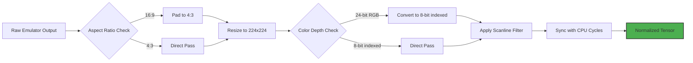
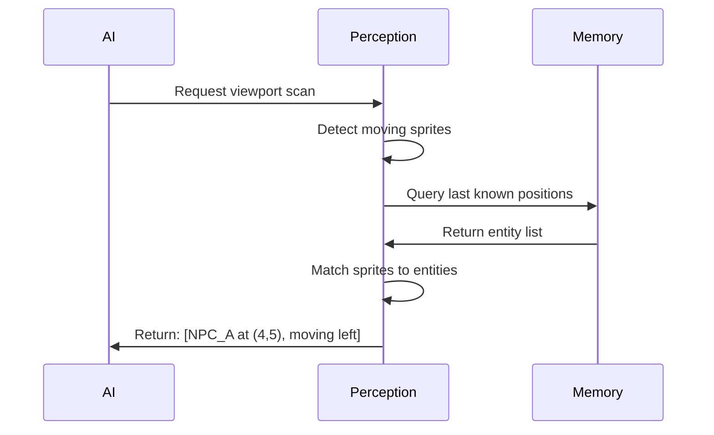
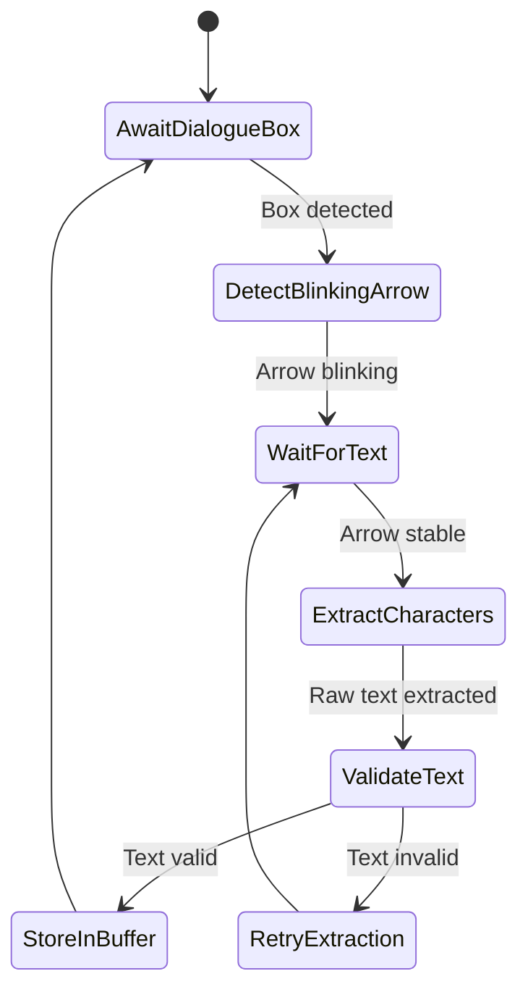
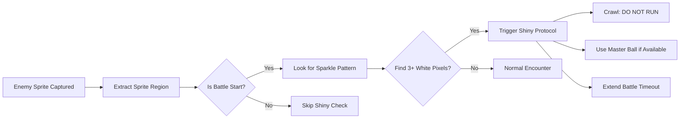
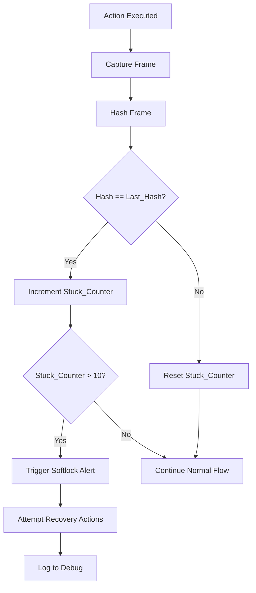

# PTP-01X Chapter 1: Vision & Perception Engine - Detailed Logic Flow

**Version:** 2.0 (Spec-Driven)  
**Purpose:** Define visual processing pipeline with flexible logic gates and state transitions

---

## 1.1 Pixel-Buffer Normalization Pipeline

### Goal: Transform emulator output into consistent 224x224 grayscale tensor



### Logic Gates & Decision Points

**Aspect Ratio Check:**
- IF width/height == 1.777 THEN trigger padding subroutine
- Padding: Add black bars left/right to maintain 1.333 aspect ratio
- Preserve original pixels, do not stretch

**Color Depth Reduction:**
- Map 24-bit RGB → 8-bit indexed using Game Boy Color palette
- Create lookup table: 0x00-0xFF representing each unique color
- Handle dithering artifacts via majority color sampling (3x3 kernel)

**Scanline Filtering:**
- REMOVE alternating horizontal lines (emulator scanlines)
- Interpolate missing lines using vertical averaging
- Preserve sharp edges on sprite boundaries

**Frame-Sync Logic:**
- WAIT for emulator vblank signal before capture
- If vblank not available: sample every 16.67ms (60fps)
- DROP duplicate frames (pixel delta < 1%)

### Error Recovery Paths

**Path A: Stuck Pixel Detection**
```
IF current_frame.hash == last_10_frames.hash
  THEN trigger "possible_softlock" alert
  AND request manual verification
  AND log coordinates to debug log
```

**Path B: Aspect Ratio Mismatch**
```
IF resize introduces distortion > 5%
  THEN fall back to letterboxing
  AND preserve native 160x144 resolution
  AND center-crop to 224x224
```

---

## 1.2 Semantic Grid Classification System

### Goal: Parse 20x18 tile viewport into navigable graph nodes

```mermaid
graph TD
    A[224x224 Grayscale] --> B[Slice into 16x16 Tiles]
    B --> C{Tile Database Lookup}
    C -->|Exact Match| D[Tag Static Object]
    C -->|Partial Match| E[Calculate Hash Similarity]
    C -->|No Match| F[Mark as "Unknown"]
    E --> G{Similarity > 85%?}
    G -->|Yes| H[Tag as Similar Object]
    G -->|No| I[Flag for Manual Review]
    D --> J[Assign Collision Type]
    H --> J
    F --> J
    J --> K[Generate Navigable Graph]
    K --> L[20x18 Node Grid]
```

### Tile Classification Matrix

**Collision Types:**
- `PASSABLE`: Grass, paths, indoor floors
- `BLOCKING`: Walls, trees, NPCs (static)
- `INTERACTIVE`: Doors, signs, item balls
- `LEDGE`: One-way drop (direction matters)
- `WARP`: Staircases, cave entrances
- `DANGER`: Lava, poison tiles
- `WATER`: Requires Surf HM
- `BREAKABLE`: Rock Smash, Cut trees

**Hash Similarity Calculation:**
```
function calculate_similarity(tile_hash, database_hash):
  hamming_distance = count_different_bits(tile_hash, database_hash)
  similarity = 1 - (hamming_distance / 256)
  return similarity * 100  // Percentage
```

**Unknown Tile Protocol:**
- CAPTURE unknown tile to debug directory
- LOG coordinates and surrounding 3x3 context
- REQUEST human annotation via annotation queue
- FALLBACK to "blocking" if no response in 60 seconds

### Dynamic Entity Tracking



**Movement Pattern Recognition:**
- Track entity positions across 3 consecutive frames
- IF position changes consistently: mark as "moving"
- IF position static for >5 frames: mark as "stationary NPC" or "object"
- Predict next position based on velocity vector

---

## 1.3 OCR & Dialogue Stream Parsing

### Goal: Extract text from dialogue boxes with 99.9% accuracy



### Dialogue State Machine

**AwaitDialogueBox:**
- SCAN for black rectangle with white border (dialogue box signature)
- CHECK for text pixel density > 10% within box region
- TIMEOUT after 300 frames (5 seconds) if no box detected

**DetectBlinkingArrow:**
- LOCATE arrow sprite in bottom-right corner (coordinates 180-200, 180-200)
- SAMPLE every 5 frames for 30 frames
- IF arrow visibility toggles > 3 times: mark as "blinking"
- ELIF arrow stable: proceed to extraction

**ExtractCharacters:**
- SLICE dialogue box into character cells (8x8 pixels per char)
- HASH each cell and compare to font template database
- HANDLE special cases:
  - `'d`, `'l`, `'s`, `'t`, `'v` contractions (apostrophe compression)
  - `é` character (0xE9 unicode)
  - `♂`/`♀` gender symbols (skip or map to M/F)
- CONCATENATE characters into words, respecting word-wrapping at 20 chars/line

**ValidateText:**
- CHECK for common OCR errors:
  - Isolated single characters (usually noise)
  - Repetitive patterns without spaces (failed word separation)
  - Illegal character sequences (e.g., numbers mid-word)
- IF validation fails: retry with different threshold
- IF passes 3/5 validators: accept text

**StoreInBuffer:**
- APPEND to dialogue history with timestamp
- EXTRACT intent and entities (see Chapter 8)
- TRIGGER relevant goal updates in GOAP system

### Font Template Database Structure

```json
{
  "font_templates": {
    "0x80": {"char": "A", "samples": 150, "confidence": 0.98},
    "0x81": {"char": "B", "samples": 145, "confidence": 0.97},
    "0xE9": {"char": "é", "samples": 67, "confidence": 0.94}
  },
  "special_cases": {
    "contraction_pattern": "[A-Z]'[a-z]",
    "gender_symbols": ["♂", "♀"],
    "apostrophe_remap": {"'d": "d", "'s": "s"}
  }
}
```

---

## 1.4 Battle Menu Coordinate Mapping

### Goal: Reliably interact with battle UI without pixel-perfect positioning

### UI Region Definitions

**Main Battle Menu (4 quadrants):**
```
Fight:   x=80-160, y=180-224
Pokémon: x=0-80,   y=180-224  
Item:    x=80-160, y=140-180
Run:     x=0-80,   y=140-180
```

**Move Selection Menu (4 slots):**
```
Slot 1: x=120-200, y=140-170  (Top-right)
Slot 2: x=120-200, y=170-200  (Bottom-right)
Slot 3: x=40-120,  y=140-170  (Top-left)
Slot 4: x=40-120,  y=170-200  (Bottom-left)
```

### Navigation Logic

**Select Move Process:**
```
1. Wait for Battle State (D057 = 0xFF)
2. Wait for Menu State (D0CD = 0x00 for main menu)
3. Click "Fight" quadrant (x=120, y=200)
4. Wait for Move Menu (check for PP display)
5. Locate cursor position (D0CD byte value)
6. Calculate needed moves:
   - IF cursor < target_slot: press Down (target_slot - cursor) times
   - IF cursor > target_slot: press Up (cursor - target_slot) times
7. Confirm selection (press A)
8. Wait for animation lock to clear
9. Verify move executed (check for damage numbers or status change)
```

**Error States:**
- IF no PP remaining: back out and select different move
- IF move fails (miss, no effect): log failure and adjust accuracy weights
- IF PP reaches 0 during battle: mark move as unavailable

### PP Count Extraction

**Location:** Bottom-right of move slot (x+60, y+5 offset)
```
1. Crop 20x10 pixel region
2. Extract digits using OCR (numbers only)
3. Parse as integer
4. IF parsing fails: estimate PP based on move max PP and usage
5. Cache PP value in move object
```

---

## 1.5 Sprite & Animation State Detection

### Goal: Identify special states and optimize input timing

### Shiny Detection Algorithm



**Sparkle Pattern Signature:**
- LOCATION: Above enemy sprite (y=40-60 region)
- PIXEL COLOR: Pure white (RGB 255,255,255 or index 0xFF)
- PATTERN: 3-5 pixels in triangular formation
- TIMING: Appears within first 30 frames of battle start

### Animation Lock Detection

**Detecting Long Animations:**
```
WHILE battle_active:
  Capture frame
  IF previous_frame.hash == current_frame.hash:
    lock_duration += 1
  IF lock_duration > 60 frames (1 second):
    Mark as "animation locked"
    Suspend input until frame changes
```

**Common Animation Durations:**
- Move animation: 30-90 frames
- Status effect: 15-30 frames  
- Faint animation: 60 frames
- Stat change: 20 frames
- Text scroll: 45 frames

**Optimization:**
- Cache animation lengths per move
- Skip input during known animation periods
- Resume input immediately after frame delta detected

### Screen Flash Detection

**Battle Start Trigger:**
```
FLASH_DETECTION:
  Sample center pixel (x=112, y=112)
  IF pixel_value changes from <50 to >200 within 3 frames:
    Battle has started
    Trigger battle state machine
    Reset turn counter
```

---

## 1.6 Visual Hazard Recognition

### Goal: Detect environmental hazards that affect navigation or combat

### Darkness Detection

```python
def detect_darkness_level(frame):
    """Calculate average luminance of viewport"""
    # Sample 100 points in grid pattern
    samples = [
        frame.get_pixel(x * 22, y * 22) 
        for x in range(10) for y in range(10)
    ]
    
    avg_luminance = sum(samples) / len(samples)
    
    if avg_luminance < 10:  # Almost black
        return "CRITICAL_DARKNESS"
    elif avg_luminance < 30:
        return "DIM_NEEDS_FLASH"
    else:
        return "NORMAL_LIGHTING"
```

**Actions Based on Darkness Level:**
- `CRITICAL_DARKNESS`: Cannot navigate, must use Flash HM
- `DIM_NEEDS_FLASH`: Can navigate but encounter rate increased  
- `NORMAL_LIGHTING`: Standard navigation

### Poison/Burn Screen Effects

**Screen Shake Pattern:**
```
SHAKE_DETECTION:
  Capture 5 consecutive frames
  For each frame, calculate center-of-mass of red pixels
  IF center-of-mass shifts > 3 pixels between frames:
    Screen is shaking
    Likely poison/burn damage animation
    Trigger "need healing" check
```

**Status Overlay Recognition:**
- LOCATION: Top-left of sprite (x=20, y=20 region)
- COLORS:
  - Purple: PSN (Poison)
  - Orange: BRN (Burn)
  - Cyan: FRZ (Freeze)
  - Yellow: PAR (Paralyze)
  - Zzz: SLP (Sleep)

### HM Obstacle Texture Recognition

**Cut Tree Signature:**
- COLOR: Green cluster in RGB 0-100 range
- SHAPE: Rectangular, 16x24 pixels
- LOCATION: Adjacent to passable path
- TEXTURE: Repeating leaf pattern

**Strength Boulder Signature:**
- COLOR: Gray/brown (RGB 100-150)
- SHAPE: Square, 16x16 pixels  
- LOCATION: Blocking narrow passages
- TEXTURE: Solid rock pattern

**Detection Process:**
```
1. Scan viewport for color clusters matching obstacle palette
2. Verify shape dimensions match expected sizes
3. Check adjacency to player (within 2 tiles)
4. If all conditions met, mark as "obstacle_detected"
5. Query inventory for corresponding HM
6. If HM available, trigger "use HM" sequence
```

---

## 1.7 Frame-Buffer Discrepancy Recovery

### Goal: Detect and recover from desync between AI actions and game state

### Stuck Pixel Detection



**Recovery Actions (in order):**
1. Press B button 3 times (exit menus)
2. Press directional button (attempt movement)
3. Press Start button (open/close menu)
4. Capture new frame and re-compare
5. If still stuck: pause and request manual intervention

### Input Confirmation Loop

**Action Verification:**
```
BEFORE_ACTION = capture_frame()
execute_action(action)
wait(30 frames)  // 0.5 seconds
AFTER_ACTION = capture_frame()

pixel_delta = calculate_pixel_difference(BEFORE_ACTION, AFTER_ACTION)

IF pixel_delta < 1%:
  ACTION_FAILED = True
  RETRY_COUNT += 1
  IF RETRY_COUNT > 3:
    ESCALATE_TO_RECOVERY()
ELSE:
  ACTION_CONFIRMED = True
  RETRY_COUNT = 0
```

**Pixel Difference Calculation:**
```
function calculate_pixel_difference(frame1, frame2):
  total_pixels = frame1.width * frame1.height
  changed_pixels = 0
  
  for x in range(0, frame1.width, 4):  // Sample every 4th pixel
      for y in range(0, frame1.height, 4):
          if frame1.get_pixel(x, y) != frame2.get_pixel(x, y):
              changed_pixels += 1
  
  return (changed_pixels / total_pixels) * 100
```

### Ghost Sprite Filtering

**Weather Effect Detection:**
```
WEATHER_FILTER:
  Sample top 50 rows of frame
  IF semi-transparent overlay detected (alpha < 255):
    Check for known weather patterns:
      - Sandstorm: brown/orange dust particles
      - Rain: blue/gray vertical lines
      - Snow: white dots
      - Fog: uniform gray reduction
    
    IF weather confirmed:
      Store weather_type in world_state
      Apply inverse filter to restore original colors
      Mark frame as "weather_affected"
```

**Aesthetic Overlay Removal:**
- Identify non-interactive sprites (butterflies, leaves)
- Detect by: small size (<10x10), random movement, no collision
- Filter out from semantic analysis
- Preserve in raw capture for debugging

### Transition Masking

**Fade Detection:**
```
FADE_DETECTION:
  Calculate average luminance of entire frame
  
  IF avg_luminance < 20 and was_normal_previously:
    Mark as "fading_to_black"
    Pause all OCR and decision logic
    Wait for fade to complete (avg_luminance returns > 50)
  
  IF avg_luminance > 230 and was_normal_previously:
    Mark as "fade_in_progress"
    Wait for fade to complete (avg_luminance returns < 200)
```

**Transition Types:**
- Fade to black: battle start/end, room transitions
- White flash: super effective hits, explosions
- Wipe: some cutscene transitions
- Pixelate: some move animations

**During Transitions:**
- Freeze decision logic
- Continue capturing for animation detection
- Resume when frame stabilizes

---

## Integration Points

### Chapter 2 (Memory Layer)
- WRAM addresses for validation: $D362 (X), $D361 (Y), $D35E (map)
- Used to confirm visual analysis matches game state

### Chapter 8 (Dialogue Systems)
- Text extraction feeds directly into intent classification
- Blinking arrow detection triggers dialogue flow

### Chapter 10 (Failsafe)
- Stuck pixel detection triggers softlock alerts
- Input confirmation failures escalate to recovery protocol

### Implementation Notes

**Performance Target:**
- Frame capture: <10ms
- Hash calculation: <1ms
- Tile classification: <5ms per tile (parallel batch: <50ms total)
- OCR: <20ms for full dialogue box
- **Total per frame: <100ms**

**Memory Budget:**
- Font templates: ~50KB
- Tile database: ~200KB  
- Frame buffers: 3x 224x224 = ~150KB
- **Total: <500KB**

**Error Handling:**
- All algorithms include timeout fallbacks
- Unknown tiles default to "blocking" (safe)
- OCR failures return None (trigger manual mode)
- Frame capture failures retry 3 times before escalating