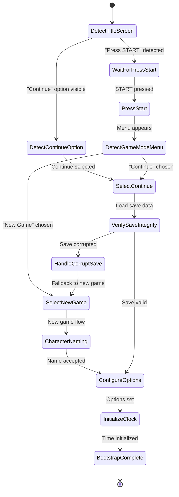
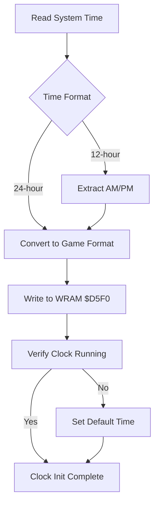
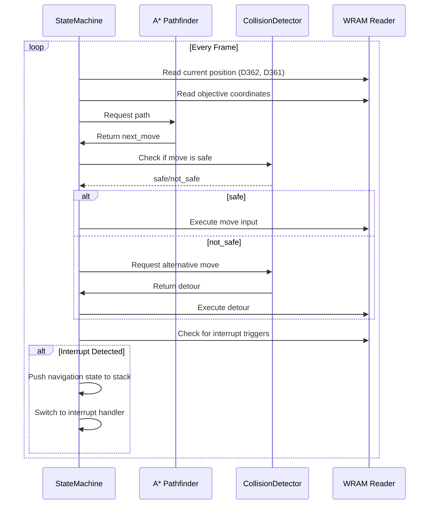
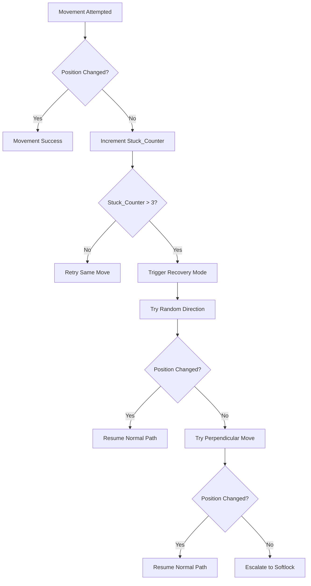
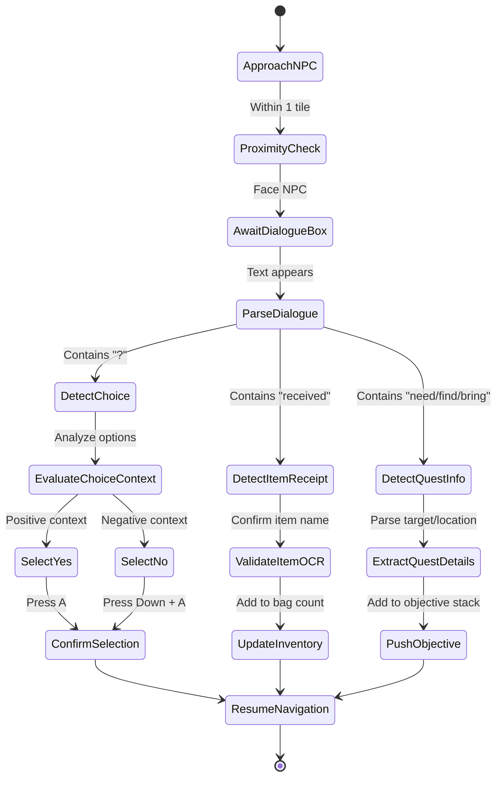
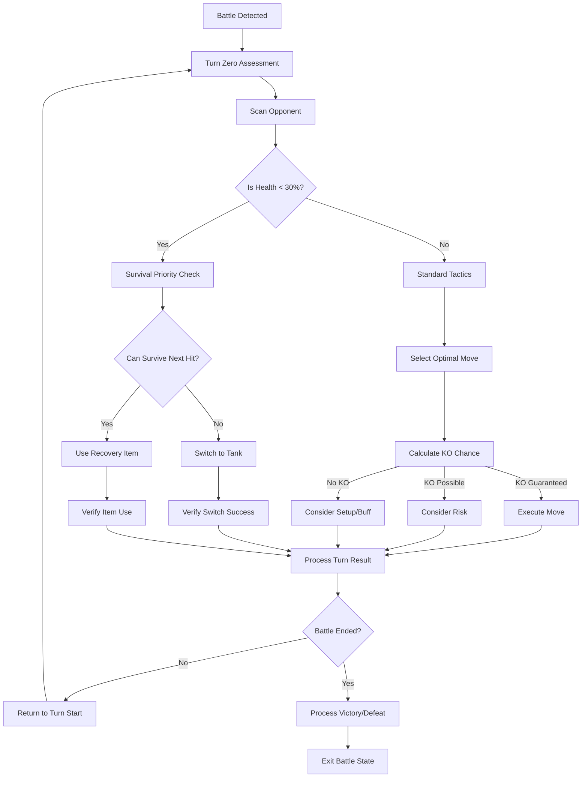
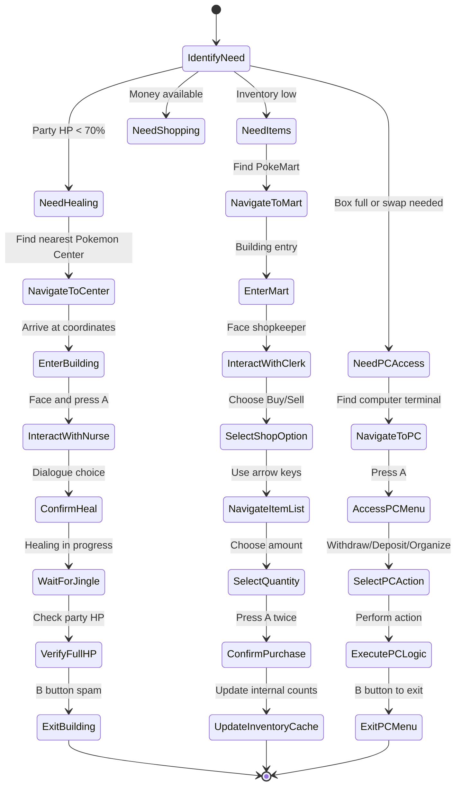
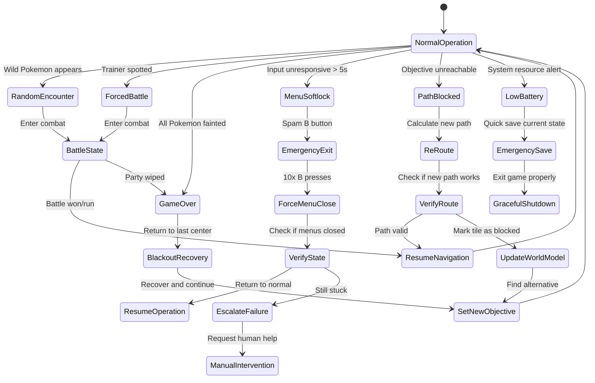

# PTP-01X Chapter 2: Hierarchical State Machine (HSM) - Detailed Logic Flow

**Version:** 2.0 (Spec-Driven)  
**Purpose:** Define state transitions, decision trees, and interrupt handling for autonomous gameplay

---

## 2.1 Bootstrap Sequence - Game Initialization

### Goal: Navigate from title screen to playable state with verified save integrity



### Title Screen Detection Logic

```
TITLE_SCREEN_IDENTIFICATION:
  Capture viewport
  Search for "PRESS START" text using OCR
  IF found:
    CONFIRM by checking bottom 50px for blinking text
    SET state = "title_screen_active"
    PROCEED to input sequence
  ELSE:
    WAIT 30 frames and retry
    IF 10 retries fail: ESCALATE to manual intervention
```

**Save File State Validation:**
```
SAVE_INTEGRITY_CHECK:
  Read save data from WRAM ($D000-$DFFF region)
  Calculate checksum of critical blocks:
    - Party data ($D16B-$D34A)
    - Inventory ($D31D-$D34A)
    - Game progress flags ($D772, $D5A7)
  
  IF checksum mismatch:
    LOG corruption details
    FALLBACK to new game
    ALERT user of data loss
  ELSE:
    LOAD world state from save
    SET starting location from save coordinates
```

### Clock Initialization Logic



**Day/Night Cycle Impact:**
- IF hour >= 20 OR hour < 6: Enable night encounters
- IF hour >= 17 AND hour < 20: Enable evening events
- Update wild encounter tables based on time
- Adjust NPC availability for time-sensitive quests

---

## 2.2 Overworld Navigation Loop

### Goal: Continuously move toward objective while handling interrupts



### Pathfinding Decision Tree

```
PATHFINDING_LOGIC:
  current_pos = (x, y, map_id)
  target_pos = get_objective_coordinates()
  
  IF same_map(current_pos, target_pos):
    Calculate A* path using current map graph
  ELSE:
    Find warp sequence to change maps
    Calculate multi-map path
  
  Get next_step from path
  
  SAFETY_CHECK(next_step):
    CHECK for trainer vision cone intersection
    CHECK for ledge drop direction
    CHECK for wild encounter rate
    CHECK for HM requirements
    
    IF any check fails:
      Generate alternative path with higher cost
      OR trigger interrupt if blocking is permanent
  
  EXECUTE move toward next_step
```

### Collision Recovery Subroutine



**Recovery Actions:**
1. Try random direction for 3 steps
2. If still stuck, try perpendicular direction
3. If still stuck after 10 total attempts, mark tile as "permanently blocked"
4. Re-route around blocked tile
5. Log incident for map validation

---

## 2.3 Interaction/Dialogue Engine

### Goal: Handle all NPC and object interactions with context-aware responses



### Proximity Calculation Logic

```
PROXIMITY_CHECK(npc_position, player_position):
  delta_x = abs(npc_position.x - player_position.x)
  delta_y = abs(npc_position.y - player_position.y)
  
  IF delta_x == 1 AND delta_y == 0:
    player_facing = get_player_facing_direction()
    IF player_facing == towards_npc:
      RETURN "interaction_ready"
  
  IF delta_x == 0 AND delta_y == 1:
    player_facing = get_player_facing_direction()
    IF player_facing == towards_npc:
      RETURN "interaction_ready"
  
  RETURN "need_to_move_closer"
```

**Facing Direction Mapping:**
- Player at (x, y) facing UP: can interact with (x, y-1)
- Player facing DOWN: can interact with (x, y+1)
- Player facing LEFT: can interact with (x-1, y)
- Player facing RIGHT: can interact with (x+1, y)

### Dialogue Choice Context Analysis

```
EVALUATE_CHOICE_CONTEXT(dialogue_lines):
  full_text = join(dialogue_lines).lower()
  
  POSITIVE_INDICATORS = [
    "heal", "restore", "receive", "get", "yes", "confirm",
    "accept", "agree", "continue", "proceed"
  ]
  
  NEGATIVE_INDICATORS = [
    "no", "cancel", "decline", "refuse", "stop", "toss",
    "release", "delete", "remove"
  ]
  
  positive_score = sum(1 for word in POSITIVE_INDICATORS if word in full_text)
  negative_score = sum(1 for word in NEGATIVE_INDICATORS if word in full_text)
  
  IF positive_score > negative_score:
    RETURN "select_yes"
  ELIF negative_score > positive_score:
    RETURN "select_no"
  ELSE:
    // Default to yes for ambiguous cases
    RETURN "select_yes"
```

**Special Case: Heal Offer**
```
IF "heal" in full_text AND "pokemon" in full_text:
  party_health = calculate_party_health_percentage()
  IF party_health < 100:
    RETURN "select_yes"  // Always accept healing when needed
  ELSE:
    RETURN "select_no"   // Skip if already healthy
```

---

## 2.4 Tactical Combat State

### Goal: Execute battle actions with survival-first priority



### Turn Zero Assessment Logic

```
TURN_ZERO_ASSESSMENT:
  opponent_species = scan_enemy_sprite()
  opponent_level = estimate_level_from_sprite_size()
  
  // Quick type identification
  IF opponent_sprite_matches_database:
    enemy_types = get_species_types(opponent_species)
  ELSE:
    enemy_types = ["unknown"]
  
  // Party evaluation
  active_pokemon = get_active_party_member()
  type_matchups = calculate_type_effectiveness(active_pokemon, enemy_types)
  
  // Threat assessment
  IF type_matchups.effectiveness < 0.5:
    threat_level = "HIGH"
    recommended_action = "consider_switch"
  ELIF type_matchups.effectiveness > 1.5:
    threat_level = "LOW"
    recommended_action = "attack"
  ELSE:
    threat_level = "MEDIUM"
    recommended_action = "evaluate_options"
  
  RETURN {
    opponent: {species, level, types},
    threat_level,
    recommended_action,
    type_matchups
  }
```

### Survival Priority Check

```
SURVIVAL_PRIORITY_CHECK(current_pokemon, opponent):
  // Calculate if current mon can survive
  predicted_damage = estimate_opponent_damage(opponent, current_pokemon)
  
  IF predicted_damage >= current_pokemon.hp:
    // Cannot survive - must switch or heal
    
    healing_items = get_available_healing_items()
    IF healing_items AND predicted_damage < current_pokemon.max_hp * 0.5:
      // Can heal and survive
      RETURN "use_item"
    ELSE:
      // Must switch to tank
      tank_pokemon = find_tank_against(opponent.types)
      IF tank_pokemon:
        RETURN f"switch_to_{tank_pokemon}"
      ELSE:
        RETURN "desperate_attack"  // Last resort
  
  ELSE IF predicted_damage >= current_pokemon.hp * 0.7:
    // Can survive but is risky
    RETURN "consider_heal_or_switch"
  
  ELSE:
    // Safe to stay and fight
    RETURN "continue_battle"
```

---

## 2.5 Logistics & Management State

### Goal: Handle all non-combat menu navigation and resource management



### Center Navigation Priority

```
FIND_NEAREST_CENTER(current_position):
  // Get list of all Pokemon Centers in world
  centers = [
    {"name": "Pallet Town", "coordinates": (12, 4), "map_id": 0},
    {"name": "Viridian City", "coordinates": (18, 22), "map_id": 1},
    {"name": "Pewter City", "coordinates": (8, 16), "map_id": 2},
    // ... all centers
  ]
  
  // Filter by map availability
  accessible_centers = [c for c in centers if can_access_map(c.map_id)]
  
  // Calculate Manhattan distance to each
  distances = [(center, manhattan_distance(current_position, center.coordinates))
               for center in accessible_centers]
  
  // Sort and return nearest
  distances.sort(key=lambda x: x[1])
  RETURN distances[0][0]
```

### Inventory Threshold Logic

```
NEED_INVENTORY_CHECK:
  current_potions = get_item_count(ITEM_POTION)
  current_super_potions = get_item_count(ITEM_SUPER_POTION)
  current_hyper_potions = get_item_count(ITEM_HYPER_POTION)
  
  current_pokeballs = get_item_count(ITEM_POKEBALL)
  current_great_balls = get_item_count(ITEM_GREAT_BALL)
  current_ultra_balls = get_item_count(ITEM_ULTRA_BALL)
  
  // Calculate "effective potions"
  effective_potions = (current_potions * 20 + 
                      current_super_potions * 50 + 
                      current_hyper_potions * 200) / 50  // Normalize to Super Potion
  
  // Check thresholds
  IF effective_potions < 10:
    TRIGGER_NEED = "restock_potions"
  
  IF (current_pokeballs + current_great_balls + current_ultra_balls) < 10:
    TRIGGER_NEED = "restock_balls"
  
  IF money > 500 AND (TRIGGER_NEED == "restock_potions" OR TRIGGER_NEED == "restock_balls"):
    TRIGGER_NEED = "go_shopping"
```

---

## 2.6 Evolution & Move-Learning Choice

### Goal: Make optimal decisions about evolution and move changes

```mermaid
flowchart TD
    A[Level Up Detected] --> B{Evolution Available?}
    B -->|Yes| C[Evolution Decision Tree]
    B -->|No| D{New Move Available?}
    
    C --> E[Check Pre-Evolution Moves]
    E --> F{Important Move Soon?}
    F -->|Yes (< 3 levels)| G[Cancel Evolution]
    F -->|No| H[Allow Evolution]
    
    D --> I[Calculate Move Power]
    I --> J{New Move > Existing?}
    J -->|Yes| K[Check Move Type Coverage]
    K --> L{Improves Coverage?}
    L -->|Yes| M[Learn Move]
    L -->|No| N[Skip Move]
    
    J -->|No| N
    
    M --> O{4 Moves Already?}
    O -->|Yes| P[Select Move to Forget]
    O -->|No| Q[Learn Directly]
    
    P --> R[Replace Weakest/Incompatible]
    R --> S[Update Moveset]
    Q --> S
    N --> T[Continue Without Change]
    
    G --> T
    H --> T
    S --> T
```

### Evolution Decision Logic

```
EVOLUTION_DECISION(pokemon, evolution_info):
  // Check for important pre-evolution moves
  next_moves = get_moves_learned_before_evolution(pokemon.species)
  
  FOR move in next_moves:
    IF move.level <= pokemon.level + 3:  // Within 3 levels
      IF move.power > 80 OR move.has_utility:
        // Important move is coming soon
        evolution_delay_benefit = 1.5
      ELSE:
        evolution_delay_benefit = 1.1
    ELSE:
      evolution_delay_benefit = 1.0
  
  // Calculate evolution benefit
  evolved_stats = get_evolved_form_stats(pokemon.species)
  stat_increase = sum(evolved_stats) - sum(current_stats)
  evolution_power_benefit = 1.0 + (stat_increase / 200)
  
  // Make decision
  IF evolution_delay_benefit > evolution_power_benefit:
    RETURN "delay_evo_for_move"
  ELSE:
    RETURN "evolve_now"
```

**Important Moves Worth Delaying:**
- Razor Leaf (Bulbasaur @ L27, Ivysaur @ L30)
- Thunderbolt (Pikachu @ L26, Raichu @ L43)
- Psychic (Abra line @ L31-38)
- Earthquake (dig-evo lines)
- Ice Beam (Water types pre-evo)

### Move Learning Decision

```
MOVE_LEARNING_DECISION(current_moves, new_move):
  // Calculate move value
  new_move_value = calculate_move_value(new_move)
  
  // Evaluate existing moves
  existing_move_values = [calculate_move_value(move) for move in current_moves]
  worst_move_index = argmin(existing_move_values)
  worst_move_value = existing_move_values[worst_move_index]
  
  // Type coverage analysis
  IF new_move.type not in [move.type for move in current_moves]:
    coverage_bonus = 1.2  // Bonus for new type coverage
  ELSE:
    coverage_bonus = 1.0
  
  // Final comparison
  adjusted_new_value = new_move_value * coverage_bonus
  
  IF adjusted_new_value > worst_move_value * 1.1:  // 10% improvement threshold
    RETURN f"learn_and_replace_{worst_move_index}"
  ELSE:
    RETURN "skip_move"
```

---

## 2.7 Emergency Interrupt Handler

### Goal: Handle unexpected events and system failures gracefully



### Random Encounter Interrupt Logic

```
RANDOM_ENCOUNTER_DETECTION:
  // Visual check
  battle_flash = detect_screen_flash()
  IF battle_flash:
    WAIT 30 frames for battle UI to load
    SCAN for opponent sprite
    IF opponent_found:
      CONFIRM by checking D057 (battle status = 0xFF)
      READ opponent species from sprite
      TRIGGER battle_state_entry
  
  // Memory check (backup)
  battle_byte = read_memory(0xD057)
  IF battle_byte == 0xFF:
    // Already in battle, but we missed the transition
    SCAN for opponent info
    TRIGGER battle_state_entry
```

**Interrupt Priority:**
1. Game Over (highest - requires immediate recovery)
2. Random Encounter (medium - standard battle entry)
3. Forced Battle (medium - trainer battle)
4. Menu Softlock (low - can attempt recovery)
5. Low Battery (low - graceful shutdown)

### Blackout Recovery Protocol

```
BLACKOUT_RECOVERY:
  // Detect black screen + "blacked out" text
  IF screen_mostly_black AND "blacked out" in OCR:
    // We're at last Pokemon Center
    SET coordinates = last_center_coordinates
    SET map_id = last_center_map
    HEAL all Pokemon (forced full heal)
    SET money = max(0, current_money - blackout_penalty)
    
    // Re-evaluate objectives
    IF current_objective_requires_location(current_map):
      // We're already where we need to be
      RESUME objective execution
    ELSE:
      // Need to travel back
      CALCULATE path to objective
      SET new navigation target
```

### Menu Softlock Detection & Recovery

```
SOFTLOCK_DETECTION:
  // Criteria:
  // 1. Menus are open for >300 frames (5 seconds)
  // 2. No progress in menu navigation
  // 3. Input spam doesn't change state
  
  IF menu_open_duration > 300 AND last_action_time > 300:
    stuck_frames = count_frames_without_change()
    
    IF stuck_frames > 60:  // 1 second of no change
      ESCALATION_LEVEL += 1
      
      IF ESCALATION_LEVEL == 1:
        // Gentle recovery
        PRESS_B(3 times with 0.5s intervals)
      ELIF ESCALATION_LEVEL == 2:
        // Aggressive recovery
        PRESS_B(10 times rapidly)
        PRESS_START()  // Try to close all menus
      ELIF ESCALATION_LEVEL >= 3:
        // Emergency measures
        RESET_INPUT_CONTROLLER()
        LOG_STATE()
        REQUEST_MANUAL_INTERVENTION()
```

**Recovery Verification:**
```
RECOVERY_VERIFICATION:
  AFTER recovery_attempts:
    WAIT 60 frames
    CHECK if menus are closed (D0CD == 0)
    IF menus closed:
      ESCALATION_LEVEL = 0
      RETURN to normal operation
    ELSE:
      ESCALATION_LEVEL += 1
      REPEAT recovery with next level
```

---

## Integration Points

### Chapter 1 (Perception)
- **OCR Results:** Feed dialogue text into interaction engine
- **Battle Detection:** Triggers combat state entry
- **Position Tracking:** Validates movement success
- **Menu Detection:** Confirms menu state for interactions

### Chapter 3 (Combat)
- **Battle State Entry:** Receives control from emergency interrupt handler
- **Combat Results:** Reports back victory/defeat to update objectives
- **PP Tracking:** Updates party state for inventory management

### Chapter 4 (Navigation)
- **Waypoint Requests:** Called by navigation state for pathfinding
- **Location Validation:** Confirms arrival at destinations (Center, Mart)
- **Map Transitions:** Handles warp points between areas

### Chapter 7 (Inventory)
- **Stock Level Queries:** Used by logistics state to determine shopping needs
- **Item Usage:** Called by combat state for in-battle items
- **PC Management:** Used by box management state

### Chapter 8 (Dialogue)
- **Text Parsing:** Provides structured dialogue data to interaction engine
- **Intent Classification:** Helps determine appropriate responses
- **Choice Detection:** Identifies Yes/No prompts for decision logic

### Chapter 9 (GOAP)
- **Objective Stack:** Receives new objectives from quest detection
- **Priority Management:** Adjusts objective weights based on state
- **Action Completion:** Notified when states complete successfully

### Chapter 10 (Failsafe)
- **Softlock Detection:** Receives alerts from emergency handler
- **Recovery Coordination:** Manages recovery protocol execution
- **State Integrity:** Validates state transitions are legal

---

## State Transition Validity Matrix

| From State | To State | Valid? | Conditions |
|------------|----------|--------|------------|
| Overworld | Battle | Yes | Random encounter or trainer spotted |
| Battle | Overworld | Yes | Victory, run, or blackout |
| Overworld | Menu | Yes | Start button or interaction trigger |
| Menu | Overworld | Yes | B button or action complete |
| Overworld | PC | Yes | A button on PC tile |
| PC | Overworld | Yes | Exit PC menu |
| Overworld | Shopping | Yes | Enter PokeMart |
| Shopping | Overworld | Yes | Exit building |
| Battle | Menu | No | Invalid transition |
| PC | Battle | No | Invalid transition |
| **Any** | **Emergency** | Yes | Critical failure detected |

**Invalid Transition Handling:**
```
ON_INVALID_TRANSITION(from_state, to_state):
  LOG_ERROR(f"Invalid transition: {from_state} → {to_state}")
  ATTEMPT graceful recovery:
    1. Reset to safest known state (usually Overworld)
    2. Clear all temporary state
    3. Re-initialize from save data
    4. Log diagnostic information
  IF recovery fails:
    ESCALATE to manual intervention
```

---

## Implementation Requirements

**Performance Targets:**
- State transition: <1ms
- Pathfinding query: <50ms for local area, <200ms for multi-map
- Interrupt detection: <16ms (within single frame)
- Recovery actions: <100ms per attempt
- **Total state machine overhead: <5% CPU**

**Memory Budget:**
- State stack: 1KB (100 states max)
- Pathfinding cache: 100KB
- Objective storage: 50KB
- **Total: <200KB**

**Reliability Requirements:**
- State transitions: 99.9% successful
- Interrupt handling: 100% detection rate for critical events
- Recovery success: >95% for softlocks, >80% for hardlocks
- Data integrity: Zero corruption of save state