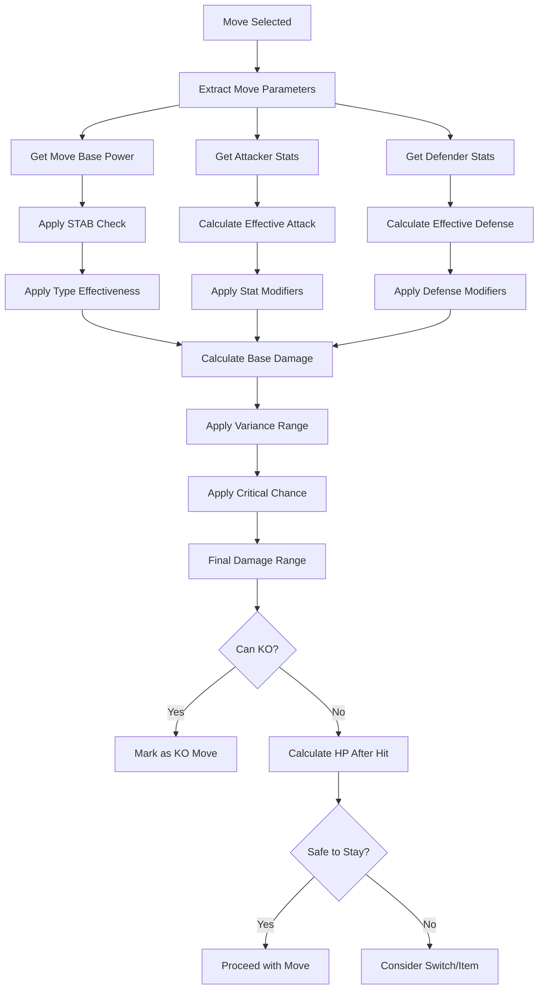
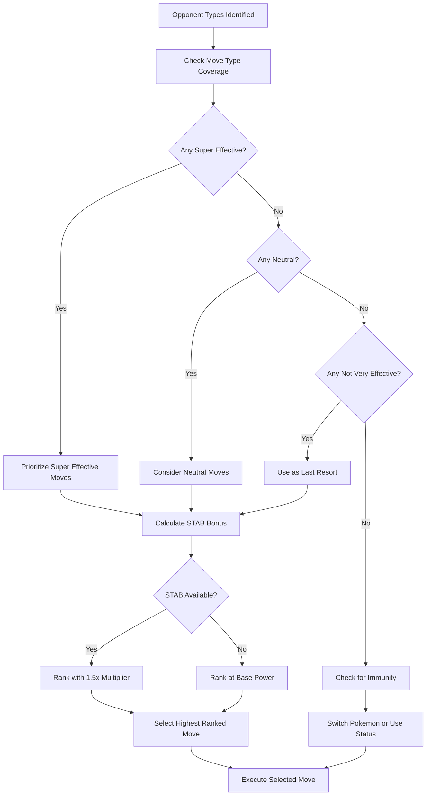
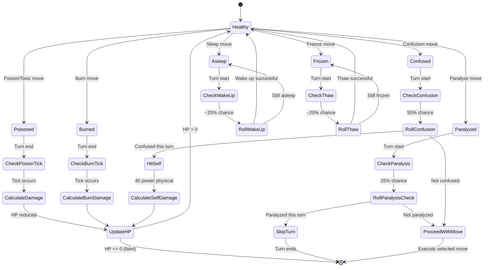
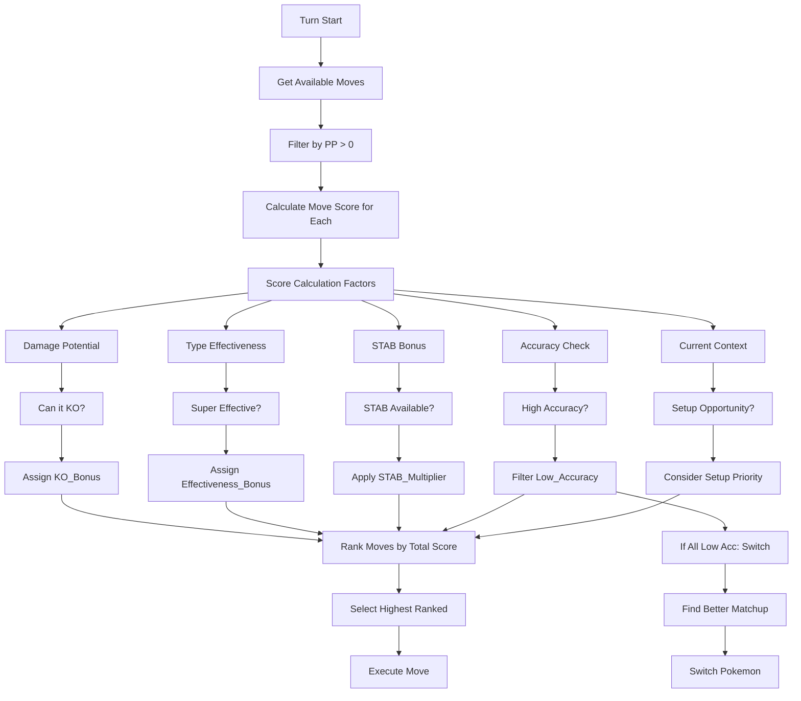
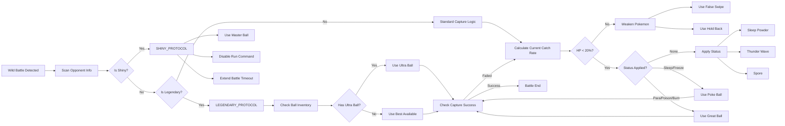
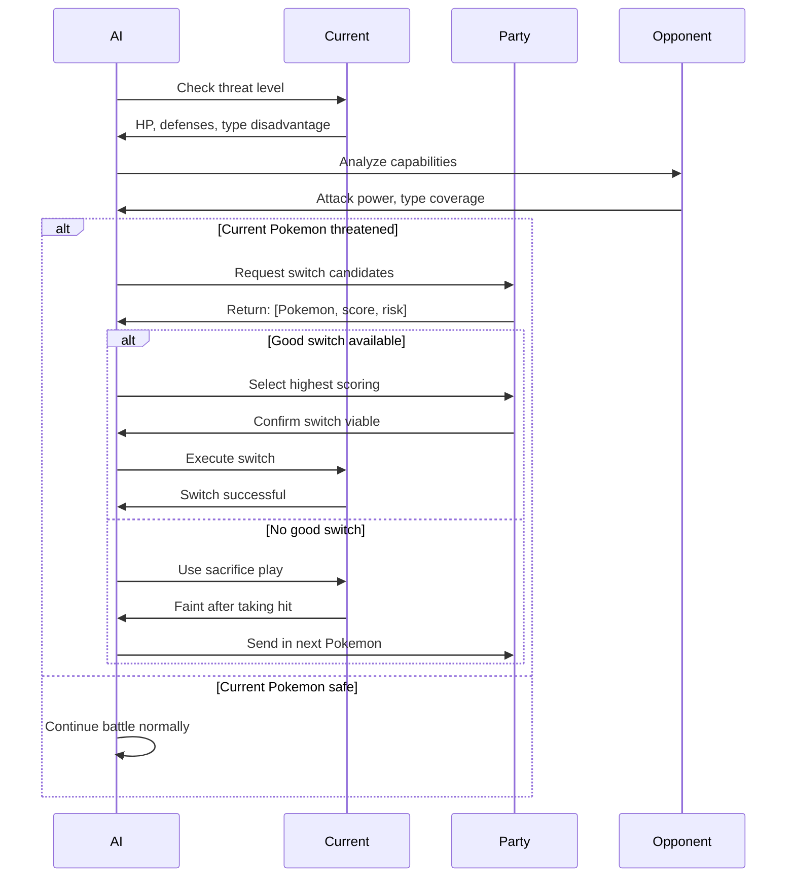

# PTP-01X Chapter 3: Tactical Combat Heuristics - Detailed Logic Flow

**Version:** 2.0 (Spec-Driven)  
**Purpose:** Define combat decision-making logic with survival-first priority and adaptive strategy

---

## 3.1 Damage Calculation & Prediction Engine

### Goal: Accurately predict damage ranges to make informed combat decisions



### Core Damage Formula (Gen 1)

```
BASE_DAMAGE = ((((2 * LEVEL / 5 + 2) * BASE_POWER * ATTACK) / DEFENSE) / 50) + 2

VARIANT_DAMAGE = BASE_DAMAGE * TYPE_EFFECTIVENESS * STAB * RANDOM_FACTOR

FINAL_DAMAGE = floor(VARIANT_DAMAGE * CRITICAL_MODIFIER)

Where:
- LEVEL: Attacker's current level
- BASE_POWER: Move's power (e.g., 40 for Tackle, 80 for Earthquake)
- ATTACK: Attacker's Attack stat if physical, Special if special
- DEFENSE: Defender's Defense if physical hit, Special if special hit
- TYPE_EFFECTIVENESS: 0, 0.5, 1, or 2 based on type chart
- STAB: 1.5 if move type matches attacker type, else 1.0
- RANDOM_FACTOR: 0.85 to 1.0 (uniform distribution)
- CRITICAL_MODIFIER: 2.0 if critical hit, 1.0 otherwise
```

**Stat Modifier Application:**
```
EFFECTIVE_ATTACK = BASE_ATTACK × (1 + (STAT_STAGE_MODIFIER / 2))

STAT_STAGE_MODIFIER ranges:
-6: 0.25×, -5: 0.285×, -4: 0.33×, -3: 0.4×, -2: 0.5×, -1: 0.66×
 0: 1.0×, +1: 1.5×, +2: 2.0×, +3: 2.5×, +4: 3.0×, +5: 3.5×, +6: 4.0×
```

### Variance Range Calculation

**Conservative Strategy (AI Default):**
```
MIN_DAMAGE = floor(BASE_DAMAGE × 0.85)  // Worst case
MAX_DAMAGE = floor(BASE_DAMAGE × 1.0)   // Best case without crit

// For critical hit consideration
CRIT_MIN = floor(MIN_DAMAGE × 2)
CRIT_MAX = floor(MAX_DAMAGE × 2)

// Weighted expected damage (for risk assessment)
EXPECTED_DAMAGE = floor((MIN_DAMAGE + MAX_DAMAGE) / 2)
```

**Decision Thresholds:**
- IF MAX_DAMAGE >= defender_hp: Move CAN KO (safe to use)
- IF EXPECTED_DAMAGE >= defender_hp × 0.8: Move LIKELY KO (good choice)
- IF MIN_DAMAGE >= defender_hp: Move ALWAYS KO (guaranteed)

### Critical Hit Probability

**Gen 1 Critical Mechanics:**
```
BASE_CRIT_RATE = <move_attribute>  // Default = 0.0625 (6.25%)
SPEED_FACTOR = floor(attacker_speed / 2)
CRIT_STAGE = min(BASE_CRIT_RATE + SPEED_FACTOR, 255)
CRIT_CHANCE = CRIT_STAGE / 256

High crit moves (e.g., Slash, Razor Leaf):
BASE_CRIT_RATE = 0.25 (25%)
```

**AI Critical Assumption:**
- Never assume critical hit for planning (defensive pessimism)
- Consider crit as bonus if it happens
- For high-crit moves (25%+): factor into KO calculation

---

## 3.2 Type-Effectiveness Lookup & Coverage Analysis

### Goal: Make optimal move selections based on type advantages



### Type Chart Matrix (Gen 1 - 15 Types)

**Core Interactions:**
```
SUPER_EFFECTIVE = 2.0x Damage
NOT_VERY_EFFECTIVE = 0.5x Damage
IMMUNE = 0.0x Damage
NEUTRAL = 1.0x Damage

Critical Interactions:
- Fire: Super vs Grass, Ice, Bug | Not vs Fire, Water, Rock, Dragon
- Water: Super vs Fire, Ground, Rock | Not vs Water, Grass, Dragon
- Grass: Super vs Water, Ground, Rock | Not vs Fire, Grass, Poison, Flying, Bug, Dragon
- Electric: Super vs Water, Flying | Not vs Electric, Grass, Dragon | IMMUNE vs Ground
- Ice: Super vs Grass, Ground, Flying, Dragon | Not vs Fire, Water, Ice
- Fighting: Super vs Normal, Ice, Rock | Not vs Poison, Flying, Psychic, Bug | IMMUNE vs Ghost
- Poison: Super vs Grass | Not vs Poison, Ground, Rock, Ghost | IMMUNE vs Steel*
- Ground: Super vs Fire, Electric, Poison, Rock | Not vs Grass, Bug | IMMUNE vs Flying
- Flying: Super vs Grass, Fighting, Bug | Not vs Electric, Rock
- Psychic: Super vs Fighting, Poison | Not vs Psychic, Steel* | IMMUNE vs Dark*
- Bug: Super vs Grass, Psychic | Not vs Fire, Fighting, Poison, Flying, Ghost, Steel*, Dragon
- Rock: Super vs Fire, Ice, Flying, Bug | Not vs Fighting, Ground, Steel*
- Ghost: Super vs Psychic, Ghost | Not vs Dark* | IMMUNE vs Normal
- Dragon: Super vs Dragon | Not vs Steel*
- Normal: Super vs None | Not vs Rock, Steel* | IMMUNE vs Ghost

*Steel type not in Gen 1, included for future-proofing
```

### Dual-Type Calculation

```
DUAL_TYPE_EFFECTIVENESS(move_type, defender_type1, defender_type2):
  effect1 = TYPE_CHART[move_type][defender_type1]
  effect2 = TYPE_CHART[move_type][defender_type2]
  
  // Multiply effectiveness
  combined_effect = effect1 * effect2
  
  RETURN combined_effect
  // Result can be: 4.0, 2.0, 1.0, 0.5, 0.25, or 0.0
```

**AI Decision Based on Combined Effect:**
- 4.0x: PERFECT match, prioritize this move
- 2.0x: GOOD match, preferred move
- 1.0x: NEUTRAL, acceptable if no better options
- 0.5x: POOR, avoid unless desperate
- 0.25x: VERY POOR, never use this move
- 0.0x: IMMUNE, do not use (switch or use status move)

### Coverage Analysis Algorithm

```
OPTIMIZE_TEAM_COVERAGE(party_moves):
  // Analyze all moves against all types
  type_coverage = {}
  
  FOR move in party_moves:
    FOR target_type in ALL_TYPES:
      effectiveness = calculate_effectiveness(move.type, target_type)
      IF effectiveness >= 2.0:
        type_coverage[target_type] = max(type_coverage.get(target_type, 0), effectiveness)
  
  // Identify coverage gaps
  uncovered_types = []
  FOR target_type in ALL_TYPES:
    IF type_coverage.get(target_type, 0) < 1.0:
      uncovered_types.append(target_type)
  
  RETURN {
    "coverage_score": len([t for t, e in type_coverage.items() if e >= 2.0]) / len(ALL_TYPES),
    "uncovered_types": uncovered_types,
    "recommendations": generate_coverage_improvements(uncovered_types)
  }
```

---

## 3.3 Status Effect & Debuff Management

### Goal: Track and respond to status conditions with optimal timing



### Status Tick Damage Calculation

**Poison Damage:**
```
POISON_DAMAGE = floor(max_hp / 16)  // ~6.25% max HP per turn

// Toxic Poison (badly poisoned)
TOXIC_DAMAGE = floor((max_hp * toxic_counter) / 16)
toxic_counter increases by 1 each turn (max 15)
```

**Burn Damage:**
```
BURN_DAMAGE = floor(max_hp / 16)  // Same as poison, but also halves Attack
```

**Confusion Self-Damage:**
```
SELF_DAMAGE = floor(((2 * level / 5 + 2) * 40 * attack) / defense / 50) + 2
// 40 base power physical attack on self
```

### AI Status Response Heuristics

```
STATUS_RESPONSE_STRATEGY(pokemon, status_condition):
  // Priority ranking of status conditions
  STATUS_PRIORITY = {
    "healthy": 0,
    "asleep": 1,      // Miss turns completely
    "frozen": 2,      // Similar to sleep but different thaw rate
    "confused": 3,    // 50% chance to hit self
    "paralyzed": 4,   // 25% chance to skip turn + speed cut
    "poisoned": 5,    // Gradual HP loss, but can still act
    "badly_poisoned": 6,  // Escalating damage
    "burned": 7       // Gradual HP loss + attack cut
  }
  
  status_priority = STATUS_PRIORITY.get(status_condition, 0)
  
  // Critical threshold - heal immediately
  IF status_priority <= 3 AND pokemon.hp_percentage > 30:
    RETURN "heal_status_urgent"
  
  // Moderate threshold - heal when convenient
  IF status_priority <= 5 AND has_healing_item:
    RETURN "heal_status_when_safe"
  
  // Low priority - can wait
  IF status_priority <= 7 AND not_in_battle:
    RETURN "heal_status_at_center"
  
  // End of battle - always heal before proceeding
  IF battle_ending:
    RETURN "heal_status_before_continue"
```

**Status Recovery Item Priority:**
1. Full Heal (cures any status) - highest priority
2. Specific cure (Antidote, Burn Heal, etc.) - medium priority
3. Full Restore (HP + status) - high if HP also low
4. Berry (Lum, etc.) - use if held, then replace

---

## 3.4 Move Selection Heuristics

### Goal: Choose the optimal move each turn based on multiple factors



### Move Scoring Algorithm

```
CALCULATE_MOVE_SCORE(move, attacker, defender, context):
  // Base score from power
  base_score = move.power / 10
  
  // Type effectiveness multiplier (0.25x to 4x)
  effectiveness = calculate_type_effectiveness(move.type, defender.types)
  effectiveness_bonus = effectiveness
  
  // STAB multiplier
  IF move.type in attacker.types:
    stab_multiplier = 1.5
  ELSE:
    stab_multiplier = 1.0
  
  // Accuracy factor
  accuracy_factor = move.accuracy / 100
  IF move.accuracy < 80 AND context.risk_averse:
    accuracy_penalty = 0.8
  ELSE:
    accuracy_penalty = 1.0
  
  // KO bonus (highest priority)
  predicted_damage = calculate_expected_damage(move, attacker, defender)
  IF predicted_damage >= defender.current_hp:
    ko_bonus = 3.0  // Massive bonus for guaranteed KO
  ELIF predicted_damage >= defender.current_hp * 0.8:
    ko_bonus = 1.5  // Good chance to KO
  ELSE:
    ko_bonus = 1.0
  
  // Coverage bonus (for team strategy)
  IF move.type not in attacker.move_types:
    coverage_bonus = 1.1  // Slight bonus for type coverage
  ELSE:
    coverage_bonus = 1.0
  
  // Final score calculation
  score = base_score × effectiveness × stab_multiplier × 
          accuracy_factor × accuracy_penalty × ko_bonus × coverage_bonus
  
  RETURN score
```

**Move Categories & Special Handling:**

**Setup Moves (e.g., Swords Dance, Growth):**
```
IF move.is_setup():
  // Only use if safe
  IF defender_cannot_2hko_attacker():
    score = 2.0  // High value if safe to set up
  ELSE:
    score = 0.1  // Low value if pressured
```

**Status Moves (e.g., Thunder Wave, Sleep Powder):**
```
IF move.inflicts_status():
  // Avoid if defender is already statused
  IF defender_has_status():
    score = 0.0
  ELSE:
    // Better against tougher opponents
    status_value = 1.5 + (defender.threat_level * 0.5)
    score = status_value * move.accuracy / 100
```

**Priority Moves (e.g., Quick Attack, Extremespeed):**
```
IF move.has_priority():
  // Valuable when faster than opponent or for finishing
  IF attacker.speed < defender.speed:
    priority_bonus = 1.5
  ELSE:
    priority_bonus = 1.1
  
  score = (move.power / 10) × priority_bonus × move.accuracy / 100
```

---

## 3.5 Catch Probability Logic (Wild Battles)

### Goal: Maximize catch rate while minimizing resource waste



### Catch Rate Formula

```
CATCH_RATE = floor((OPPORTUNITY_FACTOR) × (BALL_FACTOR) × (STATUS_FACTOR))

OPPORTUNITY_FACTOR = ((3 × max_hp - 2 × current_hp) × catch_rate) / (3 × max_hp)

BALL_FACTOR = {
  "Poke Ball": 1.0,
  "Great Ball": 1.5,
  "Ultra Ball": 2.0,
  "Master Ball": 255 (guaranteed)
}

STATUS_FACTOR = {
  "Normal": 1.0,
  "Poison/Burn/Paralyze": 1.5,
  "Sleep/Freeze": 2.5
}

catch_rate = species_base_catch_rate  // 3-255, higher = easier
```

**Catch Rate Categories:**
- 255: Guaranteed catch (common Pokémon)
- 200-254: Very easy (Pidgey, Rattata)
- 100-199: Easy (most Pokémon)
- 50-99: Medium (evolved forms, rare)
- 3-49: Hard (legendaries, Dragonite)
- <3: Very hard (Mewtwo: 3)

### Shiny Detection & Protocol

```
SHINY_PROTOCOL:
  // Visual detection
  IF sparkle_pattern_detected():
    TRIGGER highest_priority_alert
    
    // Override all other logic
    OVERRIDE battle_timeout = 9999
    OVERRIDE run_command = disabled
    OVERRIDE capture_mode = emergency
    
    // Ball selection priority
    IF master_ball in inventory:
      USE master_ball immediately
    ELSE IF ultra_ball_count >= 5:
      // Conservation mode
      ULTRA_BALL_PRIORITY = max
      ENSURE pokemon_status = sleep
    ELSE IF great_ball_count >= 10:
      // Stock mode
      GREAT_BALL_PRIORITY = high
      ENSURE pokemon_hp < 20%
    ELSE:
      // Desperation mode
      USE best_available_ball
      RISK_paralysis_instead_of_sleep = true
    
    // Backup: False Swipe to 1HP
    IF pokemon_hp > 10% AND has_false_swipe_user:
      USE false_swipe_until_minimum
    
    LOG "SHINY ENCOUNTERED" with timestamp and species
    CAPTURE screenshot immediately
    SAVE state before capture attempt
```

### Weakening Strategy

**Optimal HP Threshold:**
```
TARGET_HP_PERCENTAGE = {
  "Standard": 10,    // 10% HP for regular catches
  "Rare": 5,         // 5% HP for rare species
  "Legendary": 1,    // Minimum HP for legendaries
  "Shiny": 1         // Never risk KO on shiny
}

WEAKEN_POKEMON(target_hp_percent):
  current_hp_percent = (current_hp / max_hp) * 100
  
  IF current_hp_percent > target_hp_percent + 5:
    // Need significant weakening
    IF has_false_swipe:
      USE false_swipe (guaranteed 1HP if would KO)
    ELSE IF has_hold_back:
      USE hold_back
    ELSE:
      USE weakest_move_available
  
  ELSE IF current_hp_percent > target_hp_percent:
    // Fine-tune weakening
    USE tackle_or_scratch_level_move
  
  ELSE:
    // Already at target HP
    RETURN "weakening_complete"
```

**Status Application Priority:**
1. **Sleep** (best: 2.5x multiplier) - Use Spore, Sleep Powder, Hypnosis
2. **Freeze** (best: 2.5x multiplier) - Use Ice moves with freeze chance
3. **Paralyze** (good: 1.5x multiplier) - Use Thunder Wave, Stun Spore
4. **Burn/Poison** (okay: 1.5x multiplier) - Use if sleep unavailable, but risk KO

---

## 3.6 Item-in-Battle Heuristics

### Goal: Optimize item usage during combat for survival and advantage

```mermaid
flowchart TD
    A[Turn Start] --> B{Is Pokemon Low HP?}
    B -->|Yes (< 30%)| C{Can Opponent KO?}
    B -->|No| D{Is Pokemon Statused?}
    
    C -->|Yes| E[Use Potion/Recovery]
    C -->|No| F[Consider Setup Move]
    
    D -->|Yes| G[Evaluate Status Severity]
    G --> H{Is It Critical?}
    H -->|Yes| I[Use Status Cure]
    H -->|No| J[Defer to End of Battle]
    
    E --> K[Select Optimal Potion]
    K --> L{Super Effective Coming?}
    L -->|Yes| M[Use Hyper/Max Potion]
    L -->|No| N[Use Potion/Super]
    
    F --> O[Check Stat Boost Items]
    O --> P{Safe to Set Up?}
    P -->|Yes| Q[Use X Attack/X Defend]
    P -->|No| R[Select Attack Move]
    
    I --> S[Select Status Cure]
    S --> T{Full Heal Available?}
    T -->|Yes| U[Use Full Heal]
    T -->|No| V[Use Specific Cure]
    
    J --> W[Proceed with Attack]
    M --> W
    N --> W
    Q --> W
    R --> W
    U --> W
    V --> W
```

### Healing Item Selection Logic

```
SELECT_OPTIMAL_POTION(pokemon, opponent_threat):
  hp_needed = pokemon.max_hp - pokemon.current_hp
  current_hp_percent = (pokemon.current_hp / pokemon.max_hp) * 100
  
  // Super effective incoming?
  IF opponent_can_super_effective():
    damage_estimate = predict_damage(opponent, pokemon)
    hp_after_hit = pokemon.current_hp - damage_estimate
    
    IF hp_after_hit < 0:
      // Likely to be KO'd
      safety_buffer = pokemon.max_hp * 0.5  // Need 50% buffer
    ELSE:
      safety_buffer = pokemon.max_hp * 0.3  // Need 30% buffer
    
    // Prioritize maximum healing
    IF max_potion in inventory AND heal_amount >= hp_needed + safety_buffer:
      RETURN max_potion
    ELSE IF hyper_potion in inventory AND heal_amount >= hp_needed + safety_buffer:
      RETURN hyper_potion
    ELSE:
      // Can't safely heal, consider switch
      RETURN "SWITCH_RECOMMENDED"
  
  // Non-threatening situation - use efficient healing
  ELSE:
    // Efficiency threshold: don't waste overkill healing
    efficiency_threshold = 20  // HP buffer
    
    IF hp_needed > 200 AND hyper_potion in inventory:
      RETURN hyper_potion
    ELSE IF hp_needed > 50 AND super_potion in inventory:
      RETURN super_potion
    ELSE IF hp_needed > 0 AND potion in inventory:
      RETURN potion
    ELSE IF full_restore in inventory AND pokemon.status != "healthy":
      RETURN full_restore
    ELSE:
      RETURN "NO_HEALING_AVAILABLE"
```

**Item Priority by Situation:**

**In Battle, Under Pressure:**
1. Full Restore (HP + status)
2. Hyper Potion (200 HP)
3. Super Potion (50 HP)
4. Potion (20 HP)

**Between Battles, Safe:**
1. Potion (most efficient per HP)
2. Super Potion (moderate efficiency)
3. Hyper Potion (for high HP Pokemon)
4. Max Potion (if money is abundant)

### Stat Boost Item Usage

```
EVALUATE_STAT_BOOST_OPPORTUNITY(attacker, defender):
  // Safe setup conditions
  safe_conditions = [
    defender_cannot_2hko_attacker(),
    defender_current_hp < 20,  // Almost KO'd
    defender_has_non_damaging_move(),
    attacker_has_defense_boost(),
    battle_is_1v1_and_not_timed()
  ]
  
  safe_score = sum(safe_conditions)
  
  IF safe_score >= 2:
    // Can safely set up
    IF attacker.attack_stage < 4 AND attacker_has_physical_moves():
      RETURN "use_x_attack"
    ELSE IF attacker.defense_stage < 4 AND defender_physical_damage > 0:
      RETURN "use_x_defend"
    ELSE IF attacker.speed_stage < 4 AND outspeed_needed():
      RETURN "use_x_speed"
    ELSE IF attacker.special_stage < 4 AND attacker_has_special_moves():
      RETURN "use_x_special"
  
  // Not safe enough - just attack
  RETURN "skip_setup"
```

---

## 3.7 Party-Swap Tactics

### Goal: Make optimal switching decisions during battle



### Switch Trigger Conditions

```
SHOULD_SWITCH_POKEMON(current_pokemon, opponent):
  // Critical switches (immediate)
  IF current_pokemon.hp_percentage < 10:
    RETURN ("emergency", "must_switch")
  
  IF opponent_move_will_ko(current_pokemon):
    RETURN ("critical", "must_switch")
  
  IF type_effectiveness(opponent.move_type, current_pokemon.types) >= 4.0:
    RETURN ("critical", "extreme_disadvantage")
  
  // Strategic switches (opportunity-based)
  IF current_pokemon.hp_percentage < 30 AND not_crucial:
    RETURN ("strategic", "can_switch_if_better")
  
  IF type_effectiveness(opponent.move_type, current_pokemon.types) >= 2.0:
    RETURN ("strategic", "advantageous_switch_if_available")
  
  IF current_pokemon.pp_all_moves_low():
    RETURN ("strategic", "pp_conservation_switch")
  
  // Setup switches (optimize for sweep)
  IF opponent_weak_to_setup():
    RETURN ("setup", "bring_in_sweeper")
  
  // No switch needed
  RETURN ("none", "continue_battle")
```

### Switch Candidate Evaluation

```
EVALUATE_SWITCH_CANDIDATES(party, opponent):
  candidates = []
  
  FOR pokemon in party:
    IF pokemon == current_pokemon OR pokemon.is_fainted:
      continue  // Can't switch to same or fainted
    
    // Calculate defensive score
    incoming_damage = predict_damage(opponent, pokemon)
    survival_turns = pokemon.hp / max(incoming_damage, 1)
    
    IF survival_turns < 1:
      defensive_score = -1.0  // Would be KO'd immediately
    ELSE:
      defensive_score = min(survival_turns / 3.0, 1.0)  // Can survive 3+ turns = perfect
    
    // Calculate offensive score
    best_move = get_best_move_against(pokemon, opponent)
    if best_move:
      offensive_score = calculate_move_score(best_move, pokemon, opponent)
    else:
      offensive_score = 0.0
    
    // Type matchup bonus
    type_effectiveness = calculate_type_effectiveness(opponent.types, pokemon.types)
    IF type_effectiveness <= 0.25:
      matchup_bonus = 0.5  // Penalty for bad defensive typing
    ELIF type_effectiveness >= 1.0:
      matchup_bonus = 1.2  // Bonus for resisting opponent
    ELSE:
      matchup_bonus = 1.0
    
    // Overall switch score
    total_score = (defensive_score * 0.4 + offensive_score * 0.6) * matchup_bonus
    
    candidates.append({
      "pokemon": pokemon,
      "score": total_score,
      "reason": generate_switch_reason(defensive_score, offensive_score, matchup_bonus)
    })
  
  // Rank candidates
  candidates.sort(key=lambda x: x["score"], reverse=True)
  RETURN candidates
```

### Sacrifice Play Logic

```
EXECUTE_SACRIFICE_PLAY(current_pokemon, opponent, switch_target):
  // Goal: Take hit with current, then switch to better matchup
  
  // Check if sacrifice is worth it
  predicted_damage = calculate_opponent_damage(opponent, current_pokemon)
  current_survival = current_pokemon.hp - predicted_damage
  
  IF current_survival > 0:
    // Can survive the hit - best case
    RETURN "sacrifice_and_switch"
  ELSE:
    // Will faint, but can still be useful if brings in safely
    predicted_damage_to_switch = calculate_opponent_damage(opponent, switch_target)
    
    IF predicted_damage_to_switch >= switch_target.hp * 0.7:
      // Switch target would also be in danger
      RETURN "dont_sacrifice_both_die"
    ELSE:
      // Sacrifice is worth it
      RETURN "sacrifice_worth_it"
```

**Sacrifice Value Assessment:**
- If current will faint anyway → Always sacrifice if switch target survives
- If current can survive → Sacrifice if switch target has better matchup
- If both would be heavily damaged → Consider other options

---

## Integration Points

### Chapter 1 (Perception)
- **Sprite Recognition:** Identify opponent species and shininess
- **HP Bar Reading:** Extract current HP percentages for calculations
- **Status Overlay:** Detect burn/paralyze/sleep indicators

### Chapter 2 (Memory)
- **PP Tracking:** Consumed power points for move availability
- **Stat Stage Tracking:** Current stat modifications (Attack/Defense stages)
- **Battle State:** In-battle flag and turn counter

### Chapter 5 (Cartography)
- **Terrain Modifiers:** Battle arena effects (e.g., Grassy Terrain, Psychic Terrain)
- **Weather Detection:** Sandstorm, Rain, Sun for damage modifiers
- **Field Hazards:** Spikes, Stealth Rock damage calculations

### Chapter 6 (Entity Management)
- **Party State:** Current Pokemon stats and HP
- **Move Sets:** Available moves with current PP
- **Type Coverage:** Team-level type matching
- **Carry Optimization:** Switch decisions informed by carry scores

### Chapter 7 (Inventory)
- **Item Availability:** Potion counts, status cures, balls
- **Ball Selection:** Catch rate calculations based on current stock
- **Healing Items:** Potion selection logic for in-battle recovery

### Chapter 8 (Dialogue)
- **Battle Text:** "It's super effective!" confirms type calculations
- **Status Messages:** "Pikachu is paralyzed!" validates status application
- **Catching Messages:** "Gotcha!" confirms capture success

### Chapter 9 (GOAP)
- **Combat Goals:** "Win battle" as tactical goal with high priority
- **Switch Recommendations:** Strategic goals for party optimization
- **Emergency Protocols:** Switch when survival is threatened

### Chapter 10 (Failsafe)
- **Battle Timeout:** Detect infinite battles (PP exhaustion loops)
- **Invalid States:** Check for impossible damage values or HP
- **Recovery:** Emergency switch if current Pokemon is stuck

---

## Combat Decision Validity Matrix

| Situation | Action | Valid? | Override Conditions |
|-----------|--------|--------|-------------------|
| PP > 0 | Use Move | Yes | - |
| PP = 0 | Use Move | No | Trigger panic switch |
| HP > 0 | Use Move | Yes | - |
| HP = 0 | Use Move | No | Switch required |
| Opponent HP = 0 | Continue Attacking | No | Battle should end |
| All Moves PP = 0 | Struggle | Yes | Auto-trigger when no PP |
| Shiny Present | Use Master Ball | Yes | Override all other logic |
| Immune Type Selected | Use Move | No | Must switch or use status |
| Status Already Applied | Apply Status | No | Stack not allowed |
| Fainted Pokemon | Switch In | No | Invalid selection |

**Invalid Action Recovery:**
```
ON_INVALID_COMBAT_ACTION(action, reason):
  LOG_ERROR(f"Invalid combat action: {action} - {reason}")
  
  RECOVERY_SEQUENCE:
    1. Check PP of all moves
    2. If all PP = 0: Force Struggle
    3. If Pokemon fainted: Force switch
    4. If immune type selected: Find first non-immune move
    5. If no valid moves: Switch to next Pokemon
    6. Log recovery action taken
    7. Update internal state
```

---

## Performance Specifications

### Combat Turn Processing Timeline

| Phase | Time Budget | Priority |
|-------|-------------|----------|
| Turn Zero Assessment | 50ms | P0 - Must complete |
| Damage prediction (all moves) | 30ms | P0 - Must complete |
| Move scoring & selection | 40ms | P0 - Must complete |
| Input execution | 20ms | P0 - Must complete |
| Animation wait | 500-2000ms | P1 - Variable |
| Result parsing | 30ms | P0 - Must complete |
| State update | 20ms | P0 - Must complete |

**Total Turn Time:** 50-200ms AI processing + animation time

### Memory Budget for Combat Logic

- **Damage calculation cache:** 2KB (pre-calculated values)
- **Type chart lookup:** 1KB (15x15 matrix)
- **Move database:** 50KB (all Gen 1 moves)
- **Battle state:** 1KB (active Pokemon, HP, stats, etc.)
- **Prediction buffer:** 5KB (damage ranges for all matchups)
- **Total:** <60KB for combat heuristics

### Success Metrics

- **Damage prediction accuracy:** ±10% of actual 90% of time
- **KO prediction accuracy:** 95% for guaranteed KOs
- **Switch decision quality:** 85% survival rate post-switch
- **Item usage efficiency:** <10% waste (overheal, unnecessary items)
- **Catch success rate:** 75% for standard Pokémon, 100% for legendaries with proper setup

**Failure Recovery:**
- Wrong KO prediction → Switch strategy for similar future situations
- Missed catch → Increase weakening threshold next time
- Unexpected status loss → Increase healing priority