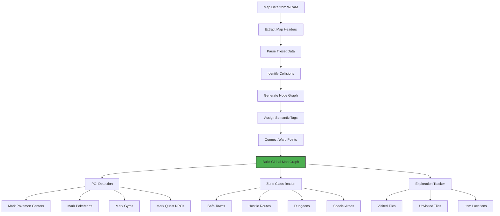
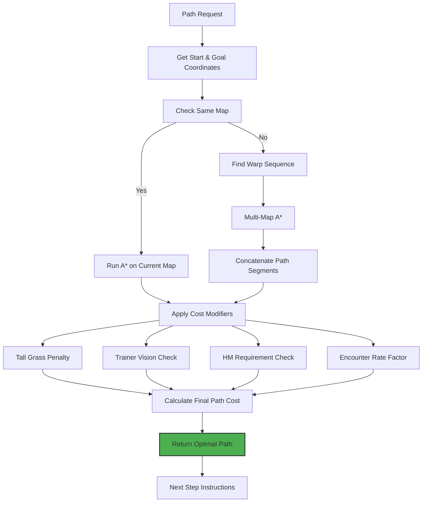
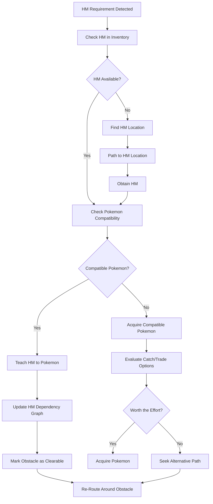
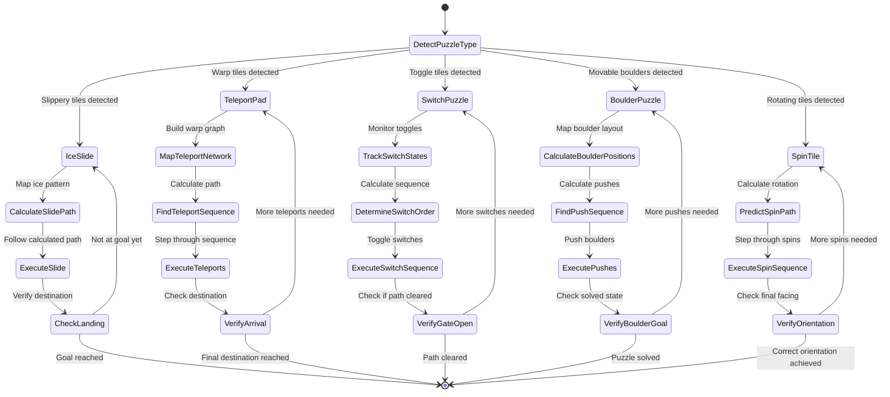
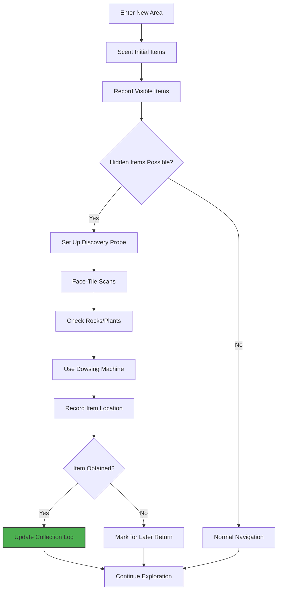
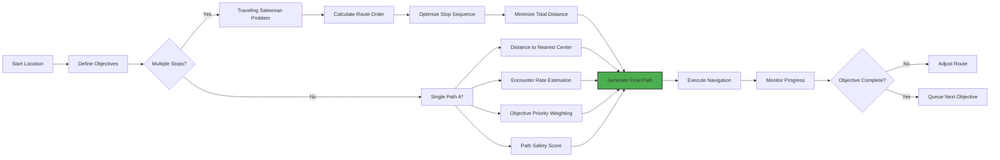

# PTP-01X Chapter 4: World Navigation & Spatial Memory - Detailed Logic Flow

**Version:** 2.0 (Spec-Driven)  
**Purpose:** Define pathfinding, map representation, and spatial reasoning for autonomous world traversal

---

## 4.1 Global Map Vectorization

### Goal: Transform game world into navigable graph with semantic meaning



### Map Header Parsing Logic

```
PARSE_MAP_HEADERS:
  FOR each map_id in 0x00-0xFF:
    READ map_header_at(0xC000 + (map_id * 0x100))
    EXTRACT:
      - map_dimensions (width, height)
      - tileset_pointer
      - collision_data_pointer
      - warp_table_pointer
      - script_pointer
      - music_id
    
    STORE in map_database[map_id]
    
    // Validate map exists
    IF map_dimensions == (0, 0):
      MARK as "non_existent"
      CONTINUE
```

### Tile Collision Detection

```
IDENTIFY_COLLISIONS(map_id, collision_data):
  map_width = map_database[map_id].width
  map_height = map_database[map_id].height
  
  FOR y in range(map_height):
    FOR x in range(map_width):
      tile_id = collision_data[y * map_width + x]
      
      CLASSIFY tile_id:
        IF tile_id in PASSABLE_TILES:
          collision_map[x][y] = "PASSABLE"
        ELSE IF tile_id in LEDGE_TILES:
          collision_map[x][y] = "LEDGE"  // One-way passable
          ledge_direction = detect_ledge_direction(x, y)
        ELSE IF tile_id in WARP_TILES:
          collision_map[x][y] = "WARP"
          warp_destination = parse_warp_data(x, y)
        ELSE IF tile_id in WATER_TILES:
          collision_map[x][y] = "WATER"
          requires_surf = TRUE
        ELSE IF tile_id in HM_OBSTACLES:
          collision_map[x][y] = "HM_BLOCK"
          required_hm = identify_hm_for_tile(tile_id)
        ELSE:
          collision_map[x][y] = "BLOCKING"
  
  RETURN collision_map
```

**Common Tile Classifications:**
- `PASSABLE`: Paths, grass, indoor floors (IDs: 0x00-0x0F, 0x10-0x1F)
- `LEDGE`: One-way cliffs (IDs: 0x20-0x2F) - direction from neighbor tiles
- `WARP`: Stairs, doors (IDs: 0x30-0x3F) - connect to other maps
- `WATER`: Ponds, ocean (IDs: 0x40-0x4F) - requires HM03 Surf
- `HM_BLOCK`: Cut trees, boulders (IDs: 0x50-0x5F) - require specific HMs
- `BLOCKING`: Walls, rocks (IDs: 0x60+) - impassable

### Warp Point Connection Logic

```
PARSE_WARP_DATA(map_id, warp_table):
  warps = []
  
  FOR each_warp_entry in warp_table:
    source_x = warp_entry.x
    source_y = warp_entry.y
    dest_map = warp_entry.destination_map
    dest_x = warp_entry.destination_x
    dest_y = warp_entry.destination_y
    
    CREATE bidirectional link:
      map_database[map_id].warps.append({
        "from": (source_x, source_y),
        "to": (dest_map, dest_x, dest_y)
      })
      
      map_database[dest_map].warps.append({
        "from": (dest_x, dest_y),
        "to": (map_id, source_x, source_y)
      })
  
  RETURN warps
```

**Warp Type Identification:**
- `DOOR`: Connects exterior ↔ interior (building entrance)
- `CAVE_ENTRANCE`: Entrance to cave systems
- `CAVE_EXIT`: Exit from cave systems
- `STAIRS`: Between floors in multi-level buildings
- `TELEPORT`: Pads (Silph Co, gyms) - often one-way

---

## 4.2 Pathfinding Heuristics

### Goal: Find optimal paths considering multiple cost factors



### A* Algorithm Implementation

```
A_STAR_PATHFINDING(start, goal, collision_map):
  // Initialize
  open_set = PriorityQueue()
  open_set.add(start, 0)
  came_from = {}
  g_score = {start: 0}
  f_score = {start: heuristic(start, goal)}
  
  WHILE open_set is not empty:
    current = open_set.pop_lowest_f_score()
    
    IF current == goal:
      RETURN reconstruct_path(came_from, current)
    
    FOR each_neighbor in get_neighbors(current):
      tentative_g_score = g_score[current] + movement_cost(current, neighbor)
      
      IF neighbor not in g_score OR tentative_g_score < g_score[neighbor]:
        came_from[neighbor] = current
        g_score[neighbor] = tentative_g_score
        f_score[neighbor] = tentative_g_score + heuristic(neighbor, goal)
        
        IF neighbor not in open_set:
          open_set.add(neighbor, f_score[neighbor])
  
  RETURN "NO_PATH_FOUND"

HEURISTIC(a, b):
  // Manhattan distance
  RETURN abs(a.x - b.x) + abs(a.y - b.y)

GET_NEIGHBORS(node):
  neighbors = []
  FOR each_direction in [UP, DOWN, LEFT, RIGHT]:
    neighbor = node.move(direction)
    IF is_within_bounds(neighbor) AND is_passable(neighbor):
      neighbors.append(neighbor)
  RETURN neighbors
```

### Multi-Map Pathfinding

```
MULTI_MAP_PATHFINDING(start_map, start_pos, goal_map, goal_pos):
  // If same map, simple A*
  IF start_map == goal_map:
    RETURN A_star(start_pos, goal_pos, collision_maps[start_map])
  
  // Build graph of connected maps
  graph = build_map_graph()
  
  // Find shortest warp path between maps
  warp_sequence = dijkstra_maps(start_map, goal_map, graph)
  
  IF warp_sequence is empty:
    RETURN "NO_CONNECTION_FOUND"
  
  // Build path segment by segment
  full_path = []
  
  // First segment: start to first warp
  first_warp = warp_sequence[0]
  path_to_warp = A_star(start_pos, first_warp.source, collision_maps[start_map])
  full_path.extend(path_to_warp)
  
  // Middle segments: warp to warp
  FOR i in range(len(warp_sequence) - 1):
    current_warp = warp_sequence[i]
    next_warp = warp_sequence[i + 1]
    
    // Path on destination map to next warp
    map_path = A_star(current_warp.dest_pos, next_warp.source, 
                     collision_maps[current_warp.dest_map])
    full_path.extend(map_path)
  
  // Last segment: final warp to goal
  last_warp = warp_sequence[-1]
  final_path = A_star(last_warp.dest_pos, goal_pos, collision_maps[goal_map])
  full_path.extend(final_path)
  
  RETURN full_path
```

**Warp Path Dijkstra:**
```
DIJKSTRA_MAPS(start_map, goal_map, map_graph):
  distance = {map: infinity for map in map_graph}
  distance[start_map] = 0
  previous = {}
  unvisited = set(map_graph.keys())
  
  WHILE unvisited:
    current = min(unvisited, key=lambda m: distance[m])
    
    IF current == goal_map:
      RETURN reconstruct_path(previous, current)
    
    unvisited.remove(current)
    
    FOR neighbor, warp_cost in map_graph[current].neighbors:
      alternative = distance[current] + warp_cost
      
      IF alternative < distance[neighbor]:
        distance[neighbor] = alternative
        previous[neighbor] = current
  
  RETURN []  // No path found
```

### Cost Modifiers & Heuristics

```
MOVEMENT_COST(current, neighbor, context):
  base_cost = 1  // Base movement cost
  
  tile_type = collision_map[neighbor.x][neighbor.y]
  
  SWITCH tile_type:
    CASE "PASSABLE":
      cost = base_cost
    
    CASE "TALL_GRASS":
      // Penalty for wild encounters
      IF context.avoid_encounters:
        cost = base_cost * 3  // Heavy penalty
      ELSE IF context.grind_mode:
        cost = base_cost * 0.8  // Slight bonus for grinding
      ELSE:
        cost = base_cost * 2
    
    CASE "WATER":
      IF context.has_surf:
        cost = base_cost * 1.1  // Small penalty
      ELSE:
        cost = infinity  // Cannot traverse
    
    CASE "TRAINER_VISION":
      IF context.avoid_trainer_battles:
        cost = infinity  // Avoid seen trainers
      ELSE:
        cost = base_cost
    
    CASE "LEDGE":
      // Ledge direction matters
      IF is_falling_direction(current, neighbor):
        cost = base_cost * 0.9  // Slight bonus (fast travel)
      ELIF is_jumping_up(current, neighbor):
        cost = infinity  // Cannot jump up
      ELSE:
        cost = infinity  // Parallel movement not allowed
```

---

## 4.3 HM Dependency Graph

### Goal: Track and utilize HM moves for map progression



### HM Availability Tracking

```
HM_INVENTORY_STATUS:
  REQUIRED_FOR_PROGRESSION = {
    "CUT": {"required_for": ["ss_anne", "route_9"], "badge": "boulder"},
    "FLY": {"required_for": [], "badge": "thunder", "utility": "fast_travel"},
    "SURF": {"required_for": ["route_12", "seafoam_islands"], "badge": "soul"},
    "STRENGTH": {"required_for": ["route_12", "rock_tunnel"], "badge": "volcano"},
    "FLASH": {"required_for": ["rock_tunnel"], "badge": "soul"},
    "WATERFALL": {"required_for": [], "badge": "earth"}  // Only in some versions
  }
  
  CHECK_HM_AVAILABILITY(hm_name):
    IF hm_name in inventory:
      RETURN "owned"
    ELIF badge_for_hm_obtained():
      // Can go get it
      IF location_known(hm_name):
        RETURN "accessible"
      ELSE:
        RETURN "unknown_location"
    ELSE:
      RETURN "badge_locked"
```

### HM Teaching Decision Logic

```
SHOULD_TEACH_HM(current_party, hm_id):
  compatible_pokemon = []
  
  FOR pokemon in current_party:
    IF can_learn_hm(pokemon, hm_id):
      compatibility_score = calculate_hm_compatibility(pokemon, hm_id)
      compatible_pokemon.append((pokemon, compatibility_score))
  
  IF NOT compatible_pokemon:
    RETURN "no_compatible_member"
  
  // Sort by compatibility score
  compatible_pokemon.sort(key=lambda x: x[1])
  best_candidate = compatible_pokemon[0]
  
  // Evaluate if teaching is worth it
  IF best_candidate[1] > 0.7:  // High compatibility
    RETURN f"teach_to_{best_candidate[0]}"
  ELSE:
    // Low compatibility - might be better to catch HM slave
    IF hm_is_critical_for_progression():
      // Need it now, even on suboptimal user
      RETURN f"teach_to_{best_candidate[0]}_temporarily"
    ELSE:
      WAIT and find better candidate
      RETURN "wait_for_better_user"
```

**HM Compatibility Scoring:**
```
CALCULATE_HM_COMPATIBILITY(pokemon, hm_id):
  // Base stats that benefit the most
  stat_benefit = {
    HM_CUT: [STATS.ATTACK],      // Physical
    HM_FLY: [STATS.ATTACK],      // Physical  
    HM_SURF: [STATS.SPECIAL],    // Special
    HM_STRENGTH: [STATS.ATTACK], // Physical
    HM_FLASH: [STATS.SPEED],     // Status (goes first to set up)
    HM_WATERFALL: [STATS.ATTACK] // Physical
  }
  
  // Calculate stat match
  relevant_stat = stat_benefit[hm_id][0]
  stat_value = getattr(pokemon, relevant_stat.lower())
  
  IF stat_value > 80:
    stat_score = 1.0
  ELIF stat_value > 60:
    stat_score = 0.7
  ELSE:
    stat_score = 0.4
  
  // Type matching (STAB)
  move_type = get_hm_type(hm_id)
  IF move_type in pokemon.types:
    stab_score = 1.5
  ELSE:
    stab_score = 1.0
  
  // Move slot availability
  IF pokemon.has_empty_move_slot():
    slot_score = 1.0
  ELSE IF pokemon.has_forgettable_move():
    slot_score = 0.8
  ELSE:
    slot_score = 0.3  // Would have to forget good move
  
  // Overall compatibility
  total_score = (stat_score * 0.4 + 
                 (1.0 if stab_score > 1.0 else 0.6) * 0.3 + 
                 slot_score * 0.3)
  
  RETURN total_score
```

---

## 4.4 Puzzle-Maze Sub-Routines

### Goal: Solve complex environmental puzzles (ice slides, teleports, switches)



### Ice Slide Puzzle Solver

**Ice Physics:**
```
ICE_SLIDE_LOGIC:
  // When stepping on ice tile:
  // 1. Continue sliding in same direction until non-ice tile
  // 2. Can't change direction mid-slide
  // 3. Can only stop at landings, boulders, or walls
  
  CALCULATE_SLIDE_PATH(from_position, direction):
    path = [from_position]
    current = from_position
    
    WHILE TRUE:
      // Move one step in slide direction
      next_pos = move(current, direction)
      
      // Check what's at next position
      tile = get_tile(next_pos)
      
      IF tile == "ICE":
        // Continue sliding
        path.append(next_pos)
        current = next_pos
        CONTINUE
      
      ELIF tile == "LANDING" or tile == "BOULDER":
        // Stop on landing
        path.append(next_pos)
        RETURN path
      
      ELIF tile == "WALL" or tile == "BLOCKING":
        // Can't slide into wall - stop before
        RETURN path
      
      ELSE:
        // Regular tile - stop here
        path.append(next_pos)
        RETURN path
```

**Ice Path Planning:**
```
FIND_ICE_PATH(start, goal):
  // Use modified A* that accounts for sliding
  
  // Pre-compute all possible slide endpoints
  slide_endpoints = {}
  FOR each_direction in [N, S, E, W]:
    FOR each_ice_tile_position:
      endpoint = calculate_slide_path(each_ice_tile, each_direction)[-1]
      slide_endpoints[(each_ice_tile, each_direction)] = endpoint
  
  // Build graph where nodes are accessible tiles
  // Edges include normal movement and ice slides
  graph = build_ice_graph(slide_endpoints)
  
  // Find path using Dijkstra with slide costs
  RETURN modified_dijkstra(graph, start, goal)
```

### Teleport Pad Network Navigation

**Teleport Pad Mapping:**
```
MAP_TELEPORT_NETWORK():
  // Each pad has fixed destination
  teleport_graph = {}
  
  // Scan map for teleport pad tiles
  pads = find_all_tiles_of_type("TELEPORT_PAD")
  
  FOR pad in pads:
    // Activate pad briefly to see where it goes
    dest_pos = test_teleport_pad(pad.position)
    
    teleport_graph[pad.position] = {
      "destination": dest_pos,
      "reversible": test_return_teleport(dest_pos)
    }
  
  RETURN teleport_graph

FIND_TELEPORT_PATH(start, goal, teleport_graph):
  // Find sequence of pad activations to reach goal
  
  // Build map of which teleports lead to which areas
  area_reachability = {}
  FOR pad_pos, pad_info in teleport_graph.items():
    area = get_area(pad_info.destination)
    IF area not in area_reachability:
      area_reachability[area] = []
    area_reachability[area].append(pad_pos)
  
  // BFS through teleport possibilities
  queue = [(start, [])]  // (current_position, teleport_sequence)
  visited = set()
  
  WHILE queue:
    current, sequence = queue.pop(0)
    
    IF current == goal or near_goal(current, goal):
      RETURN sequence
    
    IF current in visited:
      CONTINUE
    visited.add(current)
    
    // Try all teleports from current area
    current_area = get_area(current)
    IF current_area in area_reachability:
      FOR pad_position in area_reachability[current_area]:
        IF can_reach(current, pad_position):
          destination = teleport_graph[pad_position]["destination"]
          new_sequence = sequence + [pad_position]
          queue.append((destination, new_sequence))
  
  RETURN "NO_TELEPORT_PATH_FOUND"
```

---

## 4.5 Environmental Obstacles

### Goal: Handle dynamic environmental effects that affect navigation and combat

### Weather System Effects

```
WEATHER_DETECTION_AND_IMPACT:
  // Detect current weather from environment cues
  
  CAPTURE viewport sample (top 50 rows)
  weather_indicators = analyze_pixel_patterns()
  
  IF brown_dust_particles_detected():
    current_weather = "SANDSTORM"
    damage_per_turn = max(1, floor(max_hp / 16))
    accuracy_modifier = 0.8  // Sand-Attack effect
    
  ELSE IF blue_vertical_lines() AND sound_rain():
    current_weather = "RAIN"
    fire_damage_modifier = 0.5
    water_damage_modifier = 1.5
    thunder_accuracy = 100  // Never misses in rain
    
  ELSE IF bright_overexposure():
    current_weather = "SUNNY"
    fire_damage_modifier = 1.5
    water_damage_modifier = 0.5
    thunder_accuracy = 50  // Reduced accuracy
    
  ELSE IF white_falling_dots():
    current_weather = "HAIL"
    damage_per_turn = floor(max_hp / 16)
    blizzard_accuracy = 100  // Never misses in hail
    
  ELSE IF gray_overlay():
    current_weather = "FOG"
    accuracy_modifier = 0.6  // Major accuracy reduction
    
  ELSE:
    current_weather = "CLEAR"
    damage_per_turn = 0
    accuracy_modifier = 1.0
  
  // Apply weather to decision making
  IF current_weather != "CLEAR":
    UPDATE combat_calculations WITH weather_modifiers
    UPDATE pathfinding_costs IF weather_affects_visibility
```

**Weather-Based Navigation Adjustments:**
```
WEATHER_PATHFINDING_MODIFIERS:
  IF weather == "SANDSTORM" OR weather == "HAIL":
    // Chip damage while walking outside
    FOR each_outdoor_tile_in_path:
      // Add HP cost to path weight
      damage_tick_duration = time_on_tile / 60  // frames to seconds
      hp_cost = weather_damage_per_second * damage_tick_duration
      path_weight += hp_cost * health_priority_factor
      
      // If low HP, seek indoor shortcuts
      IF current_hp < max_hp * 0.3:
        PREFERENCE_FACTOR_INDOOR = 2.0
        FIND paths through buildings when possible
  
  IF weather == "FOG":
    // Reduced visibility
    trainer_vision_range = 3  // Tiles (down from 5)
    wild_encounter_rate *= 1.5  // 50% more encounters
    
    // Use Repel more aggressively
    IF repel_active == FALSE AND repel_in_inventory:
      TRIGGER repel_usage
```

### Terrain Modifier Tracking

```
TERRAIN_EFFECT_DETECTION:
  // Terrain types affect move power and effects
  
  SAMPLE ground_texture_under_player()
  
  IF texture_matched("GRASSY"):
    current_terrain = "GRASSY_TERRAIN"
    grass_move_power_modifier = 1.5
    earthquake_power_modifier = 0.5
    
  ELSE IF texture_matched("MISTY"):
    current_terrain = "MISTY_TERRAIN"
    dragon_move_power_modifier = 0.5
    status_prevention_for_grounded = TRUE
    
    // Also affects wild encounters
    encounter_rate_reduction = 0.5
    
  ELSE IF texture_matched("ELECTRIC"):
    current_terrain = "ELECTRIC_TERRAIN"
    electric_move_power_modifier = 1.5
    sleep_prevention = TRUE
    
    // Affects pathfinding (electrified tiles dangerous)
    FOR electrified_tile in electric_terrain_tiles:
      collision_map[electrified_tile] = "DANGER"
      path_heuristic_weight *= 2.0
  
  ELSE IF texture_matched("PSYCHIC"):
    current_terrain = "PSYCHIC_TERRAIN"
    psychic_move_power_modifier = 1.5
    priority_move_blocking = TRUE
    
    // NPC psychic trainers stronger here
    trainer_level_modifier = 1.2
  
  ELSE:
    current_terrain = "NORMAL"
    no_special_modifiers
  
  // Apply to active battle if in terrain
  IF battle_location IN terrain_affected_area:
    UPDATE_ALL_DAMAGE_CALCULATIONS WITH terrain_modifiers
```

### Hazard Tile Damage Prediction

```
HAZARD_TILE_NAVIGATION:
  DANGER_TILES = {
    "LAVA": {"damage": 20, "frequency": "every_step"},
    "POISON_SWAMP": {"damage": 10, "frequency": "every_step"},
    "SPIKES": {"damage": max_hp / 16, "frequency": "on_entry_only"},
    "TOXIC_SPIKES": {"damage": 0, "effect": "badly_poisoned"},
    "STICKY_WEB": {"damage": 0, "effect": "speed_debuff"}
  }
  
  EVALUATE_HAZARD_PATH(cost, path, current_hp):
    total_hazard_damage = 0
    
    FOR tile in path:
      IF tile.is_hazardous:
        hazard_info = DANGER_TILES[tile.type]
        
        IF hazard_info.frequency == "every_step":
          total_hazard_damage += hazard_info.damage
        
        ELSE IF hazard_info.frequency == "on_entry_only":
          total_hazard_damage += hazard_info.damage  // Once per tile type
    
    // Check if survivable
    IF total_hazard_damage >= current_hp:
      // Path is too dangerous
      FIND_ALTERNATIVE_PATH()
      OR_USE_HAZARD_IMMUNITY_ITEMS()
    
    // Factor damage into path cost
    adjusted_cost = cost + (total_hazard_damage * 10)  // Weight heavily
    
    RETURN adjusted_cost
```

---

## 4.6 Hidden Item & Discovery

### Goal: Systematically discover and collect hidden items and NPCs



### Item Discovery Probe Logic

```
HIDDEN_ITEM_SCAN_MODE:
  // Activate when entering dense areas (caves, forests, buildings)
  
  // Method 1: Face-Tile Interaction (A-button spam)
  FOR each_tile in area_boundary:
    MOVE_TO_ADJACENT_TILE(tile)
    FACE_TILE(tile)
    PRESS_A()
    
    IF "found" text detected in OCR:
      RECORD_ITEM(tile, item_type)
      COLLECT_ITEM()
  
  // Method 2: Rock Smash / Cut
  IDENTIFY_BREAKABLE_OBJECTS()
  
  FOR breakable in breakable_objects:
    IF has_required_hm(breakable):
      USE_HM_ON(breakable)
      CHECK_FOR_HIDDEN_ITEM_UNDER()
  
  // Method 3: Dowsing Machine
  IF dowsing_machine_in_inventory:
    EQUIP_DOWSING_MACHINE()
    
    // Spiral search pattern
    current_radius = 1
    WHILE dowsing_signal_active():
      // Search perimeter at current radius
      SEARCH_PERIMETER(current_radius)
      
      IF signal_strength_increasing:
        // Getting closer
        MOVE_TOWARD_STRONGEST_SIGNAL()
      ELSE:
        // Expand search
        current_radius += 1
      
      IF signal_at_maximum():
        // Item directly under player
        FACE_ALL_DIRECTIONS_AND_PRESS_A()
        
    UNEQUIP_DOWSING_MACHINE()
```

### NPC Discovery & Interaction

```
NPC_DISCOVERY_PROTOCOL:
  // Scan for NPC sprites in viewport
  sprites_in_view = detect_sprites()
  
  FOR sprite in sprites_in_view:
    IF is_npc_sprite(sprite):
      npc_position = sprite.position
      
      // Approach NPC
      MOVE_TO_INTERACTION_RANGE(npc_position)
      
      // Initiate dialogue
      FACE_NPC()
      PRESS_A()
      
      // Extract NPC info
      dialogue = READ_DIALOGUE()
      npc_info = EXTRACT_NPC_DATA(dialogue)
      
      RECORD_NPC({
        "position": npc_position,
        "name": npc_info.name,
        "type": npc_info.type,  // trainer, shopkeeper, quest_giver
        "dialogue": dialogue.summary,
        "quest": npc_info.quest_hint,
        "importance": npc_info.importance_score
      })
      
      // If quest-giver, update objectives
      IF npc_info.quest_hint:
        PARSE_QUEST_HINT(dialogue)
        UPDATE_OBJECTIVE_STACK(npc_info.quest_hint)
  
  // Revisit important NPCs periodically
  FOR important_npc in recorded_npcs:
    IF important_npc.importance > 0.8 AND time_since_last_visit > 10_minutes:
      SCHEDULE_VISIT(important_npc.position)
```

---

## 4.7 Route Optimization

### Goal: Calculate optimal routes considering multiple objectives



### Multi-Objective Route Planning

```
OPTIMIZE_ROUTE_ORDER(objectives, start_position):
  /* objectives = [
    {"type": "gym", "position": (x1, y1), "priority": 10},
    {"type": "mart", "position": (x2, y2), "priority": 6},
    {"type": "center", "position": (x3, y3), "priority": 3}
  ] */
  
  // Distance matrix calculation
  distance_matrix = {}
  FOR i in range(len(objectives)):
    FOR j in range(len(objectives)):
      IF i == j:
        distance_matrix[i][j] = 0
      ELSE:
        distance_matrix[i][j] = heuristic_distance(
          objectives[i].position,
          objectives[j].position
        )
  
  // Priority-adjusted traveling salesman
  // Higher priority = earlier in route
  objectives.sort(key=lambda x: x.priority, reverse=True)  // Primary sort
  
  // Group by proximity
  clusters = dbscan_clustering(objectives, eps=50)  // Cluster within 50 tiles
  
  optimized_route = []
  current_cluster_center = start_position
  
  FOR cluster in clusters_sorted_by_proximity:
    // Sort objectives within cluster by priority
    cluster.sort(key=lambda x: x.priority)
    
    // Find nearest neighbor path within cluster
    nn_path = nearest_neighbor_tsp(cluster, current_cluster_center)
    optimized_route.extend(nn_path)
    
    current_cluster_center = cluster.center
  
  RETURN optimized_route
```

**Route Safety Scoring:**
```
CALCULATE_ROUTE_SAFETY(path, party_state):
  total_safety_score = 0
  
  FOR segment in path:
    IF segment.trainer_battles_possible:
      avg_trainer_level = get_avg_trainer_level(segment)
      IF avg_trainer_level > party_avg_level + 5:
        safety_penalty = 5.0  // High risk
      ELIF avg_trainer_level > party_avg_level + 2:
        safety_penalty = 2.0  // Medium risk
      ELSE:
        safety_penalty = 0.5  // Low risk
    ELSE:
      safety_penalty = 0.0
    
    IF segment.wild_encounters:
      encounter_rate = get_encounter_rate(segment)
      IF party_hp_low() AND need_to_reach_objective_urgent():
        safety_penalty += encounter_rate * 10
      ELSE:
        safety_penalty += encounter_rate * 2
    
    segment_safety = 10.0 - safety_penalty
    total_safety_score += segment_safety
  
  RETURN total_safety_score / len(path)
```

**Dynamic Re-routing:**
```
MONITOR_ROUTE_EXECUTION():
  WHILE current_objective_not_complete():
    progress = calculate_progress_toward_objective()
    
    IF progress_stalled_for > 30_seconds:
      // Something is blocking us
      blocking_type = identify_blocking_issue()
      
      SWITCH blocking_type:
        CASE "trainer_battle":
          IF trainer_defeated:
            // Clear to continue
            CONTINUE
          ELSE:
            // Losing repeatedly
            EVALUATE_IF_UNDERLEVELED()
            IF underleveled:
              SET_NEW_OBJECTIVE("train_nearby")
              RETURN
        
        CASE "wild_encounters":
          IF repel_available:
            USE_REPEL()
          ELSE IF have_cut_through_grass_option:
            RE_ROUTE_THROUGH_BUILDING()
          ELSE:
            // Accept encounters and heal more
            INCREASE_HEALING_FREQUENCY()
        
        CASE "missing_hm":
          hm_needed = identify_missing_hm()
          SET_NEW_OBJECTIVE(f"obtain_{hm_needed}")
          RETURN
        
        CASE "puzzle_stuck":
          ACTIVATE_PUZZLE_ASSISTANCE_MODE()
          TRY_ALTERNATIVE_SOLUTIONS()
          
        CASE "level_too_low":
          SET_NEW_OBJECTIVE("train_party")
          RETURN
    
    CHECK_IF_NEW_SHORTCUT_AVAILABLE()
    UPDATE_ROUTE_IF_MORE_OPTIMAL_PATH_FOUND()
```

---

## Integration Points

### Chapter 1 (Perception)
- **Viewport Analysis:** Extract current location and surroundings
- **Tile Recognition:** Identify special tiles (ice, teleports, hazards)
- **Sprite Detection:** Find NPCs, items, obstacles

### Chapter 2 (Memory)
- **Position Tracking:** Current coordinates for pathfinding start
- **Map ID:** Current map for graph selection
- **Warp Detection:** Recognize map transitions

### Chapter 3 (Combat)
- **Terrain Modifiers:** Weather effects in battles in outdoor areas
- **Hazard Damage:** Tile-based damage affects combat strategy
- **Encounter Rates:** Wild battle frequency adjustments

### Chapter 5 (Data)
- **Map Database:** Stored world graph and node information
- **Warp Memory:** Remembered warp connections
- **POI Registry:** Known locations of interest
- **Exploration Log:** Which tiles visited, items collected

### Chapter 6 (Inventory)
- **HM Availability:** Track which HMs owned and usable
- **Key Items:** Items that open paths (e.g., Lift Key, Card Key)
- **Repel Status:** Active repel affects encounter route calculations

### Chapter 7 (Shopping)
- **PokeMart Locations:** Destination waypoints for navigation
- **Item Availability:** Which items available at which locations
- **Money Cache:** Enough money affects fast travel priority

### Chapter 8 (NPC Detection)
- **NPC Positions:** Stationary NPCs are navigational obstacles
- **Quest Hints:** NPC dialogue reveals map locations
- **Directional Hints:** "Go north to Pewter"

### Chapter 9 (GOAP)
- **Objective Waypoints:** Each goal has location coordinates
- **Multi-Objective Routing:** Find optimal path through several goals
- **Utility Calculation:** Distance to objectives affects goal priority

### Chapter 10 (Failsafe)
- **Deadlock Detection:** Stuck while following path
- **Invalid Position:** Out of bounds or in walls
- **Route Validation:** Ensure paths don't go through blocking obstacles
- **Recovery Rerouting:** When primary path fails, find alternative

---

## Navigation Validation Matrix

| Situation | Move Command | Valid? | Validation Check |
|-----------|--------------|--------|------------------|
| Tile = Passable | Move into tile | Yes | Collision check passes |
| Tile = Blocking | Move into tile | No | Collision check fails |
| Tile = Water (no Surf) | Move onto water | No | HM requirement check fails |
| Tile = Ledge (opposite direction) | Jump up | No | Ledge direction check fails |
| Tile = Ledge (correct direction) | Jump down | Yes | One-way movement allowed |
| Tile = Warp | Step onto it | Yes | Warp activation trigger |
| Tile = Trainer vision | Move through | Configurable | Setting: avoid/run |
| Tile = Item ball | Move into it | Yes | Auto-pickup trigger |
| Out of bounds coordinates | Any move | No | Map boundary check |
| During warp animation | Move input | No | Wait for transition |

**Invalid Movement Recovery:**
```
ON_INVALID_MOVEMENT_ATTEMPT(move, reason):
  LOG_WARNING(f"Invalid move {move}: {reason}")
  
  SWITCH reason:
    CASE "tile_blocking":
      MARK_TILE_AS_NEEDING_HM(tile)
      UPDATE_MAP_GRAPH()
      FIND_ALTERNATIVE_PATH()
    
    CASE "missing_hm":
      hm_needed = identify_hm_for_tile(tile)
      IF hm_available_but_not_taught:
        TRIGGER_HM_TEACHING_SEQUENCE(hm_needed)
      ELSE:
        SET_OBJECTIVE("obtain_" + hm_needed)
    
    CASE "out_of_bounds":
      CORRECT_POSITION_TO_VALID_TILE()
      REPORT_MAP_DATA_CORRUPTION()
    
    CASE "during_warp":
      WAIT_FOR_WARP_ANIMATION_COMPLETE()
      RECALCULATE_POSITION()
      RETRY_MOVE()
  
  INCREMENT_INVALID_MOVE_COUNTER()
  IF counter > 10:
    ESCALATE_TO_RECOVERY_MODE()
```

---

## Performance Specifications

### Pathfinding Benchmarks

| Operation | Tiles Checked | Time | Notes |
|-----------|--------------|------|-------|
| Single map A* | 100-500 | 20ms | Typical map size |
| Multi-map A* (2 maps) | 1000-2000 | 100ms | Via warp connection |
| Multi-map A* (5+ maps) | 5000+ | 500ms | Complex route |
| Full map graph build | All maps | 2000ms | One-time initialization |
| Teleport network solve | 50-100 pads | 50ms | Silph Co maze |
| Puzzle solver (ice) | 200 tiles | 30ms | Pre-computed endpoints |

**Memory Budget:**
- Map graph: ~200KB (all maps)
- A* open/closed sets: 50KB
- Path cache: 100KB
- Teleport network: 10KB
- **Total: <400KB**

### Navigation Success Metrics

- **Pathfinding success rate:** >95% for valid paths
- **Average path length:** Within 5% of optimal Manhattan distance
- **Multi-map pathfinding:** <2 seconds for 5-map routes
- **Puzzle solving:** >90% success without backtracking
- **Hazard avoidance:** 100% success when hazards are known
- **Recovery from invalid moves:** >85% within 3 attempts

**Failure Recovery:**
- Unknown tile type → Default to blocking (safe)
- Warp desynchrony → Re-scan warp table
- Map corruption → Reload from ROM
- Unsolvable puzzle → Backtrack and try alternative