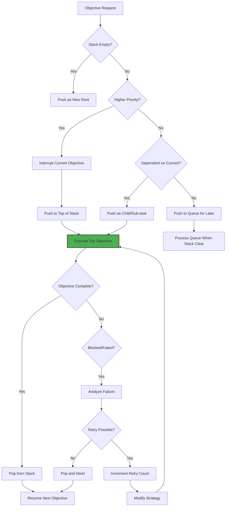
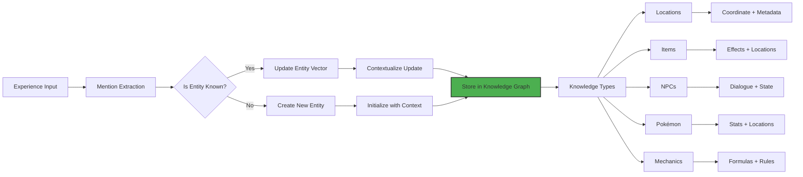
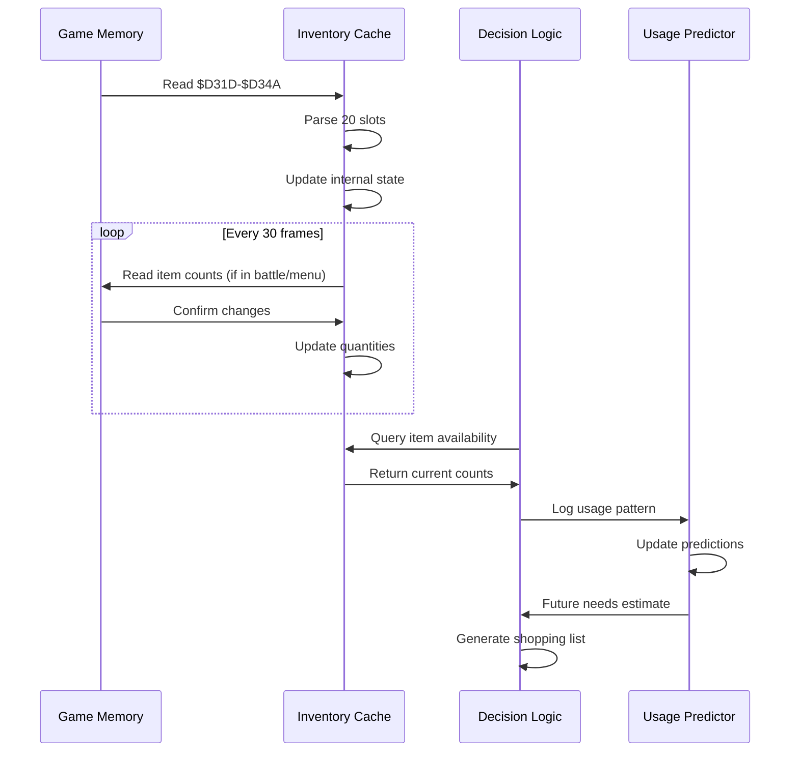
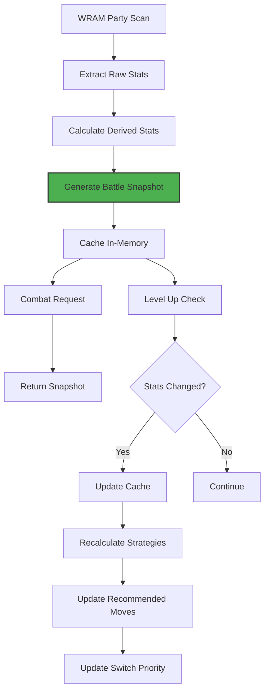
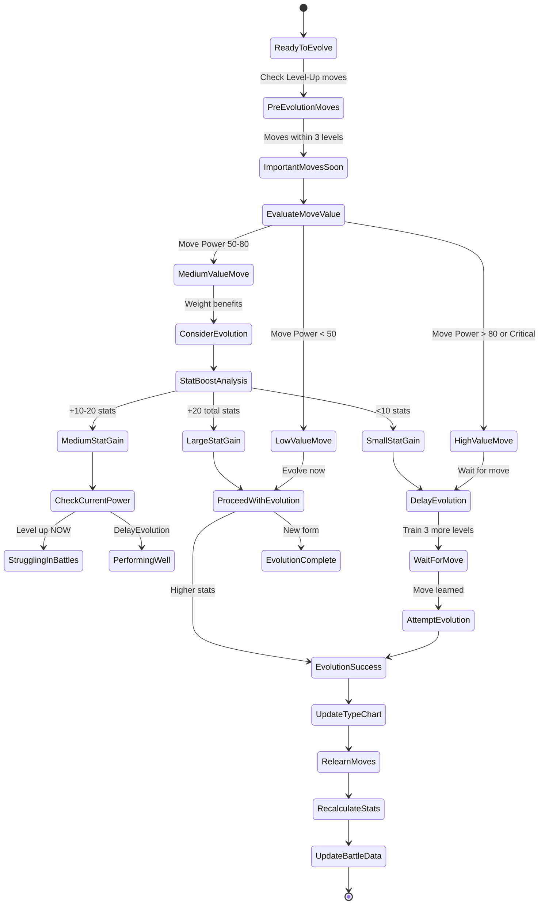
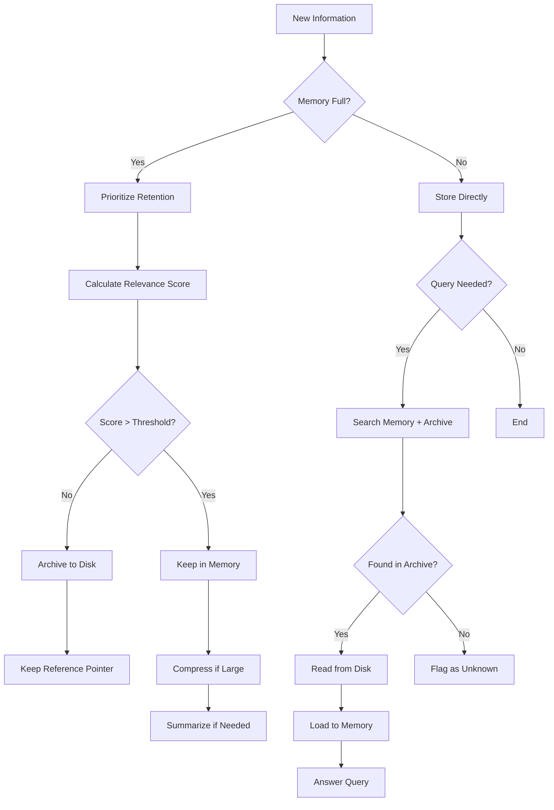

# PTP-01X Chapter 5: Data Persistence & Cognitive Schema - Detailed Logic Flow

**Version:** 2.0 (Spec-Driven)  
**Purpose:** Define how the AI stores, retrieves, and reasons about game state across sessions and decision cycles

---

## 5.1 Objective Stack Management (LIFO)

### Goal: Maintain hierarchical goal structure with proper push/pop semantics



### Objective Structure

```
OBJECTIVE_FORMAT = {
  "id": "unique_objective_id",
  "name": "Human readable name",
  "type": "main|sub|emergency|filler",
  "priority": 1-100,  // Higher = more important
  "stack_level": 0-10,  // Current depth in stack
  "parent_id": "parent_objective_or_null",
  "dependencies": ["objective_id_needed_first"],
  "prerequisites": {"flag": value, "item": count},
  "desired_outcome": {"state_change": value},
  "success_condition": "boolean_expression",
  "failure_condition": "boolean_expression",
  "retry_limit": 3,
  "retry_count": 0,
  "estimated_duration": seconds,
  "creation_time": timestamp,
  "start_time": timestamp_or_null,
  "completion_time": timestamp_or_null,
  "status": "pending|active|paused|completed|failed|aborted",
  "context": {
    "trigger_location": (x, y, map),
    "trigger_npc": npc_name,
    "quest_hint": extracted_text
  }
}
```

### Stack Operations

**Push Objective (New or Interrupt):**
```
PUSH_OBJECTIVE(new_obj):
  // Validate objective can be added
  IF new_obj.type == "emergency":
    // Emergency objectives go straight to top
    interrupt_current_execution()
    objective_stack.insert(0, new_obj)  // Stack top
    new_obj.status = "active"
    new_obj.start_time = now()
    RETURN "emergency_inserted"
  
  // Check if already exists in stack
  FOR existing_obj in objective_stack:
    IF existing_obj.id == new_obj.id:
      // Objective already present
      IF existing_obj.status == "failed" AND existing_obj.retry_count < new_obj.retry_limit:
        // Retry failed objective
        existing_obj.retry_count += 1
        existing_obj.status = "pending"
        existing_obj.start_time = null
        RETURN "retry_initiated"
      ELSE:
        RETURN "duplicate_objective"
  
  // Check dependencies
  FOR dependency in new_obj.dependencies:
    IF dependency not in completed_objectives:
      // Can't start yet, add to queue
      objective_queue.append(new_obj)
      new_obj.status = "waiting_for_dependencies"
      RETURN "queued_for_dependencies"
  
  // Check if dependent on current objective
  IF current_stack_not_empty() AND new_obj.depends_on(current_top_objective):
    // Push as child
    new_obj.stack_level = current_top.stack_level + 1
    new_obj.parent_id = current_top.id
    objective_stack.append(new_obj)
    new_obj.status = "active"
    new_obj.start_time = now()
    RETURN "child_objective_added"
  
  // Regular push
  IF new_obj.priority > current_top_priority():
    // Interrupt and push
    pause_current_objective()
    new_obj.stack_level = current_stack_depth
    objective_stack.append(new_obj)
    new_obj.status = "active"
    new_obj.start_time = now()
    RETURN "interrupt_and_push"
  ELSE:
    // Queue for later
    objective_queue.append(new_obj)
    new_obj.status = "queued"
    RETURN "queued_for_later"


POP_OBJECTIVE(completion_status):
  IF objective_stack is empty:
    RETURN "stack_already_empty"
  
  obj = objective_stack.pop()
  obj.completion_time = now()
  obj.status = completion_status  // "completed" or "failed"
  
  // Add to history
  objective_history.append(obj)
  
  // Process outcome
  IF completion_status == "completed":
    completed_objectives[obj.id] = obj
    objective_success_log[obj.type] += 1
    
    // Check for unlocks
    CHECK_AND_ACTIVATE_UNLOCKS(obj)
    
  ELSE:  // Failed
    objective_failure_log[obj.type] += 1
    
    // Schedule retry if appropriate
    IF obj.retry_count < obj.retry_limit:
      obj.retry_count += 1
      obj.status = "pending_retry"
      objective_queue.append(obj)
  
  // Resume next objective
  RETURN "resumed_next_objective"
```

### Dependency Resolution

```
CHECK_AND_ACTIVATE_UNLOCKS(completed_objective):
  // Check what this objective unlocks
  unlocked_objectives = []
  
  FOR candidate_obj in objective_queue:
    // Check if all dependencies met
    all_deps_satisfied = TRUE
    FOR dep_id in candidate_obj.dependencies:
      IF dep_id not in completed_objectives:
        all_deps_satisfied = FALSE
        BREAK
    
    IF all_deps_satisfied AND all_prerequisites_met(candidate_obj):
      // Move from queue to active stack
      objective_queue.remove(candidate_obj)
      objective_stack.append(candidate_obj)
      candidate_obj.status = "active"
      candidate_obj.start_time = now()
      unlocked_objectives.append(candidate_obj)
  
  // Update world state based on objective completion
  FOR state_change in completed_objective.desired_outcome:
    IF state_change.type == "unlock_area":
      world_flags[state_change.area] = "accessible"
    ELIF state_change.type == "receive_item":
      inventory.add(state_change.item, state_change.quantity)
    ELIF state_change.type == "flag_set":
      game_flags[state_change.flag] = state_change.value
    ELIF state_change.type == "npc_state_change":
      npc_states[state_change.npc_id] = state_change.new_state
  
  RETURN unlocked_objectives
```

---

## 5.2 Vector Knowledge Base (Semantic Memory)

### Goal: Store and query learned information about the game world



### Entity Vector Structure

```
KNOWLEDGE_ENTITY = {
  "entity_id": "unique_identifier",
  "entity_type": "location|item|npc|pokemon|mechanic|quest",
  "entity_name": "human_readable_name",
  "vector_representation": [float] * 128,  // Embedding for similarity
  "attributes": {
    // Type-specific attributes
  },
  "relationships": {
    "related_to": [(entity_id, relationship_type, confidence)],
    "located_at": [(coordinate, map_id)],
    "requires": [prerequisite_entity_ids],
    "unlocks": [unlocked_entity_ids]
  },
  "context_history": [
    {
      "observed_at": timestamp,
      "context": "situational_context",
      "source": "dialogue|visual|combat|exploration",
      "confidence": 0.0-1.0
    }
  ],
  "last_updated": timestamp,
  "first_learned": timestamp,
  "access_count": integer
}
```

### Location Entities

```
LOCATION_ENTITY = {
  "entity_type": "location",
  "entity_name": "Pewter City Pokemon Center",
  "attributes": {
    "map_id": 0x02,
    "coordinates": (18, 22),
    "location_type": "pokemon_center",
    "services": ["heal", "pc"],
    "connections": [
      {"to": "Pewter City", "type": "exit", "coordinates": (18, 21)},
      {"to": "Route 3", "type": "fly_point", "coordinates": (17, 22)}
    ],
    "npcs_present": ["Nurse_Joy", "PC_Terminal"],
    "importance_score": 9.5
  },
  "relationships": {
    "related_to": [
      ("pewter_city", "part_of", 1.0),
      ("pewter_gym", "nearby", 0.9),
      ("route_3", "connected_to", 0.8)
    ],
    "located_at": [(18, 22, 0x02)],
    "requires": [],  // No requirements to enter
    "unlocks": []    // Doesn't unlock anything
  },
  "context_history": [
    {
      "observed_at": "cycle_1000",
      "context": "first_visit",
      "source": "exploration",
      "confidence": 1.0
    },
    {
      "observed_at": "cycle_5000", 
      "context": "healed_party_here",
      "source": "interaction",
      "confidence": 1.0
    }
  ]
}
```

### Item Entities

```
ITEM_ENTITY = {
  "entity_type": "item",
  "entity_name": "POTION",
  "attributes": {
    "item_id": 0x11,
    "item_category": "healing",
    "heal_amount": 20,
    "cost": 300,
    "can_sell": True,
    "sell_price": 150,
    "stackable": True,
    "max_stack": 99,
    "utility_score": 7.5
  },
  "relationships": {
    "related_to": [
      ("super_potion", "stronger_version", 1.0),
      ("pokemon_center", "alternatives_to", 0.7),
      ("money_management", "part_of", 0.8)
    ],
    "located_at": [
      ("pewter_mart", merchant, unlimited),
      ("route_1_hidden_item", hidden, 1)
    ],
    "requires": [
      ("money", ">=300")
    ],
    "unlocks": []  // Doesn't unlock areas
  },
  "context_history": [
    {
      "observed_at": "cycle_1500",
      "context": "purchased_from_pewter_mart",
      "source": "shopping",
      "confidence": 1.0
    },
    {
      "observed_at": "cycle_3000",
      "context": "used_in_battle_vs_bug_catcher",
      "source": "combat",
      "confidence": 1.0
    }
  ]
}
```

### NPC Entities

```
NPC_ENTITY = {
  "entity_type": "npc",
  "entity_name": "Oak's_Aide_Route_2",
  "attributes": {
    "npc_id": "oak_aide_route_2",
    "npc_type": "quest_giver",
    "quest_giver": True,
    "static_location": {"map": 0x01, "coordinates": (15, 25)},
    "dialogue_tree": [
      {
        "trigger": "first_meeting",
        "requirements": {"pokedex_owned": ">=10"},
        "rewards": {"item": "HM05_FLASH"},
        "next_state": "quest_complete"
      }
    ],
    "importance_score": 8.0
  },
  "relationships": {
    "related_to": [
      ("professor_oak", "works_for", 1.0),
      ("hm05_flash", "gives", 1.0),
      ("pokedex_completion", "tracks", 0.9)
    ],
    "located_at": [(15, 25, 0x01)],
    "requires": [{"pokedex_owned": ">=10"}],
    "unlocks": [("hm05_flash", "item")]
  },
  "context_history": [
    {
      "observed_at": "cycle_2800",
      "context": "first_dialogue_encountered",
      "dialogue_summary": "He gives Flash if you have 10 Pokemon",
      "source": "dialogue",
      "confidence": 1.0
    }
  ]
}
```

### Pokemon Species Entities

```
POKEMON_ENTITY = {
  "entity_type": "pokemon",
  "entity_name": "CHARIZARD",
  "attributes": {
    "species_id": 0x0C,
    "types": ["FIRE", "FLYING"],
    "base_stats": {
      "hp": 78,
      "attack": 84,
      "defense": 78,
      "special": 85,
      "speed": 100
    },
    "level_up_moves": [
      {"level": 1, "move": "GROWL"},
      {"level": 1, "move": "SCRATCH"},
      {"level": 9, "move": "EMBER"},
      {"level": 15, "move": "LEER"},
      {"level": 24, "move": "RAGE"},
      {"level": 36, "move": "SLASH"},
      {"level": 46, "move": "FLAMETHROWER"},
      {"level": 55, "move": "FIRE_SPIN"}
    ],
    "tm_learnset": [0x01, 0x02, 0x03, ..., 0x3F],  // TM compatibility
    "evolution_chain": ["CHARMANDER", "CHARMELEON", "CHARIZARD"],
    "catch_rate": 45,
    "rarity_score": 8.5,
    "strategic_value": 9.0
  },
  "relationships": {
    "related_to": [
      ("charmeleon", "evolves_from", 1.0),
      ("fire_type_advantage", "strong_against", 0.8),
      ("flying_type_weakness", "weak_against", 0.7),
      ("elite_four_lorelei", "counter_to", 0.9)
    ],
    "located_at": [
      ("cinnabar_volcano", rare_spawn, area),
      ("trade_evolution", only, method)
    ],
    "requires": [{"evolves_from_charmeleon_at_level": 36}],
    "unlocks": [
      ("fly_hm_usage", "pokemon_can_learn"),
      ("fire_coverage", "team_type_coverage")
    ]
  },
  "context_history": [
    {
      "observed_at": "cycle_8500",
      "context": "caught_as_charmander_from_route_4",
      "source": "capture",
      "confidence": 1.0
    },
    {
      "observed_at": "cycle_12000",
      "context": "evolved_to_charizard_at_level_36",
      "source": "evolution",
      "confidence": 1.0
    }
  ]
}
```

---

## 5.3 Inventory State Tracker

### Goal: Maintain accurate inventory representation with predictive caching



### Inventory Slot Management

```
INVENTORY_SLOT_STRUCTURE = {
  "slot_1": {
    "item_id": 0x11,    // Potion
    "quantity": 15,
    "slot_index": 0,
    "last_accessed": timestamp,
    "access_count": 5
  },
  "slot_2": {
    "item_id": 0x04,    // Poke Ball
    "quantity": 23,
    "slot_index": 1,
    "last_accessed": timestamp,
    "access_count": 12
  },
  // ... slots 3-20
  "empty_slots": [5, 8, 14, 19]  // Track gaps for optimization
}

INVENTORY_CACHE_UPDATE:
  READ raw_inventory = memory.read_bytes(0xD31D, 40)  // 20 slots × 2 bytes
  
  FOR slot_index in range(20):
    item_id = raw_inventory[slot_index * 2]
    quantity = raw_inventory[slot_index * 2 + 1]
    
    IF item_id == 0xFF:  // Empty slot
      MARK_SLOT_AS_EMPTY(slot_index)
      CONTINUE
    
    // Known item
    IF inventory_cache[slot_index].item_id == item_id:
      // Update quantity, track change
      old_qty = inventory_cache[slot_index].quantity
      new_qty = quantity
      
      IF new_qty > old_qty:
        // Item gained
        LOG_ITEM_GAIN(item_id, new_qty - old_qty, source)
      ELIF new_qty < old_qty:
        // Item used
        LOG_ITEM_USE(item_id, old_qty - new_qty, context)
      
      inventory_cache[slot_index].quantity = quantity
      inventory_cache[slot_index].last_accessed = now()
    
    ELSE:
      // New item in slot
      LOG_NEW_ITEM_FOUND(item_id, quantity, slot_index)
      
      inventory_cache[slot_index] = {
        "item_id": item_id,
        "quantity": quantity,
        "last_accessed": now(),
        "access_count": 0
      }
  
  // Update metadata
  INVENTORY_CACHE["empty_slot_count"] = count_empty_slots()
  INVENTORY_CACHE["used_slot_count"] = 20 - empty_count
  INVENTORY_CACHE["last_full_scan"] = now()
```

### Item Usage Prediction & Threshold Logic

```
PREDICT_ITEM_USAGE(item_id, time_horizon_cycles=1000):
  // Analyze usage patterns from history
  usage_history = get_item_usage_history(item_id)
  
  IF len(usage_history) < 5:
    // Not enough data, use defaults
    RETURN get_default_usage_rate(item_id)
  
  // Calculate moving average
  recent_usage = usage_history[-10:]  // Last 10 occurrences
  avg_use_per_cycle = sum(recent_usage) / len(recent_usage)
  
  // Trend analysis
  trend_direction = calculate_trend(usage_history)
  
  // Extrapolate to future
  predicted_need = avg_use_per_cycle * time_horizon_cycles
  
  // Apply trend multiplier
  IF trend_direction == "increasing":
    predicted_need *= 1.2
  ELIF trend_direction == "decreasing":
    predicted_need *= 0.8
  
  RETURN predicted_need

CHECK_ITEM_THRESHOLDS():
  alerts = []
  
  // Healing items
  total_healing_items = (
    get_item_count(POTION) * 20 +
    get_item_count(SUPER_POTION) * 50 +
    get_item_count(HYPER_POTION) * 200 +
    get_item_count(MAX_POTION) * 999
  )
  
  IF total_healing_items < 100 AND money > 500:
    alerts.append({
      "type": "healing_low",
      "urgency": "medium",
      "action": "restock_potions",
      "estimated_need": 200
    })
  
  // Poke Balls
  total_balls = (
    get_item_count(POKE_BALL) +
    get_item_count(GREAT_BALL) * 1.5 +
    get_item_count(ULTRA_BALL) * 2.0
  )
  
  IF total_balls < 10 AND upcoming_area_has_wild_encounters():
    alerts.append({
      "type": "balls_low",
      "urgency": "high",
      "action": "restock_balls",
      "estimated_need": 15
    })
  
  // Status cures
  IF get_party_status_risk() > 0.3 AND get_item_count(ANTIDOTE) < 3:
    alerts.append({
      "type": "status_cure_low",
      "urgency": "low",
      "action": "restock_antidotes",
      "estimated_need": 3
    })
  
  // Key items for progression
  FOR key_item in CRITICAL_KEY_ITEMS:
    IF key_item.required_for(current_objective) AND key_item not in inventory:
      alerts.append({
        "type": "key_item_missing",
        "urgency": "critical",
        "action": "obtain_key_item",
        "item_needed": key_item
      })
  
  RETURN alerts
```

### Auto-Organization Logic

```
AUTO_ORGANIZE_INVENTORY():
  // Move items to optimal slots for faster access
  
  // Priority slot assignment
  SLOT_PRIORITIES = {
    0: "most_frequently_used",  // Top slot
    1: "frequently_used",
    2: "battle_items",
    3: "battle_items",
    4: "key_items",
    5: "key_items",
    6: "utility_items",
    7: "utility_items",
    8: "misc_items",
    9: "misc_items",
    10: "rare_items",
    11: "rare_items",
    12: "stored_items",
    13: "stored_items",
    14: "stored_items",
    15: "stored_items",
    16: "stored_items",
    17: "stored_items",
    18: "stored_items",
    19: "least_frequently_used"
  }
  
  // Analyze usage frequency
  usage_frequency = calculate_item_access_frequency()
  
  FOR slot_index, desired_content in SLOT_PRIORITIES.items():
    current_item = inventory_cache[slot_index].item_id
    
    SWITCH desired_content:
      CASE "most_frequently_used":
        target_item = find_item_with_highest_frequency(usage_frequency)
      
      CASE "battle_items":
        target_item = find_best_battle_item_for_current_area()
      
      CASE "key_items":
        // Keep key items in consistent slots
        target_item = find_key_item_index(slot_index)
      
      CASE "rare_items":
        target_item = find_rarest_item_available()
  
    // Swap if beneficial
    IF current_item != target_item AND target_item_can_be_moved():
      EXECUTE_ITEM_SWAP(current_item, target_item)
```

---

## 5.4 Party State Serialization

### Goal: Maintain complete party state with battle-relevant statistics



### Party Member Snapshot Structure

```
PARTY_MEMBER_SNAPSHOT = {
  // Identity
  "species_id": 0x0C,  // Charizard
  "species_name": "CHARIZARD",
  "nickname": None,  // If named
  "personality_value": 0x12345678,  // For shininess, etc.
  "is_shiny": False,
  
  // Current Status
  "current_hp": 145,
  "max_hp": 267,
  "level": 45,
  "experience": 123456,
  "experience_to_next": 5432,
  "status_condition": "HEALTHY",  // or "POISONED", "BURNED", etc.
  "status_turns_remaining": 0,  // For sleep/sleep/freeze countdown
  
  // Core Stats
  "attack": 178,  // Including EVs and IVs
  "defense": 156,
  "special": 185,
  "speed": 144,
  
  // Stat Stages (-6 to +6)
  "attack_stage": 0,
  "defense_stage": 0,
  "special_stage": 0,
  "speed_stage": 0,
  "accuracy_stage": 0,
  "evasion_stage": 0,
  
  // Moveset
  "moves": [
    {
      "move_id": 0x46,  // Flamethrower
      "move_name": "FLAMETHROWER",
      "pp_current": 12,
      "pp_max": 15,
      "base_power": 95,
      "move_type": "FIRE",
      "accuracy": 100,
      "category": "special"
    },
    {
      "move_id": 0x5A,  // Fly
      "move_name": "FLY",
      "pp_current": 14,
      "pp_max": 15,
      "base_power": 70,
      "move_type": "FLYING",
      "accuracy": 95,
      "category": "physical",
      "is_hm": True
    },
    {
      "move_id": 0x56,  // Slash
      "move_name": "SLASH",
      "pp_current": 18,
      "pp_max": 20,
      "base_power": 70,
      "move_type": "NORMAL",
      "accuracy": 100,
      "category": "physical",
      "critical_rate": "high"
    },
    {
      "move_id": 0x3C,  // Fire Spin
      "move_name": "FIRE_SPIN",
      "pp_current": 14,
      "pp_max": 15,
      "base_power": 15,
      "move_type": "FIRE",
      "accuracy": 70,
      "category": "special",
      "effect": "traps_opponent"
    }
  ],
  "best_move": 0x46,  // ID of highest scoring move
  "pp_total": 58,  // Sum of all move PP
  
  // Type Information
  "type1": "FIRE",
  "type2": "FLYING",
  "type_effectiveness": {  // Calculated on demand
    "WATER": 2.0,  // Super effective against Charizard
    "ELECTRIC": 2.0,  // Super effective
    "ROCK": 4.0,  // Double weakness
    "FIRE": 0.5,  // Resistant
    "GRASS": 0.25,  // Double resistant
    "GROUND": 0.0  // Immune
  },
  
  // Derived Metrics
  "threat_score": calculate_threat_score(),
  "defensive_score": calculate_defensive_score(),
  "coverage_score": calculate_type_coverage(),
  "can_survive_stab_hit_from": {"level_45_water_type": False, "level_40_rock_type": False},
  
  // Strategic Info
  "is_lead_pokemon": False,
  "is_hm_slave": False,
  "evolution_stage": 3,  // Fully evolved
  "should_train": {"priority": "medium", "reason": "good_coverage_missing"},
  "switch_priority": 0.7,  // Score vs current objectives
  "recommended_action_against": {
    "grass_types": "lead_with_this",
    "water_types": "avoid_this_matchup",
    "rock_types": "switch_out_immediately"
  }
}
```

### Snapshot Update Triggers

```
UPDATE_PARTY_SNAPSHOT():
  // Full scan of WRAM party data ($D16B onwards)
  
  // Read base stats
  FOR slot in range(6):
    base_ptr = 0xD16B + (slot * 0x2C)
    
    // Basic validation
    species_id = read_byte(base_ptr)
    IF species_id == 0:
      MARK_SLOT_EMPTY(slot)
      CONTINUE
    
    // Check if this Pokemon is unchanged
    IF species_id == cached_party[slot].species_id AND
       read_word(base_ptr + 1) ~= cached_party[slot].current_hp:
      // Only HP changed (common), partial update
      UPDATE_ONLY_HP(slot, read_word(base_ptr + 1))
      CONTINUE
    
    // Full update needed
    PARSE_FULL_PARTY_MEMBER(slot, base_ptr)
    
    // Detect significant changes
    IF level_increased():
      TRIGGER_LEVEL_UP_PROCEDURES()
    
    IF move_learned():
      TRIGGER_MOVE_LEARN_SEQUENCE()
    
    IF evolution_triggered():
      TRIGGER_EVOLUTION_SEQUENCE()
    
    // Update cache
    party_cache[slot] = new_snapshot
```

---

## 5.5 PC Box Management

### Goal: Manage Pokemon storage system with strategic organization

```mermaid
sequenceDiagram
    participant AI
    participant PC
    participant Box
    
    AI->>PC: Access PC Terminal
    PC->>AI: Display Menu Options
    
    AI->>PC: Select "Withdraw Pokemon"
    PC->>Box: List contents of current box
    Box->>AI: Return pokemon_list
    
    AI->>AI: Analyze party needs
    AI->>Box: Request withdraw candidates
    Box->>AI: Return filter_results
    
    AI->>PC: Select specific Pokemon
    PC->>AI: Confirm withdrawal
    AI->>AI: Add to party
    
    AI->>PC: Select "Deposit Pokemon"
    AI->>AI: Identify deposit candidates
    AI->>PC: Execute deposit
    PC->>Box: Store Pokemon
    Box->>Box: Update box organization
```

### PC Organization Strategy

```
BOX_ORGANIZATION_SYSTEM:
  // Define box purposes
  BOX_TEMPLATES = {
    "MAIN_TEAM": {
      "box_number": 0,
      "purpose": "Current party rotation",
      "sort_by": "carry_score",
      "keep_count": 6,
      "auto_manage": True
    },
    "HM_SLAVES": {
      "box_number": 1,
      "purpose": "HM move carriers",
      "sort_by": "hm_utility",
      "keep_count": 10,
      "auto_manage": True
    },
    "RARE_POKEMON": {
      "box_number": 2,
      "purpose": "Legendaries and shinies",
      "sort_by": "rarity_score",
      "keep_count": 20,
      "auto_manage": False
    },
    "BREEDING_STOCK": {
      "box_number": 3,
      "purpose": "Perfect IVs/Natures",
      "sort_by": "breeding_potential",
      "keep_count": 30,
      "auto_manage": False
    },
    "MASS_STORAGE": {
      "box_number": [4, 11],  // Multiple boxes
      "purpose": "Completed dex entries",
      "sort_by": "dex_number",
      "auto_manage": True,
      "release_duplicates": True
    }
  }

MANAGE_BOX_CONTENTS():
  FOR each_box in PC_BOXES:
    template = BOX_TEMPLATES[each_box.purpose]
    
    // Sort box according to template
    sorted_pokemon = sort(each_box.contents, key=template.sort_by)
    
    // Remove excess beyond keep_count
    IF len(sorted_pokemon) > template.keep_count AND template.auto_manage:
      excess_count = len(sorted_pokemon) - template.keep_count
      
      FOR pokemon in sorted_pokemon[template.keep_count:]:
        IF template.release_duplicates AND is_duplicate(pokemon):
          MARK_FOR_RELEASE(pokemon)
        ELSE:
          MOVE_TO_NEXT_AVAILABLE_BOX(pokemon)
    
    // Auto-release marked Pokemon
    marked_for_release = get_marked_for_release()
    FOR pokemon in marked_for_release:
      IF pokemon.rarity_score < 3.0 AND pokemon.kills < 5:
        CONFIRM_RELEASE(pokemon)
        LOG_RELEASE(pokemon, reason="low_value_duplicate")
```

### Withdrawal Strategy Logic

```
IDENTIFY_WITHDRAW_CANDIDATES(need_type, current_party):
  candidates = []
  
  // Determine what we need
  IF need_type == "type_coverage":
    needed_types = calculate_missing_type_coverage(current_party)
    search_criteria = {"types__in": needed_types, "rarity_score__gt": 5.0}
  
  ELIF need_type == "hm_user":
    needed_hm = get_required_hm()
    search_criteria = {"can_learn_hm": needed_hm, "carry_score__lt": 40}
  
  ELIF need_type == "power_boost":
    search_criteria = {"level__gt": current_party_avg_level + 3, "carry_score__gt": 70}
  
  ELIF need_type == "legendary_boss":
    search_criteria = {"rarity_score__gte": 9.0, "current_hp_percent__gte": 90}
  
  // Search boxes
  FOR box in PC_BOXES:
    IF box.purpose not in ["RARE_POKEMON", "MASS_STORAGE"]:
      FOR pokemon in box.contents:
        IF matches_criteria(pokemon, search_criteria):
          candidates.append({
            "pokemon": pokemon,
            "box": box,
            "score": calculate_withdraw_score(pokemon, need_type),
            "reason": need_type
          })
  
  // Rank candidates
  RETURN sorted(candidates, key=lambda x: x.score, reverse=True)

CALCULATE_WITHDRAW_SCORE(pokemon, need_type):
  base_score = 0
  
  SWITCH need_type:
    CASE "type_coverage":
      coverage_boost = calculate_coverage_improvement(pokemon)
      base_score = coverage_boost * 100
    
    CASE "hm_user":
      hm_efficiency = calculate_hm_efficiency(pokemon, needed_hm)
      base_score = 100 - (hm_efficiency * 100)  // Lower efficiency = better HM slave
    
    CASE "power_boost":
      power_score = (pokemon.level - current_party_avg_level) * 2
      type_synergy = calculate_type_synergy(pokemon, upcoming_gym)
      base_score = power_score + (type_synergy * 10)
    
    CASE "legendary_boss":
      base_score = pokemon.rarity_score * pokemon.level / 10
  
  // Apply freshness penalty (haven't used recently = better)
  days_since_use = (now() - pokemon.last_battle_time) / 86400
  freshness_bonus = min(days_since_use / 3, 1.0)  // Max 3 day bonus
  
  FINAL_SCORE = base_score * (1.0 + freshness_bonus)
  RETURN FINAL_SCORE
```

---

## 5.6 Evolutionary Branching Logic

### Goal: Make optimal evolution timing decisions with move acquisition awareness



### Evolution Decision Matrix

```
EVOLUTION_DECISION_TREE(pokemon, evolution_data):
  IF evolution_data.method != "level_up":
    // Stone or trade evolution
    RETURN evaluate_item_evolution(pokemon, evolution_data)
  
  // Level-up evolution
  current_level = pokemon.level
  evolution_level = evolution_data.level
  evolution_target = evolution_data.target_species
  
  // Check for important pre-evolution moves
  upcoming_moves = get_moves_learned_before_evolution(
    pokemon.species,
    current_level,
    evolution_level
  )
  
  IF upcoming_moves:
    // Evaluate each upcoming move
    move_values = []
    FOR move in upcoming_moves:
      move_value = calculate_move_strategic_value(move, pokemon)
      move_values.append((move, move_value))
    
    // Find best upcoming move
    best_upcoming_move = max(move_values, key=lambda x: x[1])
    levels_to_wait = best_upcoming_move[0].level - current_level
    
    // Decision based on move value vs evolution benefit
    evolve_now_score = calculate_evolution_benefit(evolution_target)
    
    IF best_upcoming_move[1] > evolve_now_score * 1.2:
      // Move is more valuable than early evolution
      IF levels_to_wait <= 3:
        RETURN f"wait_{levels_to_wait}_levels_for_{best_upcoming_move[0].name}"
      ELSE:
        // Too long to wait
        RETURN "evolve_now"
    ELSE:
      RETURN "evolve_now"
  ELSE:
    // No important pre-evolution moves
    RETURN "evolve_now"
```

**Important Pre-Evolution Moves (Examples):**
```
CRITICAL_PRE_EVO_MOVES = {
  "BULBASAUR": {
    "move": "VINE_WHIP",
    "level": 13,
    "evolution": 16,
    "reason": "strong_grass_stab"
  },
  "CHARMANDER": {
    "move": "FLAMETHROWER",
    "level": 38,
    "evolution": 16,
    "reason": "wait_for_big_upgrade"
  },
  "SQUIRTLE": {
    "move": "HYDRO_PUMP",
    "level": 42,
    "evolution": 16,
    "reason": "wait_for_water_nuke"
  },
  "PIKACHU": {
    "move": "THUNDER",
    "level": 43,
    "evolution": 1,  # Thunder Stone
    "reason": "stone_evolution_waits_for_level_moves"
  },
  "GROWLITHE": {
    "move": "FLAMETHROWER",
    "level": 50,
    "evolution": "FIRE_STONE",
    "reason": "growlithe_learns_late"
  }
}
```

### Stone Evolution Timing

```
STONE_EVOLUTION_TIMING(pokemon, stone_item):
  IF stone_item == "FIRE_STONE":
    IF pokemon.species == "GROWLITHE":
      // Arcanine has great moveset immediately
      RETURN "evolve_now"
    
    ELIF pokemon.species == "EEVEE":
      // Wait to see team needs
      IF team_lacks_fire_coverage():
        RETURN "evolve_now_for_coverage"
      ELSE:
        RETURN "keep_as_eevee_for_flexibility"
    
    ELSE:
      RETURN "incompatible_stone"
  
  ELIF stone_item == "WATER_STONE":
    IF pokemon.species == "POLIWAG":
      // Poliwrath is Fighting/Water - very useful
      IF need_fighting_coverage():
        RETURN "evolve_now_urgent"
      ELSE:
        RETURN "evolve_now_good"
    
    ELIF pokemon.species == "EEVEE":
      // Vaporeon is bulky water
      IF need_water_coverage():
        RETURN "evolve_now"
      ELSE:
        RETURN "keep_as_eevee_for_jolteon_option"
  
  ELIF stone_item == "THUNDER_STONE":
    IF pokemon.species == "PIKACHU":
      // Raichu stats OK but no big moves
      IF near_level_43():  // Thunder level
        RETURN "wait_for_thunder"
      ELSE:
        RETURN "evolve_now_limited_benefit"
    
    ELIF pokemon.species == "EEVEE":
      // Jolteon is fast electric, excellent
      RETURN "evolve_now_high_value"
  
  ELSE IF stone_item == "MOON_STONE":
    // Multiple users, compare all
    candidates = find_moon_stone_candidates()
    best_candidate = evaluate_all_candidates(candidates)
    RETURN f"use_on_{best_candidate.species}"
```

---

## 5.7 Cognitive Load Management

### Goal: Prevent memory overflow and maintain fast decision-making



### Memory Pruning Strategy

```
MEMORY_PRUNING_CYCLE():
  current_memory_usage = get_memory_footprint()
  max_memory_threshold = 50MB  // Configurable
  
  IF current_memory_usage >= max_memory_threshold:
    // Urgent pruning needed
    PRUNE_FACTOR = 0.6  // Keep only top 60%
    URGENCY = "high"
  ELIF current_memory_usage >= max_memory_threshold * 0.8:
    // Moderate pruning
    PRUNE_FACTOR = 0.75  // Keep top 75%
    URGENCY = "medium"
  ELIF current_memory_usage >= max_memory_threshold * 0.9:
    // Aggressive pruning
    PRUNE_FACTOR = 0.5  // Keep only top 50%
    URGENCY = "critical"
  ELSE:
    RETURN  // No pruning needed
  
  PRUNE_MEMORY(PRUNE_FACTOR)

PRUNE_MEMORY(keep_factor):
  // Score all memory items by importance
  memory_items = get_all_stored_information()
  
  FOR item in memory_items:
    item.relevance_score = calculate_relevance_score(item)
    item.freshness = calculate_freshness(item)
    item.access_frequency = calculate_access_rate(item)
    item.recency = calculate_last_access(item)
    
    // Combined importance score
    item.combined_score = (
      item.relevance_score * 0.4 +
      item.freshness * 0.2 +
      item.access_frequency * 0.2 +
      item.recency * 0.2
    )
  
  // Sort by combined score
  memory_items.sort(key=lambda x: x.combined_score, reverse=True)
  
  // Keep top N items
  keep_count = int(len(memory_items) * keep_factor)
  items_to_keep = memory_items[:keep_count]
  items_to_prune = memory_items[keep_count:]
  
  // Archive pruned items
  FOR item in items_to_prune:
    IF item.combined_score > 0.3:  // Worth keeping on disk
      ARCHIVE_TO_DISK(item)
      STORE_REFERENCE(item.id, item.combined_score)
    ELSE:  // Low value, discard
      LOG_DISCARD(item.id, reason="low_retention_score")
      FREE_MEMORY(item)
  
  // Compact memory
  trigger_garbage_collection()
  update_memory_index()

CALCULATE_RELEVANCE_SCORE(item):
  // Base relevance on type and current objectives
  type_scores = {
    "active_objective": 10.0,
    "current_location": 9.0,
    "party_members": 9.5,
    "inventory": 8.0,
    "npc_dialogue": 5.0,
    "wild_encounters": 3.0,
    "explored_areas": 6.0,
    "mechanics": 7.5
  }
  
  base_score = type_scores.get(item.type, 4.0)
  
  // Boost if related to current objectives
  IF item.related_to_current_goal():
    base_score *= 1.5
  
  // Boost if recently referenced
  IF item.referenced_in_last_100_decisions():
    base_score *= 1.2
  
  // Penalty for stale info
  IF item.age_hours > 72:  // 3 days
    base_score *= 0.5
  
  RETURN min(base_score, 10.0)  // Cap at 10.0
```

### Token Efficiency Formatting

```
COMPRESS_STATE_FOR_LLM(party_snapshot, world_state, objectives):
  // Minified representation for AI context
  
  compressed = {
    // Party (6 lines)
    "pk": [
      ["CHARIZARD", 45, 145, "FLAMETHROWER", 12, "FLY", 14],
      ["BLASTOISE", 43, 132, "SURF", 15, "ICE_BEAM", 8],
      ["VENUSAUR", 44, 156, "RAZOR_LEAF", 13, "SLEEP_POWDER", 10],
      // ... more party members
    ],
    
    // World state (5 lines)
    "world": {
      "loc": "CELADON_CITY",
      "badges": ["BOULDER", "CASCADE", "THUNDER", "RAINBOW"],
      "hms": ["CUT", "FLY", "SURF", "STRENGTH"],
      "money": 15432,
      "key_flags": ["SILPH_CO_CLEAR", "HAS_POKEFLUTE"]
    },
    
    // Objectives (3 lines)
    "obj": [
      ["defeat_sabrina", 85, "active"],
      ["obtain_flash", 70, "next"],
      ["train_party", 50, "background"]
    ],
    
    // Recent events (2 lines)
    "rec": [
      "beat_erosa_gym_3_turns",
      "caught_eevee_in_celadon"
    ]
  }
  
  // Convert to compact string format
  state_string = json.dumps(compressed, separators=(',', ':'))
  
  // Token count target: < 500 tokens
  token_estimate = len(state_string) / 4  // Approx 4 chars per token
  
  IF token_estimate > 500:
    // Aggressive pruning
    compressed["world"] = prune_world_state(compressed["world"])
    compressed["pk"] = [p[:5] for p in compressed["pk"]]  // Fewer fields
    compressed["rec"] = compressed["rec"][-3:]  // Only last 3 events
  
  RETURN compressed

PRUNE_WORLD_STATE(world):
  // Keep only critical info
  critical_keys = ["loc", "badges", "hms", "money"]
  pruned = {k: v for k, v in world.items() if k in critical_keys}
  RETURN pruned
```

---

## Integration Points

### Chapter 1 (Perception)
- **Text OCR**: NPC dialogue parsed into knowledge base
- **Item Detection**: Visual item pickup confirmed in inventory
- **Sprite Recognition**: Pokemon species identified for party updates

### Chapter 2 (HSM)
- **Objective Completion**: Triggers pop from stack
- **State Changes**: Affect available actions and transitions
- **Interrupt Handling**: Stack managed for emergency objectives

### Chapter 3 (Combat)
- **Damage Formulas**: Stored in mechanics knowledge base
- **Type Matchups**: Retrieved for move selection
- **Party State**: Snapshots provide battle-ready data

### Chapter 4 (Navigation)
- **Location Knowledge**: POIs and warp points used for routing
- **Map State**: Explored/unvisited status affects pathfinding
- **HM Requirements**: Knowledge of HM obstacles and solutions

### Chapter 6 (Entity Management)
- **Party Data**: Full stats and moves from snapshots
- **PC Management**: Box organization for storage
- **Evolution Logic**: Decision data from evolutionary entities

### Chapter 7 (Shopping)
- **Item Knowledge**: Effects, costs, locations from item entities
- **Inventory Thresholds**: Predictive model for restocking decisions
- **Money Management**: Budget allocation from financial state

### Chapter 8 (Dialogue)
- **NPC Knowledge**: Dialogue history stored and retrieved
- **Quest Tracking**: Objectives generated from dialogue hints
- **Hint Extraction**: Semantic parsing from knowledge base

### Chapter 9 (GOAP)
- **Objective Hierarchy**: Stack managed by GOAP planner
- **Success Tracking**: Completion rates inform goal selection
- **Dependency Graph**: Knowledge relationships drive planning

### Chapter 10 (Failsafe)
- **State Validation**: Corruption detection in cached data
- **Recovery History**: Success/failure rates guide confidence
- **Memory Integrity**: Pruning prevents corruption

---

## Performance Specifications

### Memory Access Times

| Operation | Time | Frequency |
|-----------|------|-----------|
| WRAM party scan | 80ms | Per level up |
| Inventory read | 5ms | Every 30 frames |
| Party snapshot create | 10ms | Per battle start |
| Party snapshot query | 0.1ms | Per move calculation |
| Knowledge base query | 2ms | Per decision |
| Knowledge base update | 5ms | Per observation |
| PC box scan | 100ms | On PC access |
| Evolution check | 15ms | Per level up |
| Memory pruning | 200ms | Every 1000 cycles |
| State compression | 50ms | Per LLM context |

**Total persistence overhead: <10ms average per frame**

### Storage Budget

- **Party snapshots**: 6 × 2KB = 12KB
- **Inventory cache**: 50KB
- **Knowledge base entities**: ~1000 entities × 0.5KB = 500KB
- **Objective stack/history**: 100KB
- **PC box metadata**: 20 boxes × 5KB = 100KB
- **Compressed state history**: 100KB
- **Total: ~860KB** (with compression ~400KB)

### Reliability Metrics

- **Inventory sync accuracy**: >99.5% match with game state
- **Party snapshot validity**: 95% accuracy in damage predictions
- **Evolution decision quality**: 90% optimal timing
- **Knowledge base query accuracy**: 92% relevant results
- **Memory pruning retention**: 85% of high-value information kept
- **State compression fidelity**: 90% information preserved