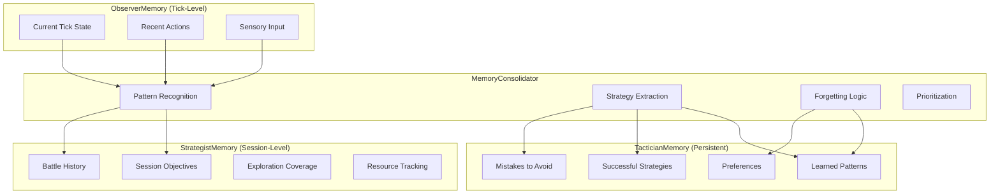
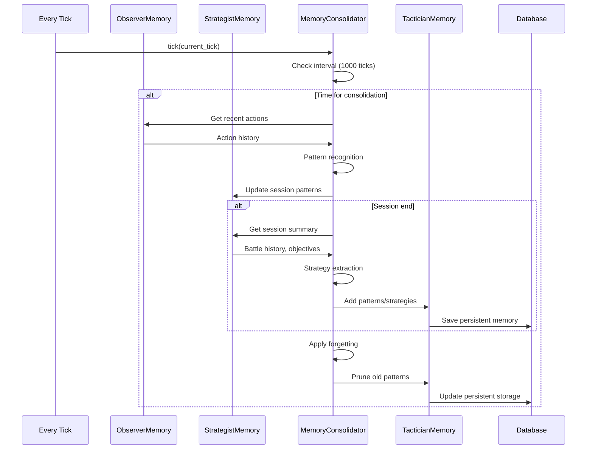

# PTP-01X Chapter 5B: Tri-Tier Memory Architecture

**Version:** 1.0 (Design & Implementation)  
**Purpose:** Define three-tier memory system for autonomous Pokemon AI with distinct lifecycles, consolidation pathways, and integration points

---

## 5B.1 Architecture Overview

### Design Philosophy

The Tri-Tier Memory Architecture implements cognitiveinspired memory hierarchy mirroring human memory:

1. **ObserverMemory** (Ephemeral) - Working memory for immediate decisions
2. **StrategistMemory** (Session-Level) - Tactical memory for current session
3. **TacticianMemory** (Persistent) - Long-term learned patterns



### Memory Tier Characteristics

| Attribute | ObserverMemory | StrategistMemory | TacticianMemory |
|-----------|---------------|------------------|-----------------|
| **Duration** | Ephemeral (tick) | Session | Persistent (across sessions) |
| **Capacity** | ~10 actions | ~1000 events | Unlimited (pruned) |
| **Access Speed** | <1ms | <10ms | <100ms |
| **Volatility** | High | Medium | Low |
| **Persistence** | None | Checkpoint | Database |
| **Consolidation** | → Strategist | → Tactician | Archive/Prune |

---

## 5B.2 ObserverMemory (Ephemeral)

### Purpose
Working memory for current tick and recent decision context. Provides immediate state for AI decision-making.

### Data Structure

```python
@dataclass
class TickState:
    """Current tick game state snapshot"""
    tick: int
    timestamp: float
    location: str
    is_battle: bool
    party_hp_percent: float
    money: int
    badges: List[str]
    screen_type: str  # overworld, battle, menu, dialog, etc.
    active_goal: Optional[str]

@dataclass
class ActionRecord:
    """Recent action with outcome"""
    tick: int
    action_type: str  # press, hold, sequence, batch
    action_value: str
    reasoning: str
    confidence: float
    success: bool
    outcome_summary: str
    duration_ms: float

@dataclass
class SensoryInput:
    """Immediate vision/OCR input"""
    vision_labels: List[str]
    ocr_text: str
    ocr_confidence: float
    screen_type: str
    enemy_pokemon: Optional[str]
    player_hp_percent: float
    enemy_hp_percent: Optional[float]
    available_actions: List[str]

@dataclass
class ObserverMemory:
    """
    Ephemeral working memory for current decision context
    
    Lifecycle: Created per decision, cleared after action execution
    """
    current_state: TickState
    recent_actions: List[ActionRecord]  # Max 10, FIFO
    sensory_input: SensoryInput
    decision_context: Dict[str, Any]
    
    def get_recent_outcomes(self) -> List[Dict[str, Any]]:
        """Get summary of recent action outcomes"""
        pass
    
    def add_action(self, action: ActionRecord):
        """Record action and maintain FIFO buffer"""
        pass
    
    def clear(self):
        """Reset memory for new decision cycle"""
        pass
```

### Integration Points

- **Input**: Vision pipeline, OCR engine, game state from emulator
- **Output**: Context injection for AI Client
- **Lifecycle**: Replaced each tick

---

## 5B.3 StrategistMemory (Session-Level)

### Purpose
Track session-level progress, objectives, and resource state. Persists through session, cleared at session end.

### Data Structure

```python
@dataclass
class SessionObjective:
    """Current session objective"""
    objective_id: str
    name: str
    description: str
    objective_type: str  # defeat_gym, catch_pokemon, reach_location, etc.
    priority: int  # 1-100
    status: str  # pending, active, completed, failed
    progress_percent: float
    created_tick: int
    completed_tick: Optional[int]
    prerequisites: List[str]
    related_location: Optional[str]

@dataclass
class BattleRecord:
    """Single battle outcome"""
    battle_id: str
    start_tick: int
    end_tick: int
    enemy_pokemon: str
    enemy_level: int
    player_pokemon: str
    player_level: int
    outcome: str  # victory, defeat, runaway, catch
    turns_taken: int
    player_hp_remaining: float
    moves_used: List[str]
    items_used: List[str]
    key_decisions: List[str]

@dataclass
class LocationVisited:
    """Location exploration record"""
    location_name: str
    location_type: str  # route, city, gym, cave, etc.
    first_visit_tick: int
    last_visit_tick: int
    visit_count: int
    explored_areas: List[str]  # specific sub-areas
    unexplored_areas: List[str]
    points_of_interest: List[str]
    npcs_interacted: List[str]

@dataclass
class ResourceSnapshot:
    """Resource state at point in time"""
    tick: int
    money: int
    items: Dict[str, int]  # item_name: quantity
    tms_obtained: List[int]
    hms_obtained: List[str]
    key_items: List[str]

@dataclass
class StrategistMemory:
    """
    Session-level tactical memory
    
    Lifecycle: Created at session start, consolidated at session end
    """
    session_id: str
    session_start_tick: int
    objectives: List[SessionObjective]
    active_objective: Optional[SessionObjective]
    battle_history: List[BattleRecord]  # All battles this session
    locations_visited: Dict[str, LocationVisited]
    resource_history: List[ResourceSnapshot]
    total_battles: int = 0
    victories: int = 0
    defeats: int = 0
    
    def get_objectives_progress(self) -> Dict[str, float]:
        """Get completion percentage by objective type"""
        pass
    
    def get_win_rate(self) -> float:
        """Calculate session battle win rate"""
        pass
    
    def record_battle(self, battle: BattleRecord):
        """Add battle to history and update stats"""
        pass
    
    def update_objective_progress(self, objective_id: str, progress: float):
        """Update objective progress"""
        pass
    
    def add_location(self, location: LocationVisited):
        """Record new location visit"""
        pass
    
    def snapshot_resources(self, tick: int):
        """Record current resource state"""
        pass
    
    def clear_session(self):
        """Clear session data for new session"""
        pass
```

### Integration Points

- **Input**: Battle system, navigation system, inventory system
- **Output**: Objectives for GOAP, battle stats for analysis
- **Lifecycle**: Persists session, consolidated to TacticianMemory at end

---

## 5B.4 TacticianMemory (Persistent)

### Purpose
Long-term learned knowledge from multiple sessions. Survives session restarts, grows with experience.

### Data Structure

```python
@dataclass
class LearnedPattern:
    """Learned pattern from experience"""
    pattern_id: str
    pattern_type: str  # enemy_behavior, route_efficiency, item_usage, etc.
    description: str
    trigger_conditions: Dict[str, Any]
    learned_from_session: str
    learned_from_tick: int
    success_count: int
    failure_count: int
    confidence: float  # 0-1
    last_validated: float  # timestamp
    relevance_score: float

@dataclass
class SuccessfulStrategy:
    """Strategy that worked in past battles"""
    strategy_id: str
    context: Dict[str, Any]  # battle context
    enemy_type: str
    player_pokemon: str
    strategy_description: str
    moves_sequence: List[str]
    success_rate: float
    total_uses: int
    first_used: float
    last_used: float

@dataclass
class MistakeRecord:
    """Mistake to avoid in future"""
    mistake_id: str
    description: str
    situation: Dict[str, Any]
    outcome: str
    severity: str  # minor, major, critical
    prevention_tip: str
    first_occurred: float
    last_occurred: float
    occurrence_count: int

@dataclass
class PlayerPreference:
    """Player-configured or learned preferences"""
    preference_id: str
    category: str  # move_order, item_timing, navigation, etc.
    description: str
    preference_value: Any
    learned_from_session: str
    confidence: float
    created_at: float
    updated_at: float

@dataclass
class TacticianMemory:
    """
    Persistent long-term memory
    
    Lifecycle: Loaded at startup, saved periodically, pruned periodically
    """
    patterns: Dict[str, LearnedPattern]
    strategies: Dict[str, SuccessfulStrategy]
    mistakes: Dict[str, MistakeRecord]
    preferences: Dict[str, PlayerPreference]
    total_sessions: int = 0
    total_battles: int = 0
    overall_win_rate: float = 0.0
    
    def add_pattern(self, pattern: LearnedPattern):
        """Add or update learned pattern"""
        pass
    
    def record_strategy_success(self, strategy_id: str):
        """Record successful use of strategy"""
        pass
    
    def add_mistake(self, mistake: MistakeRecord):
        """Record new mistake to avoid"""
        pass
    
    def get_preference(self, category: str) -> Optional[PlayerPreference]:
        """Get preference for category"""
        pass
    
    def set_preference(self, preference: PlayerPreference):
        """Set or update preference"""
        pass
    
    def get_relevant_patterns(self, context: Dict[str, Any]) -> List[LearnedPattern]:
        """Get patterns relevant to current context"""
        pass
    
    def get_successful_strategies(
        self, 
        enemy_type: str, 
        player_pokemon: str
    ) -> List[SuccessfulStrategy]:
        """Get strategies that worked against similar enemies"""
        pass
    
    def get_mistakes_for_context(self, context: Dict[str, Any]) -> List[MistakeRecord]:
        """Get mistakes relevant to current situation"""
        pass
    
    def load_from_database(self, db_path: str):
        """Load persistent memory from database"""
        pass
    
    def save_to_database(self, db_path: str):
        """Save persistent memory to database"""
        pass
```

### Database Schema

```sql
-- Tactician Memory Tables (add to existing database.py)
CREATE TABLE IF NOT EXISTS tactician_patterns (
    pattern_id TEXT PRIMARY KEY,
    pattern_type TEXT,
    description TEXT,
    trigger_conditions TEXT,  -- JSON
    learned_from_session TEXT,
    learned_from_tick INTEGER,
    success_count INTEGER DEFAULT 0,
    failure_count INTEGER DEFAULT 0,
    confidence REAL,
    last_validated REAL,
    relevance_score REAL
);

CREATE TABLE IF NOT EXISTS successful_strategies (
    strategy_id TEXT PRIMARY KEY,
    context TEXT,  -- JSON
    enemy_type TEXT,
    player_pokemon TEXT,
    strategy_description TEXT,
    moves_sequence TEXT,  -- JSON
    success_rate REAL,
    total_uses INTEGER,
    first_used REAL,
    last_used REAL
);

CREATE TABLE IF NOT EXISTS mistake_records (
    mistake_id TEXT PRIMARY KEY,
    description TEXT,
    situation TEXT,  -- JSON
    outcome TEXT,
    severity TEXT,
    prevention_tip TEXT,
    first_occurred REAL,
    last_occurred REAL,
    occurrence_count INTEGER
);

CREATE TABLE IF NOT EXISTS player_preferences (
    preference_id TEXT PRIMARY KEY,
    category TEXT,
    description TEXT,
    preference_value TEXT,  -- JSON
    learned_from_session TEXT,
    confidence REAL,
    created_at REAL,
    updated_at REAL
);
```

---

## 5B.5 MemoryConsolidator

### Purpose
Manage memory flow between tiers, pattern recognition, strategy extraction, and forgetting logic.

### Data Structure

```python
@dataclass
class ConsolidationConfig:
    """Configuration for consolidation behavior"""
    tick_interval: int = 1000  # Consolidate every N ticks
    session_end_consolidate: bool = True
    pattern_threshold: float = 0.7  # Pattern confidence threshold
    min_occurrences_for_pattern: int = 3  # Minimum occurrences to form pattern
    forgetting_decay_rate: float = 0.95  # Monthly decay rate
    max_patterns_per_type: int = 50  # Max patterns to keep per type
    max_strategies: int = 100  # Max strategies to keep
    max_mistakes: int = 200  # Max mistakes to remember
    importance_threshold: float = 0.3  # Below this, prune

class MemoryConsolidator:
    """
    Manages memory consolidation between tiers
    
    Responsibilities:
    - Pattern recognition from Observer -> Strategist
    - Strategy extraction from Strategist -> Tactician
    - Forgetting logic (decay, prune)
    - Memory prioritization
    """
    
    def __init__(
        self,
        config: Optional[ConsolidationConfig] = None,
        observer_memory: Optional[ObserverMemory] = None,
        strategist_memory: Optional[StrategistMemory] = None,
        tactician_memory: Optional[TacticianMemory] = None
    ):
        self.config = config or ConsolidationConfig()
        self.observer = observer_memory
        self.strategist = strategist_memory
        self.tactician = tactician_memory
        self.last_consolidation_tick = 0
        self.consolidation_history: List[Dict] = []
    
    def tick(self, current_tick: int):
        """
        Called every tick - checks if consolidation needed
        
        Triggers consolidation every N ticks or at session end
        """
        pass
    
    def consolidate_observer_to_strategist(self):
        """
        Extract patterns from recent observer memory to strategist
        
        - Identify recurring action sequences
        - Detect common situations
        - Aggregate successful/failed approaches
        """
        pass
    
    def consolidate_strategist_to_tactician(self):
        """
        Extract learned strategies from session to long-term memory
        
        - Identify battle patterns with high success rates
        - Extract successful move sequences
        - Record mistakes with high severity
        - Update preferences based on behavior
        """
        pass
    
    def apply_forgetting(self):
        """
        Remove or decay old memories
        
        - Apply decay to old patterns
        - Prune low-relevance items
        - Archive instead of delete when valuable
        """
        pass
    
    def prioritize_memories(self) -> Dict[str, List[str]]:
        """
        Rank memories by importance for retention
        
        Returns:
            Dict with tier -> list of memory_ids sorted by priority
        """
        pass
    
    def get_consolidation_status(self) -> Dict[str, Any]:
        """Get current consolidation status and statistics"""
        pass
```

### Consolidation Flow



---

## 5B.6 Integration Requirements

### Database Integration

```python
class MemoryDatabaseMixin:
    """Mixins for database operations"""
    
    def save_tactician_memory(self, db: GameDatabase):
        """Save tactician memory to database"""
        pass
    
    def load_tactician_memory(self, db: GameDatabase) -> TacticianMemory:
        """Load tactician memory from database"""
        pass
    
    def save_strategist_checkpoint(self, db: GameDatabase, session_id: int):
        """Save strategist memory as checkpoint"""
        pass
    
    def load_strategist_checkpoint(self, db: GameDatabase, session_id: int) -> StrategistMemory:
        """Load strategist memory from checkpoint"""
        pass
```

### GOAP Integration

```python
class MemoryGOAPIntegration:
    """Integration with GOAP planner"""
    
    def get_context_for_planning(
        self,
        observer: ObserverMemory,
        strategist: StrategistMemory,
        tactician: TacticianMemory
    ) -> Dict[str, Any]:
        """Compile memory context for GOAP decision making"""
        pass
    
    def query_strategist_objectives(
        self,
        strategist: StrategistMemory
    ) -> List[SessionObjective]:
        """Get active objectives for GOAP"""
        pass
    
    def query_tactician_strategies(
        self,
        tactician: TacticianMemory,
        context: Dict[str, Any]
    ) -> List[SuccessfulStrategy]:
        """Get relevant strategies for current context"""
        pass
    
    def record_planning_outcome(
        self,
        observer: ObserverMemory,
        success: bool,
        outcome: str
    ):
        """Record planning outcome for learning"""
        pass
```

### AI Client Integration

```python
class MemoryAIIntegration:
    """Integration with AI Client for context injection"""
    
    def inject_memory_context(
        self,
        ai_client: GameAIManager,
        observer: ObserverMemory,
        strategist: StrategistMemory,
        tactician: TacticianMemory
    ) -> Dict[str, Any]:
        """
        Inject memory context into AI prompts
        
        Returns:
            Dict with context sections for different AI models
        """
        pass
    
    def get_tactical_context(
        self,
        tactician: TacticianMemory,
        battle_context: Dict[str, Any]
    ) -> str:
        """Get tactical context for battle AI"""
        pass
    
    def get_strategic_context(
        self,
        strategist: StrategistMemory
    ) -> str:
        """Get strategic context for planning AI"""
        pass
    
    def get_recent_actions_summary(
        self,
        observer: ObserverMemory
    ) -> str:
        """Get summary of recent actions for AI context"""
        pass
```

---

## 5B.7 Performance Specifications

### Access Times

| Operation | Time | Frequency |
|-----------|------|-----------|
| Observer memory query | <1ms | Per decision |
| Strategist objective query | <5ms | Per GOAP cycle |
| Tactician strategy query | <10ms | Per battle decision |
| Memory consolidation | <100ms | Every 1000 ticks |
| Database save (Tactician) | <50ms | Session end + every 10000 ticks |
| Database load (Tactician) | <100ms | Startup |

### Storage Budget

- **ObserverMemory**: ~1KB (fixed size)
- **StrategistMemory**: ~50KB per session
- **TacticianMemory**: ~500KB base + ~1KB per pattern
- **Consolidation overhead**: ~10ms per 1000 ticks

### Scalability Targets

- **Sessions**: Unlimited (patterns aggregated)
- **Patterns**: Max 50 per type, total ~500
- **Strategies**: Max 100, sorted by success rate
- **Mistakes**: Max 200, sorted by severity

---

## 5B.8 Implementation Order

### Phase 1: Foundation (Priority: HIGH)
1. Define memory dataclasses
2. Create ObserverMemory with basic state tracking
3. Implement session start/end hooks

### Phase 2: Core Functionality (Priority: HIGH)
4. Implement StrategistMemory for session tracking
5. Add battle history recording
6. Implement resource tracking

### Phase 3: Persistence (Priority: MEDIUM)
7. Create TacticianMemory dataclasses
8. Add database schema for persistent memory
9. Implement save/load operations

### Phase 4: Consolidation (Priority: MEDIUM)
10. Implement MemoryConsolidator
11. Add pattern recognition from Observer→Strategist
12. Add strategy extraction from Strategist→Tactician

### Phase 5: Integration (Priority: MEDIUM)
13. Integrate with GOAP planner
14. Integrate with AI Client for context injection
15. Add memory querying APIs

### Phase 6: Optimization (Priority: LOW)
16. Implement forgetting logic
17. Add memory prioritization
18. Performance tuning

---

## 5B.9 Acceptance Criteria

- [ ] Memory tiers functional and integrated
- [ ] Consolidation occurs every 1000 ticks
- [ ] Memory queries return relevant context
- [ ] No memory bloat over 10+ hour sessions
- [ ] Persistent memory survives session restarts
- [ ] Pattern recognition improves decision quality
- [ ] Access times within specified limits

---

## 5B.10 Dependencies

- **1.6**: Game state definitions
- **2.1**: GOAP planner for objective integration
- **3.1**: Battle system for battle history
- **4.1**: Navigation system for location tracking
- **7.1**: Inventory system for resource tracking
- **Database**: SQLite persistence layer