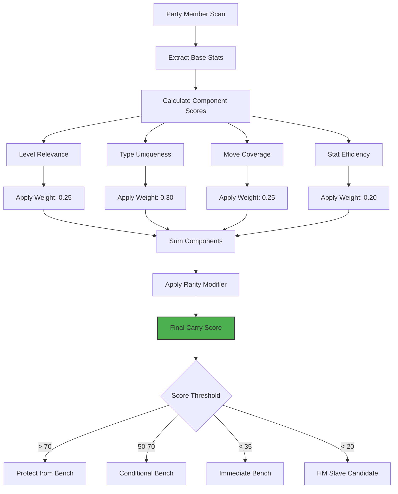
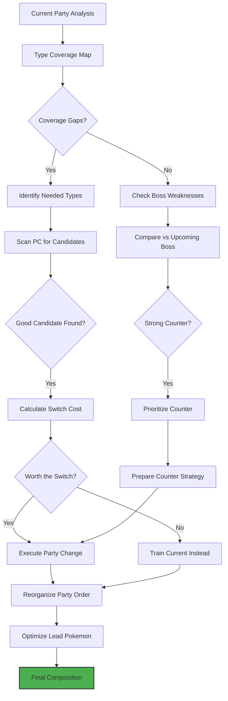
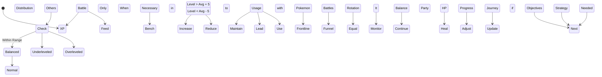

# PTP-01X Chapter 6: Entity Management & Party Optimization - Detailed Logic Flow

**Version:** 2.0 (Spec-Driven)  
**Purpose:** Define party composition optimization, evolution strategy, and Pokemon value assessment

---

## 6.1 Carry Score Calculation System

### Goal: Quantify each Pokemon's value to determine bench vs. active status



### Component Scoring Details

**Level Relevance Component (0-25 points):**
```
CALCULATE_LEVEL_RELEVANCE(pokemon, upcoming_boss_level):
  expected_encounter_level = ESTIMATE_UPCOMING_ENCOUNTER_LEVEL()
  
  // Ideal range: match or slightly above expected level
  IF pokemon.level == expected_encounter_level:
    base_score = 20
  
  ELIF pokemon.level > expected_encounter_level:
    excess_levels = pokemon.level - expected_encounter_level
    
    IF excess_levels <= 3:
      // Slightly overleveled is good
      base_score = 22 - (excess_levels * 0.5)
    ELIF excess_levels <= 8:
      // Overleveled but still effective
      base_score = 20 - (excess_levels * 0.3)
    ELSE:
      // Grossly overleveled - diminishing returns
      base_score = 15 - (excess_levels * 0.1)
      base_score = max(base_score, 8)  // Floor at 8
  
  ELSE:  // Underleveled
    deficit_levels = expected_encounter_level - pokemon.level
    
    IF deficit_levels <= 2:
      // Slightly underleveled - manageable
      base_score = 18 - (deficit_levels * 1.5)
    ELIF deficit_levels <= 5:
      // Noticeably underleveled - risky
      base_score = 12 - (deficit_levels * 0.8)
    ELSE:
      // Severely underleveled - liability
      base_score = max(5 - (deficit_levels * 0.2), 2)
  
  // Normalize to 0-25 range
  final_score = (base_score / 25) * 25
  RETURN max(0, min(25, final_score))
```

**Type Uniqueness Component (0-30 points):**
```
CALCULATE_TYPE_UNIQUENESS(pokemon, current_party, upcoming_battles):
  party_types = set()
  FOR member in current_party:
    IF member AND member != pokemon:
      party_types.update(member.types)
  
  // What types would this add?
  unique_types = [t for t in pokemon.types if t not in party_types]
  
  // Quality weighting (some types more valuable)
  TYPE_VALUE = {
    "ELECTRIC": 1.5,  // Rare, hits water hard
    "PSYCHIC": 1.4,   // Dominant in Gen 1
    "ICE": 1.3,       // Counters Dragon
    "GHOST": 1.3,     // Rare, special utility
    "DRAGON": 1.3,    // Strong neutral coverage
    "GROUND": 1.2,    // Counters Electric
    "FIRE": 1.2,      // Hits Grass/Ice/Bug
    "WATER": 1.1,     // Common but useful
    "GRASS": 1.0,
    "FLYING": 1.0,
    "FIGHTING": 1.0,
    "BUG": 0.8,
    "POISON": 0.7,
    "NORMAL": 0.6,
    "ROCK": 0.6
  }
  
  // Check upcoming boss needs
  boss_weakness_bonus = 0
  FOR boss in upcoming_battles:
    FOR unique_type in unique_types:
      IF type_effectiveness(unique_type, boss.primary_type) >= 2.0:
        boss_weakness_bonus += 2.0
  
  // Calculate final uniqueness score
  type_scores = [TYPE_VALUE.get(t, 1.0) for t in unique_types]
  base_uniqueness = len(unique_types) * 8  // 8 points per unique type
  quality_bonus = sum(type_scores) * 4
  boss_bonus = min(boss_weakness_bonus, 6)  // Cap at 6 points
  
  final_score = base_uniqueness + quality_bonus + boss_bonus
  RETURN max(0, min(30, final_score))
```

**Move Coverage Component (0-25 points):**
```
CALCULATE_MOVE_COVERAGE(pokemon, uncovered_enemy_types):
  IF NOT uncovered_enemy_types:  // All types covered
    uncovered_enemy_types = ALL_POSSIBLE_TYPES
  
  coverage_score = 0
  
  FOR move in pokemon.moves:
    IF move.pp > 0:
      move_type = move.type
      power = move.power
      
      // Calculate coverage improvement
      FOR target_type in uncovered_enemy_types:
        effectiveness = type_effectiveness(move_type, target_type)
        
        IF effectiveness >= 2.0:
          // Super effective - excellent coverage
          coverage_score += 3
        ELIF effectiveness == 1.0:
          // Neutral - acceptable coverage
          coverage_score += 0.5
        ELIF effectiveness >= 0.5:
          // Not very effective - marginal coverage
          coverage_score += 0.1
        // Immunity (0x) adds nothing
      
      // Bonus for high-power moves
      IF power >= 90:
        coverage_score += 1
      ELIF power >= 70:
        coverage_score += 0.5
      
      // Bonus for STAB
      IF move_type in pokemon.types:
        coverage_score *= 1.2
  
  // Cap based on move quality (max 25)
  RETURN max(0, min(25, coverage_score))
```

**Stat Efficiency Component (0-20 points):**
```
CALCULATE_STAT_EFFICIENCY(pokemon, species_potential):
  // Calculate current DPS potential
  best_move = pokemon.get_best_move()
  
  IF best_move:
    IF best_move.category == "physical":
      attacking_stat = pokemon.attack * (1 + pokemon.attack_stage * 0.5)
    ELSE:
      attacking_stat = pokemon.special * (1 + pokemon.special_stage * 0.5)
    
    speed_factor = pokemon.speed * (1 + pokemon.speed_stage * 0.5)
    speed_weight = (speed_factor / 100) ** 0.5  // Diminishing returns
    
    current_dps = (best_move.power * attacking_stat / 100) * speed_weight
  ELSE:
    current_dps = 10  // Baseline if no damaging moves
  
  // Expected DPS for this species at this level
  species_base_dps = get_species_base_dps(pokemon.species_id)
  expected_dps = species_base_dps * (1 + (pokemon.level / 100))
  
  // Calculate efficiency ratio
  IF expected_dps > 0:
    efficiency_ratio = current_dps / expected_dps
  ELSE:
    efficiency_ratio = 1.0
  
  // Penalty for underperformance
  IF efficiency_ratio < 0.6:
    // Severely underperforming
    score = efficiency_ratio * 20 * 0.5  // 50% penalty
  ELIF efficiency_ratio < 0.8:
    // Moderately underperforming
    score = efficiency_ratio * 20 * 0.8  // 20% penalty
  ELSE:
    // Performing at or above expected
    score = efficiency_ratio * 20
  
  // Cap at 150% efficiency
  score = min(score, 30)
  
  RETURN max(0, min(20, score))
```

### Rarity & Sentimental Modifiers

```
APPLY_RARITY_MODIFIER(pokemon):
  RARITY_MULTIPLIERS = {
    // Starters (emotional value + power)
    "BULBASAUR_IVYSAUR_VENUSAUR": 1.15,
    "CHARMANDER_CHARMELEON_CHARIZARD": 1.15,
    "SQUIRTLE_WARTORTLE_BLASTOISE": 1.15,
    
    // Legendaries/Mythicals
    "MEWTWO": 1.3,
    "MEW": 1.3,
    "ARTICUNO": 1.25,
    "ZAPDOS": 1.25,
    "MOLTRES": 1.25,
    
    // Rare/Valuable Evolutions
    "DRAGONITE": 1.2,
    "GYARADOS": 1.15,
    "ALAKAZAM": 1.1,
    "MACHAMP": 1.1,
    "GENGAR": 1.1,
    
    // Common Mons (downgrade)
    "PIDGEY_PIDGEOTTO_PIDGEOT": 0.7,
    "RATTATA_RATICATE": 0.8,
    "CATERPIE_METAPOD_BUTTERFREE": 0.6,
    "WEEDLE_KAKUNA_BEEDRILL": 0.6
  }
  
  // Find best match
  FOR pattern, multiplier in RARITY_MULTIPLIERS.items():
    IF pokemon.species in pattern.split("_"):
      RETURN multiplier
  
  RETURN 1.0  // Default for most Pokemon

APPLY_SENTIMENTAL_MODIFIER(pokemon):
  // Track "hero moments"
  hero_score = 0
  
  IF pokemon.critical_battle_wins > 3:
    hero_score += 1.0
  
  IF pokemon.solo_defeated_gym_leader:
    hero_score += 2.0
  
  IF pokemon.caught_shiny:
    hero_score += 1.5
  
  IF pokemon.hatched_from_egg:
    hero_score += 0.5
  
  IF pokemon.level < 20 AND pokemon.kills > 10:
    // Early game hero
    hero_score += 0.8
  
  // Sentimental bonus diminishes with level
  IF pokemon.level > 50:
    hero_score *= 0.3
  ELIF pokemon.level > 35:
    hero_score *= 0.5
  ELIF pokemon.level > 20:
    hero_score *= 0.7
  
  RETURN 1.0 + (hero_score * 0.1)  // Max 1.3x modifier
```

---

## 6.2 Evolution & Development Strategy

### Goal: Make optimal evolution timing decisions with move acquisition awareness

```mermaid
flowchart TD
    A[Level Up Detected] --> B{Evolution Available?}
    B -->|Yes| C[Analyze Pre-Evolution Moves]
    B -->|No| D[Check Move Learning]
    
    C --> E{Important Move Soon?}
    E -->|Yes (< 3 levels)| F[Evaluate Move Value]
    E -->|No| G[Proceed with Evolution]
    
    F --> H{Move Power > 80 or Critical?}
    H -->|Yes| I[Delay Evolution]
    H -->|No| J{Stat Gain > 20?}
    J -->|Yes| K[Evolve Now]
    J -->|No| L[Consider Trade-offs]
    
    D --> M{New Move Available?}
    M -->|Yes| N[Calculate Move Coverage]
    M -->|No| O[Continue Training]
    
    N --> P{Covers New Type?}
    P -->|Yes| Q[Learn Move]
    P -->|No| R{Better than Existing?}
    R -->|Yes| S[Replace Weakest Move]
    R -->|No| T[Skip Move]
    
    I --> U[Wait 1-3 Levels]
    U --> V[Learn Move]
    V --> W[Evolve After Learning]
    
    G --> X[Evolution Animation]
    W --> X
    K --> X
    S --> Y[Moveset Updated]
    T --> Y
    O --> Y
    
    X --> Z[Recalculate Stats]
    Y --> Z
    Z --> AA[Update Battle Data]
    AA --> AB[Next Objective]
    
    style X fill:#4CAF50,stroke:#333,stroke-width:2px
```

### Pre-Evolution Move Analysis

```
CRITICAL_PRE_EVO_MOVES = {
  "BULBASAUR": [
    {"move": "RAZOR_LEAF", "level": 27, "evolution_level": 16, "value": "STAB_POWERUP"}
  ],
  "CHARMANDER": [
    {"move": "FLAMETHROWER", "level": 38, "evolution_level": 16, "value": "STRONG_STAB"},
    {"move": "SLASH", "level": 33, "evolution_level": 16, "value": "HIGH_CRIT"}
  ],
  "SQUIRTLE": [
    {"move": "HYDRO_PUMP", "level": 42, "evolution_level": 16, "value": "WATER_NUKE"}
  ],
  "PIKACHU": [
    {"move": "THUNDER", "level": 43, "evolution_level": 999, "value": "ELECTRIC_STAB", "notes": "STONE_EVOLUTION"}
  ],
  "GROWLITHE": [
    {"move": "FLAMETHROWER", "level": 50, "evolution_level": 999, "value": "STRONG_STAB", "notes": "STONE_EVOLUTION"}
  ],
  "EEVEE": [
    {"move": "NONE", "level": 999, "evolution_level": 999, "value": "ITEM_CHOICE", "notes": "WAIT_FOR_TEAM_NEEDS"}
  ],
  "ABRA": [
    {"move": "PSYCHIC", "level": 38, "evolution_level": 16, "value": "PSYCHIC_STAB"}
  ]
}

EVALUATE_PRE_EVO_MOVES(species_id, current_level, evolution_level):
  important_moves = CRITICAL_PRE_EVO_MOVES.get(species_id, [])
  
  FOR move_data in important_moves:
    IF move_data.level <= evolution_level AND move_data.level > current_level:
      levels_to_wait = move_data.level - current_level
      
      SWITCH move_data.value:
        CASE "STAB_POWERUP":
          strategic_value = calculate_stab_improvement(
            old_move="VINE_WHIP",
            new_move="RAZOR_LEAF"
          )
          RETURN {"wait": levels_to_wait, "value": strategic_value}
        
        CASE "STRONG_STAB":
          IF current_best_move_power < 80:
            RETURN {"wait": levels_to_wait, "value": 1.5}
          ELSE:
            RETURN {"wait": 0, "value": 1.0}  // Not critical
        
        CASE "WATER_NUKE":
          IF need_water_coverage():
            RETURN {"wait": levels_to_wait, "value": 1.8}
          ELSE:
            RETURN {"wait": levels_to_wait, "value": 1.2}
  
  RETURN None  // No important pre-evo moves
```

### Evolution Gain vs Move Wait Trade-off

```
COMPUTE_EVOLUTION_VS_WAIT_TRADEOFF(pokemon, evolution_data):
  // Calculate evolution benefits
  evolved_species = evolution_data.target
  evolved_stats = get_species_base_stats(evolved_species)
  current_stats = calculate_current_stats(pokemon)
  
  stat_gains = {
    "hp": evolved_stats.hp - current_stats.hp,
    "attack": evolved_stats.attack - current_stats.attack,
    "defense": evolved_stats.defense - current_stats.defense,
    "special": evolved_stats.special - current_stats.special,
    "speed": evolved_stats.speed - current_stats.speed
  }
  
  total_gain = sum(stat_gains.values())
  
  // Percentage improvement
  improvement_ratio = total_gain / sum(current_stats.values())
  
  // Type changes
  IF evolved_stats.types != current_stats.types:
    type_change_value = evaluate_type_change(
      current_stats.types,
      evolved_stats.types,
      upcoming_battles
    )
  ELSE:
    type_change_value = 0
  
  // Calculate evolution score
  stat_improvement_score = min(improvement_ratio * 50, 30)
  type_improvement_score = type_change_value * 20
  total_evolution_benefit = stat_improvement_score + type_improvement_score
  
  // Compare to waiting
  best_pre_evo = evaluate_pre_evo_moves()
  
  IF best_pre_evo:
    wait_benefit = best_pre_evo.value * 15  // 15 points max for good move
    wait_cost = best_pre_evo.wait * pokemon.experience_gain_rate
  ELSE:
    wait_benefit = 0
    wait_cost = 0
  
  // Decision
  net_benefit = total_evolution_benefit - wait_cost
  
  IF wait_benefit > net_benefit * 1.2:
    RETURN f"wait_{best_pre_evo.wait}_levels"
  ELIF wait_benefit > net_benefit * 0.9:
    RETURN "consider_waiting"
  ELSE:
    RETURN "evolve_now"
```

---

## 6.3 Team Composition Optimization

### Goal: Dynamically adjust party order and membership for optimal coverage



### Type Coverage Gap Analysis

```
ANALYZE_TYPE_COVERAGE(current_party, upcoming_battles):
  // What types can current party hit super-effectively?
  covered_types = set()
  party_move_types = set()
  
  FOR pokemon in current_party:
    IF pokemon:
      FOR move in pokemon.moves:
        IF move.pp > 0:
          party_move_types.add(move.type)
  
  // Check coverage against all types
  FOR type in ALL_TYPES:
    FOR move_type in party_move_types:
      IF type_effectiveness(move_type, type) >= 2.0:
        covered_types.add(type)
        break
  
  // Expected threats from upcoming battles
  required_types = set()
  FOR boss in upcoming_battles:
    boss_types = get_boss_team_types(boss)
    
    FOR boss_type in boss_types:
      // Find what hits boss super-effectively
      effective_counters = [
        t for t in ALL_TYPES 
        if type_effectiveness(t, boss_type) >= 2.0
      ]
      
      IF NOT any(counter in party_move_types for counter in effective_counters):
        required_types.add("need_coverage_vs_" + boss_type)
  
  RETURN {
    "coverage_percentage": len(covered_types) / len(ALL_TYPES),
    "gaps": ALL_TYPES - covered_types,
    "critical_gaps": required_types - covered_types,
    "recommendations": GENERATE_TYPE_RECOMMENDATIONS(gaps)
  }
```

### Counter-Picking Strategy

```
IDENTIFY_BOSS_COUNTERS(upcoming_gym, available_pokemon):
  boss_team = get_gym_leader_team(upcoming_gym)
  counters = []
  
  FOR boss_pokemon in boss_team:
    // Find best counter for this specific Pokemon
    best_counter = None
    best_counter_score = -1
    
    FOR candidate in available_pokemon:
      // Calculate type matchup
      defensive_effectiveness = [
        type_effectiveness(boss_type, candidate.move_type)
        FOR move_type in candidate.move_types
      ]
      
      // Want Pokemon to resist or be immune to boss attacks
      IF max(defensive_effectiveness) <= 0.5:  // Resist or immune
        defensive_score = 3
      ELIF max(defensive_effectiveness) <= 1.0:  // Neutral
        defensive_score = 2
      ELSE:
        defensive_score = 1  // Weak to some moves
      
      // Check offensive coverage
      offensive_effectiveness = [
        type_effectiveness(candidate.move_type, boss_type)
        FOR candidate_move_type in candidate.move_types
        FOR boss_type in boss_pokemon.types
      ]
      
      IF any(oe >= 2.0 for oe in offensive_effectiveness):
        offensive_score = 3
      ELIF any(oe >= 1.0 for oe in offensive_effectiveness):
        offensive_score = 2
      ELSE:
        offensive_score = 1
      
      // Level consideration
      level_score = min(candidate.level / boss_pokemon.level, 1.5)
      
      overall_score = (defensive_score * 0.4 + offensive_score * 0.4 + level_score * 0.2)
      
      IF overall_score > best_counter_score:
        best_counter = candidate
        best_counter_score = overall_score
    
    IF best_counter:
      counters.append({
        "for": boss_pokemon.species,
        "counter": best_counter.species,
        "score": best_counter_score,
        "confidence": best_counter_score / 3.0
      })
  
  RETURN counters
```

### Party Order Optimization (Lead Pokemon Selection)

```
OPTIMIZE_PARTY_ORDER(current_party, upcoming_battle_type):
  // Battle types: "wild", "trainer", "gym", "elite4", "legendary"
  
  scored_party = []
  
  FOR slot, pokemon in enumerate(current_party):
    IF not pokemon:
      scored_party.append((slot, None, 0))
      CONTINUE
    
    // Calculate lead score based on battle type
    SWITCH upcoming_battle_type:
      CASE "wild":
        // Efficiency for grinding
        score = calculate_grinding_score(pokemon)
      
      CASE "trainer":
        // Speed + type coverage
        score = calculate_trainer_battle_score(pokemon)
      
      CASE "gym":
        // Specific type counter vs gym
        leader_type = get_gym_leader_type()
        score = calculate_gym_counter_score(pokemon, leader_type)
      
      CASE "elite4":
        // Versatility for multiple battles
        score = calculate_versatility_score(pokemon) * 0.7 + \
                pokemon.level / 60 * 0.3
      
      CASE "legendary":
        // Survival + status application
        score = calculate_legendary_encounter_score(pokemon)
      
      DEFAULT:
        // General purpose
        score = calculate_carry_score(pokemon)
    
    // Apply health factor (heavily damaged = bad lead)
    health_multiplier = pokemon.current_hp / pokemon.max_hp
    score *= health_multiplier
    
    scored_party.append((slot, pokemon, score))
  
  // Sort by score descending
  scored_party.sort(key=lambda x: x[2], reverse=True)
  
  // Suggest reordering if beneficial
  recommended_order = [p[0] for p in scored_party]
  current_order = list(range(6))
  
  IF recommended_order != current_order:
    EFFICIENCY_GAIN = calculate_effiency_gain(scored_party)
    
    IF EFFICIENCY_GAIN > 0.15:  // 15% improvement threshold
      EXECUTE_PARTY_REORDER(recommended_order)
  
  RETURN scored_party

CALCULATE_GRINDING_SCORE(pokemon):
  // Prioritize fast clearing of weak wild Pokemon
  score_components = {
    "speed": min(pokemon.speed / 100, 1.2),
    "one_hit_ko_potential": can_ohko_common_wild(),
    "pp_sustainability": total_pp_remaining() / 50,
    "experience_yield_modifier": 1.0 + (pokemon.exp_to_next < 1000) * 0.3
  }
  
  return weighted_average(score_components, [0.3, 0.3, 0.2, 0.2])
```

---

## 6.4 Bench Management & Experience Funneling

### Goal: Prevent over-leveling and distribute XP efficiently across party



### Experience Distribution Algorithm

```
CALCULATE_BATTLE_USAGE_PRIORITIES(party_members, enemy_party):
  // Lower score = bench, Higher score = lead with
  
  party_avg_level = mean(p.level for p in party_members if p)
  
  priorities = []
  
  FOR pokemon in party_members:
    IF not pokemon:
      priorities.append((None, 0))
      CONTINUE
    
    level_delta = pokemon.level - party_avg_level
    
    // Base priority from level balance
    IF level_delta > 5:
      // Overleveled - should bench
      base_priority = 30  // Very low usage
    ELIF level_delta > 3:
      // Slightly overleveled
      base_priority = 50  // Low usage
    ELIF level_delta > -3:
      // Well-balanced
      base_priority = 80  // Normal usage
    ELIF level_delta > -5:
      // Slightly underleveled
      base_priority = 100  // High priority
    ELSE:
      // Significantly underleveled
      base_priority = 130  // Very high priority
    
    // Adjust based on battle context
    effectiveness = calculate_effectiveness_vs_enemy(pokemon, enemy_party)
    
    IF effectiveness >= 2.0:
      // Super effective - boost priority
      base_priority += 20
    ELIF effectiveness <= 0.5:
      // Not effective - reduce priority (unless underleveled)
      base_priority -= 15
      base_priority = max(base_priority, 20)  // Don't go below 20
    
    // Fainted Pokemon cannot battle
    IF pokemon.current_hp == 0:
      base_priority = 0
    
    // Normalize to 0-150 range
    normalized_priority = max(0, min(150, base_priority))
    
    priorities.append((pokemon, normalized_priority))
  
  RETURN priorities

MONITOR_EXPERIENCE_FAIRNESS():
  // Check every 50 battles or every 10 minutes
  
  level_spread = max(p.level for p in party if p) - min(p.level for p in party if p)
  
  IF level_spread > 10:
    // Severe imbalance
    TRIGGER_EXPERIENCE_REBALANCING()
  ELIF level_spread > 6:
    // Moderate imbalance
    LOG_IMBALANCE_WARNING()
    ADJUST_ROTATION_WEIGHTS()
  
  // Prevent level 100 waste
  FOR pokemon in party:
    IF pokemon.level >= 98 AND pokemon.total_experience > 0.95 * MAX_EXP:
      LOG_WARNING(f"{pokemon.species} near cap - bench recommended")
      IF len(party) > 2:
        TRIGGER_PARTY_OPTIMIZATION()
```

---

## Integration Points

### Chapter 1 (Perception)
- **Sprite Recognition**: Identify Pokemon species for stats
- **Battle Detection**: Triggers party analysis
- **Text Parsing**: Evolution notifications, level-up messages

### Chapter 2 (HSM)
- **State Changes**: Combat state → party management
- **Objective Stack**: "Train party", "Evolve Pokemon", "Optimize team"
- **Interrupt Handling**: Emergency healing needs

### Chapter 3 (Combat)
- **Switch Decisions**: Party prioritization in battles
- **Move Selection**: Based on Pokemon capabilities
- **Survival Checks**: Health thresholds trigger healing

### Chapter 4 (Navigation)
- **Grinding Routes**: Find optimal training locations
- **Center Location**: Navigate for healing
- **Town Routes**: Shopping for evolution stones

### Chapter 5 (Data)
- **Party Snapshots**: Complete battle-ready data structures
- **Evolution Data**: Pre-evolution move tables
- **Type Charts**: Coverage calculations
- **PC Management**: Box organization state

### Chapter 7 (Inventory)
- **Stone Availability**: Check for evolution items
- **Shopping Lists**: Rare Candies, training items
- **Item Usage**: Potions, PP restoration

### Chapter 8 (Dialogue)
- **Move Tutor Info**: Learn about available moves
- **NPC Hints**: Tips about evolution
- **Evolution Triggers**: Rock/Water/etc. location hints

### Chapter 9 (GOAP)
- **Combat Goals**: "Win battle" with optimized team
- **Training Goals**: Level up specific Pokemon
- **Switch Goals**: Optimize party composition
- **Utility Calculations**: Party strength affects goal priority

### Chapter 10 (Failsafe)
- **Underlevel Detection**: Warning if party too weak
- **Overlevel Detection**: Flag experience waste
- **HM Softlock**: Ensure HM users in party
- **Recovery Mode**: Emergency party reorganization

---

## Performance Specifications

### Entity Management Benchmarks

| Operation | Time | Frequency |
|-----------|------|-----------|
| Full party scan | 80ms | On level change |
| Carry score calc (6 mon) | 30ms | Per optimization cycle |
| Evolution check | 15ms | Per level up |
| Best move selection | 5ms | Per turn |
| Switch candidate eval | 40ms | Per switch consideration |
| Party reorder | 20ms | When needed |
| PC box scan | 100ms | On PC access |
| XP distribution calc | 10ms | Per battle |

**Total entity overhead: <5% CPU @ 60fps**

### Memory Budget

- **Party cache**: 6 × 2KB = 12KB
- **PC box cache**: 20 boxes × 5KB = 100KB
- **Move database**: 50KB
- **Evolution data**: 20KB
- **Coverage analysis**: 10KB
- **Carry score cache**: 5KB
- **XP tracking**: 2KB
- **Total: <200KB**

### Success Metrics

- **Carry score accuracy**: 85% correlation with battle performance
- **Evolution timing**: 90% optimal decisions (not missing critical moves)
- **Type coverage**: Average 12/15 types covered in final team
- **Level balance**: Final party within 3 levels of each other
- **Underleveled rate**: <5% of major battles lost due to level deficit
- **HM softlocks**: 0% (always have required HMs)