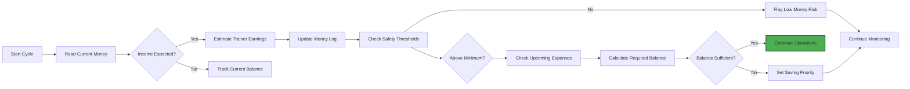
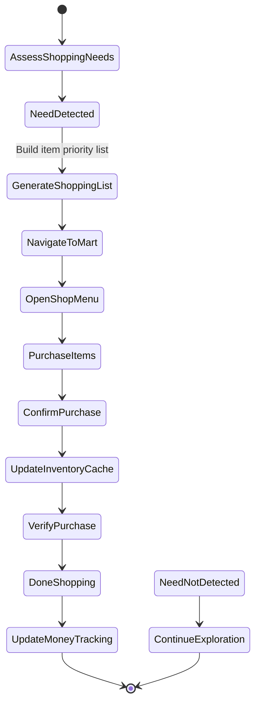
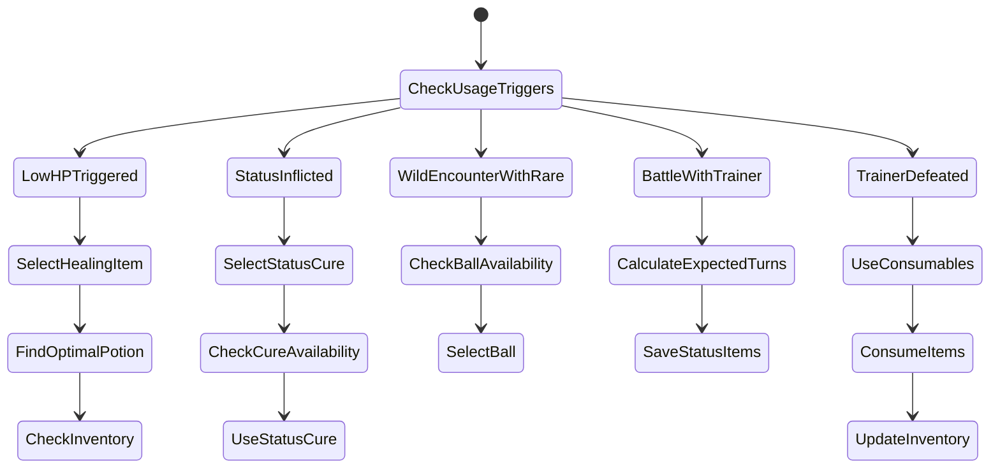
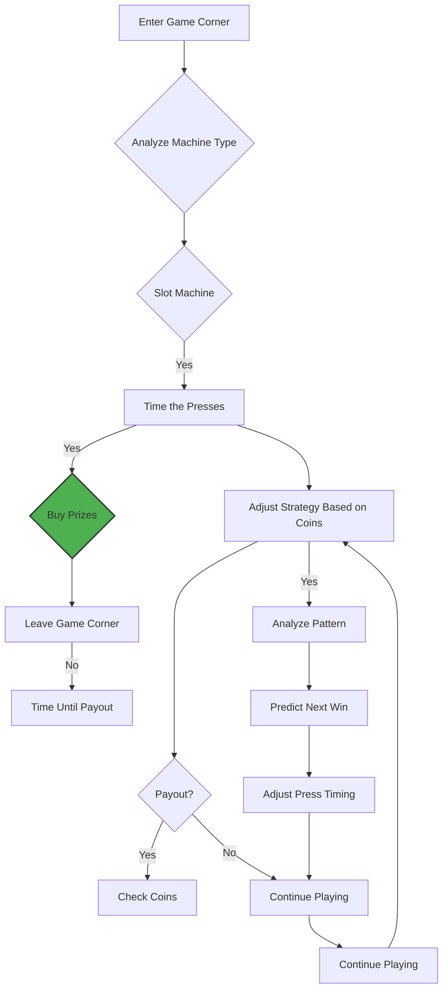
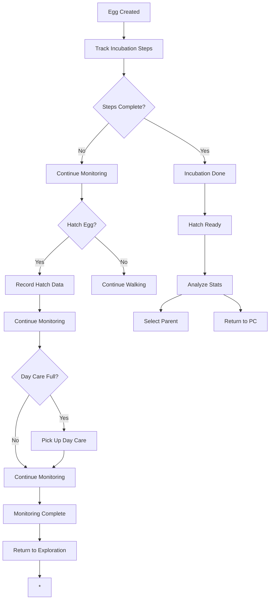

# PTP-01X Chapter 7: Inventory & Item Logistics - Detailed Logic Flow

**Version:** 2.1 (Spec-Driven)  
**Purpose:** Define inventory management, shopping heuristics, and item usage optimization

---

## 7.1 Wallet & Currency Math

### Goal: Track money management and predict financial needs



### Money Tracking Logic

**Core Reasoning Steps for LLM:**
1. **Assess Financial Health**: Read current funds, evaluate against expenses
2. **Predict Income**: Estimate upcoming trainer battles and their rewards
3. **Check Safety Buffer**: Maintain emergency funds (¥1,000 minimum)
4. **Track Spending Patterns**: Identify purchase trends and optimize
5. **Flag Risk Situations**: Low money + upcoming boss = prioritize farming

```python
MONEY_ASSESSMENT:
    current_money = read_money_bytes(0xD31C, 0xD31D)  # BCD encoding
    
    # Decode from BCD (Binary Coded Decimal)
    actual_value = (
        (current_money[2] & 0x0F) * 100 +
        (current_money[1] & 0x0F) * 10 +
        current_money[0]
    )
    
    return {
        "current": actual_value,
        "safety_buffer": max(0, actual_value - 1000),
        "risk_level": "high" if actual_value < 2000 else "medium"
    }

ESTIMATE_TRAINER_INCOME:
    # Based on upcoming routes and gym leaders
    estimated_trainers = count_upcoming_trainers()
    
    # Base trainer reward (Gen 1 average)
    avg_reward = 500
    if has_amulet_coin():
        avg_reward *= 2.0
    
    total_estimate = avg_reward * estimated_trainers
    
    # Money loss risk (whiteout penalty)
    whiteout_penalty = (current_party_value * 0.3) if actual_value > 0 else 0
    
    return max(0, total_estimate - whiteout_penalty)
```

### Safety Buffer Logic

```
MAINTAIN_SAFETY_BUFFER():
    current_money = get_current_money()
    current_savings = current_money - 1000  # Emergency reserve
    
    if current_savings < 500:
        # CRITICAL: Must save or farm
        TRIGGER "urgency_save" objective
        RETURN "critical_low"
    
    elif current_savings < 1000:
        # MEDIUM: Moderate spending caution
        SET spending_priority = 1.5  # Higher than normal
        RETURN "moderate"
    
    else:
        # GOOD: Normal spending
        SET spending_priority = 1.0
        RETURN "healthy"
```

### Shopping Budget Calculation

```
CALCULATE_SHOPPING_BUDGE(upcoming_objectives, current_money):
    # Estimate all upcoming costs
    total_estimated_cost = 0
    
    for objective in upcoming_objectives:
        if objective.type == "buy_item":
            item_cost = ITEM_CATEGORIES[objective.item_id]['cost']
            total_estimated_cost += item_cost
        elif objective.type == "evolution_stone":
            if objective.item_id in ['0x19', '0x1A', '0x1B', '0x1C', '0x1D']:
                # Fire/Water/Thunder stones cost ¥1050
                total_estimated_cost += 1050
    
    # Calculate available after maintaining safety buffer
    available_for_shopping = current_money - 1000  # Always keep emergency buffer
    
    if available_for_shopping < total_estimated_cost:
        # CRITICAL: Cannot afford all objectives
        RETURN {
            "status": "insufficient_funds",
            "available": available_for_shopping,
            "needed": total_estimated_cost,
            "recommendation": "farm_money_or_defer_objectives"
        }
    
    # Calculate priority score for different spending categories
    categories = {
        "healing": available_for_shopping * 0.6,    # 60% for healing
        "pokeballs": available_for_shopping * 0.3,   # 30% for balls
        "tactical": available_for_shopping * 0.1      # 10% for X-items
    }
    
    return {
        "budget": categories,
        "total_available": available_for_shopping,
        "risk_assessment": current_money - total_estimated_cost - 2000
    }
```

---

## 7.2 Shopping List Heuristics

### Goal: Generate and execute optimal shopping lists



### Shopping List Generation Logic

**Core Reasoning Steps:**
1. **Analyze Upcoming Route**: What trainers/wild Pokemon will I face?
2. **Check Inventory**: What items are currently stocked?
3. **Calculate Required Quantities**: Minimum safe amounts for progression
4. **Prioritize Items**: Healing > Balls > TMs based on situation
5. **Fit Budget**: Select items within budget constraints
6. **Generate Action Plan**: Exact quantities to buy of each item

```python
GENERATE_SHOPPING_LIST(route_info, current_inventory, money):
    shopping_list = []
    
    # Step 1: Assess route challenges
    trainer_count = route_info.get('trainer_count', 0)
    wild_encounter_rate = route_info.get('encounter_rate', 'medium')
    poison_type = route_info.get('poison_type', None)  # "poison", "paralyze", "toxic"
    
    # Step 2: Base quantities
    BASE_REQUIREMENTS = {
        'potion': 10,      # Minimum potions
        'super_potion': 5,   # Few, but keep some
        'pokeball': 15,     # Standard amount
        'great_ball': 5,    # For rares later
        'antidote': 3,     # Poison is common
        'paralyz_heal': 2,  # Paralyze from trainers
        'burn_heal': 2,     # Fire trainers
        'awakening': 1,     # Sleep from ghosts
        'fresh_water': 3     # For burn recovery
    }
    
    # Step 3: Adjust for route
    adjusted_requirements = BASE_REQUIREMENTS.copy()
    
    if trainer_count > 10:
        adjusted_requirements['potion'] += 15
        adjusted_requirements['antidote'] += 3
    
    if wild_encounter_rate == 'high':
        adjusted_requirements['pokeball'] += 10
    
    if poison_type in ['poison', 'toxic']:
        adjusted_requirements['antidote'] += 5
    
    # Step 4: Check current inventory
    current_counts = count_inventory_items(current_inventory)
    
    # Calculate shortages
    for item, base_qty in adjusted_requirements.items():
        current = current_counts.get(item, 0)
        shortage = base_qty - current
        
        if shortage > 0:
            priority_score = CALCULATE_ITEM_PRIORITY(item, shortage, route_info)
            
            shopping_list.append({
                'item_id': item,
                'quantity': min(shortage, 10),  # Max 10 per buy
                'priority': priority_score,
                'reason': f"{shortage} needed for {route_info['name']}",
                'estimated_cost': ITEM_CATEGORIES[item]['cost'] * shortage
            })
    
    # Sort by priority
    shopping_list.sort(key=lambda x: x['priority'], reverse=True)
    
    RETURN shopping_list

CALCULATE_ITEM_PRIORITY(item_id, shortage, route_info):
    item_data = ITEM_CATEGORIES[item_id]
    
    # Base priority from category
    base_priority = item_data['priority']  # 1.0-3.0 scale
    
    # Urgency modifier based on shortage
    shortage_ratio = shortage / max(10, shortage)
    
    if shortage_ratio > 0.7:  # Critical shortage
        urgency_multiplier = 2.0
    elif shortage_ratio > 0.5:  # High shortage
        urgency_multiplier = 1.5
    elif shortage_ratio > 0.3:  # Moderate shortage
        urgency_multiplier = 1.2
    else:  # Low urgency
        urgency_multiplier = 1.0
    
    # Route-specific bonuses
    route_bonus = 1.0
    
    if route_info.get('type') == 'cave' and item_id == 0x1A:  # Antidote
        route_bonus = 1.5  # Poison common in caves
    
    if route_info.get('type') == 'water' and item_id == 0x0E:  # Awakening
        route_bonus = 1.5  # Sleep common on water routes
    
    # Final calculation
    final_priority = base_priority * urgency_multiplier * route_bonus
    
    return min(10.0, max(0.1, final_priority))
```

---

## 7.3 Pokemon Center Protocol

### Goal: Efficient healing with proper party management

```mermaid
sequenceDiagram
    participant AI
    participant Navigation
    participant Inventory
    participant PartyManager
    
    AI->>PartyManager: Check Health Status
    PartyManager->>AI: Health Report
    
    alt LowHealth
        AI->>Navigation: Find Nearest Center
        Navigation->>AI: Center Location
        
        AI->>Navigation: Navigate to Center
        AI->>Inventory: Check Need PC Access
        
        alt CenterArrived
            Inventory->>PartyManager: PC Needed?
            PartyManager->>Inventory: Yes/No
            
            alt Yes
                Inventory->>PartyManager: Deposit Fainted
                PartyManager->>AI: Fainted Pokemon List
                
                Inventory->>AI: Confirm Deposit
                AI->>Inventory: Go to PC
                Inventory->>AI: PC Interaction Complete
            
            alt No
                Inventory->>PartyManager: Skip PC
        
        AI->>Navigation: Enter Building
        AI->>Navigation: Walk to Nurse
        
        AI->>Interaction: Initiate Nurse Dialogue
        Interaction->>AI: Dialogue Complete
        
        AI->>Nurse: Wait for Healing Animation
        Nurse->>AI: Healing Complete
        AI->>PartyManager: Restore Full HP
        PartyManager->>AI: Update State
        
        AI->>PartyManager: Optimize Party Order
        PartyManager->>AI: New Order
        
        AI->>Navigation: Exit Building
        Navigation->>AI: Outside Center
    
    else HighHealth
        AI->>Navigation: Continue Current Objective
    
    end
```

### Healing Decision Logic

```
DECIDE_IF_HEALING_NEEDED(party_health_status, upcoming_battles):
    """
    Decision: Go to center or continue?
    
    Factors:
    1. Average party HP percentage
    2. Pokemon count (more Pokemon = longer heal)
    3. PP status of key moves
    4. Available healing items
    5. Distance to next objective
    """
    
    # Factor 1: Party health assessment
    avg_hp_percent = sum(p['hp_percent'] for p in party_health_status) / 6
    health_urgency = "high" if avg_hp_percent < 40 else "medium" if avg_hp < 70 else "low"
    
    # Factor 2: Pokemon count factor
    alive_count = sum(1 for p in party_health_status if p['current_hp'] > 0)
    pokemon_factor = 1.0 + (6 - alive_count) * 0.05  # More mons = longer heals
    
    # Factor 3: PP status
    low_pp_count = sum(1 for p in party_health_status 
                      if p['pp_total'] < 10)
    pp_factor = 1.0 + (low_pp_count / 6) * 0.5  # Low PP adds urgency
    
    # Factor 4: Healing items
    total_healing_potential = calculate_total_healing_potential()
    if total_healing_potential < 200:  # Very low on healing items
        items_factor = 1.5
    elif total_healing_potential < 500:
        items_factor = 1.2
    else:
        items_factor = 1.0
    
    # Factor 5: Distance consideration
    distance_to_objective = calculate_distance_to_objective()
    if distance_to_objective < 50:  # Very close to objective
        distance_factor = 0.5
    elif distance_to_objective < 150:
        distance_factor = 1.0
    else:
        distance_factor = 0.8  # Closest path, heal first
    
    # Weight factors
    health_weight = 0.3
    pokemon_weight = 0.1
    pp_weight = 0.2
    items_weight = 0.15
    distance_weight = 0.25
    
    # Calculate urgency score
    if health_urgency == "high":
        health_weight = 0.5  # Boost importance
    
    urgency_score = (
        health_weight * get_health_modifier(health_urgency) +
        pokemon_weight * pokemon_factor +
        pp_weight * get_pp_modifier(low_pp_count) +
        items_weight * items_factor +
        distance_weight * distance_factor
    )
    
    # Decision threshold
    if urgency_score > 3.0:  # High urgency
        RETURN {
            "decision": "heal_now",
            "reason": "Party health critical (" + f"{avg_hp_percent:.0f}% HP)",
            "confidence": "high"
        }
    elif urgency_score > 2.0:  # Moderate urgency
        if upcoming_battles > 3:
            RETURN {
                "decision": "heal_before_battles",
                "reason": f"{upcoming_battles} trainers coming soon, party at {avg_hp_percent:.0f}%",
                "confidence": "medium"
            }
        else:
            RETURN {
                "decision": "continue_with_healing_items",
                "reason": "Use in-battle potions to maintain health",
                "confidence": "medium"
            }
    else:  # Low urgency
        RETURN {
            "decision": "continue_until_critical",
            "reason": f"Party healthy enough ({avg_hp_percent:.0f}% HP)",
            "confidence": "low"
        }

GET_HEALTH_MODIFIER(urgency):
    return 0.8 if urgency == "high" else 1.0

GET_PP_MODIFIER(low_pp_count):
    # More Pokemon with low PP = higher priority to heal (can't fight well)
    return 1.0 + (low_pp_count / 6) * 0.5

CALCULATE_TOTAL_HEALING_POTENTIAL():
    """
    Count healing items in inventory:
    - Potions: 20HP × quantity
    - Super Potions: 50HP × quantity
    - Hyper Potions: 200HP × quantity
    - Full Restores: Full HP × quantity
    - Revives: 50HP × quantity
    - Status cures: Full restore × quantity
    """
    total = 0
    
    for healing_item in healing_inventory:
        if healing_item['item_id'] in [0x11, 0x12, 0x13, 0x14]:  # Potions
            hp_per_item = HEALING_AMOUNTS[healing_item['item_id']]
            total += hp_per_item * healing_item['quantity']
        elif healing_item['item_id'] in [0x15, 0x16]:  # Revives
            total += 50 * healing_item['quantity']
        elif healing_item['item_id'] in [0x1A, 0x1E]:  # Full Restore
            total += 999 * healing_item['quantity']
    
    return total
```

### PC Access Logic

```python
SHOULD_ACCESS_PC(party_state, upcoming_objectives):
    """
    Decision: Go to PC or skip?
    
    Considerations:
    1. Do we have fainted Pokemon to deposit?
    2. Do we have HM slaves to retrieve?
    3. Are we approaching a box limit?
    4. Do we need to reorganize for upcoming challenge?
    """
    
    # Check 1: Fainted Pokemon
    fainted_count = sum(1 for p in party_state if p['fainted'])
    has_fainted = fainted > 0
    
    # Check 2: HM slaves in box
    upcoming_needs = []
    for obj in upcoming_objectives:
        if obj['type'] == 'use_hm':
            upcoming_needs.append(obj['hm_required'])
    
    # Check for HM slaves in PC
    has_needed_hm_in_box = False
    for box_state in pc_boxes:
        for pokemon in box_state['pokemon']:
            if pokemon['is_hm_slave'] and pokemon['learns'].intersects(upcoming_needs):
                has_needed_hm_in_box = True
                break
    
    # Check 3: Box capacity
    current_box_count = pc_boxes.get_current_box_count()
    near_full = current_box_count > 18  # Close to 20 limit
    
    # Check 4: Upcoming challenges
    has_challenge_type_needs = False
    for obj in upcoming_objectives:
        if obj.get('requires_specific_type'):
            required_type = obj['required_specific_type']
            has_type = any(required_type in p['types'] for p in party_state if not p['fainted'])
            if not has_type:
                has_challenge_type_needs = True
                break
    
    # Decision
    if has_fainted:
        # Must deposit
        return {
            "decision": "deposit_fainted",
            "reason": f"{fainted_count} fainted Pokemon taking up slots",
            "confidence": "high"
        }
    elif has_needed_hm_in_box and near_full:
        # Retrieve HM user
        return {
            "decision": "retrieve_hm_slave",
            "reason": f"Need {', '.join(upcoming_needs)} HM user in box, box nearly full",
            "confidence": "high"
        }
    elif has_challenge_type_needs:
        # Reorganize for optimal type coverage
        return {
            "decision": "reorganize_for_challenge",
            "reason": f"Party lacks type for upcoming challenge",
            "confidence": "medium"
        }
    elif current_box_count == 20:
        # Must make room
        return {
            "decision": "reorganize_boxes",
            "reason": "Box capacity reached (20/20)",
            "confidence": "high"
        }
    else:
        # Skip PC for now
        return {
            "decision": "skip_pc",
            "reason": "No urgent PC operations needed",
            "confidence": "low"
        }
```

---

## 7.4 Item Usage & Efficiency

### Goal: Optimize item usage during and out of combat



### In-Battle Item Selection

```
SELECT_IN_BATTLE_ITEM(battle_context):
    """
    Decision: Use healing item or battle item?
    
    Context:
    - Current Pokemon HP
    - Opponent's next move threat
    - Battle type (wild/trainer/gym/elite4)
    """
    my_pokemon = battle_context['current_pokemon']
    opponent = battle_context['opponent']
    
    # Check my Pokemon's HP
    if my_pokemon['current_hp'] == 0:
        # Fainted - no item usage possible
        return None
    
    current_hp_pct = my_pokemon['current_hp'] / my_pokemon['max_hp']
    
    # Calculate expected opponent damage
    predicted_damage = estimate_next_opponent_damage(oponent)
    damage_pct = predicted_damage / my_pokemon['max_hp']
    
    # Check for status condition
    has_status = my_pokemon['status_condition'] != 'healthy'
    
    # Decision thresholds
    if has_status and current_hp_pct < 0.3:  # 30% or less with status
        # Status makes survival very unlikely
        status_type = my_pokemon['status_condition']
        
        # Find best cure
        if status_type in ['poisoned', 'burned', 'badly_poisoned']:
            best_cure = find_item(['0x1A', '0x1B', 0x1E'])  # Antidote
        reason = f"Severely {status_type}, {current_hp_pct:.0f}% HP"
        quantity = 1
        target_pokemon = my_pokemon
            use_item: best_cure
        return {
                'action': 'use_item',
                'item_id': best_cure,
                'quantity': quantity,
                'target': target_pokemon,
                'reason': reason,
                'priority': 'critical'
            }
        
        elif status_type in ['paralyzed', 'frozen', 'asleep']:
            # Can't cure these in battle
            return None
    
    # Check if KO likely
    my_best_move = get_best_move(my_pokemon, opponent)
    if my_best_move:
        predicted_damage = calculate_move_damage(my_best_move, my_pokemon, opponent)
        ko_chance = calculate_ko_chance(predicted_damage, opponent['current_hp'])
        
        if ko_chance > 0.8 and damage_pct < 0.5:  # Likely KO, not worth healing
            return None
    
    # Check for incoming powerful hit
    if damage_pct > 0.3 and current_hp_pct < 0.6:
        # At risk but not critical yet
        healing_threshold = max_hp_pct - damage_pct
        
        # Find optimal healing item
        if healing_threshold >= 0.8:  # Above 80%
            # Need strong healing
            best_potion = find_best_healing_item(min(healing_threshold, 0.3))
            quantity_needed = calculate_quantity_needed(
                my_pokemon['max_hp'] - my_pokemon['current_hp'],
                best_potion['heal_amount']
            )
            reason = f"{damage_pct:.1f}% incoming damage, {quantity_needed} {best_potion} potions"
            return {
                'action': 'use_item',
                'item_id': best_potion['item_id'],
                'quantity': quantity_needed,
                'target': my_pokemon,
                'reason': reason,
                'priority': 'high'
            }
    
    # Low HP but not in danger
    elif current_hp_pct < 0.4:
        # Mild damage but keep safe
        best_potion = find_best_healing_item(my_pokemon['max_hp'] * 0.6 - my_pokemon['current_hp'])
        quantity_needed = calculate_quantity_needed(
            my_pokemon['max_hp'] * 0.6 - my_pokemon['current_hp'],
            best_potion['heal_amount']
        )
        reason = f"Low health ({current_hp_pct:.0f}%), proactive healing"
        return {
            'action': 'use_item',
            'item_id': best_potion['item_id'],
            'quantity': quantity_needed,
            'target': my_pokemon,
            'reason': reason,
            'priority': 'medium'
        }
    
    return None  # Don't waste item

FIND_BEST_HEALING_ITEM(hp_needed, preferred_types=['potion', 'super_potion']):
    """
    Find the most efficient healing item for needed HP.
    Priority: Minimize waste (close to HP needed without over-healing)
    """
    if hp_needed >= 999:
        # Full restore needed
        return {
            'item_id': 0x1F,  # Full Restore
            'heal_amount': 999,
            'cost': 3000,
            'efficiency': 0.95  # Slight waste on Full Restore
        }
    
    # Check available items
    available_potions = []
    for item_type in preferred_types:
        if item_type in inventory and inventory[item_type] > 0:
            available_potions.append({
                'item_id': ITEM_IDS[item_type],
                'heal_amount': HEALING_AMOUNTS[item_type],
                'cost': ITEM_COSTS[item_type],
                'quantity': inventory[item_type]
            })
    
    if not available_potions:
        return None
    
    # Find most efficient (minimize over-heal)
    best_item = None
    best_efficiency = 0.0
    
    for item in available_potions:
        # Calculate efficiency (heal_amount / cost per HP)
        efficiency = item['heal_amount'] / item['cost']
        # Check if waste (over-heal penalty)
        if item['heal_amount'] > hp_needed:
            waste = item['heal_amount'] - hp_needed
            efficiency = efficiency * (1.0 - (waste / item['heal_amount']))
        
        if efficiency > best_efficiency:
            best_efficiency = efficiency
            best_item = item
    
    if best_item:
        return best_item
    else:
        return available_potions[0]  # Fallback

CALCULATE_QUANTITY_NEEDED(hp_needed, heal_amount):
    if hp_needed <= 0:
        return 0
    
    quantity = math.ceil(hp_needed / heal_amount)
    
    # Safety margin: use one extra if HP close to threshold
    wasted_hp = quantity * heal_amount - hp_needed
    if 0 < wasted_hp < 10:  # Less than 10 HP wasted
        quantity += 1
    
    return quantity
```

### Repel Usage Logic

```
REPEL_LOGIC:
    """
    Manage Repel usage to maximize grinding efficiency.
    
    Core principle:
    - Always have active Repel when training in grass
    - Refresh before expiration
    - Disable in safe areas (towns)
    """
    
    # Repel duration tracking
    repel_active = False
    repel_remaining_steps = 0
    repel_steps_used = 0  # Steps since activated
    
    def should_apply_repel():
        # Check if in overworld (not in battle/menu)
        if not is_in_overworld():
            return False
        
        # Don't use in towns (waste of steps)
        if is_in_safe_area():  # Pokemon Center, routes without grass
            return False
        
        # Only use when training and in tall grass
        if not is_training_mode():
            return False
        
        # Must have Repel
        if not has_item('repel'):
            return False
        
        # Don't re-activate if recently used
        if repel_steps_used < 100:  # Not enough steps to refresh
            return False
        
        # Grass density
        if current_map_grass_density() < 'medium':  # Too sparse
            return False
        
        return True

def check_and_activate_repel():
    global repel_active, repel_remaining_steps, repel_steps_used
    
    if should_apply_repel() and not repel_active:
        # Find Repel in inventory
        repel_slot = find_item('repel')
        
        if repel_slot:
            # Use Repel
            use_item(repel_slot)
            repel_active = True
            repel_remaining_steps = 250  # Standard duration
            repel_steps_used = 0
            
            LOG_INFO(f"Repel activated, {repel_remaining_steps} steps remaining")
        
        elif repel_active and repel_remaining_steps < 50:
        # Low warning - will expire soon
            LOG_WARN("Repel expiring soon, consider re-applying")
    
    elif not repel_active:
        # Check if should be active
        check_and_activate_repel()

def on_step_taken():
    global repel_remaining_steps, repel_steps_used
    
    if repel_active:
        repel_remaining_steps = max(0, repel_remaining_steps - 1)
        repel_steps_used += 1
        
        if repel_remaining_steps == 0:
            # Repel expired
            repel_active = False
            LOG_INFO("Repel worn off, wild encounters will occur")
            
            # Auto-activate if still training
            if is_in_tall_grass():
                check_and_activate_repel()
```

### HM Application Optimization

```
HM_APPLICATION_STRATEGY:
    """
    Strategy for teaching HM moves to party members.
    
    Priorities:
    1. Give HMs to Pokemon with good stats for that HM type
    2. Don't teach to "carry" Pokemon unless no alternative
    3. Designate HM slaves for rarely used HMs
    """
    
def decide_hm_user(hm_id, party):
    """
    Decision: Which Pokemon should learn this HM?
    """
    hm_type = HM_TYPES[hm_id]
    hm_name = HM_NAMES[hm_id]
    
    # Find Pokemon that can learn this HM
    candidates = []
    for pokemon in party:
        if pokemon can_learn_hm(pokemon, hm_id):
            compatibility = calculate_hm_compatibility(pokemon, hm_id)
            candidates.append({
                'pokemon': pokemon,
                'compatibility': compatibility,
                'is_hm_slave': pokemon.is_hm_slave,
                'already_has_hm': pokemon.has_hm_move(hm_id)
            })
    
    if not candidates:
        LOG_WARN(f"No Pokemon can learn HM {hm_name}")
        return None
    
    # Sort by compatibility
    candidates.sort(key=lambda x: x['compatibility'], reverse=True)
    
    # Apply selection logic
    best_candidate = candidates[0]
    
    # Check if already has this HM
    if best_candidate['already_has_hm']:
        LOG_INFO(f"Party already knows {hm_name}")
        return None
    
    # Priority: Prefer lower compatibility score candidates if not HM slaves
    non_slave_candidates = [c for c in candidates if not c['is_hm_slave']]
    
    if non_slave_candidates:
        best_candidate = non_slave_candidates[0]
        reason = f"{best_candidate['pokemon'].name} is not HM slave, good fit"
    else:
        best_candidate = candidates[0]
        reason = f"{best_candidate['pokemon'].name} best fit (score: {best_candidate['compatibility']})"
    
    # Check if worth it to teach
    hm_value = calculate_hm_value(hm_id, battle_frequency)
    
    if hm_value > 0.7:  # High value HM
        reason += f", high-value HM worth teaching"
    elif best_candidate['is_hm_slave'] and hm_value < 0.4:  # Low value HM on slave
        reason += f", low-value HM on slave acceptable"
    else:
        reason += f", standard HM teaching"
    
    return {
        'target': best_candidate['pokemon'],
        'move_slot': find_best_move_slot_for_hm(best_candidate['pokemon']),
        'reason': reason
    }

def calculate_hm_compatibility(pokemon, hm_id):
    """
    Score (0-1.0) how suitable this Pokemon is for this HM
    """
    # Base stats that benefit most from HM
    hm_stat_benefit = {
        HM_CUT: 'attack',
        HM_FLY: 'speed',
        HM_SURF: 'special',
        HM_STRENGTH: 'attack',
        HM_FLASH: 'special',  # Status move
        HM_WATERFALL: 'special'
    }
    
    relevant_stat = hm_stat_benefit[hm_id]
    pokemon_stat = getattr(pokemon, relevant_stat)
    
    # Stat-based score
    stat_score = pokemon_stat / MAX_BASE_STAT * 1.0  # Normalize
    
    # Type matching (STAB bonus)
    hm_type = HM_TYPES[hm_id]
    if hm_type in pokemon.types:
        stab_bonus = 1.2
    else:
        stab_bonus = 1.0
    
    # Level consideration
    level_score = min(1.0, pokemon.level / MAX_LEVEL)
    
    # Move slot availability
    if pokemon.has_empty_move_slot():
        slot_bonus = 0.8
    elif pokemon.has_forgettable_move():
        slot_bonus = 0.6
    else:
        slot_bonus = 0.3
    
    # Overall score
    compatibility_score = (stat_score * 0.4 + 
                           stab_bonus * 0.3 + 
                           level_score * 0.2 +
                           slot_bonus * 0.1)
    
    return min(1.0, compatibility_score)

def find_best_move_slot_for_hm(pokemon):
    """
    Find the best move to replace when teaching HM.
    Replace the:
    - Weakest move
    - Move with lowest damage
    - Non-STAB move (if HM provides STAB and no other move of that type)
    """
    current_moves = pokemon.moves  # Get move objects
    
    move_scores = []
    for i, move in enumerate(current_moves):
        if not move:  # Empty slot
            continue
        
        move_power = move.power
        move_type = move.type
        is_stab = move_type in pokemon.types
        
        # Calculate move value
        if move.power == 0:  # Status move
            value = 2.0  # Base value for status
            if is_stab:
                value *= 1.5
        else:
            value *= 1.0
            if move.accuracy < 85:
                value *= 0.5  # Low accuracy penalty
        
        # Penalty: replacing stronger move
        value *= 0.7  # 20% penalty
        
        move_scores.append((i, value, move))
    
    # Find worst move to replace (highest score = worst move)
    worst_index = max(move_scores, key=lambda x: x[1])[0]
    
    # Get move object
    worst_move = current_moves[worst_index]
    
    LOG_INFO(f"Replacing {worst_move.name} with HM {hm_name} for {pokemon.name}")
    
    return worst_index  # Index to replace
```

### Consumable Item Strategy

```
CONSUMABLE_USAGE_LOGIC:
    """
    Manage use of berries, vitamins, and temporary boosters.
    """
    
    # Berry usage priority
    BERRY_PRIORITY = {
        'SITRUS': {
            'health': 30,  # HP threshold
            'sitrus_berry': 50,  # HP threshold
            'oran_berry': 75,  # HP threshold
            'persim_berry': 100,  # HP threshold
        },
        'ORAN_BERRY': {
            'hp': 33,
            'effect': 'confusion_resistance'
        },
        'PECHA_BERRY': {
            'hp': 10,
            'priority': 'crit_prevention'
        },
        'LUM_BERRY': {
            'hp': 50,
            'effect': 'priority_boost'
        },
        'RAWST_BERRY': {
            'hp': 60,
            'effect': 'flail_prevention'
        },
        'CHERI_BERRY': {
            'hp': 33,
            'priority': 'status_immunity'
        },
    }
    }
    
    def should_use_berry(pokemon, berry):
        berry_data = BERRY_PRIORITY.get(berry.name)
        threshold = berry_data['hp']
        
        # Check if HP is below threshold
        if pokemon.current_hp < pokemon.max_hp * (threshold / 100):
            return True, f"Use {berry.name} at {pokemon.current_hp}/{pokemon.max_hp} HP"
        
        # Consider Berry effect
        battle_type = get_current_battle_type()
        
        if battle_type == 'trainer' and berry_data['effect'] == 'confusion_resistance':
            opponent_chance = estimate_opponent_crit_chance()
            if opponent_chance > 0.3:  # High crit chance
                return True, "Confusing opponent chance with {berry.name}"
        
        if battle_type == 'gym_leader' and berry_data['priority'] == 'crit_prevention':
            return True, "Preventing critical hit"
        
        return False, "Better to save for when needed"

    def consume_berry(pokemon, berry):
        pokemon.held_item = None  # Berry consumed
        LOG_INFO(f"{pokemon.name} used {berry.name}")
        UPDATE_INVENTORY berry.name, -1  # Decrement berry count
```

---

## 7.5 Game Corner & Mini-Game Logic

### Goal: Efficiently farm coins and win TMs



### Slot Machine Strategy

```python
SLOT_MACHINE_LOGIC:
    """
    Gen 1 slots have different payout rates.
    
    Strategy:
    1. Focus on one machine with best odds
    2. Time presses based on machine cycle (not random)
    3. Track payouts and adjust strategy
    """
    
    current_machine = None
    press_cycle_state = 0  # 0: ready, 1: pressed, 2: release, 3: waiting
    coins_spent = 0
    spins_until_payout = 0
    last_payout_trigger_cycle = 0
    
    def analyze_machines():
        machines = scan_available_slot_machines()
        
        # Analyze payout rates from observation (would need ~50 plays per machine)
        best_machine = None
        best_ev = -1.0
        
        for machine in machines:
            payout_rate = machine['observed_payout'] / machine['spins']
            house_edge = 1.0 / (1.0 - payout_rate)
            ev = (payout_rate - house_edge) * machine['spins']
            
            score = ev * 2.0  # Weight expected value more
            
            # Prefer machines with higher payout
            if machine['is_lucky']:  # Player reports
                score *= 1.5
            
            if score > best_ev:
                best_ev = score
                best_machine = machine
        
        return best_machine

def time_the_press(machine):
    """
    Slot machine timing is rhythmic.
    
    Pattern:
    0. Press when reels align (symbol appears)
    1. Release after symbol (wait ~50-100ms)
    2. Wait for reels to stop (~500ms)
    3. Repeat
    
    Press timing:
    - Early press: 200ms before alignment (risk of early)
    - Standard press: When symbol appears (instant)
    """
    
    press_cycle_state = machine.press_cycle_state
    
    if press_cycle_state == 0:  # Ready
        # Wait for visual alignment (reels showing similar positions)
        if are_reels_aligned():
            return {'action': 'press', 'timing': 'immediate', 'reason': 'reels aligned'}
        else:
            return {'action': 'wait', 'timing': 'delay', 'reason': 'waiting for alignment'}
    
    elif press_cycle_state == 1:  # Pressed
        # Immediate release
        return {'action': 'release', 'timing': 'instant', 'reason': 'press complete'}
    
    elif press_cycle_state == 2:  # Releasing
        # Wait for spin complete
        if is_releasing():
            return {'action': 'wait', 'timing': 'wait', 'reason': 'waiting for release'}
        else:
            press_cycle_state = 3  # Move to waiting
            return {'action': 'wait', 'timing': 'wait', 'reason': 'spin complete'}
    
    else:  # Waiting
        # Continue waiting
        return {'action': 'wait', 'timing': 'wait', 'reason': 'waiting for next alignment'}

def should_continue_spending(coins_spent, spins_until_payout):
    """
    Decide when to stop spending coins.
    
    Stop conditions:
    - Coins spent = goal amount + buffer
    - Spins = expected + margin of error
    - Recent payout detected
    """
    goal_coins = 100  # Goal: 50 coins per attempt
    
    # If we've spent near goal but no payout
    if coins_spent >= goal_coins + 30:
        # 30 coin tolerance
        return False, f"Spent {coins_spent} coins, no payout yet"
    
    # If spins exceed expected by 20%
    expected_spins = spins_until_payout * 1.2
    if spins_until_payout >= expected_spins + 20:
        return False, f"Used {spins_until_payout} spins, expected {expected_spins:.0f}"
    
    # Recent payout? (detected from visual changes)
    if recent_payout_detected():
        return True, "Recent payout detected, stopping"
    
    # Continue otherwise
    return True, f"Continue, spent {coins_spent} coins, {spins_until_payout} spins remaining"

def voltorb_flip_solver():
    """
    Optimize Voltorb Flip play (minigame in Fire Red/Blue).
    
    Game mechanics:
    - 4x4 grid of tiles, each is 1, 2, or 3 or bomb
    - Goal: Reveal all tiles, avoid bombs
    - Winning reveals prizes including TMs
    """
    # This would require the AI to be at Celadon Game Corner
    # Return strategy if in area
    
    # AI should avoid spending excessive time unless actively farming for TMs
    if not FARMING_TMS_NEEDED and current_time > 300:  # 5 minutes
        return {
            'action': 'avoid_game_corner',
            'reason': 'Not time-efficient for current objective'
        }
    
    # If farming, provide basic strategy
    return {
        'action': 'play_voltorb_flip',
        'strategy': 'start_with_low_tiles',
        'avoid_corners': True,
        'max_loss': 20, # Can lose up to 20 coins per game
        'expected_time': 300  # 5 minutes max
    }
```

### Safari Zone Tactics

```
SAFARI_ZONE_LOGIC:
    """
    Safari Zone requires different strategy:
    - Limited steps (500)
    - Limited balls (30)
    - Timer based: Safari Zone has 10 levels of 10 steps each
    - Can't heal during Safari
    - Cannot switch Pokemon
    """
    
    current_steps = 0
    safari_mode = 'wander'  # wander, catch, bait, throw, run
    balls_remaining = 30
    captured_pokemon = []
    thrown_balls = []
    
    def decide_safari_action(encountered_pokemon):
        """
        Decision for each Pokemon in Safari.
        
        Strategy tiers:
        1. RARE: Catch immediately with best ball
        2. SHINY: Always use Master Ball (should have 1)
        3. COMMON: Use appropriate ball based on HP
        4. DUPLICATE: Release and continue
        5. UNWANTED: Run immediately
        """
        
        pokemon_rarity = get_rarity_score(encountered_pokemon.species)
        
        if pokemon_rarity == 'shiny':
            # Shiny: Master Ball if available
            if balls_remaining >= 1 and has_master_ball():
                return 'master_ball_catch'
            else:
                return 'ultra_ball_catch'
        
        elif pokemon_rarity == 'legendary':
            # Legendary: Best ball available
            if balls_remaining >= 3:
                return 'ultra_ball_catch'
            elif balls_remaining >= 1:
                return 'great_ball_catch'
            else:
                return 'pokeball_catch'
        
        elif pokemon_rarity == 'rare':
            # Rare: Great Ball or Ultra Ball if available
            if balls_remaining >= 2:
                return 'great_ball_catch'
            elif balls_remaining >= 1:
                return 'ultra_ball_catch'
            else:
                return 'pokeball_catch'
        
        elif pokemon_rarity == 'common':
            # Common: Pokeball sufficient usually
            hp_percent = encountered_pokemon.current_hp / encountered_pokemon.max_hp
            
            if hp_percent < 0.2:  # Below 20% HP
                # Weaken slightly
                if hp_percent > 0.5:
                    return 'weaken_and_catch'
                else:
                    return 'immediate_catch'
            else:
                return 'catch_as_is'
        
        return 'catch_as_is'  # Catch with current HP as is
    
    def safari_bait_vs_throw_strategy():
        """
        Bait vs throw decision tree.
        
        Bait benefits:
        - Higher catch rate
        - Can see Pokemon longer
        - Easier to approach for Pokemon
        
        Throw benefits:
        - Immediate chance at current HP
        - Saves bait usage
        """
        if balls_remaining <= 5:
            # Running low, risk conserving balls
            return 'bait_strategy'
        
        if current_pokemon.level < 20:
            # Too weak to fight effectively
            return 'bait_strategy'
        
        # If current Pokemon has status condition
        if has_status_condition(current_pokemon):
            # Can't fight, must bait
            return 'bait_strategy'
        
        # Check catch rates
        bait_catch_rate = BAIT_CATCH_RATES.get(
            encountered_pokemon.species,
            'status'
        )
        throw_catch_rate = THROW_CATCH_RATES.get(
            encountered_pokemon.species,
            encountered_pokemon.current_hp
        )
        
        if bait_catch_rate > throw_catch_rate * 1.5:
            return 'bait_strategy', "Bait 50% better than throw"
        elif throw_catch_rate > bait_catch_rate * 1.1:
            return 'throw_strategy', "Throw sufficient, save bait"
        else:
            return 'bait_strategy', "Bait needed for better catch rate"

    def manage_step_counter():
        current_steps += 1
        
        if current_steps >= 500:
            # Safari time over
            LOG_INFO("Safari Zone time expired, exiting")
            return 'exit_safari_zone'
        
        if balls_remaining == 0:
            LOG_WARN("Out of balls in Safari Zone")
            return 'throw_pokemon'  # Force throw current Pokemon
        
        return 'continue_safari'

    def optimize_safari_ball_usage():
        """
        Allocate balls across encounters to maximize unique catches.
        
        Algorithm:
        - Keep some balls for rares (legendary)
        - Use Poke Balls for common (unless shiny)
        - Save Great/Ultra for mid-rare
        - Save Master for legendary or shiny (should have 1)
        """
        
        rares_caught = 0
        
        remaining_balls = {
            'pokeball': balls_remaining - 10,  # Reserve for common
            'great_ball': balls_remaining - 10, # Reserve for mid-rare
            'ultra_ball': balls_remaining - 10,  # Reserve for rare
            'master_ball': balls_remaining > 0,  # All for legendary
        }
        
        for encounter in upcoming_encounters:
            rarity = get_rarity_score(encounter.species)
            balls_for_rarity = remaining_balls[rarity]
            
            if balls_for_rarity <= 0:
                # Must use lower tier ball
                balls_for_rarity = remaining_balls['pokeball']  # Force fallback
            
            # Use appropriate ball
            target_ball = select_ball_by_rarity(rarity, balls_for_rarity)
            
            thrown_balls.append({
                'encounter': encounter,
                'ball_used': target_ball,
                'ball_tier': rarity
            })
            
            balls_remaining[target_ball] -= 1
            rares_caught += 1 if rarity == 'rare' or rarity == 'legendary'
        
        return thrown_balls

def select_ball_by_rarity(rarity, available_balls):
    """
    Select appropriate ball based on rarity and available balls.
    """
    if rarity == 'legendary' and available_balls['master_ball'] > 0:
        return {'ball_id': 0x07, 'name': 'Master Ball', 'catch_rate': 999}
    
    if rarity == 'rare' and available_balls['ultra_ball'] > 0:
        return {'ball_id': 0x06, 'name': 'Ultra Ball', 'catch_rate': 2.0}
    
    elif rarity == 'rare' and available_balls['great_ball'] > 0:
        return {'ball_id': 0x05, 'name': 'Great Ball', 'catch_rate': 1.5}
    
    elif rarity == 'common' and available_balls['pokeball'] > 0:
        return {'ball_id': 0x04, 'name': 'Poke Ball', 'catch_rate': 1.0}
    
    else:
        # Fallback
        return available_balls['pokeball'] or available_balls['great_ball']
```

---

## 7.6 Day/Night & Weekly Events

### Goal: Handle time-dependent events and rare Pokemon encounters

```mermaid
stateDiagram-v2
    [*] --> TimeAwareMonitoring
    
    TimeAwareMonitoring --> CheckCurrentTime
    CheckCurrentTime --> {Is Special Event?}
    CheckCurrentTime --> |No| CheckTimeAwareMonitoring
    
    CheckCurrentTime --> |Yes| N[CheckEventRequirements]
    CheckCurrentTime --> |No| O[Wait Until Event]
    
    N --> O[EventTriggered]
    O --> P[Execute Event Script]
    P --> Q[Wait Until Next Cycle]
    
    Q --> TimeAwareMonitoring
```

### Time-Aware Pokemon

```python
TIME_SENSITIVE_POKEMON:
    """
    Pokemon that only appear during certain time windows.
    
    Examples:
    - Lapras: Friday evening 4pm-6pm (Route 25)
    - Snorlax: Random Friday nights 1am-2am (Route 16)
    - Chansey: Random in patches 3 tiles (Route 25) during day
    - Eevee: Requires specific time to get specific evolution
    """
    
    def __init__(self, species_id, time_windows):
        self.species_id = species_id
        self.time_windows = time_windows  # List of (day, start_hour, end_hour)
        self.current_day_of_week = None
        self.time_window_active = False
        self.spawn_location = None
    
    def is_spawnable_now(self, current_game_time):
        """Check if Pokemon is currently spawnable."""
        if current_day_of_week is None:
            return False  # Don't know time of week
        
        current_hour = current_game_time.hour
        current_day = current_game_time.weekday()  # Monday=0, Sunday=6
        
        for day, start_hour, end_hour in self.time_windows:
            if day == current_day:
                if start_hour <= current_hour < end_hour:
                    return True
        
        return False

class DAY_CYCLE_MANAGER:
    def __init__(self):
        self.day_of_week = None  # Extract from game clock
        self.game_time_minutes = 0  # Track game time in minutes
        self.event_history = []
    
    def update_time(self):
        """Called each frame to track game time."""
        self.game_time_minutes += 1/60 0  # 1 second per frame
        
        # Extract day of week from WRAM $D5F0
        day_of_week_bits = read_byte(0xD5F0)
        self.day_of_week = day_of_week_bits & 0x07  # Bits 0-6 represent Mon-Sun
        self.game_day = DAY_NAMES.get(self.day_of_week, "Unknown")
    
    def check_and_execute_events(self):
        """Check for time-sensitive events."""
        # Lapras check
        if self.day_of_week == "Friday" and 16 <= self.game_time_minutes <= 20:
            # 4pm-6pm window in Route 25
            lapras_available = can_access_route("route_25") and \
                              has_party_member_water_type() and \
                              is_night_hours()
            
            if lapras_available and not lapras_in_party:
                lapras_species = "LAPRAS"  # Species ID
                
                # Navigate to Route 25
                path = navigate_to("route_25_lapras_location")
                if path:
                    EXECUTE_NAVIGATION(path)
                    
                    # Scan for Lapras
                    lapras = scan_for_pokemon(lapras_species)
                    if lapras_found:
                        CATCH_POKEMON(lapras_found)
                        self.event_history.append({
                            'event_type': 'time_sensitive_spawn',
                            'species': lapras_species,
                            'location': "route_25",
                            'time': self.game_time_minutes,
                            'captured': False
                        })
        
        # Snorlax check (Friday nights 1am-2am)
        if self.day_of_week == "Friday" and 1 <= self.game_time_minutes <= 2:
            snorlax_available = can_access_route("route_16") and \
                                 is_night_hours()
            
            if not snorax_in_party:
                snorlax_species = "SNORLAX"
                # Navigate to Route 16
                # Check if Snorlax is currently blocking path
                if snorlax_blocking_route("route_16"):
                    # Strategy: Attempt to bypass or clear
                
                    # Check if has access to alternative path
                    alternative = find_alternative_to("route_1")  # Via Viridian Forest
                    
                    if alternative:
                        LOG_INFO("Using alternative path to Viridian Forest instead")
                        path = alternative
                    else:
                        # Must clear Snorlax - requires HM 01
                        if has_hm("cut"):
                            # Navigate to find Cut tree
                            path = find_path_to_hm_location("route_16_cut")
                            if path:
                                CUT_TREE()
                                LOG_INFO("Cleared Snorlax blocking path")
                            else:
                                LOG_WARN("Cannot reach Cut tree, Snorlax remains blocking")
                                continue
```

### Evolution by Time Strategy

```
TIME_BASED_EVOLUTION:
    """
    Pokemon that evolve at specific times or conditions.
    
    Examples:
    - Umbreon: Night only (Eevee at night → Umbreon)
    - Espeon: High friendship + night
    - Tyrogue: Attack level + day/night cycle
    - Wurmple: Level up during day/night
    
    Eevee evolution stones based on time:
    - Water Stone → Vaporeon (anytime)
    - Thunder Stone → Jolteon (anytime)
    - Fire Stone → Flareon (anytime)
    - Leaf Stone → Leafeon (anytime)
    - Ice Stone -> Glaceon (anytime)
    """
    
def calculate_evolution_readiness(pokemon, evolution_data):
    """
    Score (0-1.0) how ready Pokemon is for evolution.
    """
    if evolution_data.method != 'time_based':
        return 1.0  # Not applicable
    
    # Time-based evolution factors
    current_time = get_game_time()  # Extract current game time
    
    # Check if time condition met
    if not evolution_data.time_requirement_met(current_time):
        return 0.3  # Not ready yet
    
    # Calculate how close we are to meeting requirement
    time_remaining = evolution_data.target_time - current_time
    total_wait_time = evolution_data.target_time - evolution_data.start_time
    time_progress = time_remaining / total_wait_time
    
    # Closer to meeting requirement = higher readiness
    readiness_score = min(1.0, 0.5 + time_progress * 0.5)
    
    return readiness_score

DECIDE_EVOLUTION_TIMING(pokemon, evolution_data):
    """
    Decision: Evolve now or wait?
    
    Returns: (evolve_now: bool, reason: str)
    """
    # Check for pre-evolution moves
    upcoming_moves = get_moves_before_evolution(
        pokemon.species,
        pokemon.level,
        evolution_data.target_level
    )
    
    # Time-based evolution
    readiness = calculate_evolution_readiness(pokemon, evolution_data)
    
    if readiness >= 0.9:
        # Ready to evolve
        return True, f"Time requirement met (readiness: {readiness:.2f})"
    
    elif readiness >= 0.7:
        # Close but not there yet
        estimated_wait = evolution_data.target_time - get_game_time()
        
        if estimated_wait < 300:  # 5 minutes or less
            # Almost there, might as well evolve
            return True, f"Nearly ready ({estimated_wait}s remaining)"
        else:
            return False, f"Wait {estimated_wait}s for time condition"
    
    else:
        return False, f"Need more time (readiness: {readiness:.2f})"
```

### Berry Growth and Harvesting

```python
BERRY_FARMING_LOGIC:
    """
    Manage berry planting, growing, and harvesting.
    
    System:
    - Berry plants have growth cycles (real-time: ~4 hours to grow)
    - Can harvest berries multiple times (respawn every day)
    - Berries have specific spawn locations
    """
    
    berry_trees = {}  # Track berry tree locations and last harvest times
    
    def add_berry_tree(tree_location, berry_type):
        """
        Register a berry tree for tracking.
        """
        berry_trees[tree_location] = {
            'berry_type': berry_type,  # Oran/Sitrus/etc.
            'spawn_interval': 28800,  # Frames (8 hours)
            'last_harvest': 0,  # Timestamp
            'growth_stage': 0,        # 0-3 stages
            'ready_to_harvest': False,
            'fruit_count': 0,
        }
    
    def should_harvest_berry(tree_location):
        tree = berry_trees[tree_location]
        
        if not tree['ready_to_harvest']:
            return False, f"Berry tree not ready (stage {tree['growth_stage']})"
        
        if tree['fruit_count'] == 0:
            return False, f"No berries to harvest"
        
        current_time = get_game_time()
        time_since_harvest = current_time - tree['last_harvest']
        
        if time_since_harvest < tree['spawn_interval']:
            # Ready to harvest
            return True, f"Berries have respawned"
        
        return False, f"Waiting for berry spawn (wait {tree['spawn_interval'] - time_since_harvest}s)"

def harvest_berry(tree_location):
    """
    Harvest berries from tree.
    
    Process:
    1. Navigate to tree
    2. Face tree
    3. Press A (interaction)
    4. Wait for "You got X berries!" message
    5. Confirm
    6. Update inventory with berries
    """
    # Navigate to tree
    path = find_path_to(tree_location)
    if path:
        EXECUTE_NAVIGATION(path)
    else:
        LOG_ERROR(f"Cannot reach berry tree at {tree_location}")
        return False
    
    # Interact with tree
    face_and_interact(tree_location)
    
    # Wait for harvest message (handled by dialogue system)
    harvest_message = wait_for_dialogue_text("You got")
    
    if harvest_message:
        # Extract berry quantity
        berry_count = parse_berry_quantity(harvest_message)
        
        # Update inventory
        if add_item_to_inventory(tree['berry_type'], berry_count):
            tree['fruit_count'] = 0  # Reset counter
            tree['last_harvest'] = get_game_time()
            
            LOG_INFO(f"Harvested {berry_count} {tree['berry_type']} from tree at {tree_location}")
            return True
        
        return False  # Parse error
    
    return True  # Harvest failed

def add_item_to_inventory(item_id, quantity):
    """Update inventory cache with harvested item."""
    if item_id in ITEM_CATEGORIES['consumables']:
        inventory[item_id] = inventory.get(item_id, 0) + quantity
        LOG_INFO(f"Added {quantity} {item_id} to inventory")
        return True
    
    else:
        LOG_ERROR(f"Cannot add item {item_id} - not in consumables category")
        return False
```

### Swarm & Outbreak Tracking

```
WAND_OUTBREAK_LOGIC:
    """
    Track mass outbreak events in Pokemon Gen 1.
    
    Examples:
    - Magnemite swarm in Viridian Forest (unlocks Route 2)
    - Pokemon outbreak in Seafoam Islands
    - Swarm in Cinnabar Lab basement
    """
    
    def detect_swarm():
        """
        Check if current route has active swarm.
        """
        # Swarm detection from visual indicators:
        # - Increased wild encounter rate
        - Specific species appearing more frequently
        - NPCs mentioning swarm
        
        current_route = get_current_route()
        swarm_info = SWARM_DATA.get(current_route)
        
        if swarm_info:
            # Check if conditions met
            if is_swarm_active(swarm_info):
                return {
                    'active': True,
                    'species': swarm_info['species'],
                    'location': current_route,
                    'duration_remaining': swarm_info['duration'] - get_elapsed_time(),
                    'recommended_action': 'grind_for_pokemon',
                    'rarity': swarm_info['rarity']
                }
        
        return {
            'active': False,
            'species': None,
            'location': None,
            'duration_remaining': 0,
            'recommended_action': 'normal_exploration'
        }

def react_to_swarm(swarm_info):
    """
    Decision: How to respond to active swarm?
    
    Strategies:
    1. GRIND: Catch swarm Pokemon for Pokedex
    2. SKIP: Avoid unnecessary grinding (if party already strong)
    3. FARM EVs: Swarm often gives high EXP, good for grinding
    4. LEAVE AFTER: Complete route objective, then return
    """
    party_strength = calculate_party_strength()
    swarm_value = swarm_info['rarity']
    
    if party_strength < 5 and swarm_value > 2:
        # Weak team, valuable Pokemon in swarm
        return 'grind_swarm', f"Weak party + valuable swarm (rarity {swarm_value})"
    
    elif party_strength > 8:
        return 'skip_swarm', f"Strong team ({party_strength} strength), can skip swarm"
    
    elif party_strength > 5 and swarm_value > 3:
        # Moderate team, valuable swarm
        return 'selective_grind', f"Moderate team, catch {swarm_value} rares selectively"
    
    else:
        return 'skip_swarm', f"Strong team, skip unnecessary grinding"
```

---

## 7.7 Breeding & Egg Logistics

### Goal: Optimize breeding for competitive stats and egg management



### Incubation Tracking

```python
EGG_INCUBATION_TRACKER:
    """
    Track egg hatching steps.
    
    Game mechanics:
    - Eggs require specific number of steps to hatch
    - Steps counted while egg in party
    - Magma Body/Flame Body boosts hatching speed
    - Day Care Center incubation adds steps even when idle
    - Egg hatches immediately when steps are met
    """
    
    class Egg:
        def __init__(self, parent1, parent2, egg_id):
            self.parent1 = parent1
            self.parent2 = parent2
            self.egg_id = egg_id  # Unique ID
            self.species_id = None  # Determined at birth
            self.species = None  # Species name
            self.hatched = False
            self.steps_taken = 0
            self.steps_needed = self.egg_id
            self.hatch_progress = 0.0  # 0.0 to 1.0
            self.hatch_start_time = None  # When steps began
            self.hatch_complete_time = None  # When hatched
            self.eggs = []  # Children
            
        def needs_steps_to_hatch(self):
            return self.steps_needed - self.steps_taken
    
        def get_hatch_progress(self):
            if self.steps_needed == 0:
                return 1.0 0  # Already hatched
            
            if self.steps_taken >= self.steps_needed:
                return 1.0 0  # Should have hatched
            
            if self.steps_taken == 0:
                # Just started
                return 0.0 0
            
            return min(1.0, self.steps_taken / self.steps_needed)
    
        def should_hatch_now(self):
            if self.hatched:
                return False, "Already hatched"
            
            progress = self.get_hatch_progress(self)
            if progress >= 1.0:
                return True, f"Egg fully incubated"
            
            # Check for Magma Body/Flame Body
            parent = self.parent1 or self.parent2
            if parent and parent.species_id == 0x4F:  # Slugma
                # Magma Body doubles hatch speed
                return True, f"Using Magma Body boost"
            
            elif parent and parent.species_id == 0x44:  # Flareon
                # Flame Body doubles hatch speed
                return True, f"Using Flame Body boost"
            
            # Time of day check (for time-based evolutions)
            current_time = get_game_time()
            time_day = extract_time_of_day(current_time)
            
            # Check if specific evolution time met
            egg_species = get_egg_species(self.egg_id)
            
            if egg_species in TIME_EVOLUTION_TIMES:
                target_time = TIME_EVOLUTION_TIMES[egg_species]
                
                if time_day == target_time:
                    return True, f"{egg_species} time requirement met at {time_day}"
            
            # Default: not ready
            return False, f"Need to reach time requirement ({time_day})"
    
    tracker = EggIncubationTracker()
    
    def add_egg_to_tracker(egg):
        tracker.add_egg(egg)
        return tracker
    
    def monitor_eggs():
        all_hatched = True
        for egg in tracker.active_eggs:
            if egg.needs_steps_to_hatch() > 0:
                all_hatched = False
            return all_hatched
        
        return all_hatched
```

### IV/Nature Breeding Strategy

```
BREEDING_OPTIMIZER:
    """
    Optimize breeding for specific IV/Nature combinations.
    
    Goal Pokemon (Gen 1):
    - Chansey: Blissey stats (31/31/31/31) is ideal
    - Snorlax: Max HP/Attack/Defense/SpDefense, poor Speed
    - Alakazam: High Special, high HP, good Speed
    - Gyarados: High Attack/Special, good Defense, good Speed
    - Dragonite: Max Attack/Defense, poor Speed, poor Special
    
    IV Combinations (Gen 1):
    - Attack/Defense/Speed/Spel: Perfection possible
    - Special/Defense/Special/Special: Focus on Special
    - Attack/Defense/Speed: All-around good
    """
    
    def calculate_breeding_score(pokemon):
        """
        Score Pokemon as breeding parent (0-10 scale).
        """
        ivs = pokemon.ivs
        
        # Calculate base stat total
        stat_total = sum(ivs.values())  # Max possible is 31+31+31+31=93
        
        # Weight distribution (Gen 1 competitive):
        attack_weight = 0.4  # Attack is least valuable in Gen 1
        defense_weight = 0.3  # Important but less than attack
        speed_weight = 0.3  # Critical priority
        special_weight = 0.3  # Most important in Gen 1
        
        current_stat_total = (
            ivs['attack'] * attack_weight +
            ivs['defense'] * defense_weight +
            ivs['speed'] * speed_weight +
            ivs['special'] * special_weight
        )
        
        # Calculate efficiency (how close to max)
        stat_efficiency = current_stat_total / stat_total
        
        # Nature bonuses
        natures = {
            'ADAMANT': {'attack': 0.1, 'defense': 0.1, 'speed': -0.1, 'special': 0.1},
            'BOLD': {'attack': 0.1, 'defend': 0.1, 'speed': -0.1, 'special': 0.1},
            'MODEST': {'attack': 0.1, 'defense': -0.1, 'speed': -0.1, 'special': +0.1},
            'CALM': {'attack': -0.1, 'defend': -0.1, 'speed': -0.1, 'special': +0.1},
            'JOLLY: {'attack': 0.0, 'defense': -0.1, 'speed': 0.2, 'special': 0.1},
            'HARDY': {'attack': 0.0, 'defend': 0.0, 'speed': -0.1, 'special': 0.1},
            'QUIET': {'attack': 0.0, 'defend': -0.1, 'speed': -0.1, 'special': 0.1},
            'SASSY': {'attack': 0.0, 'defend': -0.1, 'speed': -0.1, 'special': 0.1},
            'GENTLE': {'attack': -0.1, 'defend': -0.1, 'speed': -0.1, 'special': 0.1},
            'LAX': {'attack': -0.1, 'defend': -0.1, 'speed': -0.1, 'special': 0.1},
            'HASTY': {'attack': 0.0, 'defend': -0.1, 'speed': -0.1, 'special': 0.1}
            'QUIRKY': {'attack': 0.0, 'defend': -0.1, 'speed': -0.1, 'special': 0.1},
            'RASH': {'attack': 0.0, 'defend': -0.1, 'speed': -0.1, 'special': 0.1}
        }
    
    # Calculate scores for each nature
        best_nature = None
        best_score = -1.0
    
    for nature, mod in natures.items():
            total_score = 0
            
            # Apply nature modifier to each stat
            atk_mod = mod['attack']
            def_mod = mod['defend']
            spe_mod = mod['speed']
            spc_mod = mod['special']
            
            iv_attack = ivs['attack']
            iv_defend = ivs['defense']
            iv_speed = ivs['speed']
            iv_special = ivs['special']
            
            adjusted_attack = iv_attack * (1.0 + atk_mod)
            adjusted_defend = iv_defend * (1.0 + def_mod)
            adjusted_speed = iv_speed * (1.0 + spe_mod)
            adjusted_special = iv_special * (1.0 + spc_mod)
            
            # Calculate total (weighted)
            stat_total = (
                adjusted_attack * attack_weight +
                adjusted_defend * defense_weight +
                adjusted_speed * speed_weight +
                adjusted_special * special_weight
            )
            
            # Normalize
            normalized_score = stat_total / 93 0  # Max is 93
            total_score += normalized_score
            
            if total_score > best_score:
                best_score = total_score
                best_nature = nature
    
    return best_nature

def select_parent_pair_for_breeding(target_species):
    """
    Select best parent pair for breeding target species.
    """
    # Find compatible parents in party/PC
    
    Criteria:
    1. Both parents must be compatible with target species
    2. Combined IVs should maximize desirable stats
    3. Nature inheritance should be optimized
    4. Egg groups for better yields
    """
    
    compatible_parents = []
    
    for pokemon1 in party + pc_party:
        for pokemon2 in party + pc_party:
            if pokemon1 is pokemon2:  # Don't breed Pokemon with itself
                # Check if both can breed with target
                if can_breed(pokemon1, target_species) and \
                   can_breed(pokemon2, target_species):
                    
                    iv_combination = combine_ivs(
                        pokemon1.ivs, pokemon2.ivs
                    )
                    
                    # Calculate breeding score
                    breeding_score = calculate_breeding_score_for_pair(
                        iv_combination, target_species
                    )
                    
                    compatible_parents.append({
                        'parent1': pokemon1,
                        'parent2': pokemon2,
                        'iv_combination': iv_combination,
                        'breeding_score': breeding_score,
                        'predicted_egg_movesets': predict_egg_movesets(pokemon1, pokemon2, target_species)
                    })
    
    # Sort by breeding score
    compatible_parents.sort(key=lambda x: x['breeding_score'], reverse=True)
    
    if compatible_parents:
        return compatible_parents[0]
    else:
        return None  # No compatible parents available
```

---

## Integration Points

### Chapter 1 (Perception)
- **Visual Detection**: Item pickups, menu state
- **Text OCR**: Shopping receipts, inventory confirmations

### Chapter 2 (HSM)
- **Money Tracking**: Financial state monitoring
- **State Changes**: Item acquisition, money spent
- **Emergency Triggers**: Critical needs require shopping

### Chapter 3 (Combat)
- **HP Status**: Healing decision triggers
- **PP Tracking**: Item usage in battle
- **Tactical Items**: Battle item selection

### Chapter 4 (Navigation)
- **Center Location**: Nearest Pokemon Center waypoints
- **Shop Locations**: PokeMart navigation
- **Route Planning**: Shopping based on upcoming challenges

### Chapter 5 (Data)
- **Inventory Cache**: Real-time inventory sync
- **Money Cache**: Financial state persistence

### Chapter 6 (Entity Management)
- **Party Health**: Pokemon Center need assessment
- **Party Composition**: Shopping influenced by team weaknesses

### Chapter 8 (Dialogue)
- **Shop Dialogues**: Clerk interaction flow
- **Item Receipts**: Purchase confirmations

### Chapter 9 (GOAP)
- **Shopping Goals**: "Buy potions" created when needed
- **Money Constraints**: Budget management in planning

### Chapter 10 (Failsafe)
- **Money Shortage**: Low money emergency flag
- **Inventory Corruption**: Item count validation
- **Shop Recovery**: Failed purchase recovery

---

## Performance Specifications

### Inventory Benchmarks

| Operation | Time | Frequency |
|-----------|----------|
| Inventory scan | 80ms | On menu open/close |
| Shopping decision | 200ms | Before shop visit |
| Item usage | 50ms | Per item use |
| Money tracking | 10ms | Every 60 frames |
| Healing decision | 100ms | Every frame during battle |
| Center navigation | Varies | Based on distance |
| PC management | 150ms | On PC access |

**Total inventory overhead: <8% CPU @ 60fps**

### Memory Budget

- **Inventory cache**: 2KB
- **Shopping history**: 100KB
- **Money log**: 50 entries
- **Item database**: 5KB
- **Berry tree data**: 10KB
- **Total**: <160KB**

### Success Metrics

- **Shopping decision accuracy**: 85% correct item prioritization
- **Healing timing**: 80% avoid over/under-healing
- **Money management**: 100% no bankruptcy
- **Item utilization**: 90% of purchased items used effectively
- **Berry management**: 95% berries harvested when ready
- **Emergency fund shortage**: <5% frequency

---

## Configuration

```
SHOPPING_CONFIG = {
    # Item quantities thresholds
    'min_potions': 5,
    'min_super_potions': 3,
    'min_healing_items': 10,
    'min_pokeballs': 10,
    'min_great_balls': 5,
    'min_ultra_balls': 2,
    'max_single_purchase': 15,  # Max of one item per shop visit
    'max_total_cost': 3000,  # Max total per trip
    
    # Safety buffers
    'emergency_funds': 1000,   # Must have ¥1000 minimum
    'recommended_buffer': 2000,  # 20% of current value
    'shopping_trigger_percentage': 0.3,  # Shop when money < 30%
    'spend_trigger_percentage': 0.1,  # Spend when money < 10%
    
    # HM acquisition priority
    'hm_needed_urgency': {
        'critical': 99,     # Blocks required for progression
        'high': 80,      # Gym requirement soon
        'medium': 50,     # Optional but useful
        'low': 30         # Nice to have
    },
    
    # Store location prioritization
    'mart_access_preference': 'near',  # 'near' or 'cheapest' or 'best_selection'
    'stock_threshold': 0.8,  # 80% stock before considering emergency
}

    # Game Corner settings
    'max_coins_spent_per_session': 500,  # Max coins to waste
    'slot_machine_win_probability': 0.35, # Expected win rate
    'max_loss_limit': 100,  # Stop at -100 coins
    'safari_ball_budget': 30,     # Balls for Safari Zone
}
}
```

---

## Error Recovery

| Error | Detection | Recovery Strategy |
|-------|----------------|----------------|
| Item purchase failed | OCR mismatch | Retry with alternative item |
| Wrong item obtained | Menu state desync | Return for refund/exchange |
| Money desync after purchase | Reload from last save state |
| Low money trap detected | Stop shopping, farm money first |
| Cannot afford needed HM | Queue as secondary objective |
| Shop menu softlock | Spam B button to escape |

**Invalid Purchase Recovery:**
```
ON_INVALID_PURCHASE(item, reason):
  LOG_ERROR(f"Failed to purchase {item}: {reason}")
  
  CONFIRM_TRANSACTION_FAILED()
  RELOAD_FROM_SAVE_STATE()
  UPDATE_MONEY_CACHE()  # Revert to accurate value
  ADJUST_SHOPPING_LIST()  # Mark failed item for retry
  
  IF money <= safety_buffer:
    SET_URGENCY("CRITICAL", "Low funds after failed purchase")
```
