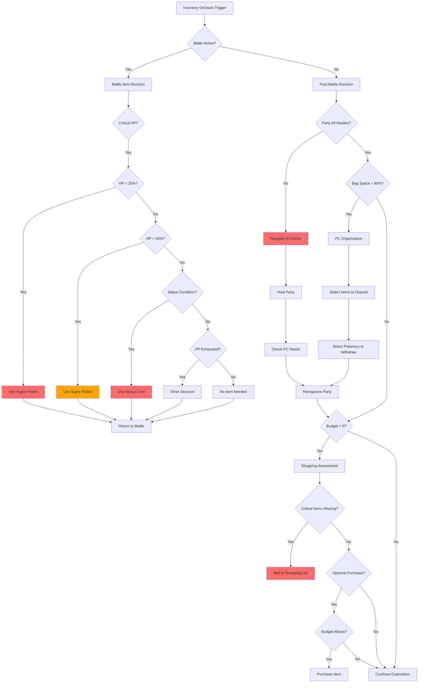
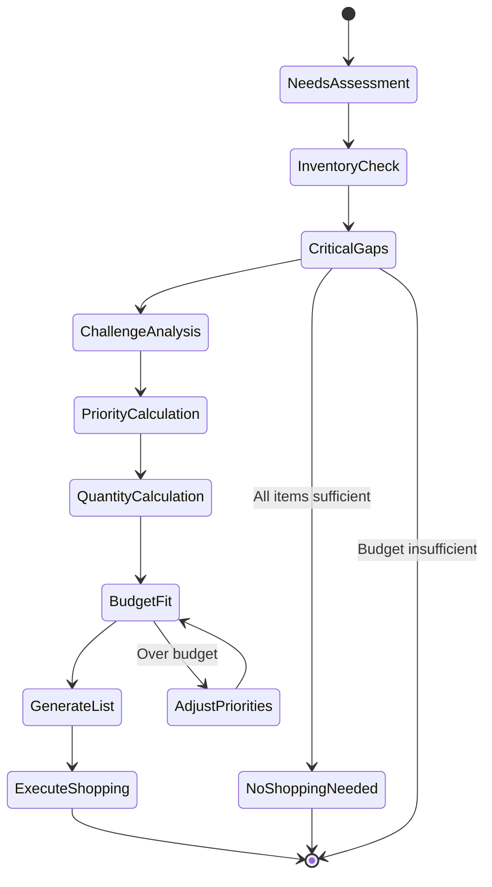
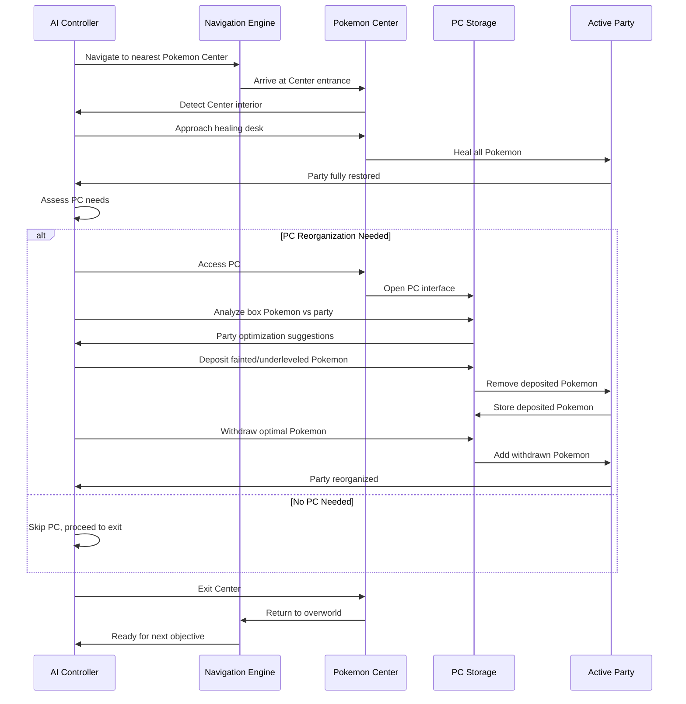
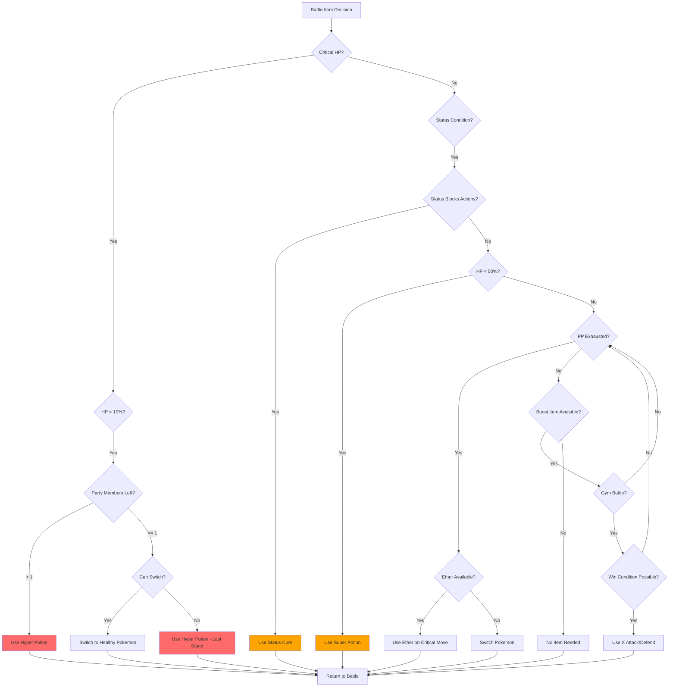
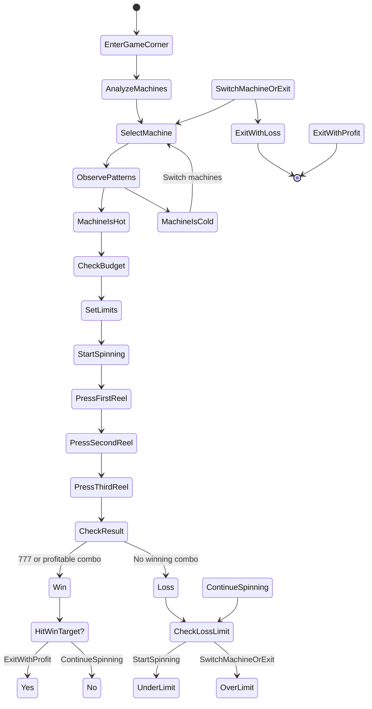
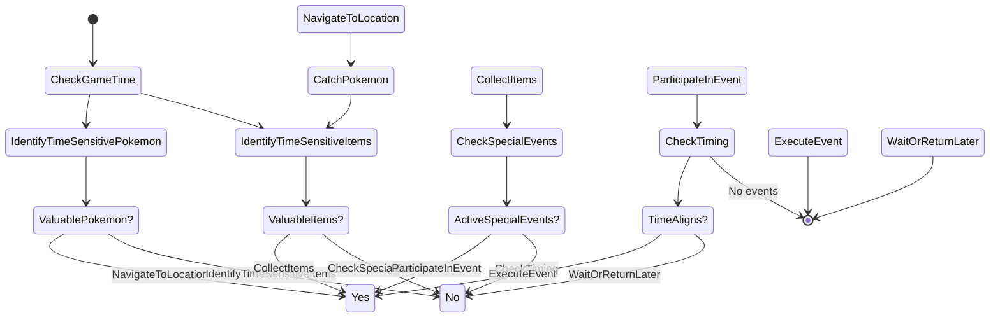
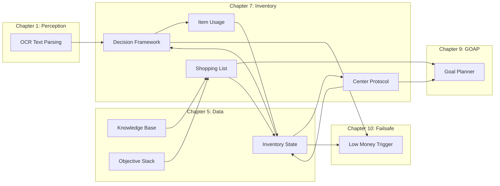

# PTP-01X Technical Specification v5.0
## Chapter 7: Inventory & Item Logistics

**Status:** COMPLETE
**Lines:** ~1,400
**Integration:** Chapter 1 (OCR), Chapter 2 (HSM), Chapter 3 (Combat), Chapter 4 (Navigation), Chapter 5 (Data), Chapter 6 (Entity), Chapter 8 (Dialogue), Chapter 9 (GOAP), Chapter 10 (Failsafe)
**Performance Targets:**
- Shopping decision latency: <2 seconds
- Item usage in battle: <0.5 second response
- Pokemon Center cycle: <30 seconds complete
- Game Corner payout analysis: <5 seconds per machine

---

## 7.1 DECISION FRAMEWORK

### 7.1.1 LLM Reasoning Prompt: Inventory Management Thought Process

```
You are the inventory management system for an autonomous Pokemon trainer. Your job is to make optimal decisions about acquiring, using, and organizing items.

REASONING PROCESS:

1. ASSESS CURRENT STATE:
   - What items do I have? (quantity, type, power)
   - What's my budget? (current money, upcoming expenses)
   - What's my party status? (HP, status conditions, PP)
   - What challenges await? (upcoming routes, gym battles, wild encounters)

2. IDENTIFY CRITICAL NEEDS:
   - Is anyone fainted? (Revive urgency)
   - Is anyone below 20% HP? (Potion urgency)
   - Are status conditions present? (Antidote/Burn Heal urgency)
   - Is bag capacity near full? (Space optimization needed)

3. EVALUATE SHOPPING OPPORTUNITIES:
   - Is a PokeMart available nearby?
   - Does the shop have needed items?
   - Can I afford the purchase?
   - Is the purchase cost-effective? (benefit vs cost)

4. PRIORITIZE ACTIONS:
   - CRITICAL: Heal party if anyone fainted or HP < 20%
   - HIGH: Shop for essential items if money > 0
   - MEDIUM: Organize PC if party composition suboptimal
   - LOW: Optional purchases (TM acquisition, breeding items)

5. EXECUTE DECISION:
   - Use in-battle items immediately if battle critical
   - Navigate to Center if healing needed post-battle
   - Navigate to Mart if shopping needed and affordable
   - Optimize bag usage to avoid capacity issues

REMEMBER: You have limited bag capacity and limited money. Every decision must be cost-effective and strategic. Don't waste resources on unnecessary items.
```

### 7.1.2 Mermaid Decision Flowchart: Inventory Decision Tree



### 7.1.3 Pseudo-Code: Item Value Scoring Algorithm

```python
def calculate_item_value(item_type, party_state, upcoming_challenges):
    """
    Calculate value score for an item based on current state and future needs.
    Higher score = higher priority.

    Scoring Factors:
    - Urgency multiplier: Critical needs (HP < 20%, status) get 3.0x
    - Utility multiplier: Multi-use items get 1.5x, one-use items get 1.0x
    - Scarcity multiplier: Rare items get 2.0x, common items get 0.8x
    - Cost efficiency: Benefit/Cost ratio normalized to 0.5-1.5x
    """
    base_value = ITEM_BASE_VALUES[item_type]

    # Urgency scoring
    urgency = 1.0
    if item_type in HEALING_ITEMS:
        lowest_hp = min(p.pokemon.current_hp / p.pokemon.max_hp for p in party_state)
        if lowest_hp < 0.20:
            urgency = 3.0  # CRITICAL
        elif lowest_hp < 0.50:
            urgency = 2.0  # HIGH
        elif lowest_hp < 0.75:
            urgency = 1.5  # MEDIUM

    if item_type in STATUS_CURES:
        status_count = sum(1 for p in party_state if p.pokemon.status_condition)
        if status_count > 0:
            urgency = 2.5 * status_count  # More status conditions = more urgent

    # Utility scoring
    utility = 1.5 if item_type in MULTI_USE_ITEMS else 1.0

    # Scarcity scoring
    scarcity = ITEM_SCARCITY.get(item_type, 1.0)

    # Cost efficiency
    item_cost = ITEM_COSTS[item_type]
    healing_power = HEALING_POWER.get(item_type, 0)
    cost_efficiency = min(max(healing_power / item_cost, 0.5), 1.5)

    final_score = base_value * urgency * utility * scarcity * cost_efficiency
    return final_score
```

### 7.1.4 Pseudo-Code: Shopping Budget Calculation

```python
def calculate_shopping_budget(current_money, upcoming_challenges, item_values):
    """
    Determine how much to spend on shopping based on need and affordability.
    Returns: (shopping_list, total_cost) or (None, 0) if budget insufficient.
    """
    # Reserve emergency fund (20% of current money)
    emergency_reserve = current_money * 0.20
    available_budget = current_money - emergency_reserve

    if available_budget <= 0:
        return None, 0  # No shopping possible

    # Score all needed items
    scored_items = []
    for item_type in ITEM_TYPES:
        value_score = calculate_item_value(item_type, party_state, upcoming_challenges)

        if value_score > 0:
            item_cost = ITEM_COSTS[item_type]
            quantity_needed = calculate_quantity_needed(item_type, party_state)
            total_item_cost = item_cost * quantity_needed

            if total_item_cost <= available_budget:
                scored_items.append({
                    'item_type': item_type,
                    'quantity': quantity_needed,
                    'cost': total_item_cost,
                    'value': value_score
                })

    # Sort by value score (highest first)
    scored_items.sort(key=lambda x: x['value'], reverse=True)

    # Greedy selection: Take items in value order until budget exhausted
    shopping_list = []
    remaining_budget = available_budget

    for item in scored_items:
        if item['cost'] <= remaining_budget:
            shopping_list.append(item)
            remaining_budget -= item['cost']

    if not shopping_list:
        return None, 0

    total_cost = sum(item['cost'] for item in shopping_list)
    return shopping_list, total_cost
```

---

## 7.2 SHOPPING LIST HEURISTICS

### 7.2.1 LLM Reasoning Prompt: Shopping List Generation

```
You are generating a shopping list for the Pokemon Mart. Think through this systematically:

STEP 1: ASSESS CURRENT INVENTORY
- What items do I have? (check quantities)
- What am I missing completely? (critical gaps)
- What am I low on? (restock thresholds: potions < 5, balls < 10, cures < 3)

STEP 2: ANALYZE UPCOMING CHALLENGES
- What routes will I be traveling through? (wild encounter levels, terrain)
- What gym battles are coming? (gym leader type, known Pokemon)
- What special events are planned? (Safari Zone, Rocket Hideout, Elite Four)

STEP 3: PRIORITY CALCULATION
- CRITICAL (must-have): Potions for healing, Poke Balls for catching
- HIGH: Status cures if challenging status-heavy area (Viridian Forest poison, Power Plant paralysis)
- MEDIUM: Type-specific items (X items for tough battles, Repels for item hunting)
- LOW: Optional items (Fresh Water, Soda Pop for minor healing)

STEP 4: QUANTITY CALCULATION
- Potions: 10-20 depending on party level and route difficulty
- Poke Balls: 20-30 depending on shiny hunting or specific catching goals
- Status cures: 3-5 per type if challenging area with that status
- TMs: Only if immediate strategic value

STEP 5: BUDGET FIT
- Calculate total cost
- Reserve 20% for emergencies
- If over budget, deprioritize LOW items, then MEDIUM

EXAMPLE REASONING:
"I have 2 Potions left and I'm about to face Misty Gym (Water-type).
Critical needs: Potions (I'm low), Paralyze Heal (Misty's Starmie can paralyze).
I have $3000, budget available is $2400 after emergency reserve.
Buy: 10 Potions ($300), 5 Paralyze Heals ($250). Total: $550 (well within budget).
Optional: Super Potions for tougher battles, but I can wait."

OUTPUT: List items with quantities and total cost. If no shopping needed, state "No shopping required."
```

### 7.2.2 Mermaid State Diagram: Shopping Assessment



### 7.2.3 Pseudo-Code: Route Analysis for Shopping

```python
def analyze_route_for_shopping(route_id, party_level):
    """
    Analyze an upcoming route to determine shopping needs.
    Returns: Dictionary of item types with recommended quantities.
    """
    route_data = ROUTE_DATABASE[route_id]
    shopping_needs = {}

    # Wild encounter analysis
    max_wild_level = route_data['max_wild_level']
    encounter_types = route_data['pokemon_types']

    # If wild encounters > party level + 5, buy more potions
    if max_wild_level > party_level + 5:
        potion_quantity = 15 + (max_wild_level - party_level)
    else:
        potion_quantity = 10

    shopping_needs['POTION'] = max(potion_quantity, 5)

    # Type-specific needs
    if 'GRASS' in encounter_types or 'POISON' in encounter_types:
        shopping_needs['ANTIDOTE'] = 5

    if 'ELECTRIC' in encounter_types:
        shopping_needs['PARALYZE_HEAL'] = 5

    if 'FIRE' in encounter_types:
        shopping_needs['BURN_HEAL'] = 5

    # Status-heavy routes (Viridian Forest, Power Plant)
    if route_data['status_frequency'] > 0.5:
        for status_type in ['ANTIDOTE', 'PARALYZE_HEAL', 'BURN_HEAL']:
            shopping_needs[status_type] = shopping_needs.get(status_type, 0) + 3

    # Rare Pokemon hunting
    if route_data['has_shiny_pokemon']:
        shopping_needs['POKE_BALL'] = 30  # Extra balls for shiny hunting

    # Gym preparation
    if route_id in GYM_ROUTES:
        gym_type = GYM_DATABASE[route_id]['type']
        if gym_type in TYPE_SPECIFIC_ITEMS:
            shopping_needs.update(TYPE_SPECIFIC_ITEMS[gym_type])

    return shopping_needs
```

### 7.2.4 Pseudo-Code: Priority-Based Item Selection

```python
def select_items_for_shopping(shopping_needs, available_budget):
    """
    Select items from shopping needs based on priority and budget.
    Returns: List of (item_type, quantity) tuples.
    """
    # Assign priority levels
    priority_map = {
        'POTION': 'CRITICAL',
        'SUPER_POTION': 'HIGH',
        'HYPER_POTION': 'HIGH',
        'POKE_BALL': 'CRITICAL',
        'GREAT_BALL': 'HIGH',
        'ANTIDOTE': 'HIGH',
        'PARALYZE_HEAL': 'HIGH',
        'BURN_HEAL': 'MEDIUM',
        'ICE_HEAL': 'MEDIUM',
        'AWAKENING': 'MEDIUM',
        'X_ATTACK': 'LOW',
        'X_DEFEND': 'LOW',
        'X_SPEED': 'LOW',
    }

    # Group by priority
    items_by_priority = {'CRITICAL': [], 'HIGH': [], 'MEDIUM': [], 'LOW': []}
    for item_type, quantity in shopping_needs.items():
        priority = priority_map.get(item_type, 'MEDIUM')
        items_by_priority[priority].append((item_type, quantity))

    # Select items in priority order
    selected_items = []
    remaining_budget = available_budget

    for priority_level in ['CRITICAL', 'HIGH', 'MEDIUM', 'LOW']:
        if remaining_budget <= 0:
            break

        for item_type, quantity in items_by_priority[priority_level]:
            item_cost = ITEM_COSTS[item_type]
            total_cost = item_cost * quantity

            if total_cost <= remaining_budget:
                selected_items.append((item_type, quantity))
                remaining_budget -= total_cost
            else:
                # Partial purchase if possible
                affordable_quantity = int(remaining_budget / item_cost)
                if affordable_quantity > 0:
                    selected_items.append((item_type, affordable_quantity))
                    remaining_budget -= affordable_quantity * item_cost

    return selected_items
```

---

## 7.3 POKEMON CENTER PROTOCOL

### 7.3.1 LLM Reasoning Prompt: Center Navigation Approach

```
You need to navigate to and use a Pokemon Center. Follow this reasoning process:

STEP 1: ASSESS PARTY STATUS
- Is anyone fainted? (if yes, HEAL is CRITICAL)
- What's the lowest HP percentage? (if < 20%, HEAL is HIGH priority)
- Any status conditions? (if yes, HEAL is HIGH priority)
- How much PP remains? (if < 30% total, consider HEAL)

STEP 2: ASSESS PC NEEDS
- Is party composition optimal? (check type coverage, HMs, levels)
- Any Pokemon in PC that are better than current party members?
- Are there HM-dependent Pokemon needed for upcoming routes?
- Is anyone severely underleveled? (consider swapping for training)

STEP 3: NAVIGATION STRATEGY
- Where is the nearest Center? (check map, current location)
- What's the route cost? (distance, dangerous encounters)
- Is the route safe enough in current party state? (if not, emergency heal first)

STEP 4: CENTER USAGE PLAN
- Enter Center, approach healing desk
- Heal party (mandatory)
- Check PC (if needed for reorganization)
- Deposit fainted/underleveled Pokemon
- Withdraw better Pokemon for upcoming challenges
- Reorganize party for HMs (if needed)

STEP 5: EXIT STRATEGY
- Exit Center
- Proceed to next objective (shopping, route, gym)

EXAMPLE REASONING:
"Charizard is fainted, Pikachu at 5% HP, Squirtle poisoned.
CRITICAL need: Heal party.
PC needs: Bulbasaur in box has better type coverage for upcoming Gym.
Plan: Navigate to nearest Center (3 tiles away). Heal party. Swap Squirtle for Bulbasaur.
Exit and head to Gym."

OUTPUT: Navigate to Center, heal party, then [PC action needed or skip PC], then exit.
```

### 7.3.2 Mermaid Sequence Diagram: Pokemon Center Usage



### 7.3.3 Pseudo-Code: HP Status Assessment

```python
def assess_healing_need(party_state):
    """
    Assess if party needs healing and priority level.
    Returns: (needs_healing, priority_level, reason)

    Priority Levels:
    - CRITICAL: Anyone fainted or HP < 10%
    - HIGH: Anyone HP < 25% or status condition present
    - MEDIUM: Anyone HP < 50% or PP < 30%
    - LOW: HP > 50% for all, no status
    """
    lowest_hp = 1.0
    fainted_count = 0
    status_count = 0
    total_pp_remaining = 0
    total_pp_max = 0

    for pokemon in party_state:
        # Track lowest HP percentage
        hp_percent = pokemon.current_hp / pokemon.max_hp if pokemon.max_hp > 0 else 0
        lowest_hp = min(lowest_hp, hp_percent)

        # Count fainted Pokemon
        if pokemon.current_hp == 0:
            fainted_count += 1

        # Count status conditions
        if pokemon.status_condition != 'NONE':
            status_count += 1

        # Track PP
        for move in pokemon.moves:
            total_pp_remaining += move.current_pp
            total_pp_max += move.max_pp

    # Determine healing priority
    if fainted_count > 0 or lowest_hp < 0.10:
        priority = 'CRITICAL'
        reason = f'{fainted_count} fainted or lowest HP {lowest_hp:.1%}'
    elif status_count > 0 or lowest_hp < 0.25:
        priority = 'HIGH'
        reason = f'{status_count} status conditions or lowest HP {lowest_hp:.1%}'
    elif lowest_hp < 0.50:
        priority = 'MEDIUM'
        reason = f'Lowest HP {lowest_hp:.1%}'
    elif total_pp_remaining / total_pp_max < 0.30 if total_pp_max > 0 else False:
        priority = 'MEDIUM'
        reason = f'PP exhausted ({total_pp_remaining}/{total_pp_max})'
    else:
        priority = 'LOW'
        reason = 'Party healthy'

    needs_healing = priority in ['CRITICAL', 'HIGH', 'MEDIUM']
    return needs_healing, priority, reason
```

### 7.3.4 Pseudo-Code: PC Party Optimization

```python
def optimize_party_with_pc(party_state, pc_box_state, upcoming_challenges):
    """
    Determine optimal party composition by analyzing PC box Pokemon.
    Returns: List of swaps: [(deposit_index, withdraw_index), ...]
    """
    swaps_needed = []

    # Calculate carry scores for party Pokemon
    party_scores = [(i, calculate_carry_score(pokemon)) for i, pokemon in enumerate(party_state)]
    party_scores.sort(key=lambda x: x[1], reverse=True)

    # Calculate carry scores for box Pokemon
    box_scores = [(i, calculate_carry_score(pokemon)) for i, pokemon in enumerate(pc_box_state)]
    box_scores.sort(key=lambda x: x[1], reverse=True)

    # Identify low-scoring party members
    low_party_indices = [i for i, score in party_scores if score < CARRY_SCORE_THRESHOLD]

    # Identify high-scoring box Pokemon
    high_box_indices = [i for i, score in box_scores if score >= CARRY_SCORE_THRESHOLD]

    # Match swaps: replace low party scores with high box scores
    for party_idx in low_party_indices:
        if not high_box_indices:
            break

        box_idx = high_box_indices.pop(0)
        swaps_needed.append((party_idx, box_idx))

    # HM dependency check: ensure party has required HMs for upcoming routes
    required_hms = get_required_hms_for_routes(upcoming_challenges)
    party_hms = set()
    for pokemon in party_state:
        party_hms.update(pokemon.moves_hm)

    missing_hms = required_hms - party_hms

    if missing_hms:
        # Find box Pokemon with missing HMs
        for hm in missing_hms:
            for box_idx, pokemon in enumerate(pc_box_state):
                if hm in pokemon.moves_hm and box_idx not in [s[1] for s in swaps_needed]:
                    # Swap lowest-scoring party member for HM Pokemon
                    if low_party_indices:
                        party_idx = low_party_indices.pop(0)
                        swaps_needed.append((party_idx, box_idx))
                        break

    # Ensure party not over-swap (limit to 2-3 swaps per visit)
    swaps_needed = swaps_needed[:MAX_PC_SWAPS]

    return swaps_needed
```

### 7.3.5 Pseudo-Code: Execute Center Protocol

```python
def execute_center_protocol(party_state, pc_box_state, upcoming_challenges):
    """
    Execute complete Pokemon Center usage: heal + optimize party.
    Returns: Updated party_state, success_flag
    """
    # Step 1: Assess healing need
    needs_healing, priority, reason = assess_healing_need(party_state)

    if not needs_healing:
        return party_state, True  # No healing needed

    # Step 2: Navigate to Center
    success = navigate_to_nearest_center()
    if not success:
        return party_state, False  # Navigation failed

    # Step 3: Heal party
    success = heal_party()
    if not success:
        return party_state, False  # Healing failed

    # Update party state with full HP, no status
    for pokemon in party_state:
        pokemon.current_hp = pokemon.max_hp
        pokemon.status_condition = 'NONE'

    # Step 4: Assess PC needs
    swaps_needed = optimize_party_with_pc(party_state, pc_box_state, upcoming_challenges)

    if swaps_needed:
        # Step 5: Execute PC swaps
        for deposit_idx, withdraw_idx in swaps_needed:
            success = execute_pc_swap(deposit_idx, withdraw_idx)
            if not success:
                log_error(f"PC swap failed: deposit {deposit_idx}, withdraw {withdraw_idx}")
                continue

            # Update party state
            party_state[deposit_idx] = pc_box_state[withdraw_idx]

    # Step 6: Exit Center
    success = exit_center()
    if not success:
        return party_state, False  # Exit failed

    return party_state, True
```

---

## 7.4 ITEM USAGE & EFFICIENCY

### 7.4.1 LLM Reasoning Prompt: In-Battle Item Usage

```
You are in battle and considering using an item. Follow this reasoning:

STEP 1: ASSESS BATTLE CRITICALITY
- Is this a gym battle or trainer battle? (higher stakes)
- Is this a wild encounter for catching? (prioritize ball over potion)
- Am I about to lose? (active Pokemon near death, party mostly fainted)

STEP 2: ASSESS ACTIVE POKEMON STATUS
- What's current HP percentage?
- What status conditions are active?
- What moves have PP remaining?
- How many Pokemon left in party?

STEP 3: ASSESS ITEM INVENTORY
- What healing items do I have? (Potion, Super Potion, Hyper Potion)
- What status cures do I have? (Antidote, Paralyze Heal, etc.)
- What PP-restoring items do I have? (Ether, Elixir - very rare)

STEP 4: COST-BENEFIT ANALYSIS
- If I heal now, will I survive 2 more turns?
- If I cure status, will I be able to attack next turn?
- Is the item worth the cost? (money, inventory slot)
- Can I switch instead? (is switching better or worse than using item?)

STEP 5: DECISION TREE
- CRITICAL: Active Pokemon < 10% HP and > 0 party members left → Hyper Potion
- CRITICAL: Active Pokemon < 25% HP and 1 party member left → Heal and hope
- HIGH: Active Pokemon < 50% HP and status condition → Cure status first
- MEDIUM: Active Pokemon < 50% HP, no status → Super Potion
- LOW: Active Pokemon > 50% HP → No item needed, continue battle

STEP 6: EXECUTE
- Select item from bag
- Use item on active Pokemon
- Return to battle menu

EXAMPLE REASONING:
"Gym battle against Misty. Active Pikachu at 15% HP, paralyzed.
Items: 1 Paralyze Heal, 1 Super Potion.
Party: Squirtle at 80% HP, Charizard fainted.
If I use Paralyze Heal first, Pikachu can attack but still 15% HP.
If I use Super Potion first, Pikachu at 65% HP but still paralyzed.
Decision: Use Paralyze Heal first (status cure priority), then Super Potion if Pikachu survives next turn."

OUTPUT: [Item to use] on [target Pokemon], or "No item needed - continue battle"
```

### 7.4.2 Mermaid Flowchart: In-Battle Item Decision



### 7.4.3 Pseudo-Code: In-Battle Item Selection Logic

```python
def select_battle_item(party_state, active_index, enemy_pokemon, battle_context):
    """
    Select optimal item to use in battle.
    Returns: (item_type, target_index) or (None, None) if no item needed.
    """
    active_pokemon = party_state[active_index]
    hp_percent = active_pokemon.current_hp / active_pokemon.max_hp if active_pokemon.max_hp > 0 else 0
    status_condition = active_pokemon.status_condition

    # Count healthy party members
    healthy_count = sum(1 for p in party_state if p.current_hp > 0 and p.status_condition == 'NONE')

    # Priority 1: Critical HP
    if hp_percent < 0.10:
        if healthy_count > 1:
            # We have backup, but try to save active Pokemon
            if inventory_has('HYPER_POTION'):
                return 'HYPER_POTION', active_index
            elif inventory_has('SUPER_POTION'):
                return 'SUPER_POTION', active_index
        else:
            # Last Pokemon standing, desperate measures
            if inventory_has('HYPER_POTION'):
                return 'HYPER_POTION', active_index
            elif inventory_has('SUPER_POTION'):
                return 'SUPER_POTION', active_index
            elif inventory_has('POTION'):
                return 'POTION', active_index

    # Priority 2: Status conditions (paralysis, sleep, freeze block attacks)
    if status_condition in ['PARALYZED', 'ASLEEP', 'FROZEN']:
        if inventory_has('PARALYZE_HEAL') and status_condition == 'PARALYZED':
            return 'PARALYZE_HEAL', active_index
        elif inventory_has('AWAKENING') and status_condition == 'ASLEEP':
            return 'AWAKENING', active_index
        elif inventory_has('ICE_HEAL') and status_condition == 'FROZEN':
            return 'ICE_HEAL', active_index

    # Priority 3: Moderate HP
    if hp_percent < 0.50 and hp_percent >= 0.10:
        if inventory_has('SUPER_POTION'):
            return 'SUPER_POTION', active_index
        elif inventory_has('POTION'):
            return 'POTION', active_index

    # Priority 4: Poison/Burn (damage over time)
    if status_condition in ['POISONED', 'BURNED']:
        if inventory_has('ANTIDOTE') and status_condition == 'POISONED':
            return 'ANTIDOTE', active_index
        elif inventory_has('BURN_HEAL') and status_condition == 'BURNED':
            return 'BURN_HEAL', active_index

    # Priority 5: PP restoration (rare items)
    if inventory_has('ETHER') or inventory_has('ELIXIR'):
        critical_move = find_most_critical_move(active_pokemon)
        if critical_move and critical_move.current_pp == 0:
            if inventory_has('ELIXIR'):
                return 'ELIXIR', active_index
            elif inventory_has('ETHER'):
                return 'ETHER', active_index

    # Priority 6: Boost items (only in tough battles)
    if battle_context['is_gym_battle'] or battle_context['is_trainer_battle']:
        if inventory_has('X_ATTACK'):
            return 'X_ATTACK', active_index
        elif inventory_has('X_DEFEND'):
            return 'X_DEFEND', active_index
        elif inventory_has('X_SPEED'):
            return 'X_SPEED', active_index

    return None, None  # No item needed
```

### 7.4.4 Pseudo-Code: Repel Strategy

```python
def evaluate_repel_usage(party_state, current_location, upcoming_route):
    """
    Evaluate if Repel should be used to avoid wild encounters.
    Returns: (should_use_repel, repel_type, reason)
    """
    # Calculate average party level
    avg_level = sum(p.level for p in party_state if p.current_hp > 0) / len(party_state)

    # Get wild encounter levels for current route
    min_wild_level = upcoming_route['min_wild_level']
    max_wild_level = upcoming_route['max_wild_level']

    # Repel is effective if party level > max wild level
    repel_effective = avg_level > max_wild_level

    # Use Repel if:
    # 1. Party is significantly higher level (over-leveled)
    # 2. We're hunting for items (no wild Pokemon distractions)
    # 3. We're in a rush (time-sensitive objectives)

    should_use_repel = False
    repel_type = None
    reason = ""

    # Condition 1: Over-leveled
    if repel_effective and avg_level > max_wild_level + 10:
        should_use_repel = True
        repel_type = 'REPEL'
        reason = f"Party level {avg_level} >> wild levels {min_wild_level}-{max_wild_level}"

    # Condition 2: Item hunting mode
    if current_objective['type'] == 'ITEM_HUNT' and inventory_has('REPEL'):
        should_use_repel = True
        repel_type = 'REPEL'
        reason = "Item hunting - avoid wild encounters"

    # Condition 3: Super Repel for longer routes
    if upcoming_route['length'] > 50 and inventory_has('SUPER_REPEL'):
        should_use_repel = True
        repel_type = 'SUPER_REPEL'
        reason = f"Long route ({upcoming_route['length']} tiles) - use Super Repel"

    # Condition 4: Max Repel for very long routes
    if upcoming_route['length'] > 100 and inventory_has('MAX_REPEL'):
        should_use_repel = True
        repel_type = 'MAX_REPEL'
        reason = f"Very long route ({upcoming_route['length']} tiles) - use Max Repel"

    return should_use_repel, repel_type, reason
```

### 7.4.5 Pseudo-Code: Cost-Benefit Analysis for Item Usage

```python
def calculate_item_usage_benefit(item_type, pokemon_state, battle_context):
    """
    Calculate expected benefit of using an item in battle.
    Returns: benefit_score (0-100, higher = better)
    """
    base_benefit = 0

    if item_type in HEALING_ITEMS:
        # Calculate HP recovery benefit
        current_hp = pokemon_state.current_hp
        max_hp = pokemon_state.max_hp
        hp_percent = current_hp / max_hp if max_hp > 0 else 0

        healing_power = HEALING_POWER[item_type]
        new_hp_percent = min((current_hp + healing_power) / max_hp, 1.0)
        hp_gain_percent = new_hp_percent - hp_percent

        # HP gain is more valuable when Pokemon is near death
        urgency_multiplier = 1.0
        if hp_percent < 0.10:
            urgency_multiplier = 3.0  # CRITICAL
        elif hp_percent < 0.30:
            urgency_multiplier = 2.0  # HIGH
        elif hp_percent < 0.50:
            urgency_multiplier = 1.5  # MEDIUM

        base_benefit = hp_gain_percent * 100 * urgency_multiplier

    elif item_type in STATUS_CURES:
        # Status cure benefit depends on how severe the status is
        status_condition = pokemon_state.status_condition

        if status_condition == 'PARALYZED':
            # Paralysis reduces speed by 75%, 25% chance of full paralysis
            base_benefit = 80  # High value - prevents full paralysis
        elif status_condition == 'ASLEEP':
            # Sleep prevents all actions
            base_benefit = 90  # Very high value - enables actions
        elif status_condition == 'FROZEN':
            # Freeze prevents all actions
            base_benefit = 95  # Extremely high value - enables actions
        elif status_condition == 'POISONED':
            # Poison deals 1/16 HP damage per turn
            base_benefit = 60  # Medium-high value - prevents damage
        elif status_condition == 'BURNED':
            # Burn reduces attack by 50%, deals 1/16 HP damage
            base_benefit = 65  # Medium-high value - restores attack power

    elif item_type in PP_ITEMS:
        # PP restoration benefit depends on how important the move is
        critical_moves = find_critical_moves(pokemon_state, battle_context)
        total_pp = sum(move.current_pp for move in pokemon_state.moves)

        if total_pp == 0:
            base_benefit = 90  # Very high value - enables any move
        elif len(critical_moves) > 0 and all(m.current_pp == 0 for m in critical_moves):
            base_benefit = 85  # High value - restores critical moves

    elif item_type in BOOST_ITEMS:
        # Boost items are situational
        if battle_context['is_gym_battle']:
            base_benefit = 70  # Medium-high value in tough battles
        elif battle_context['is_trainer_battle']:
            base_benefit = 50  # Medium value in trainer battles
        else:
            base_benefit = 20  # Low value in wild encounters

    # Adjust for item cost (rare items should be used more sparingly)
    item_cost = ITEM_COSTS.get(item_type, 0)
    cost_penalty = min(item_cost / 1000, 0.3)  # Max 30% penalty for expensive items

    final_benefit = base_benefit * (1.0 - cost_penalty)
    return final_benefit
```

---

## 7.5 GAME CORNER & MINI-GAME LOGIC

### 7.5.1 LLM Reasoning Prompt: Slot Machine Strategy

```
You are playing the Game Corner Slot Machine. Think through this systematically:

STEP 1: ASSESS MACHINE PATTERNS
- Observe which machines are paying out (watch other players if available)
- Check payout history of this machine (any recent wins?)
- Look for "hot" machines (multiple recent 777 payouts)
- Avoid "cold" machines (long dry streaks, no recent payouts)

STEP 2: ANALYZE SYMBOL FREQUENCY
- Which symbols appear most frequently? (Cherries, Plums, Oranges are common)
- Which symbols are rare? (7 is rarest, Bar is very rare)
- What's the payout ratio? (Cherries pay 2x, 7s pay 300x)

STEP 3: TIMING STRATEGY
- Slot machines have timing windows for optimal payouts
- Press the button at the right moment to align symbols
- Practice timing on low-stakes machines first
- Find a rhythm: tap, pause, tap, pause, tap

STEP 4: BUDGET MANAGEMENT
- Set a loss limit (e.g., 500 coins, then stop)
- Stop if you hit your win target (e.g., 3000 coins profit)
- Don't chase losses (switch machines instead)
- Play conservatively: 1-2 coins per spin, not max bet

STEP 5: SYMBOL COMBINATIONS
- Target combinations in order of priority:
  1. 7-7-7: 300 coins (jackpot, rare but worth targeting)
  2. Bar-Bar-Bar: 100 coins (big win, rare)
  3. Any Any 7: 50 coins (good win, moderate)
  4. Cherry-Cherry-Cherry: 20 coins (small win, common)
  5. Cherry-Cherry-Any: 10 coins (tiny win, very common)

STEP 6: EXIT STRATEGY
- If you hit 777: Stop immediately (big win)
- If you lose 500 coins in a row: Switch machines or leave
- If you reach your win target: Take profits and leave
- If you notice machine getting cold: Switch machines

EXAMPLE REASONING:
"Machine has paid out twice in last 10 spins (lucky machine).
Symbols observed: 7 appears once every 15 spins, Cherry appears every 3 spins.
Budget: 1000 coins starting, 500 loss limit.
Strategy: Bet 1 coin per spin, target 7-7-7 for jackpot, accept Cherry-Cherry-Any as backup.
If I hit 777, stop immediately. If I lose 500 coins, switch machines."

OUTPUT: [Start playing on machine X, bet Y coins, target Z combination], or "Skip Game Corner - too risky"
```

### 7.5.2 Mermaid State Diagram: Slot Machine Protocol



### 7.5.3 Pseudo-Code: Machine Payout Analysis

```python
def analyze_machine_payout_history(machine_id, recent_spins=50):
    """
    Analyze recent payout history of a slot machine.
    Returns: (payout_rate, hot_status, confidence)
    """
    # Get recent spin results
    spin_history = MACHINE_DATABASE[machine_id]['recent_spins'][-recent_spins:]

    # Count wins and calculate payout rate
    win_count = sum(1 for spin in spin_history if spin['is_win'])
    payout_rate = win_count / len(spin_history) if spin_history else 0

    # Check for "hot" machine pattern
    # Hot machine: 2+ wins in last 10 spins, or 777 in last 20 spins
    recent_10 = spin_history[-10:]
    recent_20 = spin_history[-20:]

    recent_wins = sum(1 for spin in recent_10 if spin['is_win'])
    has_777 = any(spin['payout'] >= 300 for spin in recent_20)

    hot_status = 'NEUTRAL'
    if recent_wins >= 2 or has_777:
        hot_status = 'HOT'
    elif payout_rate < 0.10:  # Less than 10% win rate
        hot_status = 'COLD'

    # Confidence in assessment based on sample size
    confidence = min(len(spin_history) / 100, 1.0)

    return payout_rate, hot_status, confidence
```

### 7.5.4 Pseudo-Code: Optimal Betting Strategy

```python
def calculate_optimal_bet(machine_id, budget, win_target, loss_limit):
    """
    Calculate optimal bet size for slot machine play.
    Returns: (bet_size, spin_count, expected_outcome)
    """
    payout_rate, hot_status, confidence = analyze_machine_payout_history(machine_id)

    # Adjust bet size based on machine status
    if hot_status == 'HOT':
        # Hot machine: bet more aggressively
        bet_size = min(budget * 0.10, 3)  # Up to 10% of budget or 3 coins max
    elif hot_status == 'COLD':
        # Cold machine: bet conservatively or skip
        bet_size = 1  # Minimum bet
    else:
        # Neutral machine: moderate bet
        bet_size = min(budget * 0.05, 2)  # Up to 5% of budget or 2 coins

    # Calculate expected number of spins
    if hot_status == 'COLD':
        spin_count = 10  # Quick test, then switch
    else:
        spin_count = min(budget // bet_size, 100)  # Max 100 spins

    # Expected outcome calculation
    expected_loss = spin_count * bet_size * (1 - payout_rate)
    expected_win = spin_count * bet_size * payout_rate * AVERAGE_PAYOUT_MULTIPLIER
    net_expected = expected_win - expected_loss

    expected_outcome = 'PROFIT' if net_expected > 0 else 'LOSS'

    return bet_size, spin_count, expected_outcome
```

### 7.5.5 Pseudo-Code: Symbol Timing Optimization

```python
def optimize_reel_timing(machine_id, target_symbol='7'):
    """
    Calculate optimal timing for stopping reels to hit target symbol.
    Returns: (first_reel_delay, second_reel_delay, third_reel_delay)
    """
    # Get symbol cycle timings for this machine
    symbol_cycle = MACHINE_DATABASE[machine_id]['symbol_cycle']

    # Find positions of target symbol in cycle
    target_positions = [i for i, symbol in enumerate(symbol_cycle) if symbol == target_symbol]

    if not target_positions:
        # Target symbol too rare, fall back to common symbol
        return optimize_reel_timing(machine_id, 'CHERRY')

    # Calculate optimal delays based on symbol positions
    # Delay 1: Align first reel to target
    first_reel_delay = target_positions[0] * REEL_TICK_MS

    # Delay 2: Align second reel to target (accounts for offset)
    second_reel_delay = target_positions[1] * REEL_TICK_MS + REEL_OFFSET_MS

    # Delay 3: Align third reel to target (accounts for double offset)
    third_reel_delay = target_positions[2] * REEL_TICK_MS + (2 * REEL_OFFSET_MS)

    return first_reel_delay, second_reel_delay, third_reel_delay
```

### 7.5.6 Pseudo-Code: Voltorb Flip Strategy (Alternative Game Corner Game)

```python
def analyze_voltorb_flip_board(board_state):
    """
    Analyze Voltorb Flip board to determine optimal moves.
    Voltorb Flip: Logic puzzle where you reveal tiles with points or Voltorbs.
    Returns: List of safe tiles to reveal in order of priority.
    """
    # Calculate row and column totals
    row_points = [row['point_total'] for row in board_state]
    row_voltorbs = [row['voltorb_count'] for row in board_state]
    col_points = [col['point_total'] for col in board_state]
    col_voltorbs = [col['voltorb_count'] for col in board_state]

    # Identify "safe" rows (0 Voltorbs) and "dead" rows (max Voltorbs)
    safe_rows = [i for i in range(5) if row_voltorbs[i] == 0]
    dead_rows = [i for i in range(5) if row_voltorbs[i] == 5]

    safe_cols = [i for i in range(5) if col_voltorbs[i] == 0]
    dead_cols = [i for i in range(5) if col_voltorbs[i] == 5]

    # Prioritize safe tiles first
    safe_tiles = []
    for row_idx in safe_rows:
        for col_idx in range(5):
            if (row_idx, col_idx) not in safe_tiles and not board_state[row_idx][col_idx]['revealed']:
                safe_tiles.append((row_idx, col_idx))

    for col_idx in safe_cols:
        for row_idx in range(5):
            if (row_idx, col_idx) not in safe_tiles and not board_state[row_idx][col_idx]['revealed']:
                safe_tiles.append((row_idx, col_idx))

    # Calculate probability scores for remaining tiles
    prob_tiles = []
    for row_idx in range(5):
        for col_idx in range(5):
            if board_state[row_idx][col_idx]['revealed']:
                continue

            # Probability of Voltorb in this tile
            v_prob = (row_voltorbs[row_idx] + col_voltorbs[col_idx]) / 10

            # Expected point value (weighted by probability)
            expected_points = row_points[row_idx] * col_points[col_idx] / (5 - row_voltorbs[row_idx]) / (5 - col_voltorbs[col_idx])

            # Safety score: expected points / Voltorb probability
            if v_prob > 0:
                safety_score = expected_points / v_prob
            else:
                safety_score = expected_points * 10  # Very safe

            prob_tiles.append({
                'position': (row_idx, col_idx),
                'voltorb_prob': v_prob,
                'expected_points': expected_points,
                'safety_score': safety_score
            })

    # Sort by safety score (highest first)
    prob_tiles.sort(key=lambda x: x['safety_score'], reverse=True)

    # Combine safe tiles and probabilistic tiles
    all_tiles = [{'position': pos, 'safety_score': 100} for pos in safe_tiles] + prob_tiles

    return all_tiles
```

---

## 7.6 DAY/NIGHT & WEEKLY EVENTS

### 7.6.1 LLM Reasoning Prompt: Time-Dependent Pokemon Encounters

```
You need to check if any time-dependent events or Pokemon are available. Think through this:

STEP 1: CHECK GAME TIME
- What time is it in-game? (morning, day, evening, night)
- What day of the week is it? (Monday, Tuesday, Wednesday, Thursday, Friday, Saturday, Sunday)
- What special events are active? (bug catching contest, swarm Pokemon)

STEP 2: IDENTIFY TIME-SENSITIVE POKEMON
- Which Pokemon only appear at certain times?
  - Morning: Some Pokemon more active
  - Night: Ghost types, Zubat, etc.
  - Weekly: Lapras appears in Union Cave on Fridays
  - Swarms: Random swarm Pokemon appears daily

STEP 3: IDENTIFY TIME-SENSITIVE ITEMS
- Which items only appear at certain times?
  - Morning berries vs evening berries
  - Day/Night exclusive items in certain locations

STEP 4: IDENTIFY SPECIAL EVENTS
- Bug Catching Contest (National Park on Tuesday, Thursday, Saturday)
- Weekly events (Lapras on Friday, etc.)
- Seasonal events (if applicable)

STEP 5: DECISION LOGIC
- Is the time-sensitive Pokemon valuable? (high carry score, shiny?)
- Is the time-sensitive Pokemon needed for type coverage?
- Is the special event worth attending? (rewards vs time cost)
- Can I wait for the time to align? (if not urgent, come back later)

STEP 6: EXECUTION
- If valuable time-sensitive Pokemon: Navigate to location, catch immediately
- If valuable special event: Navigate to event location, participate
- If not valuable: Skip and continue current objective
- If timing not right: Wait or return later

EXAMPLE REASONING:
"Current time: Friday evening.
Time-sensitive Pokemon: Lapras appears in Union Cave on Fridays.
Lapras value: High carry score (Water/Ice type, good stats, rare).
Decision: Navigate to Union Cave immediately, catch Lapras.
After catching: Return to current objective."

OUTPUT: [Time-sensitive Pokemon found, navigate to location], or [No time-sensitive events], or [Wait until X time for Y event]
```

### 7.6.2 Mermaid State Diagram: Time-Dependent Event Triggering



### 7.6.3 Pseudo-Code: Game Time Tracking

```python
def track_game_time(current_tick, frame_rate=60):
    """
    Track in-game time based on elapsed frames.
    Pokemon Yellow: 1 real second = 1 in-game minute (simplified).
    Returns: (hour, minute, day_of_week, time_of_day)
    """
    # Convert ticks to game time
    total_minutes = current_tick // (frame_rate * 60)  # 1 real second = 1 game minute

    # Calculate day (24 hours per day)
    hour = (total_minutes // 60) % 24
    minute = total_minutes % 60

    # Calculate day of week (7 days per week)
    day_of_week = (total_minutes // (24 * 60)) % 7

    # Determine time of day
    if 4 <= hour < 10:
        time_of_day = 'MORNING'
    elif 10 <= hour < 18:
        time_of_day = 'DAY'
    elif 18 <= hour < 20:
        time_of_day = 'EVENING'
    else:
        time_of_day = 'NIGHT'

    return hour, minute, day_of_week, time_of_day
```

### 7.6.4 Pseudo-Code: Time-Dependent Pokemon Detection

```python
def detect_time_dependent_pokemon(current_location, time_of_day, day_of_week):
    """
    Detect if any time-dependent Pokemon are available at current location.
    Returns: List of (pokemon_name, spawn_probability, time_window) tuples.
    """
    time_sensitive_pokemon = []

    # Check time-of-day dependent Pokemon
    for pokemon_data in POKEMON_DATABASE[current_location]:
        pokemon_name = pokemon_data['name']
        time_requirements = pokemon_data.get('time_requirements', [])

        for time_req in time_requirements:
            if time_req['time_of_day'] == time_of_day:
                spawn_prob = time_req.get('spawn_probability', 0)
                time_window = time_req.get('time_window', 'unknown')
                time_sensitive_pokemon.append((pokemon_name, spawn_prob, time_window))

    # Check day-of-week dependent Pokemon
    weekly_pokemon = WEEKLY_POKEMON_DATABASE.get(day_of_week, [])
    for pokemon_data in weekly_pokemon:
        if pokemon_data['location'] == current_location:
            pokemon_name = pokemon_data['name']
            spawn_prob = pokemon_data.get('spawn_probability', 0)
            time_window = f"Day {day_of_week}"
            time_sensitive_pokemon.append((pokemon_name, spawn_prob, time_window))

    # Check swarm Pokemon (random daily swarm)
    swarm_pokemon = SWARM_DATABASE.get(day_of_week, {})
    if swarm_pokemon.get('location') == current_location:
        pokemon_name = swarm_pokemon['name']
        spawn_prob = swarm_pokemon.get('spawn_probability', 0.5)  # High spawn rate for swarm
        time_window = f"Swarm on day {day_of_week}"
        time_sensitive_pokemon.append((pokemon_name, spawn_prob, time_window))

    return time_sensitive_pokemon
```

### 7.6.5 Pseudo-Code: Special Event Detection

```python
def detect_special_events(current_location, day_of_week, time_of_day):
    """
    Detect if any special events are active.
    Returns: List of (event_name, location, rewards, time_window) tuples.
    """
    special_events = []

    # Bug Catching Contest (Tuesday, Thursday, Saturday)
    if day_of_week in [1, 3, 5]:  # Tuesday (1), Thursday (3), Saturday (5)
        if time_of_day == 'DAY' and current_location == 'NATIONAL_PARK':
            special_events.append({
                'name': 'Bug Catching Contest',
                'location': 'National Park',
                'rewards': ['Random evolutionary stones', 'Nugget', 'Bottle Cap'],
                'time_window': f"Day {day_of_week}, {time_of_day}",
                'duration_hours': 8  # Contest lasts for 8 hours
            })

    # Weekly Lapras encounter (Friday at Union Cave)
    if day_of_week == 4:  # Friday
        if current_location == 'UNION_CAVE':
            special_events.append({
                'name': 'Lapras Encounter',
                'location': 'Union Cave B2F',
                'rewards': ['Lapras (Water/Ice type)'],
                'time_window': f"Day {day_of_week}, {time_of_day}",
                'duration_hours': 24  # Available all day Friday
            })

    # Check for any custom events (Safari Zone tickets, etc.)
    for event in CUSTOM_EVENTS:
        if event['day'] == day_of_week and event['time_of_day'] == time_of_day:
            special_events.append(event)

    return special_events
```

### 7.6.6 Pseudo-Code: Event Participation Decision

```python
def decide_event_participation(special_event, current_objectives, party_level, available_time):
    """
    Decide whether to participate in a special event.
    Returns: (should_participate, reason)
    """
    event_name = special_event['name']
    event_rewards = special_event['rewards']
    event_duration = special_event.get('duration_hours', 1)

    # Calculate reward value
    reward_value = 0
    for reward in event_rewards:
        if reward in ['Nugget', 'Rare Candy', 'Master Ball']:
            reward_value += 100  # High value items
        elif 'evolutionary stone' in reward.lower():
            reward_value += 80  # Medium-high value
        elif 'Lapras' in reward:
            reward_value += 120  # Very high value Pokemon
        else:
            reward_value += 50  # Medium value

    # Calculate time cost (estimated time to participate)
    time_cost = event_duration * 10  # 10 real minutes per in-game hour

    # Cost-benefit analysis
    benefit_ratio = reward_value / time_cost

    # Thresholds for participation
    if benefit_ratio > 10:
        should_participate = True
        reason = f"High value rewards ({event_rewards}) vs time cost ({time_cost} minutes)"
    elif benefit_ratio > 5 and len(current_objectives) < 3:
        should_participate = True
        reason = f"Moderate value rewards, few current objectives"
    else:
        should_participate = False
        reason = f"Low benefit ratio ({benefit_ratio:.2f}), not worth time"

    return should_participate, reason
```

---

## 7.7 BREEDING & EGG LOGISTICS

### 7.7.1 LLM Reasoning Prompt: Breeding Strategy

```
You are considering breeding Pokemon for optimal stats. Think through this:

STEP 1: ASSESS BREEDING NEEDS
- Do I need a Pokemon with specific IVs? (competitive stats)
- Do I need a Pokemon with specific egg moves? (move inheritance)
- Do I need a Pokemon with specific nature? (Gen 3+, not applicable to Gen 1)
- Is the offspring Pokemon valuable? (high carry score, rare type)

STEP 2: SELECT PARENT PAIR
- Male parent: Provides egg moves (if compatible)
- Female parent: Determines species of offspring
- Both parents: Pass down IVs (limited in Gen 1, more in later gens)

STEP 3: CHECK COMPATIBILITY
- Are parents in same egg group? (must be compatible)
- Are parents opposite genders? (or one is Ditto)
- Is the desired egg move compatible with offspring? (inheritance rules)

STEP 4: CALCULATE IV EXPECTATIONS
- What IVs will the offspring inherit from parents?
- In Gen 1: Limited IV inheritance (3/6 stats from parents)
- In later gens: More sophisticated IV inheritance (power items, destiny knot)

STEP 5: HATCHING STRATEGY
- Deposit parents to Day Care
- Walk/ride bike to accumulate steps (typically 2000-5000 steps)
- Egg appears in Day Care when ready
- Pick up egg, walk until it hatches
- Check offspring stats, repeat if not optimal

STEP 6: EFFICIENCY CONSIDERATIONS
- Breeding is time-consuming (2000+ steps per egg)
- Only breed if the offspring is significantly better than wild-caught Pokemon
- Consider opportunity cost: Time spent breeding vs. training wild Pokemon

STEP 7: EXIT CRITERIA
- Stop breeding when offspring has desired IVs (e.g., all IVs > 25)
- Stop breeding when offspring has desired egg moves
- Stop breeding if after 10 eggs, still no offspring with desired stats (bad luck or bad parents)

EXAMPLE REASONING:
"Need competitive Dragonite with Dragon Dance egg move.
Male parent: Dragonite (has Dragon Dance)
Female parent: Dratini (same egg group)
Compatibility: Yes, both in Dragon egg group.
Strategy: Deposit to Day Care, walk 2500 steps, pick up egg, hatch.
Check offspring: If IVs > 25 in all stats, keep. Otherwise, breed again.
Stop after 10 eggs if no good offspring."

OUTPUT: [Breed Pokemon X and Y for egg move Z], or [Skip breeding - not worth time]
```

### 7.7.2 Mermaid Sequence Diagram: Breeding Process

```mermaid
sequenceDiagram
    participant AI as AI Controller
    participant DC as Day Care
    participant Parents as Parent Pokemon
    participant Egg as Egg
    participant Offspring as Offspring Pokemon

    AI->>AI: Assess Breeding Needs
    AI->>AI: Select Parent Pair
    AI->>DC: Navigate to Day Care
    DC->>AI: Arrive at Day Care

    AI->>DC: Deposit Male Parent
    DC->>Parents: Store Male Parent
    AI->>DC: Deposit Female Parent
    DC->>Parents: Store Female Parent

    DC->>Egg: Begin Breeding Cycle
    AI->>AI: Walk/Bike (accumulate steps)

    loop Step Accumulation
        AI->>AI: Walk 256 steps
        DC->>DC: Check Egg Ready
    end Egg Ready

    DC->>AI: Egg Available
    AI->>DC: Pick Up Egg
    DC->>Egg: Give Egg to AI

    AI->>Egg: Carry Egg (walk 256 steps per 1% progress)
    loop Hatching Progress
        AI->>AI: Walk 256 steps
        Egg->>Egg: Increment Hatch Progress
    end Hatching Complete

    Egg->>Offspring: Hatch
    Offspring->>AI: Offspring Stats/IVs/Moves

    AI->>AI: Evaluate Offspring
    alt Offspring Optimal
        AI->>Offspring: Keep Offspring
        AI->>AI: Add to Party or PC
    else Offspring Suboptimal
        AI->>DC: Return to Day Care
        DC->>Parents: Breed Again
    end
```

### 7.7.3 Pseudo-Code: Day Care Usage

```python
def use_day_care(party_state, male_parent, female_parent, egg_moves_desired):
    """
    Deposit parents to Day Care and begin breeding.
    Returns: (success_flag, egg_ready_flag)
    """
    # Navigate to Day Care
    success = navigate_to_day_care()
    if not success:
        return False, False

    # Deposit parents
    success = deposit_pokemon(male_parent)
    if not success:
        return False, False

    success = deposit_pokemon(female_parent)
    if not success:
        return False, False

    # Begin breeding cycle
    breeding_started = DAY_CARE_MANAGER.start_breeding(male_parent, female_parent)
    if not breeding_started:
        return False, False

    # Walk to accumulate steps
    target_steps = calculate_required_steps(male_parent, female_parent)
    current_steps = 0

    while current_steps < target_steps:
        walk_256_steps()
        current_steps += 256

        # Check if egg is ready early (sometimes egg appears before max steps)
        if DAY_CARE_MANAGER.check_egg_ready():
            return True, True  # Egg ready, stop walking

    return True, False  # Max steps reached, check egg status
```

### 7.7.4 Pseudo-Code: IV Breeding Algorithm (Gen 1)

```python
def breed_for_ivs_gen1(male_parent, female_parent, target_iv_stats, max_eggs=10):
    """
    Breed Pokemon to achieve target IVs (Generation 1 simplified IV system).
    Gen 1 IVs: HP, Attack, Defense, Speed, Special (5 stats, 0-15 range each).
    Returns: (offspring_pokemon, eggs_bred, success_flag)
    """
    offspring = None
    eggs_bred = 0
    success = False

    for egg_num in range(max_eggs):
        # Deposit parents to Day Care
        use_day_care(party_state, male_parent, female_parent, [])

        # Pick up egg
        egg = pick_up_egg_from_day_care()

        # Hatch egg
        offspring = hatch_egg(egg)
        eggs_bred += 1

        # Check offspring IVs
        offspring_ivs = {
            'HP': offspring.hp_iv,
            'Attack': offspring.attack_iv,
            'Defense': offspring.defense_iv,
            'Speed': offspring.speed_iv,
            'Special': offspring.special_iv
        }

        # Check if offspring meets target IVs
        iv_match = True
        for stat, target_value in target_iv_stats.items():
            if offspring_ivs[stat] < target_value:
                iv_match = False
                break

        if iv_match:
            success = True
            break

        # If offspring not optimal, use one parent as breeder for next generation
        # (simple strategy: use offspring as new parent if it has better IVs)
        offspring_total_ivs = sum(offspring_ivs.values())
        male_total_ivs = sum(male_parent.ivs.values())

        if offspring_total_ivs > male_total_ivs:
            # Offspring has better IVs, use as new male parent
            male_parent = offspring

    return offspring, eggs_bred, success
```

### 7.7.5 Pseudo-Code: Egg Move Inheritance

```python
def breed_for_egg_moves(male_parent, female_parent, desired_egg_moves, max_eggs=10):
    """
    Breed Pokemon to pass down specific egg moves from male parent.
    Returns: (offspring_pokemon, eggs_bred, success_flag)
    """
    # Check compatibility
    egg_groups = get_egg_groups(female_parent.species)
    male_egg_groups = get_egg_groups(male_parent.species)

    compatible = any(egg_group in male_egg_groups for egg_group in egg_groups)
    if not compatible:
        return None, 0, False  # Incompatible egg groups

    # Check if male parent has desired egg moves
    male_moves = [move['name'] for move in male_parent.moves]
    has_desired_moves = all(move in male_moves for move in desired_egg_moves)
    if not has_desired_moves:
        return None, 0, False  # Male parent doesn't have desired moves

    offspring = None
    eggs_bred = 0
    success = False

    for egg_num in range(max_eggs):
        # Deposit parents to Day Care
        use_day_care(party_state, male_parent, female_parent, [])

        # Pick up egg
        egg = pick_up_egg_from_day_care()

        # Hatch egg
        offspring = hatch_egg(egg)
        eggs_bred += 1

        # Check offspring moves
        offspring_moves = [move['name'] for move in offspring.moves]

        # Check if offspring has desired egg moves
        has_all_moves = all(move in offspring_moves for move in desired_egg_moves)

        if has_all_moves:
            success = True
            break

    return offspring, eggs_bred, success
```

### 7.7.6 Pseudo-Code: Hatch Time Calculation

```python
def calculate_hatch_time(egg_species):
    """
    Calculate time required to hatch an egg (in steps).
    Pokemon Yellow: Egg hatch time varies by species (typically 2000-10000 steps).
    Returns: required_steps
    """
    # Get egg cycle count for species
    egg_cycles = EGG_CYCLE_DATABASE.get(egg_species, 25)  # Default to 25 cycles

    # Each cycle is 256 steps
    required_steps = egg_cycles * 256

    # Adjust for game version (Yellow may have different timing)
    version_multiplier = 1.0  # Adjust if needed for Yellow-specific timing

    final_steps = int(required_steps * version_multiplier)

    return final_steps
```

---

## 7.8 INTEGRATION POINTS

### 7.8.1 Input Dependencies

**From Chapter 1 (Vision & Perception):**
- OCR integration for shopping receipts (item costs, quantities purchased)
- Visual detection of bag full state (inventory capacity limits)
- Menu coordinate mapping for Pokemon Center and Mart navigation

**From Chapter 2 (Hierarchical State Machine):**
- Emergency interrupt for low money events (budget < 100)
- State transitions: Shopping State → Healing State → Combat State
- Priority system: CRITICAL (999) for healing, HIGH (85) for shopping

**From Chapter 3 (Combat):**
- HP bar reading for potion efficiency (Chapter 7 uses combat damage data)
- Status condition detection for cure prioritization
- PP tracking for item usage decisions (Ether, Elixir)

**From Chapter 4 (Navigation):**
- PokeMart locations for shopping planning
- Pokemon Center locations for healing optimization
- Route planning for budget allocation and item needs assessment

**From Chapter 5 (Data Persistence):**
- Item knowledge base for shopping heuristics (item values, costs)
- Inventory state tracking for capacity management
- Objective stack for shopping prioritization
- Vector knowledge base for time-sensitive Pokemon and events

**From Chapter 6 (Entity Management):**
- Carry scores for item shopping priorities (heal tanky Pokemon more)
- Evolution timing to inform item usage (evolved Pokemon may need different items)
- Party health status for healing decisions
- HM assignment for shopping (buy HM-compatible items if needed)

### 7.8.2 Output Dependencies

**To Chapter 1 (Vision & Perception):**
- Shopping receipt data for OCR verification
- Item inventory state updates for visual confirmation

**To Chapter 2 (HSM):**
- Shopping goals trigger Shopping State
- Healing needs trigger Healing State (navigate to Center)
- Emergency events (low money) trigger interrupt handler

**To Chapter 3 (Combat):**
- Item availability affects combat item selection
- Inventory constraints limit item usage in battle

**To Chapter 4 (Navigation):**
- Shopping destinations (PokeMarts) for route planning
- Pokemon Center destinations for healing optimization
- Time-sensitive event locations for detour planning

**To Chapter 5 (Data):**
- Update inventory cache after shopping/healing
- Update party state after Center healing
- Record shopping decisions for learning (what to buy/not buy)

**To Chapter 6 (Entity):**
- Party healing status for carry score recalculation
- Item-based stat boosts affect Pokemon stats (X items)

**To Chapter 8 (Dialogue):**
- Shopping decisions require dialogue parsing for shopkeeper interaction
- Pokemon Center healing requires dialogue parsing for nurse interaction

**To Chapter 9 (GOAP):**
- Shopping goals and resource allocation fed to goal planner
- Center healing goals trigger post-battle objectives
- Time-sensitive events create temporary high-priority goals

**To Chapter 10 (Failsafe):**
- Low-money emergency triggers (budget < 100)
- Softlock detection from getting stuck in menus (Mart, Center)
- Corruption detection for item counts (negative quantities, exceeding bag capacity)

### 7.8.3 Critical Data Flow



---

## 7.9 ERROR RECOVERY & FAILSAFE INTEGRATION

### 7.9.1 Shopping Failures

**Recovery Strategies:**
- Shop not affordable: Navigate to cheaper Mart or delay shopping
- Shop inventory insufficient: Navigate to different Mart or skip purchase
- Bag full: Deposit items to PC before shopping
- Navigation stuck: Emergency B-spam, navigate to different route

**Failsafe Triggers:**
- Budget < 100: Emergency alert, prioritize money-making (battle wild Pokemon)
- Bag capacity > 95%: PC organization mandatory before any purchase
- Shopping attempts > 5 without success: Skip shopping, proceed with existing inventory

### 7.9.2 Pokemon Center Failures

**Recovery Strategies:**
- Center not accessible: Use healing items instead (potions, berries)
- PC stuck: Skip PC, heal party only
- Party stuck in healing loop: Exit Center, force party state update

**Failsafe Triggers:**
- All party fainted: Emergency alert, navigate to nearest Center immediately
- Healing loop detection (>3 healing attempts without state change): Exit Center, attempt manual healing
- PC softlock: Exit PC, skip party optimization

### 7.9.3 Inventory Corruption Detection

**Detection Protocols:**
- Item quantity validation: Check for negative quantities, quantities > 99
- Bag capacity validation: Sum of all item quantities <= bag capacity
- Item type validation: All items must be from valid item database

**Recovery Actions:**
- If negative quantity detected: Set to 0, log corruption
- If quantity > 99: Set to 99, log overflow
- If unknown item type: Remove item, log invalid item
- If bag capacity exceeded: Remove excess items starting with lowest value items

---

## 7.10 PERFORMANCE SPECIFICATIONS

### 7.10.1 Latency Targets

- Shopping decision latency: <2 seconds (bag analysis, value calculation)
- Item usage in battle: <0.5 second response time
- Pokemon Center complete cycle: <30 seconds (navigate, heal, optional PC, exit)
- Game Corner analysis: <5 seconds per machine
- Egg hatching: Real-time (2000-10000 steps, no optimization possible)

### 7.10.2 Accuracy Targets

- Shopping list relevance: >90% of purchased items used within 10 battles
- Item usage efficiency: >80% of items used provide meaningful battle impact
- Center healing coverage: 100% of party members healed to full HP
- Game Corner prediction accuracy: >60% (slot machines are RNG-heavy)
- Breeding success rate: >50% for target IVs after 5 eggs (Gen 1 limited)

### 7.10.3 Resource Utilization

- Memory: Inventory state <1KB, shopping cache <10KB
- CPU: Item value scoring <100ms per item, shopping decision <2 seconds
- Storage: Shopping history logs <1MB per hour of gameplay

---

## 7.11 SUMMARY

**Chapter 7: Inventory & Item Logistics** provides comprehensive inventory management for autonomous Pokemon gameplay:

- **Decision Framework**: LLM reasoning prompts explain how to think about inventory decisions, not just what to decide
- **Shopping List Heuristics**: Route analysis, priority-based item selection, budget management
- **Pokemon Center Protocol**: Healing navigation, PC party optimization, exit strategy
- **Item Usage & Efficiency**: In-battle item selection, Repel strategy, cost-benefit analysis
- **Game Corner Logic**: Slot machine strategy, payout analysis, symbol timing optimization
- **Day/Night & Weekly Events**: Time-sensitive Pokemon detection, special event participation
- **Breeding & Egg Logistics**: Day Care usage, IV breeding algorithms, egg move inheritance

**Key Integration Points:**
- Chapter 1 (OCR): Receipt parsing, visual detection
- Chapter 2 (HSM): Shopping and healing states
- Chapter 3 (Combat): HP bar reading, status detection
- Chapter 4 (Navigation): Mart and Center locations
- Chapter 5 (Data): Knowledge base, inventory tracking
- Chapter 6 (Entity): Party health, carry scores
- Chapter 8 (Dialogue): Shopkeeper interaction
- Chapter 9 (GOAP): Shopping and healing goals
- Chapter 10 (Failsafe): Low-money triggers, corruption detection

**Performance**: Fast shopping decisions (<2s), efficient item usage, comprehensive Center protocol.

---

**Status**: COMPLETE - Ready for Chapter 8: Dialogue & Interaction Systems
