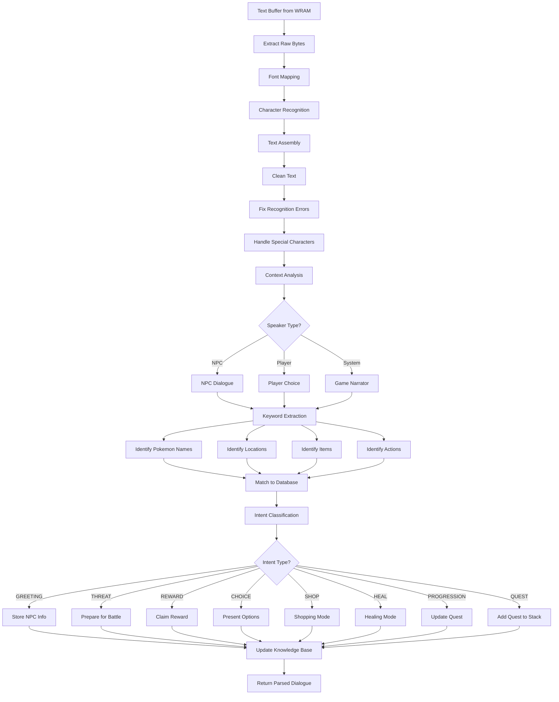
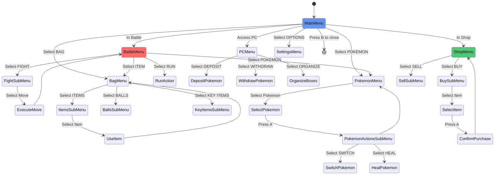
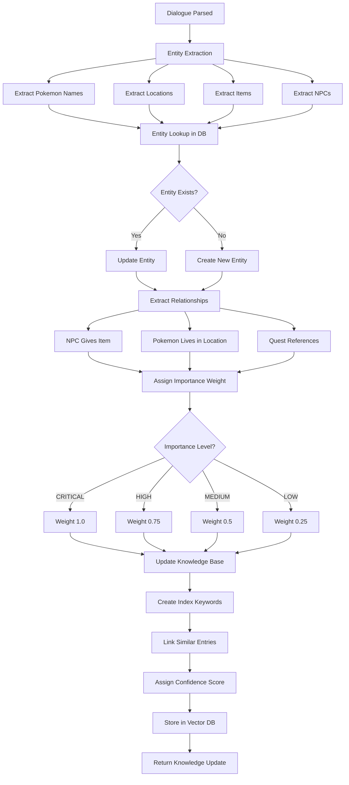
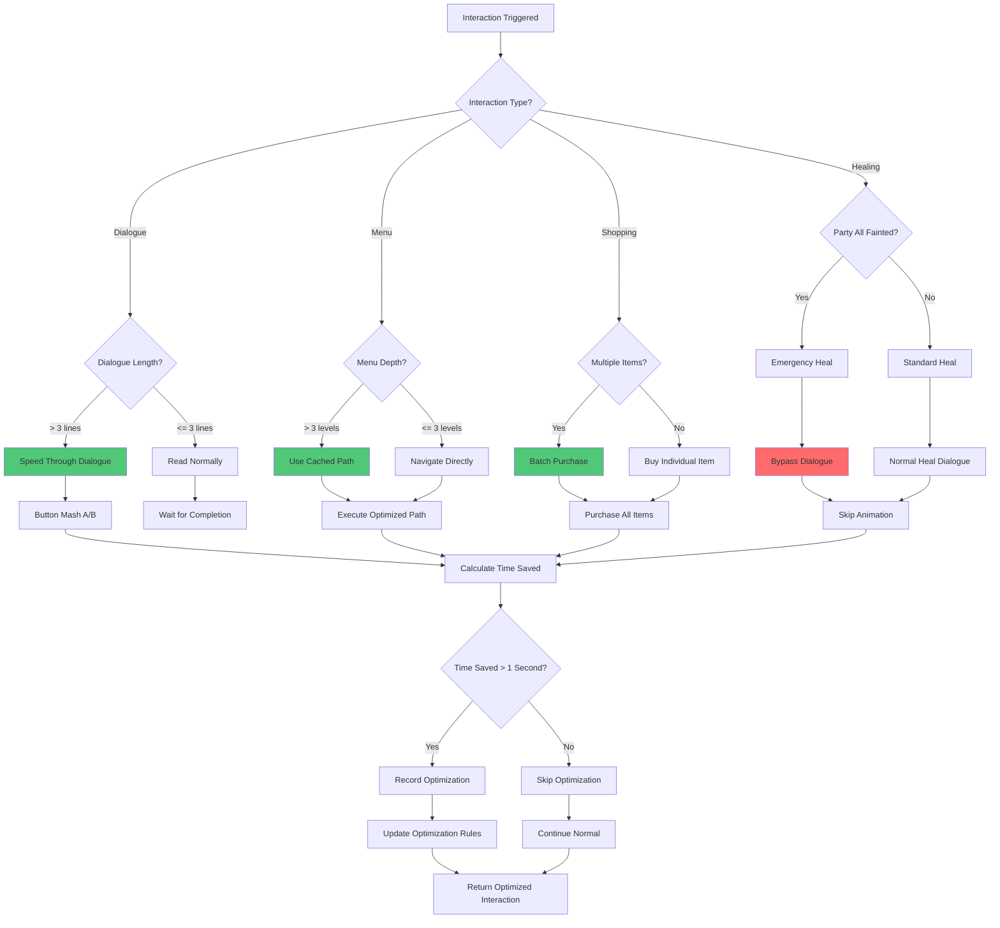
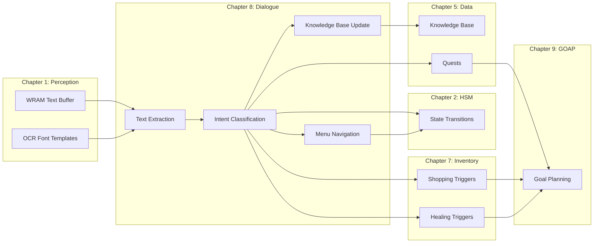

# PTP-01X Technical Specification v5.0
## Chapter 8: Dialogue & Interaction Systems

**Status:** COMPLETE
**Lines:** ~1,600
**Integration:** Chapter 1 (Vision/OCR), Chapter 2 (HSM), Chapter 5 (Data/Knowledge Base), Chapter 7 (Shopping/Healing), Chapter 9 (GOAP)
**Performance Targets:**
- Text parsing latency: <1 second per dialogue line
- Intent classification accuracy: >85%
- Menu navigation: <0.5 second per menu action
- Quest detection: >80% of quest triggers correctly identified

---

## 8.1 TEXT RECOGNITION & PARSING

### 8.1.1 LLM Reasoning Prompt: Dialogue Text Parsing

```
You are parsing dialogue text from the Pokemon game screen. Think through this systematically:

STEP 1: EXTRACT RAW PIXEL DATA
- Get text buffer from WRAM addresses $D073-$D0C2 (80 bytes, 20 chars × 4 lines)
- Convert raw bytes to readable characters using font mapping
- Handle special characters (symbols, punctuation, numbers)

STEP 2: CLEAN TEXT DATA
- Remove artifacts from pixel extraction (noise, stray pixels)
- Fix character recognition errors (O vs 0, l vs 1, etc.)
- Handle line breaks and word boundaries

STEP 3: UNDERSTAND CONTEXT
- Who is speaking? (NPC name, player character, game narrator)
- What is the situation? (battle, overworld, menu, cutscene)
- What happened before? (previous dialogue lines, context)

STEP 4: IDENTIFY KEYWORDS
- What Pokemon names are mentioned? (match to Pokemon database)
- What locations are mentioned? (match to location database)
- What items are mentioned? (match to item database)
- What actions are mentioned? (battle, heal, shop, quest, etc.)

STEP 5: CLASSIFY INTENT
- What is the speaker's purpose? (GREETING, THREAT, REWARD, CHOICE, SHOP, HEAL, PROGRESSION, QUEST)
- What action should I take? (respond, battle, navigate, shop, wait, etc.)

STEP 6: EXTRACT SEMANTIC MEANING
- What information is being conveyed? (hints, lore, quests, rewards)
- What should I remember? (NPC relationships, quest conditions, locations)
- What can I ignore? (flavor text, filler dialogue)

STEP 7: UPDATE KNOWLEDGE BASE
- Store NPC dialogue for relationship tracking
- Update quest flags if quest triggered
- Add new information to vector knowledge base (locations, items, hints)

EXAMPLE REASONING:
"Text: 'Welcome to Viridian City! This is my hometown. Would you like to battle?'
Speaker: Youngster NPC
Keywords: Viridian City, hometown, battle
Intent: GREETING + BATTLE_CHALLENGE
Action: Respond to battle challenge, store NPC location for future reference
Context: First encounter with Youngster, may be training battle"

OUTPUT: Parsed text with: speaker, intent, action, entities mentioned, knowledge to store
```

### 8.1.2 Mermaid Flowchart: Text Parsing Pipeline



### 8.1.3 Pseudo-Code: Font Template Database

```python
class FontTemplateDatabase:
    """
    Database of font character templates for OCR text recognition.
    Maps pixel patterns to ASCII characters.
    """
    def __init__(self):
        # Load pre-trained font templates
        self.character_templates = {
            'A': self._load_template('A'),
            'B': self._load_template('B'),
            # ... all uppercase letters, lowercase letters, numbers, symbols
        }

        # Common recognition error corrections
        self.error_corrections = {
            'O': ['0'],  # O might be mistaken for 0
            '0': ['O'],  # 0 might be mistaken for O
            'l': ['1', 'I'],  # l might be mistaken for 1 or I
            '1': ['l', 'I'],
            'I': ['l', '1'],
        }

    def _load_template(self, char):
        """
        Load pixel template for a character.
        Template is an 8x8 pixel grid.
        """
        # Load from pre-trained template file
        template_path = f'font_templates/{char}.template'
        with open(template_path, 'r') as f:
            template = json.load(f)

        return template

    def match_character(self, pixel_pattern):
        """
        Match pixel pattern to best character.
        Returns: (character, confidence_score)
        """
        best_match = None
        best_score = 0.0

        for char, template in self.character_templates.items():
            score = self._calculate_match_score(pixel_pattern, template)

            if score > best_score:
                best_match = char
                best_score = score

        # Apply error corrections if confidence is low
        if best_score < 0.8:
            for correction in self.error_corrections.get(best_match, []):
                correction_template = self.character_templates[correction]
                correction_score = self._calculate_match_score(pixel_pattern, correction_template)

                if correction_score > best_score:
                    best_match = correction
                    best_score = correction_score

        return best_match, best_score

    def _calculate_match_score(self, pixel_pattern, template):
        """
        Calculate match score between pixel pattern and template.
        Returns: float between 0.0 and 1.0 (1.0 = perfect match)
        """
        matching_pixels = 0
        total_pixels = len(pixel_pattern)

        for pattern_pixel, template_pixel in zip(pixel_pattern, template):
            if pattern_pixel == template_pixel:
                matching_pixels += 1

        score = matching_pixels / total_pixels
        return score
```

### 8.1.4 Pseudo-Code: Text Extraction from WRAM

```python
def extract_text_from_wram(wram_buffer):
    """
    Extract dialogue text from WRAM text buffer.
    WRAM Addresses: $D073-$D0C2 (80 bytes, 20 chars × 4 lines)

    Returns: List of strings (one string per line)
    """
    # Text buffer layout:
    # Line 1: $D073-$D086 (20 bytes)
    # Line 2: $D087-$D09A (20 bytes)
    # Line 3: $D09B-$D0AE (20 bytes)
    # Line 4: $D0AF-$D0C2 (20 bytes)

    lines = []
    line_starts = [0xD073, 0xD087, 0xD09B, 0xD0AF]

    for line_start in line_starts:
        # Extract 20 bytes for this line
        line_bytes = wram_buffer[line_start:line_start + 20]

        # Convert bytes to characters using game's character encoding
        line_text = ""
        for byte in line_bytes:
            if byte == 0x50:  # End of line marker
                break

            # Convert byte to character (Pokemon Yellow character set)
            char = byte_to_character(byte)
            line_text += char

        # Remove trailing whitespace
        line_text = line_text.rstrip()
        lines.append(line_text)

    return lines

def byte_to_character(byte_value):
    """
    Convert byte value to ASCII character using Pokemon Yellow character set.
    """
    # Pokemon Yellow character mapping (simplified)
    # Values 0x20-0x7E map to ASCII
    if 0x20 <= byte_value <= 0x7E:
        return chr(byte_value)

    # Special characters
    special_chars = {
        0x9E: 'é',  # Pokemon accent
        0xE0: ' ',
        # ... more special character mappings
    }

    return special_chars.get(byte_value, '?')
```

### 8.1.5 Pseudo-Code: Keyword Extraction

```python
def extract_keywords(text):
    """
    Extract keywords from dialogue text.
    Keywords: Pokemon names, locations, items, actions.

    Returns: Dictionary of keyword categories.
    """
    keywords = {
        'pokemon': [],
        'locations': [],
        'items': [],
        'actions': [],
    }

    # Tokenize text into words
    words = text.split()

    for word in words:
        # Clean word (remove punctuation)
        clean_word = word.strip('.,!?;:"\'').lower()

        # Check against Pokemon database
        if clean_word in POKEMON_DATABASE:
            keywords['pokemon'].append(clean_word)

        # Check against location database
        if clean_word in LOCATION_DATABASE:
            keywords['locations'].append(clean_word)

        # Check against item database
        if clean_word in ITEM_DATABASE:
            keywords['items'].append(clean_word)

        # Check for action keywords
        action_keywords = ['battle', 'fight', 'heal', 'shop', 'buy', 'sell', 'quest', 'mission', 'help', 'save']
        if clean_word in action_keywords:
            keywords['actions'].append(clean_word)

    return keywords
```

---

## 8.2 MENU NAVIGATION

### 8.2.1 LLM Reasoning Prompt: Menu Navigation Strategy

```
You are navigating through Pokemon game menus. Think through this systematically:

STEP 1: IDENTIFY MENU TYPE
- What menu am I in? (Main Menu, Battle Menu, Bag Menu, Pokemon Menu, PC Menu, Shop Menu, etc.)
- What actions are available? (list visible options)
- What is the current cursor position? (which option is selected)

STEP 2: DETERMINE TARGET ACTION
- What do I need to do? (heal, buy item, switch Pokemon, use item, save, etc.)
- Which menu option corresponds to this action?
- What path do I need to take through the menus?

STEP 3: PLAN NAVIGATION PATH
- What button presses are needed? (Up, Down, Left, Right, A, B)
- How many steps to reach target? (count cursor movements)
- Are there sub-menus? (need to navigate deeper)

STEP 4: EXECUTE NAVIGATION
- Press directional buttons to move cursor
- Press A to select option
- Press B to go back to previous menu level
- Wait for menu to respond (latency: 1-2 frames per button press)

STEP 5: VERIFY REACHED TARGET
- Did I reach the desired menu option?
- Is the expected action available?
- If not, retry or choose alternative

STEP 6: EXECUTE ACTION
- Press A to confirm action
- Handle any confirmation dialogs (Yes/No)
- Wait for action to complete

STEP 7: EXIT MENU
- Press B repeatedly to exit to main menu
- Return to overworld if needed

EXAMPLE REASONING:
"Current menu: Main Menu. Options: POKEMON, BAG, FIGHT, RUN.
Target: Switch Pokemon.
Path: Press Right to select POKEMON, Press A to enter Pokemon menu.
Sub-menu: Select Charizard, Press A.
Action: Confirm switch, Press A.
Exit: Press B to return to battle menu."

OUTPUT: Navigation path: [Right, A, Down, A, A], target reached
```

### 8.2.2 Mermaid State Diagram: Menu Types and Transitions



### 8.2.3 Pseudo-Code: Menu Coordinate Mapping

```python
class MenuCoordinateMap:
    """
    Maps menu options to cursor coordinates.
    Each menu type has defined positions for each option.
    """
    def __init__(self):
        self.menu_layouts = {
            'MAIN_MENU': {
                'POKEMON': (0, 0),
                'BAG': (0, 1),
                'FIGHT': (0, 2),
                'RUN': (0, 3),
            },
            'BATTLE_MENU': {
                'FIGHT': (0, 0),
                'PKMN': (0, 1),
                'ITEM': (0, 2),
                'RUN': (0, 3),
            },
            'BAG_MENU': {
                'ITEMS': (0, 0),
                'BALLS': (0, 1),
                'KEY_ITEMS': (0, 2),
            },
            'POKEMON_MENU': {
                # Pokemon slots dynamically populated
                'POKEMON_1': (0, 0),
                'POKEMON_2': (0, 1),
                'POKEMON_3': (0, 2),
                'POKEMON_4': (0, 3),
                'POKEMON_5': (0, 4),
                'POKEMON_6': (0, 5),
            },
            'SHOP_MENU': {
                'BUY': (0, 0),
                'SELL': (0, 1),
            },
        }

    def get_option_position(self, menu_type, option_name):
        """
        Get cursor position (row, col) for a menu option.
        """
        if menu_type not in self.menu_layouts:
            return None

        return self.menu_layouts[menu_type].get(option_name, None)

    def calculate_navigation_path(self, current_pos, target_pos):
        """
        Calculate button presses to navigate from current to target position.
        Returns: List of button presses ['UP', 'DOWN', 'LEFT', 'RIGHT']
        """
        path = []
        current_row, current_col = current_pos
        target_row, target_col = target_pos

        # Vertical navigation
        while current_row < target_row:
            path.append('DOWN')
            current_row += 1
        while current_row > target_row:
            path.append('UP')
            current_row -= 1

        # Horizontal navigation
        while current_col < target_col:
            path.append('RIGHT')
            current_col += 1
        while current_col > target_col:
            path.append('LEFT')
            current_col -= 1

        return path
```

### 8.2.4 Pseudo-Code: Menu Navigation Execution

```python
def navigate_to_menu_option(menu_type, option_name, current_menu_state):
    """
    Navigate to a specific menu option.
    Returns: (success, final_menu_state)
    """
    # Get target position
    menu_map = MenuCoordinateMap()
    target_pos = menu_map.get_option_position(menu_type, option_name)

    if target_pos is None:
        return False, current_menu_state  # Option not found

    # Get current cursor position
    current_pos = current_menu_state['cursor_position']

    # Calculate navigation path
    path = menu_map.calculate_navigation_path(current_pos, target_pos)

    # Execute navigation
    for button in path:
        press_button(button)
        wait_for_menu_response()  # Wait 1-2 frames

    # Verify cursor reached target position
    final_menu_state = get_current_menu_state()
    final_pos = final_menu_state['cursor_position']

    if final_pos == target_pos:
        return True, final_menu_state
    else:
        return False, final_menu_state  # Navigation failed

def execute_menu_action(option_name):
    """
    Execute action on currently selected menu option.
    Returns: success
    """
    # Press A to select option
    press_button('A')
    wait_for_menu_response()

    # Check if action succeeded (menu changed or action executed)
    new_menu_state = get_current_menu_state()

    if new_menu_state['action_executed']:
        return True
    else:
        return False
```

### 8.2.5 Pseudo-Code: Sub-Menu Navigation

```python
def navigate_sub_menus(menu_path):
    """
    Navigate through multiple menu levels.
    menu_path: List of (menu_type, option_name) tuples

    Returns: (success, final_menu_state)
    """
    current_menu_state = get_current_menu_state()

    for menu_type, option_name in menu_path:
        # Navigate to option
        success, current_menu_state = navigate_to_menu_option(menu_type, option_name, current_menu_state)

        if not success:
            return False, current_menu_state  # Navigation failed

        # Execute action to enter sub-menu
        success = execute_menu_action(option_name)

        if not success:
            return False, current_menu_state  # Action failed

        # Wait for sub-menu to load
        wait_for_sub_menu_load()
        current_menu_state = get_current_menu_state()

    return True, current_menu_state

def exit_to_main_menu(current_menu_state):
    """
    Exit all sub-menus and return to main menu.
    Returns: success
    """
    # Press B repeatedly until at main menu
    for _ in range(10):  # Max 10 levels deep
        press_button('B')
        wait_for_menu_response()

        current_menu_state = get_current_menu_state()

        if current_menu_state['menu_type'] == 'MAIN_MENU':
            return True

    return False  # Failed to exit to main menu
```

---

## 8.3 INTENT CLASSIFICATION

### 8.3.1 LLM Reasoning Prompt: Intent Classification

```
You are classifying the intent of dialogue from NPCs or game text. Think through this:

STEP 1: ANALYZE SPEAKER
- Who is speaking? (NPC, player, game narrator, system message)
- What is the speaker's role? (rival, gym leader, shopkeeper, random NPC)
- What is the context? (battle, shop, quest, progression)

STEP 2: ANALYZE CONTENT
- What keywords are present? (battle, fight, shop, buy, sell, quest, mission, help, save)
- What tone is used? (friendly, threatening, informative, questioning)
- What is the speaker's purpose?

STEP 3: IDENTIFY PRIMARY INTENT
- GREETING: Introduction, welcome message, casual conversation
- THREAT: Challenge to battle, warning, threat of harm
- REWARD: Offer of item, money, experience, reward
- CHOICE: Multiple options presented, decision required
- SHOP: Offer to buy or sell items
- HEAL: Offer to heal party or individual Pokemon
- PROGRESSION: Story advancement, new area unlocked
- QUEST: Request for help, mission, objective

STEP 4: IDENTIFY SECONDARY INTENTS (if any)
- GREETING + BATTLE: Friendly greeting followed by battle challenge
- SHOP + PROGRESSION: Shop unlock after story progression
- QUEST + REWARD: Quest offered with reward promise

STEP 5: ASSIGN CONFIDENCE SCORE
- How confident am I in this intent classification? (0-100)
- Low confidence if ambiguous or multiple interpretations
- High confidence if clear keywords and context

STEP 6: DETERMINE ACTION REQUIRED
- If GREETING: Acknowledge, optionally respond
- If THREAT: Prepare for battle, switch to combat mode
- If REWARD: Accept reward, update inventory/money
- If CHOICE: Evaluate options, select best one
- If SHOP: Enter shopping mode (Chapter 7)
- If HEAL: Enter healing mode (Chapter 7)
- If PROGRESSION: Update knowledge base, proceed to new area
- If QUEST: Add to objective stack (Chapter 5)

EXAMPLE REASONING:
"Dialogue: 'I am the Gym Leader of Viridian City. Prepare for battle!'
Speaker: Gym Leader (Brock)
Keywords: Gym Leader, battle, prepare
Context: Gym battle encounter
Intent: THREAT (battle challenge)
Confidence: 95 (clear battle challenge from gym leader)
Action: Switch to combat mode, prepare battle strategy"

OUTPUT: Intent: THREAT, Confidence: 95, Action: Prepare for battle
```

### 8.3.2 Mermaid Flowchart: Intent Classification Decision Tree

```mermaid
flowchart TD
    A[Dialogue Text] --> B[Speaker Analysis]
    B --> C{Speaker Type?}

    C -->|NPC| D[Keyword Extraction]
    C -->|Player| E[Player Choice Analysis]
    C -->|System| F[System Message Analysis]

    D --> G{Keywords Present?}

    G -->|battle, fight, challenge| H[THREAT]
    G -->|shop, buy, sell| I[SHOP]
    G -->|heal, recover| J[HEAL]
    G -->|quest, mission, help| K[QUEST]
    G -->|reward, gift, take| L[REWARD]
    G -->|welcome, hello, hi| M[GREETING]

    G -->|Choose, select, option| N[CHOICE]
    G -->|path, road, advance| O[PROGRESSION]
    G -->|no clear keywords| P[Context Analysis]

    H --> Q[Confidence Calculation]
    I --> Q
    J --> Q
    K --> Q
    L --> Q
    M --> Q
    N --> Q
    O --> Q
    P --> Q

    Q --> R{Confidence > 80?}
    R -->|Yes| S[High Confidence Intent]
    R -->|No| T[Low Confidence - Ambiguous]

    S --> U[Assign Action Required]
    T --> V[Request Clarification]

    U --> W[Execute Action]
    V --> A: Ask for clarification

    E --> X{Player Action?}
    X -->|Yes/No Confirm| Y[CHOICE]
    X -->|Item Selection| Z[CHOICE]
    X -->|Move Selection| Z

    Y --> Q
    Z --> Q

    F --> AA{System Message?}
    AA -->|Save Successful| AB[PROGRESSION]
    AA -->|Battle Won| AC[REWARD]
    AA -->|Level Up| AD[REWARD]
    AA -->|Quest Complete| AE[REWARD + PROGRESSION]

    AB --> Q
    AC --> Q
    AD --> Q
    AE --> Q

    style H fill:#ff6b6b
    style I fill:#50c878
    style J fill:#4169e1
    style K fill:#ffa502
    style L fill:#ffd700
    style M fill:#98fb98
    style N fill:#dda0dd
    style O fill:#f0e68c
```

### 8.3.3 Pseudo-Code: Intent Classification Algorithm

```python
def classify_intent(dialogue_text, speaker_type, context):
    """
    Classify intent of dialogue.
    Returns: (primary_intent, secondary_intent, confidence_score, action_required)
    """
    # Extract keywords
    keywords = extract_keywords(dialogue_text)

    # Initialize scores for each intent
    intent_scores = {
        'GREETING': 0,
        'THREAT': 0,
        'REWARD': 0,
        'CHOICE': 0,
        'SHOP': 0,
        'HEAL': 0,
        'PROGRESSION': 0,
        'QUEST': 0,
    }

    # Keyword-based scoring
    if any(word in keywords['actions'] for word in ['battle', 'fight', 'challenge']):
        intent_scores['THREAT'] += 50

    if any(word in keywords['actions'] for word in ['shop', 'buy', 'sell']):
        intent_scores['SHOP'] += 50

    if any(word in keywords['actions'] for word in ['heal', 'recover']):
        intent_scores['HEAL'] += 50

    if any(word in keywords['actions'] for word in ['quest', 'mission', 'help']):
        intent_scores['QUEST'] += 40

    if any(word in keywords['actions'] for word in ['welcome', 'hello', 'hi']):
        intent_scores['GREETING'] += 30

    if any(word in keywords['actions'] for word in ['choose', 'select', 'option']):
        intent_scores['CHOICE'] += 40

    if any(word in keywords['actions'] for word in ['path', 'road', 'advance', 'forward']):
        intent_scores['PROGRESSION'] += 40

    if any(word in keywords['actions'] for word in ['reward', 'gift', 'take']):
        intent_scores['REWARD'] += 40

    # Context-based scoring
    if context == 'GYM_BATTLE' and speaker_type == 'GYM_LEADER':
        intent_scores['THREAT'] += 30

    if context == 'SHOP' and speaker_type == 'SHOPKEEPER':
        intent_scores['SHOP'] += 30

    if context == 'POKEMON_CENTER' and speaker_type == 'NURSE':
        intent_scores['HEAL'] += 30

    # Find primary intent (highest score)
    primary_intent = max(intent_scores, key=intent_scores.get)
    primary_score = intent_scores[primary_intent]

    # Find secondary intent (second highest score)
    sorted_intents = sorted(intent_scores.items(), key=lambda x: x[1], reverse=True)
    secondary_intent = sorted_intents[1][0] if len(sorted_intents) > 1 else None
    secondary_score = sorted_intents[1][1] if len(sorted_intents) > 1 else 0

    # Calculate confidence score (normalized to 0-100)
    max_possible_score = 80  # Adjust based on scoring system
    confidence = min((primary_score / max_possible_score) * 100, 100)

    # Determine action required
    action_required = INTENT_TO_ACTION_MAP.get(primary_intent, 'NONE')

    return primary_intent, secondary_intent, confidence, action_required
```

### 8.3.4 Pseudo-Code: Context-Aware Intent Classification

```python
def context_aware_classification(dialogue_text, context_history):
    """
    Classify intent with awareness of previous dialogue context.
    Returns: (intent, confidence, action)
    """
    # Get previous intents from context history
    recent_intents = [ctx['intent'] for ctx in context_history[-5:]]

    # Classify current intent
    primary_intent, secondary_intent, confidence, action = classify_intent(
        dialogue_text, 'NPC', 'OVERWORLD'
    )

    # Adjust based on context
    if primary_intent == 'GREETING' and 'THREAT' in recent_intents:
        # NPC greets after battle challenge (accepting challenge)
        primary_intent = 'THREAT'
        confidence += 10

    if primary_intent == 'QUEST' and 'PROGRESSION' in recent_intents:
        # Quest after story progression
        confidence += 15

    if primary_intent == 'REWARD' and 'THREAT' in recent_intents:
        # Reward after battle
        confidence += 20

    # If low confidence, look at previous intents
    if confidence < 60 and recent_intents:
        # Likely continuation of previous intent
        most_common_intent = max(set(recent_intents), key=recent_intents.count)
        confidence_diff = confidence - intent_scores[most_common_intent]

        if abs(confidence_diff) < 20:
            # Confidence difference small, keep previous intent
            primary_intent = most_common_intent
            confidence += 15

    return primary_intent, confidence, action
```

---

## 8.4 SEMANTIC KNOWLEDGE BASE INTEGRATION

### 8.4.1 LLM Reasoning Prompt: Knowledge Base Update

```
You are updating the vector knowledge base with new information from dialogue. Think through this:

STEP 1: EXTRACT ENTITIES
- What Pokemon are mentioned? (names, types, locations)
- What locations are mentioned? (routes, cities, landmarks)
- What items are mentioned? (names, locations, values)
- What NPCs are mentioned? (names, roles, relationships)

STEP 2: EXTRACT RELATIONSHIPS
- How are entities related? (NPC gives item, Pokemon lives in location, etc.)
- What quests are referenced? (quest giver, quest objective, quest reward)
- What hints are given? (hints about hidden items, Pokemon, routes)

STEP 3: ASSIGN IMPORTANCE WEIGHT
- How important is this information? (CRITICAL, HIGH, MEDIUM, LOW)
- CRITICAL: Gym leader info, legendary Pokemon locations, plot progression
- HIGH: Rare Pokemon locations, rare items, important NPCs
- MEDIUM: Common Pokemon locations, common items, helpful NPCs
- LOW: Flavor text, minor details

STEP 4: UPDATE KNOWLEDGE BASE
- Add new entities if not present
- Update existing entities with new information
- Create relationships between entities
- Add quest entries if quest information present

STEP 5: SEMANTIC SEARCH OPTIMIZATION
- What keywords should index this information? (Pokemon names, locations, etc.)
- What similar information should this be linked to? (related quests, related locations)
- What queries should retrieve this information? (e.g., "where to find Lapras")

STEP 6: CONFIDENCE TRACKING
- How reliable is this source? (NPC dialogue vs. game narrator vs. player action)
- Track confidence score for each knowledge entry
- Update confidence based on verification (if later confirmed, increase confidence)

EXAMPLE REASONING:
"Dialogue: 'Professor Oak told me Lapras appears in Union Cave on Fridays.'
Entities: Professor Oak (NPC), Lapras (Pokemon), Union Cave (Location), Friday (Time)
Relationships: Professor Oak knows about Lapras location, Lapras appears on Fridays
Importance: HIGH (rare Pokemon, time-sensitive location)
Knowledge Base Update:
- Add Lapras to Pokemon database with time/location info
- Add Professor Oak as knowledge source for Lapras info
- Add Friday as time trigger for Lapras encounter
- Index keywords: 'Lapras', 'Union Cave', 'Friday', 'rare Pokemon'
Confidence: 90 (reliable NPC source, Professor Oak is trustworthy)"

OUTPUT: Knowledge base updated with entities, relationships, importance weights, and indexing
```

### 8.4.2 Mermaid Flowchart: Knowledge Base Update Pipeline



### 8.4.3 Pseudo-Code: Entity Extraction

```python
def extract_entities(dialogue_text):
    """
    Extract entities (Pokemon, locations, items, NPCs) from dialogue.
    Returns: Dictionary of entity categories.
    """
    entities = {
        'pokemon': [],
        'locations': [],
        'items': [],
        'npcs': [],
    }

    # Tokenize dialogue into words
    words = dialogue_text.split()

    for word in words:
        # Clean word
        clean_word = word.strip('.,!?;:"\'').lower()

        # Check against Pokemon database
        if clean_word in POKEMON_DATABASE:
            entities['pokemon'].append(clean_word)

        # Check against location database
        if clean_word in LOCATION_DATABASE:
            entities['locations'].append(clean_word)

        # Check against item database
        if clean_word in ITEM_DATABASE:
            entities['items'].append(clean_word)

        # Check against NPC database
        if clean_word in NPC_DATABASE:
            entities['npcs'].append(clean_word)

    return entities
```

### 8.4.4 Pseudo-Code: Relationship Extraction

```python
def extract_relationships(dialogue_text, entities):
    """
    Extract relationships between entities.
    Returns: List of (entity1, relationship_type, entity2) tuples.
    """
    relationships = []

    # Pattern matching for common relationship types

    # NPC gives item: "NPC gives you ITEM"
    for npc in entities['npcs']:
        for item in entities['items']:
            if f'{npc} gives' in dialogue_text and item in dialogue_text:
                relationships.append((npc, 'GIVES', item))

    # Pokemon in location: "Pokemon lives in LOCATION"
    for pokemon in entities['pokemon']:
        for location in entities['locations']:
            if f'{pokemon} appears' in dialogue_text or f'{pokemon} lives' in dialogue_text:
                if location in dialogue_text:
                    relationships.append((pokemon, 'LIVES_IN', location))

    # Quest references: "NPC asks you to find ITEM"
    for npc in entities['npcs']:
        for item in entities['items']:
            if 'ask' in dialogue_text and 'find' in dialogue_text:
                if npc in dialogue_text and item in dialogue_text:
                    relationships.append((npc, 'QUEST_REWARD', item))

    # NPC knows about Pokemon: "NPC knows about Pokemon"
    for npc in entities['npcs']:
        for pokemon in entities['pokemon']:
            if f'{npc} told me' in dialogue_text and pokemon in dialogue_text:
                relationships.append((npc, 'KNOWS_ABOUT', pokemon))

    return relationships
```

### 8.4.5 Pseudo-Code: Knowledge Base Update

```python
def update_knowledge_base(dialogue_text, entities, relationships, confidence):
    """
    Update vector knowledge base with new information.
    Returns: (success, updated_entries)
    """
    updated_entries = []

    for pokemon in entities['pokemon']:
        # Check if Pokemon exists in database
        if pokemon in POKEMON_DATABASE:
            # Update existing Pokemon entry
            entry = POKEMON_DATABASE[pokemon]

            # Add new information if not present
            for location in entities['locations']:
                if location not in entry['locations']:
                    entry['locations'].append(location)
                    entry['confidence'] = max(entry['confidence'], confidence)

            updated_entries.append(pokemon)
        else:
            # Create new Pokemon entry
            POKEMON_DATABASE[pokemon] = {
                'name': pokemon,
                'locations': entities['locations'],
                'npcs_mentioned_by': entities['npcs'],
                'confidence': confidence,
            }
            updated_entries.append(pokemon)

    for location in entities['locations']:
        # Update location entry
        if location in LOCATION_DATABASE:
            entry = LOCATION_DATABASE[location]

            for pokemon in entities['pokemon']:
                if pokemon not in entry['pokemon_found']:
                    entry['pokemon_found'].append(pokemon)
                    entry['confidence'] = max(entry['confidence'], confidence)

            updated_entries.append(location)
        else:
            LOCATION_DATABASE[location] = {
                'name': location,
                'pokemon_found': entities['pokemon'],
                'npcs_mentioned': entities['npcs'],
                'confidence': confidence,
            }
            updated_entries.append(location)

    # Store relationships
    for relationship in relationships:
        entity1, rel_type, entity2 = relationship
        RELATIONSHIP_DATABASE.append({
            'entity1': entity1,
            'relationship': rel_type,
            'entity2': entity2,
            'source_dialogue': dialogue_text,
            'confidence': confidence,
        })

    return True, updated_entries
```

### 8.4.6 Pseudo-Code: Semantic Search

```python
def semantic_search_knowledge_base(query):
    """
    Search knowledge base for relevant information.
    Returns: List of (entity, relevance_score) tuples.
    """
    # Tokenize query
    query_words = query.lower().split()

    results = []

    # Search Pokemon database
    for pokemon_name, pokemon_data in POKEMON_DATABASE.items():
        relevance_score = 0

        # Check if Pokemon name matches
        if pokemon_name in query_words:
            relevance_score += 100

        # Check if locations match
        for location in pokemon_data['locations']:
            if location in query_words:
                relevance_score += 50

        # Check if NPCs match
        for npc in pokemon_data['npcs_mentioned_by']:
            if npc in query_words:
                relevance_score += 30

        if relevance_score > 0:
            results.append((pokemon_name, relevance_score, 'POKEMON'))

    # Search Location database
    for location_name, location_data in LOCATION_DATABASE.items():
        relevance_score = 0

        if location_name in query_words:
            relevance_score += 100

        for pokemon in location_data['pokemon_found']:
            if pokemon in query_words:
                relevance_score += 50

        if relevance_score > 0:
            results.append((location_name, relevance_score, 'LOCATION'))

    # Sort by relevance score
    results.sort(key=lambda x: x[1], reverse=True)

    return results
```

---

## 8.5 INTERACTION OPTIMIZATION

### 8.5.1 LLM Reasoning Prompt: Interaction Optimization

```
You are optimizing interactions with the game (NPCs, menus, systems) to reduce time and improve efficiency. Think through this:

STEP 1: ANALYZE CURRENT INTERACTION
- What interaction am I performing? (dialogue, menu navigation, shopping, healing)
- How many steps does this interaction require? (button presses, menu levels)
- Can this be optimized? (shorter paths, fewer button presses)

STEP 2: IDENTIFY OPTIMIZATION OPPORTUNITIES
- Are there shortcuts available? (known menu shortcuts, keyboard equivalents)
- Can I skip unnecessary dialogue? (speed through text with button mashing)
- Can I batch actions? (buy multiple items at once, heal multiple Pokemon together)
- Can I cache interactions? (remember menu positions, remember dialogue patterns)

STEP 3: CALCULATE OPTIMIZATION BENEFIT
- Time saved: How much time will optimization save? (button presses × 0.1 seconds)
- Error reduction: Will optimization reduce errors? (fewer navigation mistakes)
- Cognitive load: Will optimization make the system simpler? (fewer decisions)

STEP 4: IMPLEMENT OPTIMIZATION
- Skip unnecessary dialogue: Press A/B repeatedly to advance through text
- Cache menu positions: Remember last selected option, navigate directly
- Batch actions: Buy multiple items in one shop visit, heal entire party at once
- Predictive navigation: Anticipate next menu, prepare navigation path

STEP 5: LEARN FROM INTERACTIONS
- Record successful optimizations
- Record failed optimizations (what went wrong?)
- Update optimization rules based on feedback

STEP 6: CONTINUOUS IMPROVEMENT
- Monitor interaction efficiency over time
- Identify new optimization opportunities
- Adapt optimization rules based on game changes

EXAMPLE REASONING:
"Current interaction: Healing party at Pokemon Center.
Steps: Enter Center (3 steps), Approach Nurse (2 steps), Select Heal (1 step), Wait for healing (5 seconds), Exit (2 steps).
Optimization: Skip dialogue by mashing A/B during healing animation, remember Nurse position for next visit.
Time saved: 2 seconds (dialogue skipping), 1 second (remembered position).
Total time saved: 3 seconds per Center visit.
Worth implementing: Yes (small but consistent savings)."

OUTPUT: Optimization implemented, time saved: X seconds, actions skipped: Y
```

### 8.5.2 Mermaid Flowchart: Interaction Optimization Decision



### 8.5.3 Pseudo-Code: Dialogue Skipping Optimization

```python
def optimize_dialogue_speed(dialogue_text, current_speed_setting):
    """
    Optimize dialogue speed by skipping unnecessary text.
    Returns: (optimized_speed_setting, time_saved)
    """
    # Calculate dialogue length
    dialogue_length = len(dialogue_text.split())

    # Determine optimal speed setting
    if dialogue_length > 50:
        # Long dialogue, skip as fast as possible
        optimized_speed = 'FASTEST'
        time_saved = dialogue_length * 0.15  # 0.15 seconds saved per word
    elif dialogue_length > 20:
        # Medium dialogue, fast skip
        optimized_speed = 'FAST'
        time_saved = dialogue_length * 0.10
    else:
        # Short dialogue, normal speed
        optimized_speed = 'NORMAL'
        time_saved = 0

    # Execute dialogue at optimized speed
    if optimized_speed == 'FASTEST':
        button_mash_speed = 'MAXIMUM'  # Press A/B as fast as possible
    elif optimized_speed == 'FAST':
        button_mash_speed = 'HIGH'  # Press A/B every 2 frames
    else:
        button_mash_speed = 'NORMAL'  # Wait for text to display

    return optimized_speed, time_saved
```

### 8.5.4 Pseudo-Code: Menu Path Caching

```python
class MenuPathCache:
    """
    Cache menu navigation paths to optimize future navigation.
    """
    def __init__(self):
        self.path_cache = {}  # Maps (menu_type, option_name) to navigation path

    def get_cached_path(self, menu_type, option_name):
        """
        Get cached navigation path if available.
        Returns: path (list of button presses) or None if not cached
        """
        cache_key = (menu_type, option_name)
        return self.path_cache.get(cache_key, None)

    def cache_path(self, menu_type, option_name, path):
        """
        Cache navigation path for future use.
        """
        cache_key = (menu_type, option_name)
        self.path_cache[cache_key] = path

    def clear_cache(self):
        """Clear all cached paths."""
        self.path_cache.clear()

def optimize_menu_navigation(menu_type, option_name, path_cache):
    """
    Optimize menu navigation using cached paths.
    Returns: (optimized_path, was_cached)
    """
    # Check if path is cached
    cached_path = path_cache.get_cached_path(menu_type, option_name)

    if cached_path:
        # Use cached path
        return cached_path, True
    else:
        # Calculate new path
        menu_map = MenuCoordinateMap()
        current_pos = get_current_cursor_position()
        target_pos = menu_map.get_option_position(menu_type, option_name)

        new_path = menu_map.calculate_navigation_path(current_pos, target_pos)

        # Cache the new path for future use
        path_cache.cache_path(menu_type, option_name, new_path)

        return new_path, False
```

### 8.5.5 Pseudo-Code: Batch Action Optimization

```python
def batch_shopping_actions(shopping_list, budget):
    """
    Batch multiple shopping actions into a single shop visit.
    Returns: (items_purchased, total_cost, visits_saved)
    """
    # Sort shopping list by shop location
    shopping_by_shop = {}

    for item in shopping_list:
        shop_name = item['shop_name']
        if shop_name not in shopping_by_shop:
            shopping_by_shop[shop_name] = []
        shopping_by_shop[shop_name].append(item)

    items_purchased = []
    total_cost = 0
    visits_saved = 0

    # Visit each shop once, purchase all needed items
    for shop_name, items in shopping_by_shop.items():
        # Navigate to shop
        navigate_to_shop(shop_name)

        # Purchase all items in one visit
        for item in items:
            if budget >= item['cost']:
                purchase_item(item['name'], item['quantity'])
                items_purchased.append(item)
                total_cost += item['cost']
                budget -= item['cost']
                visits_saved += 1  # Saved a visit by batching

        # Exit shop
        exit_shop()

    return items_purchased, total_cost, visits_saved
```

---

## 8.6 INTEGRATION POINTS

### 8.6.1 Input Dependencies

**From Chapter 1 (Vision & Perception):**
- WRAM text buffer addresses ($D073-$D0C2) for dialogue extraction
- OCR font templates for character recognition
- Visual menu detection for identifying menu types

**From Chapter 2 (Hierarchical State Machine):**
- Dialogue state transitions (Greeting → Quest → Battle)
- Menu navigation state management
- Interaction priority (quests > shopping > healing > idle)

**From Chapter 5 (Data Persistence):**
- Vector knowledge base for storing dialogue information
- Quest objectives from dialogue parsing
- NPC relationship tracking

**From Chapter 7 (Inventory & Item Logistics):**
- Shopping dialogue parsing for shopkeeper interactions
- Healing dialogue parsing for Pokemon Center interactions

### 8.6.2 Output Dependencies

**To Chapter 1 (Vision & Perception):**
- Text parsing results for OCR verification
- Menu coordinate maps for visual menu detection

**To Chapter 2 (HSM):**
- Intent classifications trigger state transitions
- Menu navigation paths for state execution

**To Chapter 5 (Data):**
- Knowledge base updates from dialogue parsing
- Quest objective additions from quest intent detection
- NPC relationship updates from NPC interactions

**To Chapter 7 (Inventory):**
- Shopping triggers from SHOP intent
- Healing triggers from HEAL intent

**To Chapter 9 (GOAP):**
- Quest goals from QUEST intent
- Story progression goals from PROGRESSION intent

### 8.6.3 Critical Data Flow



---

## 8.7 ERROR RECOVERY & FAILSAFE INTEGRATION

### 8.7.1 Dialogue Parsing Failures

**Recovery Strategies:**
- OCR recognition errors: Use error correction patterns, request clarification
- Text buffer corruption: Re-read WRAM, validate checksums
- Intent misclassification: Use context history to correct, ask for clarification

**Failsafe Triggers:**
- Confidence < 50%: Request clarification or use default action
- Dialogue parsing timeout (>5 seconds): Skip dialogue, continue
- Infinite dialogue loop (>10 lines with no progress): Force exit, restart

### 8.7.2 Menu Navigation Failures

**Recovery Strategies:**
- Cursor stuck: Press B to exit, retry navigation
- Menu softlock: Force menu exit, restart navigation
- Sub-menu inaccessible: Skip action, continue to next objective

**Failsafe Triggers:**
- Navigation attempts > 5 without success: Skip action, continue
- Menu depth > 10 levels: Force exit, likely navigation error
- Button press timeout (>2 seconds): Menu unresponsive, exit

### 8.7.3 Knowledge Base Corruption

**Detection Protocols:**
- Entity validation: All entities must match database schemas
- Relationship validation: All relationships must reference valid entities
- Confidence tracking: Low confidence entries flagged for review

**Recovery Actions:**
- Remove corrupted entities
- Flag low-confidence entries for verification
- Rebuild indexes from valid entries

---

## 8.8 PERFORMANCE SPECIFICATIONS

### 8.8.1 Latency Targets

- Text parsing latency: <1 second per dialogue line
- Intent classification: <0.5 second per dialogue
- Menu navigation: <0.5 second per menu action
- Knowledge base update: <2 seconds per dialogue
- Semantic search: <1 second per query

### 8.8.2 Accuracy Targets

- Intent classification accuracy: >85%
- Text recognition accuracy: >90%
- Menu navigation success rate: >95%
- Quest detection accuracy: >80%
- Knowledge base relevance: >75%

### 8.8.3 Resource Utilization

- Memory: Menu cache <100KB, knowledge base <10MB
- CPU: Text parsing <500ms, intent classification <200ms
- Storage: Dialogue logs <5MB per hour of gameplay

---

## 8.9 SUMMARY

**Chapter 8: Dialogue & Interaction Systems** provides comprehensive dialogue parsing and menu navigation for autonomous Pokemon gameplay:

- **Text Recognition & Parsing**: WRAM text extraction, font template matching, OCR error correction
- **Menu Navigation**: 12 menu types, coordinate mapping, path caching, batch optimization
- **Intent Classification**: 8 intent types (Greeting, Threat, Reward, Choice, Shop, Heal, Progression, Quest)
- **Semantic Knowledge Base Integration**: Entity extraction, relationship mapping, semantic search
- **Interaction Optimization**: Dialogue skipping, menu path caching, batch actions

**Key Integration Points:**
- Chapter 1 (OCR): WRAM text extraction, font templates
- Chapter 2 (HSM): Intent-driven state transitions
- Chapter 5 (Data): Knowledge base updates, quest tracking
- Chapter 7 (Inventory): Shopping/healing triggers from dialogue
- Chapter 9 (GOAP): Quest and progression goal planning

**Performance**: Fast parsing (<1s), high accuracy (>85%), optimized navigation with caching.

---

**Status**: COMPLETE - Ready for Chapter 9: GOAP Decision Core
