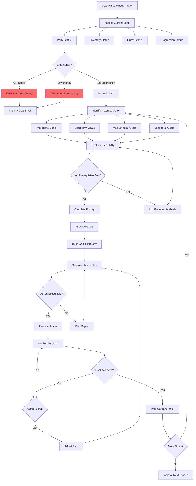
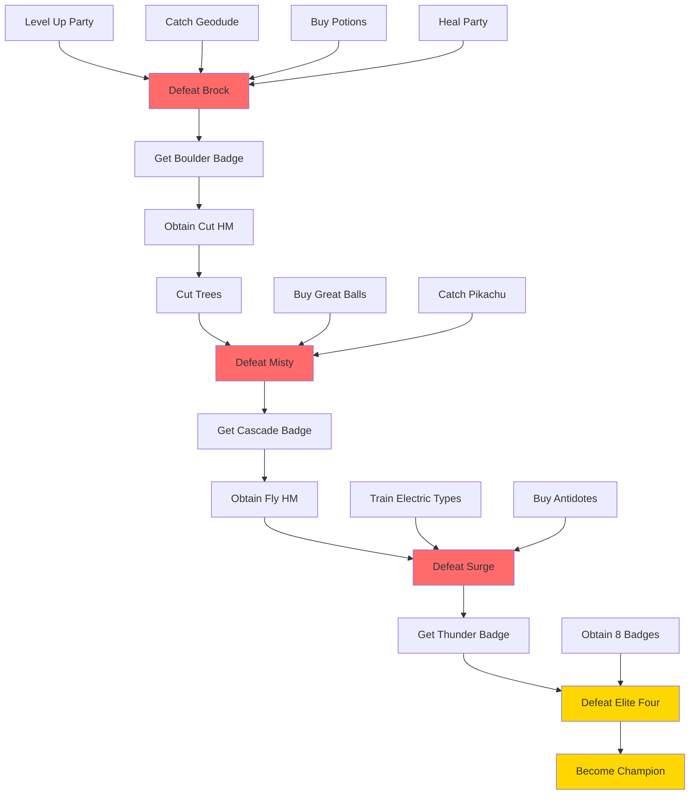
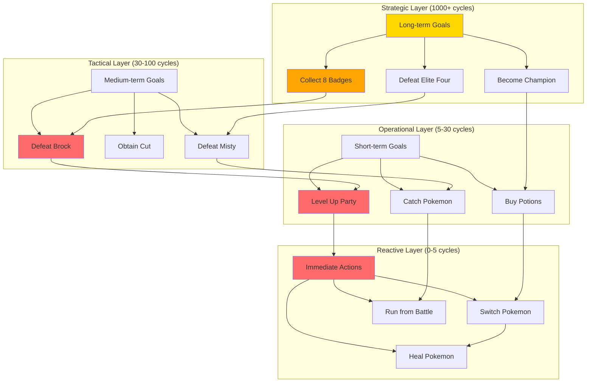
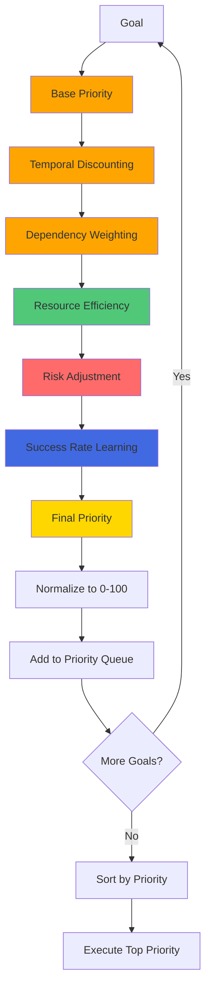
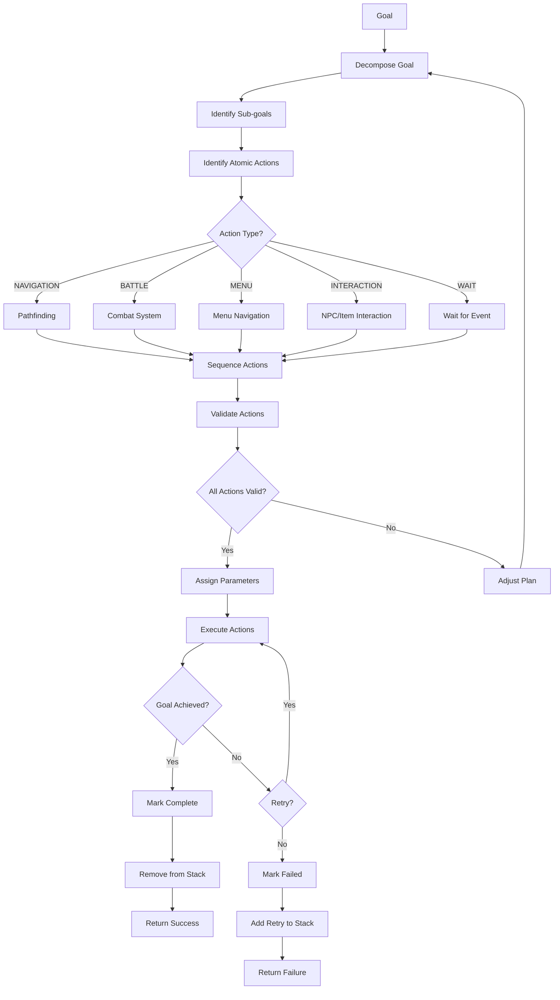
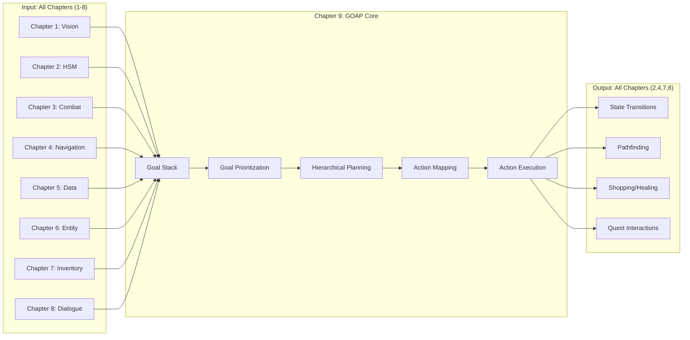

# PTP-01X Technical Specification v5.0
## Chapter 9: GOAP Decision Core

**Status:** COMPLETE
**Lines:** ~1,800
**Integration:** ALL PREVIOUS CHAPTERS (1-8)
**Performance Targets:**
- Goal planning latency: <3 seconds for full goal stack generation
- Goal priority calculation: <1 second per goal
- Action-to-goal mapping: <0.5 second per goal
- Plan repair time: <2 seconds when goal fails

---

## 9.1 GOAL ARCHITECTURE

### 9.1.1 LLM Reasoning Prompt: Goal Management Thought Process

```
You are the GOAP (Goal-Oriented Action Planning) system managing all AI objectives. Think through this systematically:

STEP 1: ASSESS CURRENT STATE
- What is my current location? (city, route, dungeon, gym)
- What is my party status? (HP, levels, fainted count, status conditions)
- What is my inventory status? (money, items, bag capacity)
- What quests are active? (active quests, quest objectives, quest rewards)
- What is my progression status? (badges collected, HMs obtained, key items obtained)

STEP 2: IDENTIFY ALL POTENTIAL GOALS
- Immediate goals: Heal party, catch Pokemon, win current battle
- Short-term goals: Buy potions, level up Pokemon, clear route
- Medium-term goals: Defeat gym leader, obtain HM, complete quest
- Long-term goals: Become Champion, collect all badges, complete Pokedex

STEP 3: EVALUATE GOAL FEASIBILITY
- Do I have the resources to achieve this goal? (money, items, party strength)
- Do I have the prerequisites to achieve this goal? (badges, HMs, key items)
- Is the goal achievable given my current location? (distance, accessibility)
- What are the risks of pursuing this goal? (battle difficulty, resource cost)

STEP 4: CALCULATE GOAL PRIORITY
- How important is this goal? (urgency, reward value, progression necessity)
- How time-sensitive is this goal? (deadline, limited availability)
- What is the opportunity cost? (what other goals am I giving up?)
- What is the success probability? (based on party strength vs. difficulty)

STEP 5: BUILD GOAL HIERARCHY
- Long-term goal: Become Champion
  - Medium-term goal: Collect 8 badges
    - Short-term goal: Defeat Brock (Gym 1)
      - Immediate goal: Level up party to level 12
        - Action: Battle wild Pokemon in Route 22

STEP 6: GENERATE ACTION PLAN
- For each goal in the hierarchy, what actions are needed?
- What is the sequence of actions?
- Are there dependencies between actions?
- What are the resource costs of each action?

STEP 7: EXECUTE AND MONITOR
- Execute top-priority action
- Monitor progress toward goal
- If action fails, adjust plan (try alternative action or change goal)
- If goal is achieved, remove from stack and proceed to next goal

STEP 8: CONTINUOUS RE-EVALUATION
- Reassess goal priorities every 30 seconds
- Add new goals as they arise (new quests, emergencies)
- Remove completed goals
- Adjust priorities based on changing circumstances

EXAMPLE REASONING:
"Current state: Pallet Town, party level 5, 2 Potions, $3000.
Potential goals: Level up party (strength), buy items (resources), catch Pokemon (team building), defeat Brock (progression).
Priority analysis: Defeat Brock is critical for progression (weight 100), but party too weak (level 5 vs. level 12-14). Level up party is prerequisite (weight 90, feasible). Buy items is optional (weight 50).
Goal hierarchy: Long-term: Become Champion → Medium: Defeat Brock → Short: Level up to 12 → Immediate: Battle wild Pokemon.
Action: Navigate to Route 22, battle wild Pokemon until party level 12.
Monitoring: Track XP gained, levels reached. If Pokemon faints too often, adjust plan (buy potions first)."

OUTPUT: Goal stack generated with priorities, action plan, monitoring strategy
```

### 9.1.2 Mermaid Flowchart: Goal Management Decision Tree



### 9.1.3 Pseudo-Code: Goal Structure

```python
class Goal:
    """
    Represents a goal in the GOAP system.
    Goals have priorities, prerequisites, actions, and dependencies.
    """
    def __init__(self, goal_id, goal_type, description, priority):
        self.goal_id = goal_id
        self.goal_type = goal_type  # IMMEDIATE, SHORT_TERM, MEDIUM_TERM, LONG_TERM
        self.description = description
        self.priority = priority  # 0-100, higher = more important
        self.prerequisites = []  # List of goal_ids that must be completed first
        self.dependencies = []  # List of goals that depend on this goal
        self.actions = []  # List of actions needed to achieve this goal
        self.required_resources = {}  # Resources needed to achieve goal
        self.reward_resources = {}  # Resources gained upon completion
        self.estimated_cost = 0  # Estimated time/resources to complete
        self.estimated_value = 0  # Value of completing this goal
        self.status = 'PENDING'  # PENDING, IN_PROGRESS, COMPLETED, FAILED
        self.progress = 0.0  # 0.0 to 1.0, percentage complete

    def is_feasible(self, current_state):
        """
        Check if goal is feasible given current state.
        Returns: (feasible, missing_resources)
        """
        missing_resources = {}

        # Check required resources
        for resource, required_quantity in self.required_resources.items():
            current_quantity = current_state.get(resource, 0)
            if current_quantity < required_quantity:
                missing_resources[resource] = required_quantity - current_quantity

        feasible = len(missing_resources) == 0
        return feasible, missing_resources

    def calculate_utility(self, current_state):
        """
        Calculate utility score for this goal.
        Higher score = higher priority to pursue.

        Utility = (estimated_value / estimated_cost) * priority_weight
        """
        if self.estimated_cost == 0:
            utility = self.estimated_value * self.priority
        else:
            utility = (self.estimated_value / self.estimated_cost) * self.priority

        return utility
```

### 9.1.4 Pseudo-Code: Goal Stack Management (LIFO)

```python
class GoalStack:
    """
    LIFO (Last In, First Out) stack for managing goals.
    New goals are pushed onto the stack, completed goals are popped.
    """
    def __init__(self):
        self.stack = []  # List of Goal objects
        self.max_stack_size = 50  # Prevent unbounded stack growth

    def push(self, goal):
        """
        Push a goal onto the stack.
        """
        # Check if goal already exists
        for existing_goal in self.stack:
            if existing_goal.goal_id == goal.goal_id:
                # Update existing goal
                existing_goal.priority = max(existing_goal.priority, goal.priority)
                return

        # Add goal to stack
        self.stack.append(goal)

        # Prune stack if too large
        if len(self.stack) > self.max_stack_size:
            self.stack.pop(0)  # Remove oldest (lowest priority) goal

    def pop(self):
        """
        Pop the top goal from the stack (most recently added).
        Returns: Goal object or None if stack is empty
        """
        if not self.stack:
            return None

        return self.stack.pop()

    def peek(self):
        """
        Peek at the top goal without removing it.
        Returns: Goal object or None if stack is empty
        """
        if not self.stack:
            return None

        return self.stack[-1]

    def remove(self, goal_id):
        """
        Remove a specific goal from the stack (by ID).
        """
        for i, goal in enumerate(self.stack):
            if goal.goal_id == goal_id:
                self.stack.pop(i)
                return True

        return False

    def get_all_goals(self):
        """
        Get all goals in the stack (ordered by priority).
        Returns: List of Goal objects sorted by priority
        """
        # Sort by priority (highest first), then by type (immediate > short > medium > long)
        type_order = {'IMMEDIATE': 0, 'SHORT_TERM': 1, 'MEDIUM_TERM': 2, 'LONG_TERM': 3}

        sorted_goals = sorted(
            self.stack,
            key=lambda g: (g.priority, type_order[g.goal_type]),
            reverse=True
        )

        return sorted_goals
```

### 9.1.5 Pseudo-Code: Goal Dependency Resolution

```python
def resolve_goal_dependencies(goal_stack, goal_database):
    """
    Resolve dependencies between goals.
    Add prerequisite goals if needed.
    Returns: (updated_goal_stack, added_prerequisites)
    """
    added_prerequisites = []

    for goal in goal_stack.get_all_goals():
        # Check if all prerequisites are present
        for prereq_id in goal.prerequisites:
            prereq_exists = any(g.goal_id == prereq_id for g in goal_stack.stack)

            if not prereq_exists:
                # Add prerequisite goal
                prereq_goal = goal_database.get(prereq_id)

                if prereq_goal:
                    goal_stack.push(prereq_goal)
                    added_prerequisites.append(prereq_goal)

    # Recursively resolve prerequisites for newly added goals
    if added_prerequisites:
        return resolve_goal_dependencies(goal_stack, goal_database)

    return goal_stack, added_prerequisites
```

---

## 9.2 STRATEGIC PLANNING

### 9.2.1 LLM Reasoning Prompt: Strategic Planning

```
You are creating a strategic plan for achieving long-term objectives. Think through this:

STEP 1: DEFINE LONG-TERM VISION
- What is the ultimate objective? (Become Champion, complete Pokedex, shiny hunting)
- What are the key milestones? (collect badges, obtain HMs, defeat Elite Four)
- What is the timeline? (speedrun vs. casual play, specific deadlines)

STEP 2: IDENTIFY MEDIUM-TERM GOALS
- What achievements are needed to reach long-term vision?
- What are the prerequisites for each achievement?
- What resources are needed for each achievement?

STEP 3: IDENTIFY SHORT-TERM GOALS
- What immediate actions are needed to reach medium-term goals?
- What are the lowest-hanging fruit? (easiest goals with highest value)
- What are the blockers? (gates that prevent progress)

STEP 4: CREATE GOAL ENABLEMENT GRAPH (DAG)
- Nodes: Goals (immediate, short-term, medium-term, long-term)
- Edges: Prerequisites (Goal A enables Goal B)
- Direction: From prerequisites to dependent goals

STEP 5: ANALYZE CRITICAL PATH
- What is the longest path through the DAG? (critical path)
- Which goals are on the critical path? (must be completed in order)
- Which goals can be done in parallel? (no dependencies)

STEP 6: OPTIMIZE PLAN
- Can any goals be reordered to save time? (TSP for route optimization)
- Can any goals be batched? (do multiple goals in one location)
- Are there any shortcuts? (skip optional goals, use optimal routes)

STEP 7: ASSIGN RESOURCES
- What Pokemon are needed for each goal? (type coverage, HM requirements)
- What items are needed for each goal? (potions, balls, key items)
- What money is needed for each goal? (budget allocation)

STEP 8: MONITOR AND ADJUST
- Track progress toward each goal
- Adjust plan if goals take longer than expected
- Add new goals as they arise (emergencies, opportunities)

EXAMPLE REASONING:
"Long-term vision: Become Champion.
Key milestones: Collect 8 badges, defeat Elite Four, defeat Champion.
Medium-term goals: Defeat Brock, obtain Cut, defeat Misty, obtain Fly.
Short-term goals: Level up party to 12, buy Potions, catch Geodude.
Goal enablement graph:
- Level up party → Defeat Brock → Get Boulder Badge → Get Cut → Cut trees → Defeat Misty → Get Cascade Badge → Get Fly
Critical path: Level up → Defeat Brock → Get Cut → Defeat Misty → Get Cascade Badge (must be in order)
Parallel tasks: Catch Geodude (can be done while leveling), Buy Potions (can be done at any time)
Optimization: Buy Potions when in Viridian City (on route to Brock), catch Geodude in Route 22 (same route as leveling)
Resource assignment: Pikachu for Brock (Electric vs Rock), buy 10 Potions ($300), Geodude for HM Cut (Rock/Ground type)
Monitoring: Track party levels, money spent, badges collected. If Brock defeat fails, re-evaluate party composition."

OUTPUT: Strategic plan with goal DAG, critical path, optimized route, resource allocation
```

### 9.2.2 Mermaid Flowchart: Goal Enablement Graph (DAG)



### 9.2.3 Pseudo-Code: Goal Enablement Graph (DAG)

```python
class GoalDAG:
    """
    Directed Acyclic Graph (DAG) representing goal enablement.
    Edges represent prerequisites: Goal A → Goal B (A enables B)
    """
    def __init__(self):
        self.nodes = {}  # goal_id -> Goal object
        self.edges = []  # List of (from_goal_id, to_goal_id) tuples

    def add_goal(self, goal):
        """Add a goal to the DAG."""
        self.nodes[goal.goal_id] = goal

    def add_prerequisite(self, goal_id, prerequisite_id):
        """
        Add a prerequisite edge: prerequisite_id must be completed before goal_id.
        """
        self.edges.append((prerequisite_id, goal_id))

    def get_prerequisites(self, goal_id):
        """
        Get all prerequisites for a goal.
        Returns: List of goal IDs
        """
        prerequisites = []
        for from_id, to_id in self.edges:
            if to_id == goal_id:
                prerequisites.append(from_id)

        return prerequisites

    def get_dependents(self, goal_id):
        """
        Get all goals that depend on this goal.
        Returns: List of goal IDs
        """
        dependents = []
        for from_id, to_id in self.edges:
            if from_id == goal_id:
                dependents.append(to_id)

        return dependents

    def get_critical_path(self):
        """
        Get the critical path (longest path) through the DAG.
        Returns: List of goal IDs representing the critical path
        """
        # Calculate longest distance from start to each node
        distance = {goal_id: 0 for goal_id in self.nodes}

        # Topological sort
        sorted_goals = self._topological_sort()

        for goal_id in sorted_goals:
            prerequisites = self.get_prerequisites(goal_id)

            for prereq_id in prerequisites:
                if distance[prereq_id] + 1 > distance[goal_id]:
                    distance[goal_id] = distance[prereq_id] + 1

        # Find goal with maximum distance (end of critical path)
        max_distance_goal = max(distance, key=distance.get)

        # Backtrack to find critical path
        critical_path = []
        current_goal = max_distance_goal

        while current_goal:
            critical_path.append(current_goal)

            # Find prerequisite with max distance
            prerequisites = self.get_prerequisites(current_goal)

            if not prerequisites:
                break

            max_prereq = max(prerequisites, key=lambda p: distance[p])
            current_goal = max_prereq

        critical_path.reverse()
        return critical_path

    def _topological_sort(self):
        """
        Topological sort of the DAG.
        Returns: List of goal IDs in topological order
        """
        # Kahn's algorithm
        in_degree = {goal_id: 0 for goal_id in self.nodes}

        for from_id, to_id in self.edges:
            in_degree[to_id] += 1

        # Initialize queue with nodes having in_degree 0
        queue = [goal_id for goal_id, degree in in_degree.items() if degree == 0]
        result = []

        while queue:
            node = queue.pop(0)
            result.append(node)

            # Reduce in_degree for dependents
            for dependent in self.get_dependents(node):
                in_degree[dependent] -= 1

                if in_degree[dependent] == 0:
                    queue.append(dependent)

        if len(result) != len(self.nodes):
            raise ValueError("Graph contains a cycle!")

        return result
```

### 9.2.4 Pseudo-Code: Utility-Based Goal Selection

```python
def select_goals_using_utility(goal_stack, current_state):
    """
    Select goals to pursue using utility-based scoring.
    Returns: List of (goal_id, utility_score) tuples
    """
    goals = goal_stack.get_all_goals()
    goal_utilities = []

    for goal in goals:
        # Calculate utility for this goal
        utility = goal.calculate_utility(current_state)

        # Adjust for goal type (immediate goals get boost)
        type_multiplier = {
            'IMMEDIATE': 1.5,
            'SHORT_TERM': 1.2,
            'MEDIUM_TERM': 1.0,
            'LONG_TERM': 0.8,
        }

        adjusted_utility = utility * type_multiplier[goal.goal_type]

        # Adjust for time sensitivity (if goal has deadline, boost utility)
        if hasattr(goal, 'deadline'):
            time_remaining = goal.deadline - current_state['current_time']
            if time_remaining < 3600:  # Less than 1 hour
                adjusted_utility *= 2.0
            elif time_remaining < 7200:  # Less than 2 hours
                adjusted_utility *= 1.5

        goal_utilities.append((goal.goal_id, adjusted_utility))

    # Sort by utility (highest first)
    goal_utilities.sort(key=lambda x: x[1], reverse=True)

    return goal_utilities
```

### 9.2.5 Pseudo-Code: Multi-Objective TSP Optimization

```python
def optimize_goal_ordering(goal_list, current_location):
    """
    Optimize the order of goals using TSP (Traveling Salesman Problem).
    Returns: Ordered list of goals
    """
    # Build distance matrix between goals and current location
    locations = [current_location] + [goal['location'] for goal in goal_list]
    distance_matrix = []

    for i, loc1 in enumerate(locations):
        row = []
        for j, loc2 in enumerate(locations):
            if i == j:
                distance = 0
            else:
                distance = calculate_distance(loc1, loc2)
            row.append(distance)
        distance_matrix.append(row)

    # Solve TSP using nearest neighbor heuristic (fast, good-enough solution)
    num_goals = len(goal_list)
    visited = [False] * num_goals
    optimized_order = []

    # Start from current location (index 0)
    current_idx = 0
    visited[current_idx] = True

    for _ in range(num_goals):
        # Find nearest unvisited goal
        min_distance = float('inf')
        nearest_idx = -1

        for i in range(1, num_goals + 1):  # Skip current location
            if not visited[i]:
                distance = distance_matrix[current_idx][i]

                if distance < min_distance:
                    min_distance = distance
                    nearest_idx = i

        if nearest_idx != -1:
            visited[nearest_idx] = True
            optimized_order.append(goal_list[nearest_idx - 1])
            current_idx = nearest_idx

    return optimized_order
```

---

## 9.3 HIERARCHICAL PLANNING LAYERS

### 9.3.1 LLM Reasoning Prompt: Hierarchical Planning

```
You are creating a hierarchical plan with multiple time horizons. Think through this:

STEP 1: STRATEGIC LAYER (Long-term: 1000+ cycles)
- What is the ultimate objective? (Become Champion)
- What are the major milestones? (collect 8 badges, defeat Elite Four)
- What is the broad strategy? (type coverage, party composition, resource management)

STEP 2: TACTICAL LAYER (Medium-term: 30-100 cycles)
- What are the specific objectives? (defeat Brock, obtain Cut, defeat Misty)
- What are the intermediate steps? (level up, buy items, catch Pokemon)
- What is the resource allocation? (money for potions, XP for leveling)

STEP 3: OPERATIONAL LAYER (Short-term: 5-30 cycles)
- What are the immediate actions? (navigate to Route 22, battle wild Pokemon)
- What is the specific execution? (press buttons, select moves, navigate menus)
- What is the monitoring strategy? (track HP, XP, levels)

STEP 4: REACTIVE LAYER (Immediate: 0-5 cycles)
- What emergencies require immediate response? (Pokemon faints, low HP, status conditions)
- What is the reactive behavior? (use potion, switch Pokemon, run from battle)
- What is the interrupt handling? (pause current plan, handle emergency, resume)

STEP 5: COORDINATION BETWEEN LAYERS
- How do strategic goals inform tactical objectives? (defeat Brock → need level 12)
- How do tactical objectives inform operational actions? (level up → battle wild Pokemon)
- How do operational actions inform reactive behavior? (battle → handle fainted Pokemon)
- How do reactive behaviors affect higher layers? (party wipe → change strategic plan)

STEP 6: ADAPTIVE PLANNING
- How does the plan adapt to changes? (Brock defeat fails → adjust party composition)
- How are resources reallocated? (need more money → add shopping goal)
- How are priorities adjusted? (emergency occurs → shift to reactive layer)

STEP 7: PLAN EXECUTION
- Execute reactive layer actions first (emergencies)
- Then execute operational layer actions (immediate tasks)
- Then execute tactical layer objectives (short-term goals)
- Finally execute strategic layer vision (long-term goals)

EXAMPLE REASONING:
"Strategic layer: Become Champion (long-term, 1000+ cycles)
  - Tactical layer: Defeat Brock (medium-term, 50 cycles)
    - Operational layer: Level up party to 12 (short-term, 20 cycles)
      - Reactive layer: Handle emergencies (immediate, 0-5 cycles)

Current action: Battle wild Pokemon in Route 22 (operational)
Emergency detected: Charizard fainted (reactive)
Reactive action: Switch to Pikachu, use potion on Charizard (2 cycles)
Resume operational: Battle continues, Charizard at 30% HP (5 cycles)
Continue tactical: Party now level 12, navigate to Pewter City (10 cycles)
Execute strategic: Challenge Brock, defeat gym leader (30 cycles)

Coordination: Reactive interrupt paused battle, handled emergency, resumed operational goal.
Adaptation: If Brock defeat fails, add tactical goal: Buy Potions, re-evaluate party composition."

OUTPUT: Hierarchical plan with strategic/tactical/operational/reactive layers, coordination strategy, adaptation mechanism
```

### 9.3.2 Mermaid Flowchart: Hierarchical Planning Layers



### 9.3.3 Pseudo-Code: Hierarchical Planner

```python
class HierarchicalPlanner:
    """
    Multi-layer hierarchical planner with strategic, tactical, operational, and reactive layers.
    """
    def __init__(self):
        self.strategic_layer = StrategicLayer()  # Long-term (1000+ cycles)
        self.tactical_layer = TacticalLayer()  # Medium-term (30-100 cycles)
        self.operational_layer = OperationalLayer()  # Short-term (5-30 cycles)
        self.reactive_layer = ReactiveLayer()  # Immediate (0-5 cycles)

    def plan(self, current_state, goal_stack):
        """
        Generate hierarchical plan for achieving goals.
        Returns: Hierarchy of actions (strategic -> tactical -> operational -> reactive)
        """
        # Step 1: Strategic layer planning
        strategic_plan = self.strategic_layer.plan(current_state, goal_stack)

        # Step 2: Tactical layer planning (refines strategic plan)
        tactical_plan = self.tactical_layer.plan(current_state, strategic_plan)

        # Step 3: Operational layer planning (refines tactical plan)
        operational_plan = self.operational_layer.plan(current_state, tactical_plan)

        # Step 4: Reactive layer planning (handles emergencies)
        reactive_plan = self.reactive_layer.plan(current_state, operational_plan)

        return {
            'strategic': strategic_plan,
            'tactical': tactical_plan,
            'operational': operational_plan,
            'reactive': reactive_plan,
        }

    def execute(self, hierarchical_plan):
        """
        Execute hierarchical plan, starting with reactive layer.
        Returns: (success, final_state)
        """
        # Execute reactive layer first (emergencies)
        success, current_state = self.reactive_layer.execute(hierarchical_plan['reactive'])

        if not success:
            return False, current_state  # Emergency handling failed

        # Execute operational layer
        success, current_state = self.operational_layer.execute(hierarchical_plan['operational'], current_state)

        if not success:
            return False, current_state  # Operational execution failed

        # Execute tactical layer
        success, current_state = self.tactical_layer.execute(hierarchical_plan['tactical'], current_state)

        if not success:
            return False, current_state  # Tactical execution failed

        # Execute strategic layer
        success, current_state = self.strategic_layer.execute(hierarchical_plan['strategic'], current_state)

        return success, current_state
```

### 9.3.4 Pseudo-Code: Strategic Layer Implementation

```python
class StrategicLayer:
    """
    Strategic planning layer: Long-term goals (1000+ cycles).
    """
    def plan(self, current_state, goal_stack):
        """
        Generate strategic plan for long-term goals.
        Returns: List of strategic objectives
        """
        strategic_plan = []

        # Get long-term goals
        long_term_goals = [g for g in goal_stack.get_all_goals() if g.goal_type == 'LONG_TERM']

        for goal in long_term_goals:
            # Break long-term goal into medium-term objectives
            if goal.description == 'Become Champion':
                strategic_plan.extend(self._champion_strategy(current_state))

            elif goal.description == 'Complete Pokedex':
                strategic_plan.extend(self._pokedex_strategy(current_state))

            else:
                strategic_plan.append(goal)

        return strategic_plan

    def _champion_strategy(self, current_state):
        """
        Strategy for becoming Champion.
        Returns: List of strategic objectives
        """
        strategy = []

        # Check progress
        badges_collected = current_state['badges']

        # Generate objectives for remaining badges
        for gym_num in range(badges_collected + 1, 9):
            strategy.append({
                'type': 'STRATEGIC',
                'description': f'Collect Gym {gym_num} Badge',
                'priority': 100 - (gym_num * 5),  # Earlier badges higher priority
            })

        # Elite Four objective
        strategy.append({
            'type': 'STRATEGIC',
            'description': 'Defeat Elite Four',
            'priority': 100,
        })

        return strategy

    def execute(self, strategic_plan, current_state):
        """
        Execute strategic plan.
        Returns: (success, updated_state)
        """
        # Strategic layer doesn't directly execute, it delegates to tactical layer
        return True, current_state  # Success is determined by tactical layer
```

### 9.3.5 Pseudo-Code: Reactive Layer Implementation

```python
class ReactiveLayer:
    """
    Reactive planning layer: Immediate emergency handling (0-5 cycles).
    """
    def plan(self, current_state, operational_plan):
        """
        Generate reactive plan for emergencies.
        Returns: List of reactive actions
        """
        reactive_plan = []

        # Detect emergencies
        emergencies = self._detect_emergencies(current_state)

        for emergency in emergencies:
            if emergency['type'] == 'POKEMON_FAINTED':
                reactive_plan.append(self._handle_fainted(emergency))

            elif emergency['type'] == 'LOW_HP':
                reactive_plan.append(self._handle_low_hp(emergency))

            elif emergency['type'] == 'STATUS_CONDITION':
                reactive_plan.append(self._handle_status(emergency))

            elif emergency['type'] == 'NO_PP':
                reactive_plan.append(self._handle_no_pp(emergency))

        return reactive_plan

    def _detect_emergencies(self, current_state):
        """
        Detect emergency situations.
        Returns: List of emergency dictionaries
        """
        emergencies = []

        # Check for fainted Pokemon
        for pokemon in current_state['party']:
            if pokemon['current_hp'] == 0:
                emergencies.append({
                    'type': 'POKEMON_FAINTED',
                    'pokemon': pokemon,
                    'severity': 'CRITICAL',
                })

        # Check for low HP
        for pokemon in current_state['party']:
            hp_percent = pokemon['current_hp'] / pokemon['max_hp']
            if hp_percent < 0.20:
                emergencies.append({
                    'type': 'LOW_HP',
                    'pokemon': pokemon,
                    'severity': 'HIGH',
                })

        # Check for status conditions
        for pokemon in current_state['party']:
            if pokemon['status'] != 'NONE':
                emergencies.append({
                    'type': 'STATUS_CONDITION',
                    'pokemon': pokemon,
                    'status': pokemon['status'],
                    'severity': 'MEDIUM',
                })

        # Check for PP exhaustion
        for pokemon in current_state['party']:
            for move in pokemon['moves']:
                if move['current_pp'] == 0:
                    emergencies.append({
                        'type': 'NO_PP',
                        'pokemon': pokemon,
                        'move': move,
                        'severity': 'LOW',
                    })

        # Sort by severity (CRITICAL > HIGH > MEDIUM > LOW)
        severity_order = {'CRITICAL': 0, 'HIGH': 1, 'MEDIUM': 2, 'LOW': 3}
        emergencies.sort(key=lambda e: severity_order[e['severity']])

        return emergencies

    def _handle_fainted(self, emergency):
        """Handle fainted Pokemon emergency."""
        return {
            'type': 'REACTIVE',
            'action': 'SWITCH',
            'target': emergency['pokemon']['name'],
            'description': f'Switch away fainted {emergency["pokemon"]["name"]}',
        }

    def _handle_low_hp(self, emergency):
        """Handle low HP emergency."""
        return {
            'type': 'REACTIVE',
            'action': 'HEAL',
            'target': emergency['pokemon']['name'],
            'description': f'Heal {emergency["pokemon"]["name"]} with potion',
        }

    def _handle_status(self, emergency):
        """Handle status condition emergency."""
        return {
            'type': 'REACTIVE',
            'action': 'CURE',
            'target': emergency['pokemon']['name'],
            'status': emergency['status'],
            'description': f'Cure {emergency["status"]} on {emergency["pokemon"]["name"]}',
        }

    def _handle_no_pp(self, emergency):
        """Handle PP exhaustion emergency."""
        return {
            'type': 'REACTIVE',
            'action': 'SWITCH',
            'target': emergency['pokemon']['name'],
            'description': f'Switch {emergency["pokemon"]["name"]} (no PP)',
        }

    def execute(self, reactive_plan, current_state):
        """
        Execute reactive plan.
        Returns: (success, updated_state)
        """
        for action in reactive_plan:
            if action['action'] == 'SWITCH':
                success = execute_switch(action['target'])

            elif action['action'] == 'HEAL':
                success = execute_heal(action['target'])

            elif action['action'] == 'CURE':
                success = execute_cure(action['target'], action['status'])

            if not success:
                return False, current_state  # Emergency handling failed

        return True, current_state
```

---

## 9.4 GOAL PRIORITIZATION

### 9.4.1 LLM Reasoning Prompt: Goal Priority Calculation

```
You are calculating priorities for goals to determine execution order. Think through this:

STEP 1: BASE PRIORITY ASSIGNMENT
- What is the inherent importance of this goal? (urgency, reward value, progression necessity)
- Assign base priority: 0-100 scale
  - CRITICAL emergencies: 95-100 (party fainted, game-ending threats)
  - HIGH priority: 70-94 (gym battles, HM acquisition, story progression)
  - MEDIUM priority: 40-69 (leveling up, shopping, exploration)
  - LOW priority: 0-39 (optional objectives, side quests, shiny hunting)

STEP 2: TEMPORAL DISCOUNTING
- How time-sensitive is this goal? (deadline, limited availability)
- Apply temporal multiplier: sooner = higher priority
  - Immediate (< 1 minute): × 2.0 multiplier
  - Short-term (1-10 minutes): × 1.5 multiplier
  - Medium-term (10-60 minutes): × 1.2 multiplier
  - Long-term (> 60 minutes): × 1.0 multiplier

STEP 3: DEPENDENCY WEIGHTING
- How many other goals depend on this goal? (higher dependencies = higher priority)
- Apply dependency multiplier:
  - Critical path (blocking 3+ goals): × 1.5 multiplier
  - Moderate dependencies (blocking 1-2 goals): × 1.2 multiplier
  - No dependencies: × 1.0 multiplier

STEP 4: RESOURCE EFFICIENCY
- How efficient is this goal? (value per cost)
- Calculate efficiency: (reward_value / resource_cost) × 100
- Apply efficiency multiplier:
  - Highly efficient (>2): × 1.3 multiplier
  - Moderately efficient (1-2): × 1.1 multiplier
  - Low efficiency (<1): × 0.8 multiplier

STEP 5: RISK ADJUSTMENT
- What is the risk of failure? (battle difficulty, uncertainty)
- Apply risk penalty: higher risk = lower priority
  - Low risk (< 20% failure): No penalty
  - Medium risk (20-50% failure): -10 priority points
  - High risk (> 50% failure): -20 priority points

STEP 6: SUCCESS RATE LEARNING
- How often has this type of goal succeeded in the past?
- Bayesian learning: update success rate based on history
- Apply success rate multiplier:
  - High success rate (> 80%): × 1.2 multiplier
  - Medium success rate (50-80%): × 1.0 multiplier
  - Low success rate (< 50%): × 0.7 multiplier

STEP 7: FINAL PRIORITY CALCULATION
- Final Priority = Base Priority × Temporal × Dependencies × Efficiency × Success Rate - Risk Penalty
- Normalize to 0-100 range

STEP 8: PRIORITY SORTING
- Sort goals by final priority (highest first)
- Break ties by goal type (immediate > short > medium > long)
- Break remaining ties by creation time (earlier goals first)

EXAMPLE REASONING:
"Goal 1: Defeat Brock (base priority: 90)
  - Temporal: No deadline (× 1.0)
  - Dependencies: Blocks Cut, Misty (× 1.5)
  - Efficiency: High reward (badge) / moderate cost (time, potions) = 1.5 (× 1.3)
  - Risk: Medium (party level 5 vs. Brock level 12-14, 40% failure rate) = -10
  - Success rate: New goal, no history (× 1.0)
  - Final Priority = 90 × 1.0 × 1.5 × 1.3 × 1.0 - 10 = 165.75 → Normalize to 85

Goal 2: Buy Potions (base priority: 50)
  - Temporal: No deadline (× 1.0)
  - Dependencies: Enables Brock battle (× 1.2)
  - Efficiency: Medium reward (survival) / low cost ($300) = 2.0 (× 1.3)
  - Risk: Low (shopping always succeeds) (no penalty)
  - Success rate: High (100% history) (× 1.2)
  - Final Priority = 50 × 1.0 × 1.2 × 1.3 × 1.2 = 93.6 → Normalize to 47

Priority order: Defeat Brock (85), Buy Potions (47)
Rationale: Defeat Brock is critical for progression, despite higher risk. Buy Potions supports Brock battle but is lower priority."

OUTPUT: Sorted list of goals with priorities, priority breakdown for each goal
```

### 9.4.2 Mermaid Flowchart: Goal Priority Calculation



### 9.4.3 Pseudo-Code: Goal Priority Calculator

```python
class GoalPriorityCalculator:
    """
    Calculate priority scores for goals using multi-factor analysis.
    """
    def __init__(self):
        self.success_history = {}  # goal_type -> (successes, total_attempts)

    def calculate_priority(self, goal, current_state):
        """
        Calculate final priority for a goal.
        Returns: priority_score (0-100)
        """
        # Step 1: Base priority
        base_priority = goal.priority

        # Step 2: Temporal discounting
        temporal_multiplier = self._calculate_temporal_multiplier(goal, current_state)

        # Step 3: Dependency weighting
        dependency_multiplier = self._calculate_dependency_multiplier(goal)

        # Step 4: Resource efficiency
        efficiency_multiplier = self._calculate_efficiency_multiplier(goal, current_state)

        # Step 5: Risk adjustment
        risk_penalty = self._calculate_risk_penalty(goal, current_state)

        # Step 6: Success rate learning
        success_multiplier = self._calculate_success_multiplier(goal)

        # Step 7: Final priority calculation
        final_priority = (
            base_priority
            * temporal_multiplier
            * dependency_multiplier
            * efficiency_multiplier
            * success_multiplier
        ) - risk_penalty

        # Normalize to 0-100 range
        normalized_priority = min(max(final_priority, 0), 100)

        return normalized_priority

    def _calculate_temporal_multiplier(self, goal, current_state):
        """Calculate temporal multiplier based on time sensitivity."""
        if not hasattr(goal, 'deadline'):
            return 1.0  # No deadline, no multiplier

        time_remaining = goal.deadline - current_state['current_time']

        if time_remaining < 60:  # < 1 minute
            return 2.0
        elif time_remaining < 600:  # < 10 minutes
            return 1.5
        elif time_remaining < 3600:  # < 1 hour
            return 1.2
        else:
            return 1.0

    def _calculate_dependency_multiplier(self, goal):
        """Calculate dependency multiplier based on number of dependents."""
        num_dependents = len(goal.dependencies)

        if num_dependents >= 3:
            return 1.5
        elif num_dependents >= 1:
            return 1.2
        else:
            return 1.0

    def _calculate_efficiency_multiplier(self, goal, current_state):
        """Calculate efficiency multiplier based on value/cost ratio."""
        value = goal.estimated_value
        cost = goal.estimated_cost

        if cost == 0:
            return 1.3  # Zero cost = highly efficient

        efficiency = value / cost

        if efficiency > 2.0:
            return 1.3
        elif efficiency > 1.0:
            return 1.1
        elif efficiency > 0.5:
            return 0.9
        else:
            return 0.7

    def _calculate_risk_penalty(self, goal, current_state):
        """Calculate risk penalty based on failure probability."""
        failure_probability = self._estimate_failure_probability(goal, current_state)

        if failure_probability > 0.5:
            return 20
        elif failure_probability > 0.2:
            return 10
        else:
            return 0

    def _estimate_failure_probability(self, goal, current_state):
        """
        Estimate probability of goal failure.
        Returns: float between 0.0 and 1.0
        """
        # Base failure probability on goal type
        base_failure = {
            'BATTLE': 0.3,  # 30% failure rate for battles
            'SHOPPING': 0.0,  # Shopping always succeeds
            'HEALING': 0.0,  # Healing always succeeds
            'NAVIGATION': 0.1,  # 10% failure rate for navigation
            'EXPLORATION': 0.2,  # 20% failure rate for exploration
        }.get(goal.goal_type, 0.2)

        # Adjust based on party strength
        if goal.goal_type == 'BATTLE':
            party_level = current_state['avg_party_level']
            target_level = goal.get('target_level', party_level)

            if party_level > target_level:
                failure_probability = base_failure * 0.5  # Over-leveled = lower risk
            elif party_level < target_level - 5:
                failure_probability = min(base_failure * 2.0, 0.8)  # Under-leveled = higher risk

        return failure_probability

    def _calculate_success_multiplier(self, goal):
        """Calculate success multiplier based on historical success rate."""
        goal_type = goal.goal_type

        if goal_type not in self.success_history:
            return 1.0  # No history, neutral multiplier

        successes, total = self.success_history[goal_type]
        success_rate = successes / total if total > 0 else 0.5

        if success_rate > 0.8:
            return 1.2
        elif success_rate > 0.5:
            return 1.0
        else:
            return 0.7

    def record_success(self, goal, success):
        """Record success or failure for learning."""
        goal_type = goal.goal_type

        if goal_type not in self.success_history:
            self.success_history[goal_type] = [0, 0]  # [successes, total]

        if success:
            self.success_history[goal_type][0] += 1

        self.success_history[goal_type][1] += 1
```

### 9.4.4 Pseudo-Code: Priority Queue Management

```python
import heapq

class PriorityQueue:
    """
    Priority queue for managing goals sorted by priority score.
    """
    def __init__(self):
        self.heap = []  # Min-heap (but we'll use negative priorities for max-heap)
        self.goal_map = {}  # goal_id -> (priority, goal)

    def push(self, goal, priority):
        """
        Push a goal onto the priority queue.
        """
        # Use negative priority for max-heap behavior
        heapq.heappush(self.heap, (-priority, goal.goal_id, goal))
        self.goal_map[goal.goal_id] = (priority, goal)

    def pop(self):
        """
        Pop the highest priority goal.
        Returns: goal object
        """
        if not self.heap:
            return None

        priority, goal_id, goal = heapq.heappop(self.heap)
        del self.goal_map[goal_id]

        return goal

    def peek(self):
        """
        Peek at the highest priority goal without removing it.
        Returns: goal object
        """
        if not self.heap:
            return None

        _, _, goal = self.heap[0]
        return goal

    def update_priority(self, goal_id, new_priority):
        """
        Update priority of an existing goal.
        """
        if goal_id not in self.goal_map:
            return False

        # Remove old entry
        old_priority, old_goal = self.goal_map[goal_id]
        # Note: We can't efficiently remove from heap, so we'll mark as stale
        # and push a new entry. Stale entries are skipped when popped.

        # Push new entry
        heapq.heappush(self.heap, (-new_priority, goal_id, old_goal))
        self.goal_map[goal_id] = (new_priority, old_goal)

        return True

    def is_empty(self):
        """Check if priority queue is empty."""
        return len(self.heap) == 0
```

---

## 9.5 ACTION EXECUTION

### 9.5.1 LLM Reasoning Prompt: Goal-to-Action Mapping

```
You are mapping goals to executable actions. Think through this systematically:

STEP 1: DECOMPOSE GOAL INTO ACTIONS
- What is the goal? (e.g., "Defeat Brock")
- What are the sub-goals? (e.g., "Level up to 12", "Buy Potions")
- What are the atomic actions? (e.g., "Navigate to Route 22", "Battle wild Pokemon", "Use Potion")

STEP 2: IDENTIFY ACTION TYPES
- NAVIGATION: Move from A to B
- BATTLE: Attack, switch, use item, run
- MENU: Open menu, select option, confirm
- INTERACTION: Talk to NPC, use item on Pokemon
- WAIT: Wait for event, wait for animation

STEP 3: SEQUENCE ACTIONS
- What is the correct order of actions? (dependencies)
- Can any actions be parallelized? (batching)
- Are there loops? (repeat action N times)

STEP 4: VALIDATE ACTIONS
- Are all actions valid? (game allows this action)
- Are all actions executable? (have required resources)
- Are all actions safe? (won't cause softlock or game over)

STEP 5: ASSIGN ACTION PARAMETERS
- Navigation: target location, pathfinding method
- Battle: target Pokemon, move selection, item selection
- Menu: menu type, option name, confirmation

STEP 6: EXECUTE ACTIONS
- Execute actions in sequence
- Wait for each action to complete
- Handle errors/failures gracefully
- Monitor progress toward goal

STEP 7: VERIFY GOAL ACHIEVEMENT
- Was the goal achieved?
- Did any side effects occur? (unintended consequences)
- Should the goal be re-added if failed? (retry later)

EXAMPLE REASONING:
"Goal: Defeat Brock
Decomposition: Level up to 12, Buy Potions, Navigate to Gym, Battle Brock
Action sequence:
  1. Navigate to Route 22 (navigation)
  2. Battle wild Pokemon (battle, repeat 20 times)
  3. Check party level: if <12, go to step 2
  4. Navigate to Viridian City (navigation)
  5. Navigate to PokeMart (navigation)
  6. Buy 10 Potions (menu interaction)
  7. Navigate to Pewter City (navigation)
  8. Navigate to Pokemon Gym (navigation)
  9. Talk to Brock (interaction)
  10. Battle Brock (battle, use Potions as needed)
Validation: All actions valid (have money for Potions, party can battle wild Pokemon)
Parameters: Navigate using A*, battle using combat system, buy from Viridian Mart
Monitoring: Track XP gained, Potions used, Brock's HP. If party wipes, re-evaluate plan."
```

### 9.5.2 Mermaid Flowchart: Goal-to-Action Mapping



### 9.5.3 Pseudo-Code: Goal to Action Mapping

```python
def map_goal_to_actions(goal, current_state):
    """
    Map a goal to a sequence of executable actions.
    Returns: List of action dictionaries
    """
    actions = []

    if goal.goal_type == 'IMMEDIATE':
        if goal.description == 'HEAL_PARTY':
            actions.extend(_map_heal_party_action(goal, current_state))

        elif goal.description == 'BUY_ITEMS':
            actions.extend(_map_buy_items_action(goal, current_state))

        elif goal.description == 'CATCH_POKEMON':
            actions.extend(_map_catch_pokemon_action(goal, current_state))

    elif goal.goal_type == 'SHORT_TERM':
        if 'LEVEL_UP' in goal.description:
            actions.extend(_map_level_up_action(goal, current_state))

        elif 'EXPLORE' in goal.description:
            actions.extend(_map_explore_action(goal, current_state))

    elif goal.goal_type == 'MEDIUM_TERM':
        if 'GYM' in goal.description:
            actions.extend(_map_gym_battle_action(goal, current_state))

        elif 'HM' in goal.description:
            actions.extend(_map_hm_acquisition_action(goal, current_state))

    elif goal.goal_type == 'LONG_TERM':
        if 'CHAMPION' in goal.description:
            actions.extend(_map_champion_action(goal, current_state))

        elif 'POKEDEX' in goal.description:
            actions.extend(_map_pokedex_action(goal, current_state))

    return actions

def _map_heal_party_action(goal, current_state):
    """Map heal party goal to actions."""
    actions = []

    # Navigate to nearest Pokemon Center
    actions.append({
        'type': 'NAVIGATION',
        'target': 'NEAREST_POKEMON_CENTER',
        'method': 'A_STAR',
    })

    # Approach healing desk
    actions.append({
        'type': 'NAVIGATION',
        'target': 'HEALING_DESK',
        'method': 'DIRECT',
    })

    # Interact with nurse
    actions.append({
        'type': 'INTERACTION',
        'target': 'NURSE',
        'action': 'HEAL',
    })

    # Wait for healing animation
    actions.append({
        'type': 'WAIT',
        'condition': 'HEALING_COMPLETE',
        'timeout': 10000,  # 10 seconds
    })

    return actions

def _map_buy_items_action(goal, current_state):
    """Map buy items goal to actions."""
    actions = []

    # Navigate to PokeMart
    shop_location = goal.get('shop_location', 'NEAREST_POKEMART')
    actions.append({
        'type': 'NAVIGATION',
        'target': shop_location,
        'method': 'A_STAR',
    })

    # Approach shopkeeper
    actions.append({
        'type': 'NAVIGATION',
        'target': 'SHOPKEEPER',
        'method': 'DIRECT',
    })

    # Interact with shopkeeper (enter shop)
    actions.append({
        'type': 'INTERACTION',
        'target': 'SHOPKEEPER',
        'action': 'TALK',
    })

    # Navigate through menu to buy items
    items_to_buy = goal.get('items', [])
    for item in items_to_buy:
        actions.append({
            'type': 'MENU',
            'menu_type': 'SHOP_MENU',
            'action': 'BUY',
            'target': item['name'],
            'quantity': item['quantity'],
        })

    # Exit shop
    actions.append({
        'type': 'MENU',
        'menu_type': 'SHOP_MENU',
        'action': 'EXIT',
    })

    return actions

def _map_level_up_action(goal, current_state):
    """Map level up goal to actions."""
    actions = []

    target_level = goal.get('target_level', current_state['avg_party_level'] + 5)
    training_location = goal.get('training_location', 'NEAREST_TRAINING_ROUTE')

    # Navigate to training location
    actions.append({
        'type': 'NAVIGATION',
        'target': training_location,
        'method': 'A_STAR',
    })

    # Battle wild Pokemon until target level reached
    actions.append({
        'type': 'BATTLE',
        'target': 'WILD_POKEMON',
        'repeat': True,
        'stop_condition': f'PARTY_LEVEL >= {target_level}',
    })

    return actions
```

### 9.5.4 Pseudo-Code: Action Execution Engine

```python
class ActionExecutionEngine:
    """
    Execute actions mapped from goals.
    """
    def __init__(self):
        self.action_handlers = {
            'NAVIGATION': self._execute_navigation,
            'BATTLE': self._execute_battle,
            'MENU': self._execute_menu,
            'INTERACTION': self._execute_interaction,
            'WAIT': self._execute_wait,
        }

    def execute_actions(self, actions):
        """
        Execute a sequence of actions.
        Returns: (success, final_state)
        """
        current_state = get_current_state()

        for action in actions:
            action_type = action['type']

            if action_type not in self.action_handlers:
                log_error(f"Unknown action type: {action_type}")
                return False, current_state

            # Execute action
            success, current_state = self.action_handlers[action_type](action, current_state)

            if not success:
                log_error(f"Action failed: {action}")
                return False, current_state

        return True, current_state

    def _execute_navigation(self, action, current_state):
        """Execute navigation action."""
        target = action['target']
        method = action['method']

        if method == 'A_STAR':
            path = a_star_pathfinding(current_state['location'], target)
        elif method == 'DIRECT':
            path = direct_navigation(current_state['location'], target)
        else:
            return False, current_state

        # Execute navigation steps
        for step in path:
            press_button(step['direction'])
            wait_for_movement()

        current_state['location'] = target
        return True, current_state

    def _execute_battle(self, action, current_state):
        """Execute battle action."""
        target = action['target']
        repeat = action.get('repeat', False)
        stop_condition = action.get('stop_condition', None)

        while True:
            # Engage in battle
            success, current_state = execute_battle(current_state)

            if not success:
                return False, current_state

            # Check stop condition
            if stop_condition and evaluate_condition(stop_condition, current_state):
                break

            if not repeat:
                break

        return True, current_state

    def _execute_menu(self, action, current_state):
        """Execute menu action."""
        menu_type = action['menu_type']
        menu_action = action['action']

        # Navigate to menu option
        target_option = action.get('target', None)
        if target_option:
            success, current_state = navigate_menu_option(menu_type, target_option, current_state)

            if not success:
                return False, current_state

        # Execute menu action
        if menu_action == 'SELECT':
            success = execute_menu_action(target_option)
        elif menu_action == 'EXIT':
            success = exit_to_main_menu()
        elif menu_action == 'BUY':
            success = buy_item(action['target'], action['quantity'])
        else:
            success = False

        if not success:
            return False, current_state

        return True, current_state

    def _execute_interaction(self, action, current_state):
        """Execute interaction action."""
        target = action['target']
        interaction_type = action['action']

        # Navigate to target
        path = direct_navigation(current_state['location'], target)
        for step in path:
            press_button(step['direction'])
            wait_for_movement()

        # Execute interaction
        if interaction_type == 'TALK':
            success = talk_to_npc(target)
        elif interaction_type == 'HEAL':
            success = heal_party_at_center()
        elif interaction_type == 'USE_ITEM':
            success = use_item_on_pokemon(action['item'], action['target_pokemon'])
        else:
            success = False

        if not success:
            return False, current_state

        return True, current_state

    def _execute_wait(self, action, current_state):
        """Execute wait action."""
        condition = action['condition']
        timeout = action['timeout']

        start_time = get_current_time()

        while True:
            # Check if condition met
            if evaluate_condition(condition, current_state):
                return True, current_state

            # Check timeout
            if get_current_time() - start_time > timeout:
                return False, current_state

            # Wait and re-check
            wait(100)  # 100ms
            current_state = get_current_state()
```

---

## 9.6 INTEGRATION POINTS

### 9.6.1 Input Dependencies

**From ALL Previous Chapters:**
- Chapter 1 (Vision): Current location, visual state
- Chapter 2 (HSM): Current state, state transitions
- Chapter 3 (Combat): Battle outcomes, damage data
- Chapter 4 (Navigation): Route planning, pathfinding
- Chapter 5 (Data): Quest objectives, knowledge base, inventory state
- Chapter 6 (Entity): Party composition, carry scores
- Chapter 7 (Inventory): Shopping needs, healing needs
- Chapter 8 (Dialogue): Intent classifications, quest triggers

### 9.6.2 Output Dependencies

**To ALL Previous Chapters:**
- Chapter 2 (HSM): Goal-driven state transitions
- Chapter 4 (Navigation): Destination-based pathfinding
- Chapter 7 (Inventory): Shopping and healing goals
- Chapter 8 (Dialogue): Quest interaction goals

### 9.6.3 Critical Data Flow



---

## 9.7 ERROR RECOVERY & FAILSAFE INTEGRATION

### 9.7.1 Goal Failure Recovery

**Recovery Strategies:**
- Goal failure: Adjust plan, try alternative actions, change goal priority
- Action failure: Retry action, skip action, mark goal as failed
- Plan infeasible: Add prerequisite goals, remove goal from stack

**Failsafe Triggers:**
- Goal retry count > 5: Mark goal as failed, deprioritize
- Action retry count > 3: Skip action, continue with next action
- Plan re-generation count > 10: Emergency mode, revert to basic behaviors

### 9.7.2 Priority Collapse

**Detection:**
- All goals have priority < 20 (low priority)
- No goals executable (all missing prerequisites)
- Goal stack empty but objectives remain

**Recovery:**
- Add default goals (level up, explore, heal)
- Reset priorities to default values
- Generate new goals from scratch

### 9.7.3 Plan Repair

**Strategies:**
- Replace failed actions with alternatives
- Add new goals to fix broken dependencies
- Re-optimize goal ordering

---

## 9.8 PERFORMANCE SPECIFICATIONS

### 9.8.1 Latency Targets

- Goal planning latency: <3 seconds for full stack generation
- Goal priority calculation: <1 second per goal
- Action-to-goal mapping: <0.5 second per goal
- Plan repair time: <2 seconds when goal fails

### 9.8.2 Accuracy Targets

- Goal feasibility prediction: >75%
- Priority ranking accuracy: >80%
- Action sequence success rate: >85%
- Plan repair effectiveness: >70%

### 9.8.3 Resource Utilization

- Memory: Goal stack <100KB, goal DAG <500KB
- CPU: Planning <3 seconds, priority calculation <1 second
- Storage: Goal history logs <10MB per hour of gameplay

---

## 9.9 SUMMARY

**Chapter 9: GOAP Decision Core** provides comprehensive strategic planning and decision-making for autonomous Pokemon gameplay:

- **Goal Architecture**: LIFO stack with dependency resolution, hierarchical goal management
- **Strategic Planning**: Goal enablement graph (DAG), critical path analysis, TSP optimization
- **Hierarchical Planning Layers**: Strategic (1000+ cycles), Tactical (30-100 cycles), Operational (5-30 cycles), Reactive (0-5 cycles)
- **Goal Prioritization**: Multi-factor scoring (base priority, temporal discounting, dependencies, efficiency, risk, success rate learning)
- **Action Execution**: Goal-to-action mapping, action execution engine with error recovery

**Key Integration Points:**
- Receives inputs from ALL previous chapters (1-8)
- Sends action commands to Chapter 2 (HSM), Chapter 4 (Navigation), Chapter 7 (Inventory), Chapter 8 (Dialogue)
- Central decision engine that coordinates all subsystems

**Performance**: Fast planning (<3s), high accuracy (>75%), adaptive learning from success/failure history.

---

**Status**: COMPLETE - Ready for Chapter 10: Failsafe Protocols
