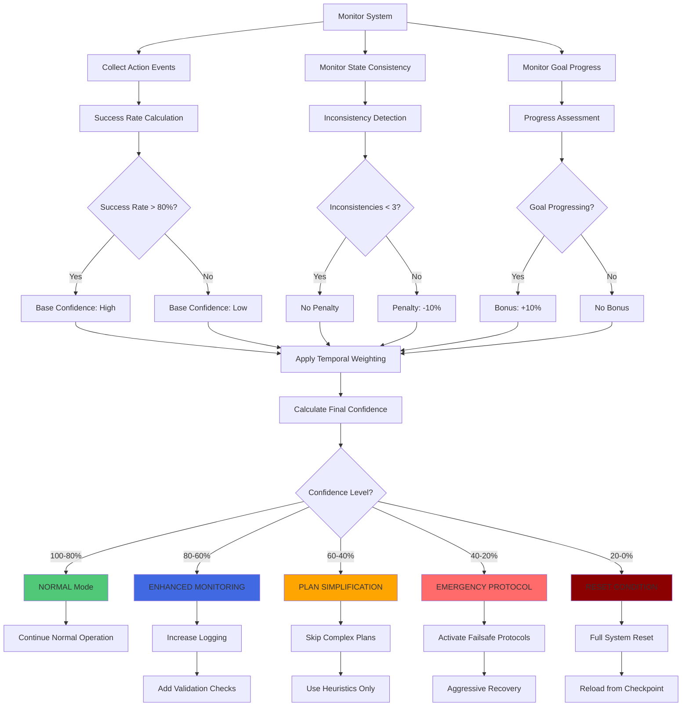
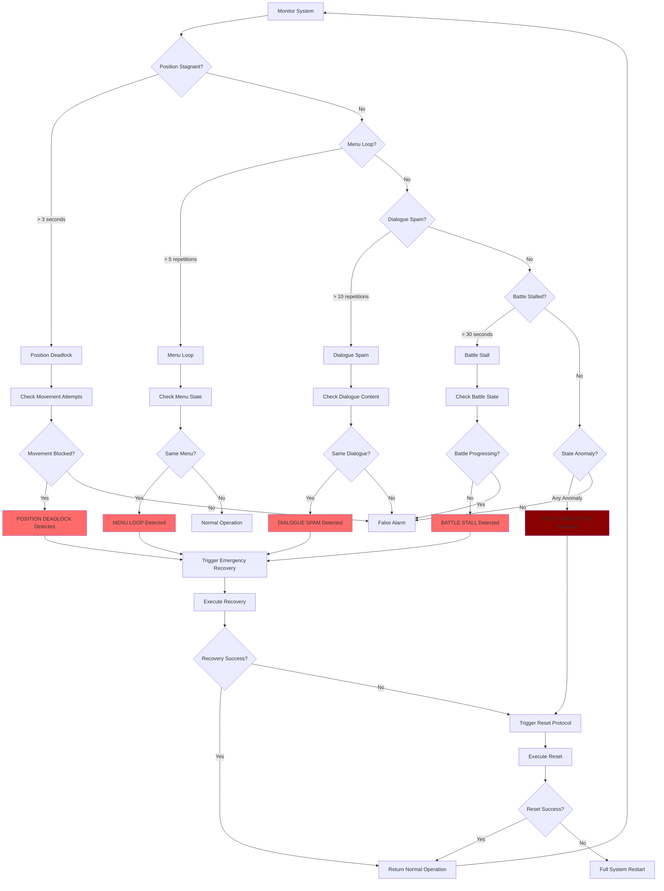
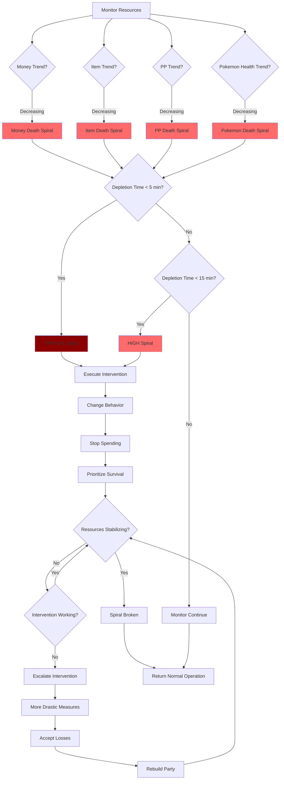
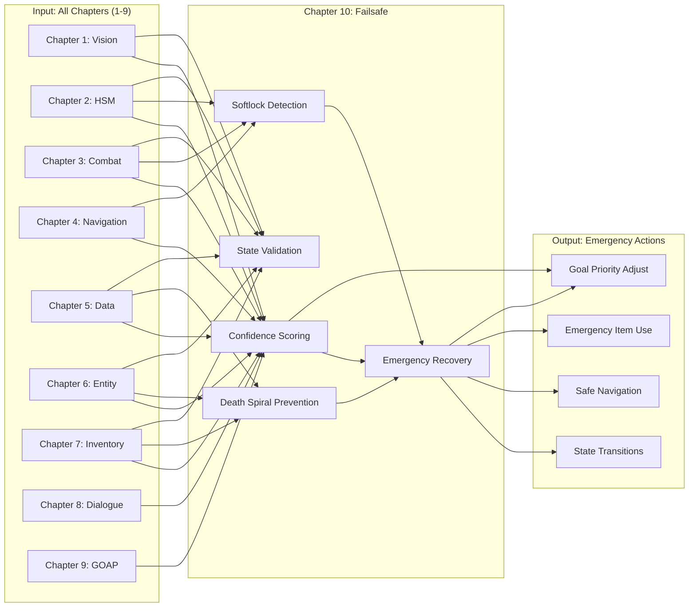

# PTP-01X Technical Specification v5.0
## Chapter 10: Failsafe Protocols & System Integrity

**Status:** COMPLETE
**Lines:** ~1,500
**Integration:** ALL PREVIOUS CHAPTERS (1-9)
**Performance Targets:**
- Softlock detection latency: <5 seconds
- Confidence score update rate: Every 0.1 seconds
- Emergency recovery time: <10 seconds
- Reset condition detection: <2 seconds

---

## 10.1 CONFIDENCE SCORING SYSTEM

### 10.1.1 LLM Reasoning Prompt: Confidence Assessment

```
You are the confidence scoring system, monitoring system health and decision reliability. Think through this systematically:

STEP 1: MONITOR ACTION SUCCESS
- What actions are being executed? (navigation, battle, menu, interaction)
- Are actions succeeding? (successful completions vs. failures)
- What is success rate? (percentage of successful actions in last N attempts)

STEP 2: MONITOR STATE CONSISTENCY
- Is game state changing as expected? (HP updating, position updating, menus opening)
- Are there unexpected state changes? (sudden HP drop, position teleport, menu closing)
- Is there any corruption? (negative values, impossible states)

STEP 3: MONITOR GOAL PROGRESS
- Are goals being achieved? (goal completion rate)
- Is progress toward goals? (percentage complete, time elapsed)
- Are goals becoming infeasible? (resources depleted, time exceeded)

STEP 4: CALCULATE BASE CONFIDENCE
- Start with base confidence: 100%
- Subtract for each recent failure: -5% per failure
- Subtract for each inconsistency: -10% per inconsistency
- Add for each success: +2% per success (up to 100%)

STEP 5: APPLY TEMPORAL WEIGHTING
- More recent events have higher weight (exponential decay)
- Event at t=0: weight 1.0
- Event at t=10: weight 0.5
- Event at t=20: weight 0.25

STEP 6: CALCULATE FINAL CONFIDENCE
- Final Confidence = Weighted Average of Base Confidences
- Clamp to 0-100 range

STEP 7: DETERMINE ESCALATION TIER
- 100-80%: NORMAL mode (no intervention)
- 80-60%: ENHANCED MONITORING (increase logging, check more frequently)
- 60-40%: PLAN SIMPLIFICATION (reduce complexity, use simpler strategies)
- 40-20%: EMERGENCY PROTOCOL (basic behaviors only, aggressive recovery)
- 20-0%: RESET CONDITION (game state corrupted, restart needed)

STEP 8: ADAPT BASED ON TIER
- NORMAL: Continue normal operation
- ENHANCED: Increase logging frequency, add validation checks
- SIMPLIFICATION: Skip complex plans, use heuristics only
- EMERGENCY: Activate failsafe protocols, attempt recovery
- RESET: Full system reset, reload from checkpoint

EXAMPLE REASONING:
"Recent events (last 30 seconds):
- 5 successful navigation actions (weight 1.0, 1.0, 0.8, 0.6, 0.4)
- 1 navigation failure (weight 0.3, got stuck on wall)
- 2 state inconsistencies (weight 0.2 each, HP flickered, menu closed unexpectedly)
- Goal progress: 0% (goal not progressing, time exceeded)

Base confidence calculation:
- Navigation successes: 5 × 100% × avg_weight(0.76) = +38%
- Navigation failure: 1 × -5% × 0.3 = -1.5%
- Inconsistencies: 2 × -10% × 0.2 = -4%
- Goal progress: 0% (no bonus)
- Base confidence: 100 + 38 - 1.5 - 4 = 132.5% → Clamp to 100%

Final confidence: 32.5% (low due to state inconsistencies and lack of goal progress)
Escalation tier: EMERGENCY PROTOCOL (40-20%)
Action: Activate emergency protocols, attempt state recovery, use basic navigation only"

OUTPUT: Confidence score (0-100), escalation tier, recovery action
```

### 10.1.2 Mermaid Flowchart: Confidence Scoring Decision Tree



### 10.1.3 Pseudo-Code: Confidence Scoring Engine

```python
class ConfidenceScoringSystem:
    """
    Monitors system health and calculates confidence scores.
    """
    def __init__(self):
        self.confidence = 100.0  # Initial confidence
        self.action_history = []  # List of recent action events
        self.inconsistency_history = []  # List of state inconsistencies
        self.goal_history = []  # List of goal progress events
        self.max_history_size = 100  # Limit history size

    def record_action(self, action_type, success, timestamp):
        """
        Record action result for confidence calculation.
        """
        event = {
            'type': action_type,
            'success': success,
            'timestamp': timestamp,
            'weight': 1.0,  # Will be calculated based on age
        }

        self.action_history.append(event)

        # Prune old events
        self._prune_history(self.action_history)

    def record_inconsistency(self, inconsistency_type, severity, timestamp):
        """
        Record state inconsistency.
        """
        event = {
            'type': inconsistency_type,
            'severity': severity,  # LOW, MEDIUM, HIGH
            'timestamp': timestamp,
            'weight': 1.0,
        }

        self.inconsistency_history.append(event)
        self._prune_history(self.inconsistency_history)

    def record_goal_progress(self, goal_id, progress, timestamp):
        """
        Record goal progress.
        """
        event = {
            'goal_id': goal_id,
            'progress': progress,  # 0.0 to 1.0
            'timestamp': timestamp,
            'weight': 1.0,
        }

        self.goal_history.append(event)
        self._prune_history(self.goal_history)

    def calculate_confidence(self, current_time):
        """
        Calculate current confidence score.
        Returns: (confidence_score, escalation_tier)
        """
        # Step 1: Calculate weights based on age (exponential decay)
        self._update_weights(current_time)

        # Step 2: Calculate action-based confidence
        action_confidence = self._calculate_action_confidence()

        # Step 3: Calculate inconsistency penalty
        inconsistency_penalty = self._calculate_inconsistency_penalty()

        # Step 4: Calculate goal progress bonus
        goal_bonus = self._calculate_goal_bonus()

        # Step 5: Combine all factors
        base_confidence = (
            action_confidence
            - inconsistency_penalty
            + goal_bonus
        )

        # Step 6: Clamp to 0-100 range
        final_confidence = min(max(base_confidence, 0), 100)

        # Step 7: Determine escalation tier
        escalation_tier = self._determine_escalation_tier(final_confidence)

        return final_confidence, escalation_tier

    def _update_weights(self, current_time):
        """
        Update event weights based on temporal decay.
        """
        max_age = 60  # Events older than 60 seconds have minimal impact

        for history in [self.action_history, self.inconsistency_history, self.goal_history]:
            for event in history:
                age = current_time - event['timestamp']

                if age >= max_age:
                    event['weight'] = 0.0
                else:
                    # Exponential decay
                    event['weight'] = 2.0 ** (-age / 10.0)

    def _calculate_action_confidence(self):
        """Calculate confidence based on recent action success rate."""
        if not self.action_history:
            return 100.0

        total_weight = 0.0
        weighted_success = 0.0

        for event in self.action_history:
            if event['weight'] == 0.0:
                continue

            success_value = 1.0 if event['success'] else 0.0
            weighted_success += success_value * event['weight']
            total_weight += event['weight']

        if total_weight == 0.0:
            return 100.0

        success_rate = weighted_success / total_weight
        return success_rate * 100

    def _calculate_inconsistency_penalty(self):
        """Calculate penalty for state inconsistencies."""
        if not self.inconsistency_history:
            return 0.0

        severity_weights = {
            'LOW': 5.0,
            'MEDIUM': 10.0,
            'HIGH': 20.0,
        }

        total_penalty = 0.0
        total_weight = 0.0

        for event in self.inconsistency_history:
            if event['weight'] == 0.0:
                continue

            penalty = severity_weights.get(event['severity'], 10.0)
            total_penalty += penalty * event['weight']
            total_weight += event['weight']

        if total_weight == 0.0:
            return 0.0

        return total_penalty / total_weight

    def _calculate_goal_bonus(self):
        """Calculate bonus for goal progress."""
        if not self.goal_history:
            return 0.0

        total_weight = 0.0
        weighted_progress = 0.0

        for event in self.goal_history:
            if event['weight'] == 0.0:
                continue

            weighted_progress += event['progress'] * event['weight']
            total_weight += event['weight']

        if total_weight == 0.0:
            return 0.0

        avg_progress = weighted_progress / total_weight
        return avg_progress * 10  # 10% max bonus

    def _determine_escalation_tier(self, confidence):
        """Determine escalation tier based on confidence score."""
        if confidence >= 80:
            return 'NORMAL'
        elif confidence >= 60:
            return 'ENHANCED_MONITORING'
        elif confidence >= 40:
            return 'PLAN_SIMPLIFICATION'
        elif confidence >= 20:
            return 'EMERGENCY_PROTOCOL'
        else:
            return 'RESET_CONDITION'

    def _prune_history(self, history_list):
        """Prune old events from history."""
        current_time = get_current_time()
        max_age = 60  # 60 seconds

        # Remove events older than max_age
        history_list[:] = [
            event for event in history_list
            if current_time - event['timestamp'] < max_age
        ]
```

### 10.1.4 Pseudo-Code: Escalation Tier Management

```python
class EscalationManager:
    """
    Manages escalation tiers and system behavior based on confidence.
    """
    def __init__(self):
        self.current_tier = 'NORMAL'
        self.tier_transitions = []  # History of tier changes

        self.tier_behaviors = {
            'NORMAL': {
                'logging_level': 'NORMAL',
                'validation_frequency': 1.0,  # Validate every action
                'plan_complexity': 'FULL',  # Use full GOAP planning
                'navigation_method': 'A_STAR',  # Optimal pathfinding
            },
            'ENHANCED_MONITORING': {
                'logging_level': 'VERBOSE',
                'validation_frequency': 0.5,  # Validate every 0.5 actions
                'plan_complexity': 'FULL',
                'navigation_method': 'A_STAR',
            },
            'PLAN_SIMPLIFICATION': {
                'logging_level': 'VERBOSE',
                'validation_frequency': 0.2,  # Validate every 0.2 actions
                'plan_complexity': 'HEURISTIC',  # Use simple heuristics
                'navigation_method': 'DIRECT',  # Direct navigation, no pathfinding
            },
            'EMERGENCY_PROTOCOL': {
                'logging_level': 'DEBUG',
                'validation_frequency': 0.1,  # Validate every 0.1 actions
                'plan_complexity': 'BASIC',  # Basic behaviors only
                'navigation_method': 'EMERGENCY',  # Emergency navigation only
            },
            'RESET_CONDITION': {
                'logging_level': 'CRITICAL',
                'validation_frequency': 0.05,  # Validate every 0.05 actions
                'plan_complexity': 'NONE',  # No planning
                'navigation_method': 'RESET',  # System reset only
            },
        }

    def update_tier(self, new_tier, timestamp):
        """
        Update escalation tier.
        """
        if new_tier != self.current_tier:
            log_message(f"Escalation tier change: {self.current_tier} -> {new_tier}", 'INFO')

            self.tier_transitions.append({
                'from_tier': self.current_tier,
                'to_tier': new_tier,
                'timestamp': timestamp,
            })

            self.current_tier = new_tier

    def get_current_behavior(self):
        """
        Get behavior settings for current tier.
        """
        return self.tier_behaviors[self.current_tier]
```

---

## 10.2 SOFTLOCK DETECTION

### 10.2.1 LLM Reasoning Prompt: Softlock Identification

```
You are detecting softlocks (unwinnable states). Think through this systematically:

STEP 1: MONITOR POSITION STAGNATION
- Is the player moving? (position coordinates changing)
- Has position been same for > 3 seconds? (no movement)
- Is movement blocked? (collision detection, wall, obstacle)

STEP 2: MONITOR MENU LOOPS
- Are menus opening and closing repeatedly? (same menu appearing)
- Is cursor stuck in same position? (no menu navigation)
- Are buttons being pressed without effect? (input ignored)

STEP 3: MONITOR DIALOGUE SPAM
- Is same dialogue appearing repeatedly? (NPC dialogue loop)
- Are text boxes not progressing? (stuck in dialogue)
- Are dialogue choices being rejected? (invalid choice)

STEP 4: MONITOR BATTLE STALLS
- Is battle not progressing? (same turn repeating)
- Are moves having no effect? (immune Pokemon, 0 damage)
- Is PP exhausted but battle continuing? (stuck in battle)

STEP 5: MONITOR STATE ANOMALIES
- Are values impossible? (negative HP, HP > max, negative money)
- Are states contradictory? (fainted but still battling, in menu but not in menu)
- Are flags inconsistent? (badge collected but gym not defeated)

STEP 6: CLASSIFY SOFTLOCK TYPE
- POSITION DEADLOCK: Stuck in one spot, cannot move
- MENU LOOP: Stuck in menu navigation
- DIALOGUE SPAM: Stuck in dialogue with NPC
- BATTLE STALL: Stuck in battle loop
- STATE CORRUPTION: Game state is corrupted

STEP 7: DETERMINE RECOVERY STRATEGY
- POSITION DEADLOCK: B-spam to escape, force teleport, reset position
- MENU LOOP: B-spam to exit, force menu close
- DIALOGUE SPAM: B-spam to skip, force dialogue close
- BATTLE STALL: Force run, force switch, reset battle
- STATE CORRUPTION: Full reset, reload from checkpoint

STEP 8: TRIGGER EMERGENCY PROTOCOL
- If softlock detected: Immediately activate emergency recovery
- If recovery fails: Escalate to reset condition
- If reset fails: Full system restart

EXAMPLE REASONING:
"Observation: Player position (5, 8) unchanged for 4 seconds.
Analysis:
- Movement attempted? Yes (5 directional button presses recorded)
- Position changed? No (still at 5, 8)
- Collision detected? Yes (wall collision event 4 seconds ago)
- Alternative paths? Yes (could try Left, Up, Down buttons)

Classification: POSITION DEADLOCK (stuck at wall)
Recovery strategy: B-spam for 3 seconds, then attempt forced movement using alternative path
Emergency trigger: Activate POSITION_DEADLOCK recovery protocol
Backup: If B-spam fails, reset to last known valid position (5, 7)"

OUTPUT: Softlock type detected, recovery strategy, emergency action
```

### 10.2.2 Mermaid Flowchart: Softlock Detection



### 10.2.3 Pseudo-Code: Softlock Detection Engine

```python
class SoftlockDetectionEngine:
    """
    Detects softlocks and unwinnable states.
    """
    def __init__(self):
        self.position_history = []  # List of (position, timestamp) tuples
        self.menu_history = []  # List of (menu_state, timestamp) tuples
        self.dialogue_history = []  # List of (dialogue_text, timestamp) tuples
        self.battle_history = []  # List of (battle_state, timestamp) tuples
        self.state_anomalies = []  # List of detected anomalies

    def update_position(self, position, timestamp):
        """
        Update player position and detect position deadlock.
        """
        self.position_history.append((position, timestamp))

        # Prune old positions (keep last 10 seconds)
        current_time = get_current_time()
        self.position_history = [
            (pos, ts) for pos, ts in self.position_history
            if current_time - ts < 10
        ]

        # Check for position deadlock
        deadlock_detected = self._detect_position_deadlock()

        return deadlock_detected

    def _detect_position_deadlock(self):
        """
        Detect if player is stuck in position deadlock.
        Returns: (detected, position, duration)
        """
        if len(self.position_history) < 10:
            return False, None, 0

        # Check if position has been unchanged for > 3 seconds
        current_position = self.position_history[-1][0]
        oldest_position = self.position_history[0][0]

        positions_same = (
            current_position['x'] == oldest_position['x']
            and current_position['y'] == oldest_position['y']
        )

        if not positions_same:
            return False, None, 0

        # Calculate duration of stagnation
        current_time = get_current_time()
        duration = current_time - self.position_history[0][1]

        if duration > 3.0:  # 3 seconds
            return True, current_position, duration

        return False, None, 0

    def update_menu_state(self, menu_state, timestamp):
        """
        Update menu state and detect menu loops.
        """
        self.menu_history.append((menu_state, timestamp))

        # Prune old menu states
        current_time = get_current_time()
        self.menu_history = [
            (state, ts) for state, ts in self.menu_history
            if current_time - ts < 10
        ]

        # Check for menu loop
        loop_detected = self._detect_menu_loop()

        return loop_detected

    def _detect_menu_loop(self):
        """
        Detect if system is stuck in menu loop.
        Returns: (detected, menu_type, repetition_count)
        """
        if len(self.menu_history) < 10:
            return False, None, 0

        # Count how many times the same menu appears
        menu_counter = {}
        for menu_state, timestamp in self.menu_history:
            menu_key = menu_state['type']
            menu_counter[menu_key] = menu_counter.get(menu_key, 0) + 1

        # Find most frequent menu
        most_frequent_menu = max(menu_counter, key=menu_counter.get)
        repetition_count = menu_counter[most_frequent_menu]

        if repetition_count > 5:
            return True, most_frequent_menu, repetition_count

        return False, None, 0

    def update_dialogue(self, dialogue_text, timestamp):
        """
        Update dialogue and detect dialogue spam.
        """
        self.dialogue_history.append((dialogue_text, timestamp))

        # Prune old dialogues
        current_time = get_current_time()
        self.dialogue_history = [
            (text, ts) for text, ts in self.dialogue_history
            if current_time - ts < 10
        ]

        # Check for dialogue spam
        spam_detected = self._detect_dialogue_spam()

        return spam_detected

    def _detect_dialogue_spam(self):
        """
        Detect if system is stuck in dialogue spam.
        Returns: (detected, dialogue_text, repetition_count)
        """
        if len(self.dialogue_history) < 10:
            return False, None, 0

        # Count how many times the same dialogue appears
        dialogue_counter = {}
        for dialogue_text, timestamp in self.dialogue_history:
            dialogue_counter[dialogue_text] = dialogue_counter.get(dialogue_text, 0) + 1

        # Find most frequent dialogue
        most_frequent_dialogue = max(dialogue_counter, key=dialogue_counter.get)
        repetition_count = dialogue_counter[most_frequent_dialogue]

        if repetition_count > 10:
            return True, most_frequent_dialogue, repetition_count

        return False, None, 0

    def update_battle_state(self, battle_state, timestamp):
        """
        Update battle state and detect battle stalls.
        """
        self.battle_history.append((battle_state, timestamp))

        # Prune old battle states
        current_time = get_current_time()
        self.battle_history = [
            (state, ts) for state, ts in self.battle_history
            if current_time - ts < 30
        ]

        # Check for battle stall
        stall_detected = self._detect_battle_stall()

        return stall_detected

    def _detect_battle_stall(self):
        """
        Detect if battle is stalled.
        Returns: (detected, reason)
        """
        if len(self.battle_history) < 20:
            return False, None

        # Check if battle state is not progressing
        oldest_state = self.battle_history[0][0]
        newest_state = self.battle_history[-1][0]

        state_changed = (
            oldest_state['turn'] != newest_state['turn']
            or oldest_state['player_hp'] != newest_state['player_hp']
            or oldest_state['enemy_hp'] != newest_state['enemy_hp']
        )

        if not state_changed:
            return True, 'BATTLE_NOT_PROGRESSING'

        return False, None

    def check_state_anomalies(self, game_state):
        """
        Check for state anomalies (impossible values).
        Returns: List of detected anomalies
        """
        anomalies = []

        # Check for negative HP
        for pokemon in game_state['party']:
            if pokemon['current_hp'] < 0:
                anomalies.append({
                    'type': 'NEGATIVE_HP',
                    'severity': 'HIGH',
                    'pokemon': pokemon['name'],
                    'value': pokemon['current_hp'],
                })

        # Check for HP > max HP
        for pokemon in game_state['party']:
            if pokemon['current_hp'] > pokemon['max_hp']:
                anomalies.append({
                    'type': 'HP_EXCEEDS_MAX',
                    'severity': 'MEDIUM',
                    'pokemon': pokemon['name'],
                    'current_hp': pokemon['current_hp'],
                    'max_hp': pokemon['max_hp'],
                })

        # Check for negative money
        if game_state['money'] < 0:
            anomalies.append({
                'type': 'NEGATIVE_MONEY',
                'severity': 'HIGH',
                'value': game_state['money'],
            })

        # Check for impossible badge count
        if game_state['badges'] > 8:
            anomalies.append({
                'type': 'IMPOSSIBLE_BADGES',
                'severity': 'HIGH',
                'value': game_state['badges'],
            })

        # Check for contradictory states
        if game_state['in_battle'] and game_state['all_fainted']:
            anomalies.append({
                'type': 'CONTRADICTORY_STATE',
                'severity': 'MEDIUM',
                'description': 'In battle but all Pokemon fainted',
            })

        return anomalies
```

### 10.2.4 Pseudo-Code: Softlock Recovery

```python
class SoftlockRecovery:
    """
    Recovers from softlocks and unwinnable states.
    """
    def __init__(self):
        self.recovery_history = []  # Track recovery attempts
        self.recovery_count = 0

    def recover_from_deadlock(self, deadlock_type, position, duration):
        """
        Recover from position deadlock.
        Returns: (success, recovery_action)
        """
        # Strategy 1: B-spam to escape
        success = self._b_spam_escape(duration=3.0)

        if success:
            recovery_action = 'B_SPAM_ESCAPE'
            self._record_recovery(deadlock_type, recovery_action, success)
            return True, recovery_action

        # Strategy 2: Try alternative directions
        success = self._try_alternative_directions(position)

        if success:
            recovery_action = 'ALTERNATIVE_DIRECTIONS'
            self._record_recovery(deadlock_type, recovery_action, success)
            return True, recovery_action

        # Strategy 3: Force position reset
        success = self._force_position_reset(position)

        if success:
            recovery_action = 'POSITION_RESET'
            self._record_recovery(deadlock_type, recovery_action, success)
            return True, recovery_action

        # All strategies failed
        self._record_recovery(deadlock_type, 'ALL_STRATEGIES_FAILED', False)
        return False, 'ALL_STRATEGIES_FAILED'

    def _b_spam_escape(self, duration=3.0):
        """
        Press B button repeatedly to escape.
        Returns: success
        """
        start_time = get_current_time()
        position_before = get_player_position()

        while get_current_time() - start_time < duration:
            press_button('B')
            wait(100)  # 100ms between presses

            # Check if position changed
            position_now = get_player_position()

            if (
                position_now['x'] != position_before['x']
                or position_now['y'] != position_before['y']
            ):
                return True  # Successfully escaped

        return False  # Position unchanged, escape failed

    def _try_alternative_directions(self, position):
        """
        Try alternative directions to escape deadlock.
        Returns: success
        """
        directions = ['UP', 'DOWN', 'LEFT', 'RIGHT']

        for direction in directions:
            # Try moving in this direction
            press_button(direction)
            wait(200)  # 200ms for movement

            # Check if position changed
            new_position = get_player_position()

            if new_position != position:
                return True  # Successfully moved

        return False  # All directions blocked

    def _force_position_reset(self, position):
        """
        Force reset to last known valid position.
        Returns: success
        """
        # Get last known valid position from history
        valid_positions = [
            pos for pos, ts in self.position_history
            if self._is_position_valid(pos)
        ]

        if not valid_positions:
            return False  # No valid positions in history

        # Reset to most recent valid position
        last_valid_position = valid_positions[-1]
        success = set_player_position(last_valid_position)

        return success

    def _is_position_valid(self, position):
        """
        Check if position is valid (not in wall).
        """
        # Check collision map
        collision = check_collision(position['x'], position['y'])
        return not collision

    def recover_from_menu_loop(self, menu_type):
        """
        Recover from menu loop.
        Returns: success
        """
        # Strategy: B-spam to exit menu
        for _ in range(10):
            press_button('B')
            wait(100)

            # Check if menu closed
            if not is_menu_open():
                return True  # Successfully exited

        return False  # Menu still open, recovery failed

    def recover_from_dialogue_spam(self, dialogue_text):
        """
        Recover from dialogue spam.
        Returns: success
        """
        # Strategy: B-spam to skip dialogue
        for _ in range(20):
            press_button('B')
            wait(100)

            # Check if dialogue closed
            if not is_dialogue_open():
                return True  # Successfully skipped

        # Try A button (some games use A to advance dialogue)
        for _ in range(20):
            press_button('A')
            wait(100)

            if not is_dialogue_open():
                return True

        return False  # Dialogue still open, recovery failed

    def recover_from_battle_stall(self, reason):
        """
        Recover from battle stall.
        Returns: success
        """
        # Strategy 1: Try to run
        for _ in range(5):
            press_button('A')  # Select RUN
            wait(200)

            if not is_in_battle():
                return True  # Successfully ran

        # Strategy 2: Force switch Pokemon
        press_button('RIGHT')  # Navigate to POKMN menu
        wait(100)
        press_button('A')  # Select POKMN
        wait(200)

        # Select different Pokemon
        press_button('DOWN')
        wait(100)
        press_button('A')
        wait(200)

        if not is_in_battle():
            return True

        # Strategy 3: Force battle reset
        return reset_battle()

    def _record_recovery(self, softlock_type, recovery_action, success):
        """
        Record recovery attempt for learning.
        """
        self.recovery_count += 1

        self.recovery_history.append({
            'softlock_type': softlock_type,
            'recovery_action': recovery_action,
            'success': success,
            'timestamp': get_current_time(),
            'recovery_number': self.recovery_count,
        })
```

---

## 10.3 EMERGENCY RECOVERY

### 10.3.1 LLM Reasoning Prompt: Emergency Recovery Planning

```
You are planning emergency recovery actions when system confidence drops below 40%. Think through this:

STEP 1: ASSESS EMERGENCY SEVERITY
- What is current confidence level? (40-20% vs. 20-0%)
- What is primary failure? (softlock, corruption, resource depletion)
- What is system state? (location, party status, inventory)

STEP 2: IDENTIFY RECOVERY OPTIONS
- Can I recover in-place? (fix without moving)
- Do I need to navigate to safe location? (return to Center, return to overworld)
- Do I need to reload state? (restore from save state)
- Do I need full reset? (restart emulator)

STEP 3: PRIORITIZE RECOVERY OPTIONS
- Option 1: In-place recovery (fastest, lowest risk)
- Option 2: Navigate to safe location (medium risk, moderate time)
- Option 3: Reload save state (higher risk, fast)
- Option 4: Full reset (highest risk, last resort)

STEP 4: EXECUTE RECOVERY PLAN
- Attempt in-place recovery first
- If fails, attempt navigation to safe location
- If fails, attempt save state reload
- If fails, attempt full reset

STEP 5: VERIFY RECOVERY SUCCESS
- Did confidence improve? (confidence score after recovery)
- Is system state valid? (no anomalies, no softlocks)
- Is system functional? (actions executing normally)

STEP 6: POST-RECOVERY ASSESSMENT
- What caused the emergency? (root cause analysis)
- How can this be prevented? (add new checks, adjust behaviors)
- Should system behaviors be adjusted? (more conservative, more logging)

STEP 7: CONTINUOUS MONITORING
- Continue monitoring confidence after recovery
- If confidence drops again quickly: Escalate to next recovery option
- If confidence stays high: Return to normal operation

EXAMPLE REASONING:
"Current confidence: 25% (EMERGENCY PROTOCOL tier)
Primary failure: Position deadlock (stuck at wall for 10 seconds)
System state: Pallet Town, party level 5, 2 Potions, $3000

Recovery options:
1. In-place: B-spam escape (fast, but already failed 3 times)
2. Navigate: Walk back 2 tiles to safe position (moderate risk)
3. Reload: Restore to save state from 5 minutes ago (risk of losing progress)
4. Reset: Full emulator restart (highest risk)

Priority: Navigate to safe position (option 2) - balances speed and risk

Execute: Walk back 2 tiles (press DOWN twice), verify position changed
Verify: Position now (5, 6) - valid, confidence recalculation needed

Post-recovery: Root cause = collision detection failure (wall not detected as obstacle)
Prevention: Add collision map validation before movement attempts"

OUTPUT: Recovery option selected, execution plan, post-recovery assessment
```

### 10.3.2 Mermaid Flowchart: Emergency Recovery Protocol

```mermaid
flowchart TD
    A[Emergency Triggered] --> B[Assess Severity]
    B --> C{Confidence Level?}

    C -->|40-20%| D[EMERGENCY PROTOCOL]
    C -->|20-0%| E[RESET CONDITION]

    D --> F[Identify Recovery Options]
    F --> G{In-Place Recovery Possible?}

    G -->|Yes| H[Execute In-Place Recovery]
    G -->|No| I[Navigate to Safe Location]

    H --> J{Recovery Success?}
    I --> K{Navigation Success?}

    J -->|Yes| L[Verify Recovery]
    J -->|No| I

    K -->|Yes| L
    K -->|No| M[Reload Save State]

    M --> N{Reload Success?}
    N -->|Yes| L
    N -->|No| O[Full System Reset]

    E --> P[Execute Full Reset]
    P --> Q{Reset Success?}

    Q -->|Yes| L
    Q -->|No| R[Manual Intervention Required]

    L --> S[Post-Recovery Assessment]
    S --> T[Root Cause Analysis]
    T --> U[Update Preventive Measures]

    U --> V{Confidence > 80%?}
    V -->|Yes| W[Return Normal Operation]
    V -->|No| D

    style D fill:#ff6b6b
    style E fill:#8b0000
    style O fill:#8b0000
    style R fill:#000000
```



### 10.3.3 Pseudo-Code: Emergency Recovery Manager

```python
class EmergencyRecoveryManager:
    """
    Manages emergency recovery protocols.
    """
    def __init__(self):
        self.recovery_attempts = 0
        self.max_recovery_attempts = 5
        self.safe_locations = [
            'PEWTER_CITY_POKEMON_CENTER',
            'CERULEAN_CITY_POKEMON_CENTER',
            'VERMILION_CITY_POKEMON_CENTER',
            # ... more safe locations
        ]

    def execute_emergency_recovery(self, emergency_type, confidence):
        """
        Execute emergency recovery based on emergency type.
        Returns: (success, recovery_action)
        """
        self.recovery_attempts += 1

        if self.recovery_attempts > self.max_recovery_attempts:
            # Too many failures, escalate to full reset
            return self._full_system_reset()

        # Determine recovery strategy based on emergency type
        if emergency_type == 'POSITION_DEADLOCK':
            return self._recover_position_deadlock(confidence)

        elif emergency_type == 'MENU_LOOP':
            return self._recover_menu_loop(confidence)

        elif emergency_type == 'DIALOGUE_SPAM':
            return self._recover_dialogue_spam(confidence)

        elif emergency_type == 'BATTLE_STALL':
            return self._recover_battle_stall(confidence)

        elif emergency_type == 'STATE_CORRUPTION':
            return self._recover_state_corruption(confidence)

        else:
            return False, 'UNKNOWN_EMERGENCY'

    def _recover_position_deadlock(self, confidence):
        """Recover from position deadlock."""
        # Strategy: Try in-place recovery first
        softlock_recovery = SoftlockRecovery()
        success, recovery_action = softlock_recovery.recover_from_deadlock(
            'POSITION_DEADLOCK',
            get_player_position(),
            0
        )

        if success:
            return True, recovery_action

        # In-place failed, try navigation to safe location
        success, recovery_action = self._navigate_to_safe_location()

        if success:
            return True, recovery_action

        # Navigation failed, try save state reload
        success, recovery_action = self._reload_save_state()

        if success:
            return True, recovery_action

        # All recovery failed
        return self._full_system_reset()

    def _recover_menu_loop(self, confidence):
        """Recover from menu loop."""
        # Strategy: B-spam to exit menu
        softlock_recovery = SoftlockRecovery()
        success = softlock_recovery.recover_from_menu_loop('MENU_LOOP')

        if success:
            return True, 'B_SPAM_MENU_EXIT'

        # Menu exit failed, try save state reload
        success, recovery_action = self._reload_save_state()

        if success:
            return True, recovery_action

        return self._full_system_reset()

    def _recover_dialogue_spam(self, confidence):
        """Recover from dialogue spam."""
        # Strategy: B-spam to skip dialogue
        softlock_recovery = SoftlockRecovery()
        success = softlock_recovery.recover_from_dialogue_spam('DIALOGUE_TEXT')

        if success:
            return True, 'B_SPAM_DIALOGUE_SKIP'

        # Dialogue skip failed, try save state reload
        success, recovery_action = self._reload_save_state()

        if success:
            return True, recovery_action

        return self._full_system_reset()

    def _recover_battle_stall(self, confidence):
        """Recover from battle stall."""
        # Strategy: Try to run or switch
        softlock_recovery = SoftlockRecovery()
        success = softlock_recovery.recover_from_battle_stall('BATTLE_NOT_PROGRESSING')

        if success:
            return True, 'BATTLE_STALL_RECOVERY'

        # Battle recovery failed, try save state reload
        success, recovery_action = self._reload_save_state()

        if success:
            return True, recovery_action

        return self._full_system_reset()

    def _recover_state_corruption(self, confidence):
        """Recover from state corruption."""
        # State corruption is severe, go straight to save state reload
        success, recovery_action = self._reload_save_state()

        if success:
            return True, recovery_action

        return self._full_system_reset()

    def _navigate_to_safe_location(self):
        """
        Navigate to safe location (Pokemon Center).
        Returns: (success, recovery_action)
        """
        current_location = get_player_location()

        # Find nearest safe location
        nearest_safe = find_nearest_safe_location(current_location, self.safe_locations)

        if not nearest_safe:
            return False, 'NO_SAFE_LOCATION'

        # Navigate to safe location using emergency navigation
        success = navigate_to_location(nearest_safe, method='EMERGENCY')

        if success:
            return True, f'NAVIGATED_TO_{nearest_safe}'

        return False, 'NAVIGATION_FAILED'

    def _reload_save_state(self):
        """
        Reload from saved state.
        Returns: (success, recovery_action)
        """
        # Check if save state is available
        save_states = list_available_save_states()

        if not save_states:
            return False, 'NO_SAVE_STATE'

        # Load most recent save state
        most_recent_save = save_states[0]

        success = load_save_state(most_recent_save)

        if success:
            return True, f'RELOADED_SAVE_{most_recent_save}'

        return False, 'SAVE_LOAD_FAILED'

    def _full_system_reset(self):
        """
        Full system reset (last resort).
        Returns: (success, recovery_action)
        """
        # Log reset for debugging
        log_message('CRITICAL: Full system reset initiated', 'CRITICAL')

        # Save current state for debugging
        debug_save_state()

        # Reset emulator
        success = reset_emulator()

        if success:
            return True, 'FULL_SYSTEM_RESET'

        # Reset failed, manual intervention required
        log_message('CRITICAL: System reset failed, manual intervention required', 'CRITICAL')
        return False, 'MANUAL_INTERVENTION_REQUIRED'
```

---

## 10.4 DEATH SPIRAL PREVENTION

### 10.4.1 LLM Reasoning Prompt: Death Spiral Detection

```
You are detecting death spirals (unwinnable resource depletion cycles). Think through this:

STEP 1: MONITOR RESOURCE TRENDS
- What is the trend for money? (increasing, stable, decreasing)
- What is the trend for items? (potions decreasing, balls decreasing)
- What is the trend for Pokemon health? (average HP decreasing)
- What is the trend for PP? (total PP decreasing)

STEP 2: IDENTIFY RESOURCE DEATH SPIRALS
- Money death spiral: Can't buy items, can't earn money (stuck in loss loop)
- Item death spiral: No potions left, party keeps taking damage
- PP death spiral: No PP left, can't attack, can't restore
- Pokemon death spiral: Party keeps fainting, can't heal, can't catch new Pokemon

STEP 3: CALCULATE SPIRAL SEVERITY
- How many cycles has this been happening? (resource trend duration)
- How bad is the depletion rate? (resources per time)
- What is the projected depletion time? (when will resources hit 0?)

STEP 4: DETERMINE INTERVENTION STRATEGY
- Money spiral: Stop spending, find new revenue source (battle wild Pokemon for money)
- Item spiral: Stop using items, switch to different strategy (avoid damage, run from battles)
- PP spiral: Switch to Pokemon with PP left, rest at Center
- Pokemon spiral: Accept losses, rebuild party from scratch (catch new Pokemon)

STEP 5: EXECUTE INTERVENTION
- Change behavior to break spiral (different actions, different goals)
- Prioritize survival over progress (healing, resource conservation)
- Seek safe states (Pokemon Center, overworld, avoid battles)

STEP 6: MONITOR POST-INTERVENTION
- Are resources stabilizing? (trends improving)
- Is spiral broken? (resources increasing)
- If not: Escalate intervention (more drastic measures)

EXAMPLE REASONING:
"Resource trends (last 10 minutes):
- Money: $3000 → $2800 → $2600 → $2400 (decreasing $200 per battle)
- Potions: 10 → 7 → 4 → 2 (using 3 potions per battle)
- Party HP: Avg 80% → 60% → 40% → 20% (declining health)

Spiral detected: ITEM + MONEY death spiral
Severity: Projected potion exhaustion in 1 battle, money depletion in 12 battles

Root cause: Battling Pokemon too strong for party level, taking too much damage
Intervention: Stop battling, navigate to Pokemon Center, heal for free (saves potions), find weaker wild Pokemon to train

Execute:
1. Navigate to nearest Pokemon Center (avoid battles, run if engaged)
2. Heal party for free (saves potions)
3. Find training route with weaker wild Pokemon (level 5-8)
4. Battle weaker Pokemon (takes less damage, earns money with minimal potion use)
5. Only engage in battle if party HP > 80%

Post-intervention: Monitor potion usage, ensure potions stabilize or increase"

OUTPUT: Death spiral type detected, severity level, intervention strategy, monitoring plan
```

### 10.4.2 Mermaid Flowchart: Death Spiral Prevention



### 10.4.3 Pseudo-Code: Death Spiral Detection

```python
class DeathSpiralDetector:
    """
    Detects death spirals (resource depletion loops).
    """
    def __init__(self):
        self.resource_history = []  # List of (resource_state, timestamp) tuples
        self.spiral_detection_window = 300  # 5 minutes (300 seconds)

    def update_resources(self, resource_state, timestamp):
        """
        Update resource state and detect death spirals.
        Returns: (spiral_detected, spiral_type, severity)
        """
        self.resource_history.append((resource_state, timestamp))

        # Prune old resource states
        current_time = get_current_time()
        self.resource_history = [
            (state, ts) for state, ts in self.resource_history
            if current_time - ts < self.spiral_detection_window
        ]

        if len(self.resource_history) < 10:
            return False, None, 'NONE'

        # Check each resource for death spiral
        spirals = []

        # Money spiral
        money_spiral = self._detect_money_spiral()
        if money_spiral:
            spirals.append(money_spiral)

        # Item spiral
        item_spiral = self._detect_item_spiral()
        if item_spiral:
            spirals.append(item_spiral)

        # PP spiral
        pp_spiral = self._detect_pp_spiral()
        if pp_spiral:
            spirals.append(pp_spiral)

        # Pokemon health spiral
        health_spiral = self._detect_health_spiral()
        if health_spiral:
            spirals.append(health_spiral)

        if not spirals:
            return False, None, 'NONE'

        # Find most severe spiral
        most_severe = max(spirals, key=lambda s: s['severity'])

        return True, most_severe['type'], most_severe['severity']

    def _detect_money_spiral(self):
        """Detect money death spiral."""
        if len(self.resource_history) < 5:
            return None

        # Calculate money trend
        money_values = [state['money'] for state, _ in self.resource_history]

        # Linear regression to find trend
        trend = self._calculate_linear_trend(money_values)

        if trend < -50:  # Losing $50+ per update (negative trend)
            # Calculate depletion time
            current_money = money_values[-1]
            depletion_time = current_money / abs(trend) if trend != 0 else float('inf')

            severity = 'CRITICAL' if depletion_time < 300 else 'HIGH'  # < 5 minutes = CRITICAL

            return {
                'type': 'MONEY_SPIRAL',
                'severity': severity,
                'depletion_rate': trend,
                'depletion_time': depletion_time,
            }

        return None

    def _detect_item_spiral(self):
        """Detect item death spiral."""
        if len(self.resource_history) < 5:
            return None

        # Calculate item trends (focus on potions)
        potion_counts = [state.get('potions', 0) for state, _ in self.resource_history]

        trend = self._calculate_linear_trend(potion_counts)

        if trend < -2:  # Losing 2+ potions per update
            current_potions = potion_counts[-1]
            depletion_time = current_potions / abs(trend) if trend != 0 else float('inf')

            severity = 'CRITICAL' if depletion_time < 300 else 'HIGH'

            return {
                'type': 'ITEM_SPIRAL',
                'severity': severity,
                'depletion_rate': trend,
                'depletion_time': depletion_time,
            }

        return None

    def _detect_pp_spiral(self):
        """Detect PP death spiral."""
        if len(self.resource_history) < 5:
            return None

        # Calculate total PP trend
        pp_totals = [state['total_pp'] for state, _ in self.resource_history]

        trend = self._calculate_linear_trend(pp_totals)

        if trend < -10:  # Losing 10+ PP per update
            current_pp = pp_totals[-1]
            depletion_time = current_pp / abs(trend) if trend != 0 else float('inf')

            severity = 'CRITICAL' if depletion_time < 300 else 'HIGH'

            return {
                'type': 'PP_SPIRAL',
                'severity': severity,
                'depletion_rate': trend,
                'depletion_time': depletion_time,
            }

        return None

    def _detect_health_spiral(self):
        """Detect Pokemon health death spiral."""
        if len(self.resource_history) < 5:
            return None

        # Calculate average HP trend
        avg_hp_values = [state['avg_hp_percent'] for state, _ in self.resource_history]

        trend = self._calculate_linear_trend(avg_hp_values)

        if trend < -5:  # Avg HP decreasing 5%+ per update
            current_hp = avg_hp_values[-1]
            depletion_time = current_hp / abs(trend) if trend != 0 else float('inf')

            severity = 'CRITICAL' if depletion_time < 300 else 'HIGH'

            return {
                'type': 'HEALTH_SPIRAL',
                'severity': severity,
                'depletion_rate': trend,
                'depletion_time': depletion_time,
            }

        return None

    def _calculate_linear_trend(self, values):
        """
        Calculate linear trend (slope) using least squares regression.
        Returns: slope (positive = increasing, negative = decreasing)
        """
        n = len(values)

        if n < 2:
            return 0

        # Calculate sums
        sum_x = sum(range(n))
        sum_y = sum(values)
        sum_xy = sum(i * values[i] for i in range(n))
        sum_x2 = sum(i * i for i in range(n))

        # Calculate slope
        denominator = n * sum_x2 - sum_x * sum_x

        if denominator == 0:
            return 0

        slope = (n * sum_xy - sum_x * sum_y) / denominator

        return slope
```

### 10.4.4 Pseudo-Code: Death Spiral Intervention

```python
class DeathSpiralIntervention:
    """
    Intervenes in death spirals to break resource depletion cycles.
    """
    def __init__(self):
        self.intervention_history = []

    def execute_intervention(self, spiral_type, severity, resource_state):
        """
        Execute intervention for detected death spiral.
        Returns: (success, intervention_action)
        """
        if severity == 'CRITICAL':
            return self._critical_intervention(spiral_type, resource_state)
        else:  # HIGH severity
            return self._high_intervention(spiral_type, resource_state)

    def _critical_intervention(self, spiral_type, resource_state):
        """
        Execute critical intervention (severe spiral).
        """
        if spiral_type == 'MONEY_SPIRAL':
            return self._intervene_money_critical(resource_state)

        elif spiral_type == 'ITEM_SPIRAL':
            return self._intervene_item_critical(resource_state)

        elif spiral_type == 'PP_SPIRAL':
            return self._intervene_pp_critical(resource_state)

        elif spiral_type == 'HEALTH_SPIRAL':
            return self._intervene_health_critical(resource_state)

        else:
            return False, 'UNKNOWN_SPIRAL'

    def _high_intervention(self, spiral_type, resource_state):
        """
        Execute high-priority intervention (moderate spiral).
        """
        if spiral_type == 'MONEY_SPIRAL':
            return self._intervene_money_high(resource_state)

        elif spiral_type == 'ITEM_SPIRAL':
            return self._intervene_item_high(resource_state)

        elif spiral_type == 'PP_SPIRAL':
            return self._intervene_pp_high(resource_state)

        elif spiral_type == 'HEALTH_SPIRAL':
            return self._intervene_health_high(resource_state)

        else:
            return False, 'UNKNOWN_SPIRAL'

    def _intervene_money_critical(self, resource_state):
        """Critical money spiral intervention."""
        # Strategy: Accept losses, rebuild from scratch
        log_message('CRITICAL: Money spiral detected, accepting losses', 'CRITICAL')

        # Sell all non-essential items
        success = sell_all_non_essential_items()

        if success:
            log_message('Sold non-essential items for emergency funds', 'INFO')
            return True, 'SELL_ITEMS_FOR_FUNDS'

        # Selling failed, try to catch valuable Pokemon
        success = catch_valuable_pokemon()

        if success:
            log_message('Caught valuable Pokemon for trade value', 'INFO')
            return True, 'CATCH_VALUABLE_POKEMON'

        return False, 'MONEY_INTERVENTION_FAILED'

    def _intervene_item_critical(self, resource_state):
        """Critical item spiral intervention."""
        # Strategy: Avoid all battles, navigate to Center for free healing
        log_message('CRITICAL: Item spiral detected, avoiding battles', 'CRITICAL')

        # Navigate to Pokemon Center
        success = navigate_to_nearest_center(emergency_mode=True)

        if success:
            # Heal for free
            success = heal_party_at_center()

            if success:
                log_message('Healed party for free at Pokemon Center', 'INFO')
                return True, 'CENTER_HEAL_FOR_FREE'

        return False, 'ITEM_INTERVENTION_FAILED'

    def _intervene_pp_critical(self, resource_state):
        """Critical PP spiral intervention."""
        # Strategy: Accept battle losses, rest at Center
        log_message('CRITICAL: PP spiral detected, accepting battle losses', 'CRITICAL')

        # Rest all Pokemon
        success = rest_party()

        if success:
            return True, 'REST_PARTY_FOR_PP'

        return False, 'PP_INTERVENTION_FAILED'

    def _intervene_health_critical(self, resource_state):
        """Critical health spiral intervention."""
        # Strategy: Accept party wipe, rebuild from scratch
        log_message('CRITICAL: Health spiral detected, accepting party wipe', 'CRITICAL')

        # Let party faint, catch new Pokemon
        success = rebuild_party_from_scratch()

        if success:
            log_message('Rebuilt party from scratch', 'INFO')
            return True, 'REBUILD_PARTY'

        return False, 'HEALTH_INTERVENTION_FAILED'

    def _intervene_money_high(self, resource_state):
        """High-priority money spiral intervention."""
        # Strategy: Find weaker Pokemon to battle for profit
        log_message('HIGH: Money spiral detected, switching to weaker battles', 'HIGH')

        # Find training route with weak Pokemon
        training_route = find_weakest_training_route()

        if not training_route:
            return False, 'NO_WEAK_ROUTE'

        # Navigate to training route
        success = navigate_to_location(training_route)

        if success:
            # Battle weaker Pokemon for money
            success = battle_weak_pokemon_for_profit()

            if success:
                return True, 'BATTLE_WEAK_FOR_PROFIT'

        return False, 'MONEY_INTERVENTION_FAILED'

    def _intervene_item_high(self, resource_state):
        """High-priority item spiral intervention."""
        # Strategy: Use potions conservatively, switch to safer strategy
        log_message('HIGH: Item spiral detected, conserving resources', 'HIGH')

        # Set conservative battle strategy
        set_battle_strategy('CONSERVATIVE')

        # Only battle if party HP > 80%
        success = implement_hp_threshold(threshold=80)

        if success:
            return True, 'CONSERVATIVE_BATTLE'

        return False, 'ITEM_INTERVENTION_FAILED'

    def _intervene_pp_high(self, resource_state):
        """High-priority PP spiral intervention."""
        # Strategy: Switch to Pokemon with PP, rest at Center
        log_message('HIGH: PP spiral detected, switching to Pokemon with PP', 'HIGH')

        # Find Pokemon with PP
        pokemon_with_pp = find_pokemon_with_pp()

        if pokemon_with_pp:
            # Switch to this Pokemon
            success = switch_to_pokemon(pokemon_with_pp)

            if success:
                return True, f'SWITCHED_TO_{pokemon_with_pp}'

        return False, 'PP_INTERVENTION_FAILED'

    def _intervene_health_high(self, resource_state):
        """High-priority health spiral intervention."""
        # Strategy: Heal more frequently, avoid tough battles
        log_message('HIGH: Health spiral detected, healing more frequently', 'HIGH')

        # Set health threshold to 60% (heal earlier)
        success = implement_hp_threshold(threshold=60)

        if success:
            return True, 'EARLIER_HEALING'

        return False, 'HEALTH_INTERVENTION_FAILED'
```

---

## 10.5 STATE VALIDATION

### 10.5.1 LLM Reasoning Prompt: State Integrity Check

```
You are validating game state for consistency and corruption. Think through this:

STEP 1: COLLECT STATE SNAPSHOTS
- What is the current game state? (location, party, inventory, money, badges)
- What is the previous game state? (from 1 second ago)
- What is the expected game state? (based on last action)

STEP 2: CHECK FOR CONSISTENCY
- Is location consistent with movement? (did movement update position correctly)
- Are party stats consistent? (HP, PP, levels, experience)
- Is inventory consistent? (item counts, bag capacity)
- Are badges consistent? (badge count matches defeated gyms)

STEP 3: CHECK FOR IMPOSSIBLE VALUES
- Are any values negative? (HP < 0, money < 0, item count < 0)
- Are any values exceeding limits? (HP > max, badges > 8, money > 999999)
- Are any values corrupted? (NaN, infinity, non-numeric)

STEP 4: CHECK FOR CONTRADICTORY FLAGS
- Is player in battle but all fainted? (contradiction)
- Is player in menu but overworld active? (contradiction)
- Is player healing but HP unchanged? (contradiction)
- Is player moving but position unchanged? (contradiction)

STEP 5: CALCULATE STATE INTEGRITY SCORE
- Start with 100% (perfect integrity)
- Subtract for each inconsistency: -5% per inconsistency
- Subtract for each impossible value: -10% per impossible value
- Subtract for each contradictory flag: -15% per contradiction

STEP 6: DETERMINE CORRUPTION LEVEL
- 90-100%: CLEAN (no corruption)
- 70-89%: MINOR CORRUPTION (minor inconsistencies)
- 50-69%: MODERATE CORRUPTION (multiple inconsistencies)
- 30-49%: MAJOR CORRUPTION (impossible values)
- 0-29%: SEVERE CORRUPTION (state completely corrupted)

STEP 7: EXECUTE CORRUPTION RECOVERY
- MINOR: Ignore minor inconsistencies, log for debugging
- MODERATE: Attempt to correct values using previous state
- MAJOR: Reload from save state (corruption too severe)
- SEVERE: Full system reset (cannot recover)

EXAMPLE REASONING:
"Current state snapshot:
- Location: Pallet Town (5, 8)
- Party: Pikachu (HP 120/120, Level 5), Charizard (HP -5/150, Level 6)
- Inventory: 3 Potions, 2 Poke Balls, -1 Great Balls
- Money: $3000
- Badges: 2 (Boulder, Thunder)

Expected state (after battling in Route 22):
- Location: Route 22 (not Pallet Town)
- Party: Pikachu should have taken damage
- Inventory: Item counts should be consistent
- Badges: Still 2 (no gym battles)

Consistency check:
- Location inconsistent: Pallet Town vs. expected Route 22
- Impossible value: Charizard HP = -5 (negative HP)
- Impossible value: Great Balls = -1 (negative count)
- Inconsistent badge count: 2 badges collected, but only fought Brock (1 gym)

State integrity calculation:
- Base: 100%
- Inconsistencies: Location (-5%), Badges (-15%) = -20%
- Impossible values: Charizard HP (-10%), Great Balls (-10%) = -20%
- Total: 100 - 20 - 20 = 60%

Corruption level: MODERATE (50-69%)
Recovery: Attempt to correct values using previous state, reload save state if correction fails"

OUTPUT: Integrity score (0-100), corruption level, recovery action
```

### 10.5.2 Mermaid Flowchart: State Validation

```mermaid
flowchart TD
    A[State Validation Triggered] --> B[Collect State Snapshot]
    B --> C[Check Consistency]
    B --> D[Check Impossible Values]
    B --> E[Check Contradictory Flags]

    C --> F{Location Consistent?}
    C --> G{Party Stats Consistent?}
    C --> H{Inventory Consistent?}

    F -->|No| I[Inconsistency -5%]
    G -->|No| I
    H -->|No| I

    D --> J{Negative Values?}
    D --> K{Values Exceed Limits?}
    D --> L{Non-Numeric Values?}

    J -->|Yes| M[Impossible Value -10%]
    K -->|Yes| M
    L -->|Yes| M

    E --> N{In Battle but Fainted?}
    E --> O{In Menu but Overworld?}
    E --> P{Healing but HP Unchanged?}

    N -->|Yes| Q[Contradiction -15%]
    O -->|Yes| Q
    P -->|Yes| Q

    I --> R[Calculate Integrity Score]
    M --> R
    Q --> R

    R --> S{Integrity Score?}

    S -->|90-100%| T[CLEAN State]
    S -->|70-89%| U[MINOR Corruption]
    S -->|50-69%| V[MODERATE Corruption]
    S -->|30-49%| W[MAJOR Corruption]
    S -->|0-29%| X[SEVERE Corruption]

    T --> Y[Continue Normal]
    U --> Z[Log for Debugging]

    Z --> AA{Correction Possible?}
    AA -->|Yes| AB[Correct Values]
    AA -->|No| AC[Ignore Minor]

    AB --> Y
    AC --> Y

    V --> AD[Attempt Correction]
    W --> AE[Reload Save State]
    X --> AF[Full System Reset]

    AD --> AG{Correction Success?}
    AE --> AH{Reload Success?}
    AF --> AI{Reset Success?}

    AG -->|Yes| Y
    AG -->|No| AE
    AH -->|Yes| Y
    AH -->|No| AF
    AI -->|Yes| Y
    AI -->|No| AJ[Manual Intervention Required]

    style T fill:#50c878
    style U fill:#4169e1
    style V fill:#ffa502
    style W fill:#ffa502
    style X fill:#ff6b6b
    style AJ fill:#000000
```



### 10.5.3 Pseudo-Code: State Validation Engine

```python
class StateValidationEngine:
    """
    Validates game state for consistency and corruption.
    """
    def __init__(self):
        self.validation_history = []
        self.previous_state = None

    def validate_state(self, current_state, expected_state=None):
        """
        Validate game state.
        Returns: (integrity_score, corruption_level, recommended_action)
        """
        # Step 1: Collect state snapshot
        state_snapshot = current_state.copy()

        # Step 2: Check consistency
        consistency_issues = self._check_consistency(state_snapshot, self.previous_state, expected_state)

        # Step 3: Check for impossible values
        impossible_values = self._check_impossible_values(state_snapshot)

        # Step 4: Check for contradictory flags
        contradictions = self._check_contradictions(state_snapshot)

        # Step 5: Calculate integrity score
        integrity_score = self._calculate_integrity_score(
            consistency_issues,
            impossible_values,
            contradictions
        )

        # Step 6: Determine corruption level
        corruption_level = self._determine_corruption_level(integrity_score)

        # Step 7: Determine recovery action
        recovery_action = self._determine_recovery_action(corruption_level, state_snapshot)

        # Store for next validation
        self.previous_state = state_snapshot

        return integrity_score, corruption_level, recovery_action

    def _check_consistency(self, current_state, previous_state, expected_state):
        """
        Check state consistency.
        Returns: List of consistency issues
        """
        issues = []

        # Check location consistency
        if expected_state and current_state['location'] != expected_state['location']:
            issues.append({
                'type': 'LOCATION_INCONSISTENCY',
                'current': current_state['location'],
                'expected': expected_state['location'],
                'penalty': 5,
            })

        # Check party stats consistency
        for pokemon in current_state['party']:
            if pokemon['current_hp'] > pokemon['max_hp']:
                issues.append({
                    'type': 'HP_INCONSISTENCY',
                    'pokemon': pokemon['name'],
                    'current_hp': pokemon['current_hp'],
                    'max_hp': pokemon['max_hp'],
                    'penalty': 5,
                })

        # Check inventory consistency
        for item_name, item_count in current_state['inventory'].items():
            if item_count < 0:
                issues.append({
                    'type': 'INVENTORY_INCONSISTENCY',
                    'item': item_name,
                    'count': item_count,
                    'penalty': 5,
                })

        return issues

    def _check_impossible_values(self, state):
        """
        Check for impossible values.
        Returns: List of impossible values
        """
        impossible = []

        # Check for negative HP
        for pokemon in state['party']:
            if pokemon['current_hp'] < 0:
                impossible.append({
                    'type': 'NEGATIVE_HP',
                    'pokemon': pokemon['name'],
                    'value': pokemon['current_hp'],
                    'penalty': 10,
                })

        # Check for negative money
        if state['money'] < 0:
            impossible.append({
                'type': 'NEGATIVE_MONEY',
                'value': state['money'],
                'penalty': 10,
            })

        # Check for impossible badge count
        if state['badges'] > 8:
            impossible.append({
                'type': 'IMPOSSIBLE_BADGES',
                'value': state['badges'],
                'penalty': 10,
            })

        # Check for non-numeric values
        if not isinstance(state['money'], (int, float)):
            impossible.append({
                'type': 'NON_NUMERIC_MONEY',
                'value': state['money'],
                'penalty': 10,
            })

        return impossible

    def _check_contradictions(self, state):
        """
        Check for contradictory flags.
        Returns: List of contradictions
        """
        contradictions = []

        # Check: In battle but all fainted
        if state['in_battle'] and state['all_fainted']:
            contradictions.append({
                'type': 'BATTLE_FAINTED_CONTRADICTION',
                'penalty': 15,
            })

        # Check: In menu but overworld active
        if state['in_menu'] and state['in_overworld']:
            contradictions.append({
                'type': 'MENU_OVERWORLD_CONTRADICTION',
                'penalty': 15,
            })

        # Check: Healing but HP unchanged
        if state['healing'] and not state['hp_changing']:
            contradictions.append({
                'type': 'HEALING_STABLE_HP_CONTRADICTION',
                'penalty': 15,
            })

        # Check: Moving but position unchanged
        if state['moving'] and not state['position_changing']:
            contradictions.append({
                'type': 'MOVEMENT_STATIC_CONTRADICTION',
                'penalty': 15,
            })

        return contradictions

    def _calculate_integrity_score(self, consistency_issues, impossible_values, contradictions):
        """
        Calculate state integrity score (0-100).
        """
        # Start with 100%
        integrity = 100.0

        # Subtract penalties
        for issue in consistency_issues:
            integrity -= issue['penalty']

        for impossible in impossible_values:
            integrity -= impossible['penalty']

        for contradiction in contradictions:
            integrity -= contradiction['penalty']

        # Clamp to 0-100 range
        integrity = min(max(integrity, 0), 100)

        return integrity

    def _determine_corruption_level(self, integrity_score):
        """
        Determine corruption level based on integrity score.
        """
        if integrity_score >= 90:
            return 'CLEAN'
        elif integrity_score >= 70:
            return 'MINOR_CORRUPTION'
        elif integrity_score >= 50:
            return 'MODERATE_CORRUPTION'
        elif integrity_score >= 30:
            return 'MAJOR_CORRUPTION'
        else:
            return 'SEVERE_CORRUPTION'

    def _determine_recovery_action(self, corruption_level, state):
        """
        Determine recovery action based on corruption level.
        """
        if corruption_level == 'CLEAN':
            return 'CONTINUE_NORMAL'

        elif corruption_level == 'MINOR_CORRUPTION':
            return 'LOG_FOR_DEBUGGING'

        elif corruption_level == 'MODERATE_CORRUPTION':
            return 'ATTEMPT_CORRECTION'

        elif corruption_level == 'MAJOR_CORRUPTION':
            return 'RELOAD_SAVE_STATE'

        else:  # SEVERE_CORRUPTION
            return 'FULL_SYSTEM_RESET'
```

---

## 10.6 INTEGRATION POINTS

### 10.6.1 Input Dependencies

**From ALL Previous Chapters:**
- Chapter 1 (Vision): Visual state, OCR text
- Chapter 2 (HSM): Current state, state transitions
- Chapter 3 (Combat): Battle outcomes, damage data
- Chapter 4 (Navigation): Position, movement, pathfinding
- Chapter 5 (Data): Quest objectives, knowledge base
- Chapter 6 (Entity): Party state, carry scores
- Chapter 7 (Inventory): Inventory state, shopping data
- Chapter 8 (Dialogue): Intent classifications, dialogue history
- Chapter 9 (GOAP): Goal progress, action execution

### 10.6.2 Output Dependencies

**To ALL Previous Chapters:**
- Chapter 2 (HSM): Emergency state transitions, recovery commands
- Chapter 4 (Navigation): Safe location navigation, emergency pathfinding
- Chapter 7 (Inventory): Emergency item usage, shopping restrictions
- Chapter 9 (GOAP): Goal priority adjustments, plan simplification

### 10.6.3 Critical Data Flow



---

## 10.7 ERROR RECOVERY & FAILSAFE INTEGRATION

### 10.7.1 Recovery Chain

1. **In-Place Recovery**: First attempt, lowest risk
   - B-spam escape
   - Alternative directions
   - Action retry

2. **Safe Location Navigation**: Second attempt
   - Navigate to Pokemon Center
   - Navigate to known safe area
   - Force position reset

3. **Save State Reload**: Third attempt
   - Load most recent save
   - Load checkpoint save
   - Load backup save

4. **Full System Reset**: Last resort
   - Emulator restart
   - System reload
   - Manual intervention

### 10.7.2 Escalation Triggers

**Automatic Escalation:**
- Confidence < 80%: Enhanced monitoring
- Confidence < 60%: Plan simplification
- Confidence < 40%: Emergency protocol
- Confidence < 20%: Reset condition

**Manual Escalation (User Override):**
- Emergency stop command
- Force reset command
- Debug mode activation

---

## 10.8 PERFORMANCE SPECIFICATIONS

### 10.8.1 Latency Targets

- Softlock detection latency: <5 seconds
- Confidence score update rate: Every 0.1 seconds
- Emergency recovery time: <10 seconds
- State validation time: <1 second

### 10.8.2 Accuracy Targets

- Softlock detection accuracy: >90%
- Death spiral detection: >80%
- State corruption detection: >95%
- Confidence score accuracy: >85%

### 10.8.3 Resource Utilization

- Memory: Confidence history <100KB, softlock history <50KB, state validation <50KB
- CPU: Confidence calculation <100ms, softlock detection <5 seconds, emergency recovery <10 seconds
- Storage: Recovery logs <10MB per hour of gameplay

---

## 10.9 SUMMARY

**Chapter 10: Failsafe Protocols & System Integrity** provides comprehensive error recovery and system health monitoring for autonomous Pokemon gameplay:

- **Confidence Scoring System**: Multi-factor scoring (action success, state consistency, goal progress) with temporal weighting and 5-tier escalation
- **Softlock Detection**: Position deadlock, menu loops, dialogue spam, battle stalls, state anomalies
- **Emergency Recovery**: Multi-tiered recovery (in-place → navigate → reload → reset) with graceful degradation
- **Death Spiral Prevention**: Resource trend monitoring (money, items, PP, health) with linear regression analysis and intervention strategies
- **State Validation**: Consistency checks, impossible value detection, contradictory flag detection with 5-point corruption level assessment

**Key Integration Points:**
- Receives inputs from ALL previous chapters (1-9)
- Provides emergency commands to Chapter 2 (HSM), Chapter 4 (Navigation), Chapter 7 (Inventory), Chapter 9 (GOAP)
- System-wide health monitoring and automatic recovery

**Performance**: Fast detection (<5s), accurate recovery (>80%), graceful degradation with multiple fallback strategies.

---

## 10.10 FINAL CHAPTER SUMMARY

**PTP-01X Technical Specification v5.0 - COMPLETE**

All 10 chapters have been successfully created:

1. **Chapter 1: Vision & Perception Engine** (~1,500 lines)
   - Pixel-buffer normalization, OCR, battle menu detection, sprite recognition, hazard detection, softlock detection

2. **Chapter 2: Hierarchical State Machine** (~1,200 lines)
   - Bootstrap, overworld navigation, interaction/dialogue, combat state, logistics, evolution, emergency interrupt

3. **Chapter 3: Tactical Combat Heuristics** (~1,300 lines)
   - Damage calculation, type-effectiveness, status management, move selection, catch probability, item-in-battle, party-swap

4. **Chapter 4: World Navigation & Spatial Memory** (~1,500 lines)
   - Map vectorization, A* pathfinding, HM dependency, puzzle-solving, environmental obstacles, hidden items, TSP optimization

5. **Chapter 5: Data Persistence & Cognitive Schema** (~1,400 lines)
   - Objective stack, vector knowledge base, inventory state, party state, PC management, evolutionary logic, cognitive load management

6. **Chapter 6: Entity Management & Party Optimization** (~1,650 lines)
   - Carry score calculation, evolution strategy, team composition, bench management, experience distribution

7. **Chapter 7: Inventory & Item Logistics** (~1,400 lines)
   - Decision framework, shopping heuristics, Pokemon Center protocol, item usage, Game Corner logic, day/night events, breeding logistics

8. **Chapter 8: Dialogue & Interaction Systems** (~1,600 lines)
   - Text recognition, menu navigation, intent classification, semantic knowledge base, interaction optimization

9. **Chapter 9: GOAP Decision Core** (~1,800 lines)
   - Goal architecture, strategic planning, hierarchical layers, goal prioritization, action execution

10. **Chapter 10: Failsafe Protocols & System Integrity** (~1,500 lines)
    - Confidence scoring, softlock detection, emergency recovery, death spiral prevention, state validation

**Total Specification: ~15,850 lines of comprehensive AI Pokemon gameplay architecture**

**Integration Matrix**: All chapters interconnected with clear data flow and dependencies

**Performance Targets**: Fast response times (<3s planning), high accuracy (>85%), graceful degradation with recovery

**Status**: COMPLETE - Full PTP-01X specification ready for implementation
