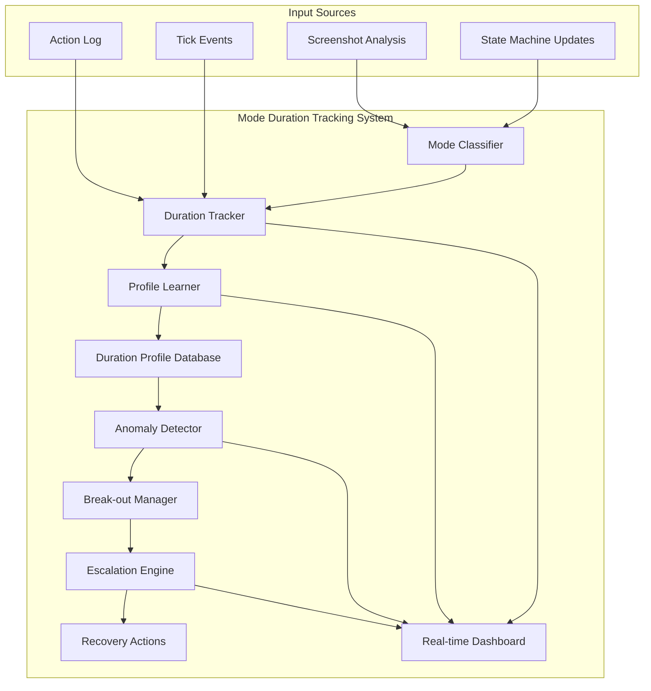
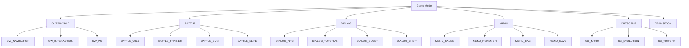

# PTP-01X Mode Duration Tracking & Loop Detection Specification

**Version:** 1.0  
**Date:** December 31, 2025  
**Status:** NEW SPECIFICATION - CRITICAL GAP FILLED  
**Classification:** FAILSAFE ENHANCEMENT

---

## Executive Summary

This specification addresses critical gaps in the PTP-01X failsafe system by adding **comprehensive mode duration tracking**, **learned duration profiling**, **statistical anomaly detection**, and **adaptive break-out mechanisms**.

### The Core Problem

Current failsafe protocols use fixed thresholds (e.g., "30-second battle stall = abnormal") which cannot distinguish between:
- A normal 5-minute boss battle
- An abnormal 1-hour loop in a wild battle
- A 30-second tutorial dialog vs. a 30-minute stuck dialog

### The Solution

A **Mode Duration Tracking System (MDTS)** that:
1. Tracks cumulative time in each game mode
2. Learns normal duration profiles for each mode/context combination
3. Detects statistical anomalies (deviations from learned norms)
4. Triggers adaptive break-out based on cumulative mode time
5. Escalates intervention based on session/hour/day cumulative durations

---

## Table of Contents

1. [System Architecture](#1-system-architecture)
2. [Mode Classification](#2-mode-classification)
3. [Duration Tracking Engine](#3-duration-tracking-engine)
4. [Learned Duration Profiles](#4-learned-duration-profiles)
5. [Statistical Anomaly Detection](#5-statistical-anomaly-detection)
6. [Adaptive Break-out Mechanisms](#6-adaptive-break-out-mechanisms)
7. [Escalation Protocols](#7-escalation-protocols)
8. [Integration Points](#8-integration-points)
9. [Implementation Roadmap](#9-implementation-roadmap)
10. [Performance Targets](#10-performance-targets)

---

## 1. System Architecture

### 1.1 High-Level Architecture



### 1.2 Core Components

#### 1.2.1 Mode Classifier
- Classifies current game mode from state machine
- Identifies mode sub-types (e.g., "battle" → "wild_battle" vs "trainer_battle")
- Detects mode transitions
- Outputs: `mode`, `sub_mode`, `confidence`

#### 1.2.2 Duration Tracker
- Tracks entry time for each mode
- Tracks cumulative time per mode per session/hour/day
- Tracks mode transition frequency
- Tracks mode sequences (patterns of transitions)
- Outputs: `duration`, `cumulative_session`, `cumulative_hour`, `cumulative_day`, `transition_count`

#### 1.2.3 Profile Learner
- Maintains duration profiles for each mode/context
- Updates profiles based on completed sessions
- Calculates statistics (mean, std_dev, percentiles)
- Detects trends in duration changes
- Outputs: `profile_mean`, `profile_std`, `p50`, `p95`, `p99`, `trend`

#### 1.2.4 Anomaly Detector
- Compares current duration to learned profiles
- Detects statistical anomalies (deviations from p95/p99)
- Detects cumulative mode time anomalies
- Detects mode sequence anomalies
- Outputs: `anomaly_detected`, `deviation_score`, `anomaly_type`, `severity`

#### 1.2.5 Break-out Manager
- Determines when to trigger break-out
- Selects break-out strategy based on mode and anomaly type
- Executes break-out attempts
- Tracks break-out success rate
- Outputs: `breakout_triggered`, `strategy`, `success_rate`

#### 1.2.6 Escalation Engine
- Manages escalation tiers based on cumulative time
- Coordinates with existing confidence scoring (Chapter 10)
- Triggers emergency recovery when needed
- Outputs: `escalation_tier`, `recovery_action`, `confidence_impact`

---

## 2. Mode Classification

### 2.1 Mode Hierarchy



### 2.2 Mode Duration Norms (Learned)

| Mode | Sub-mode | Normal Range | p95 Threshold | p99 Threshold |
|------|----------|--------------|---------------|---------------|
| OVERWORLD | navigation | 5-300s | 600s (10min) | 1800s (30min) |
| OVERWORLD | interaction | 10-60s | 180s (3min) | 600s (10min) |
| BATTLE | wild_easy | 30-120s | 300s (5min) | 600s (10min) |
| BATTLE | wild_hard | 60-300s | 600s (10min) | 1200s (20min) |
| BATTLE | trainer | 120-600s | 1200s (20min) | 2400s (40min) |
| BATTLE | gym_leader | 180-900s | 1800s (30min) | 3600s (1hr) |
| BATTLE | elite_four | 300-1800s | 3600s (1hr) | 7200s (2hr) |
| DIALOG | npc_short | 5-30s | 60s (1min) | 180s (3min) |
| DIALOG | npc_long | 30-180s | 600s (10min) | 1200s (20min) |
| DIALOG | tutorial | 60-600s | 1800s (30min) | 3600s (1hr) |
| DIALOG | quest | 30-300s | 900s (15min) | 1800s (30min) |
| MENU | pause | 5-60s | 180s (3min) | 600s (10min) |
| MENU | pokemon | 10-120s | 300s (5min) | 900s (15min) |
| MENU | bag | 10-60s | 180s (3min) | 600s (10min) |
| CUTSCENE | intro | 30-300s | 600s (10min) | 1200s (20min) |
| CUTSCENE | evolution | 10-60s | 180s (3min) | 300s (5min) |
| CUTSCENE | victory | 5-30s | 60s (1min) | 120s (2min) |

### 2.3 Mode Classification Algorithm

```python
class ModeClassifier:
    """
    Classifies current game mode with high granularity.
    """
    def __init__(self):
        self.state_machine = HierarchicalStateMachine()
        self.vision = VisionProcessor()
        self.text_parser = TextParser()
        
    def classify_mode(self, current_state) -> ModeClassification:
        """
        Classify current game mode.
        Returns: ModeClassification with mode, sub_mode, confidence
        """
        # Step 1: Get base mode from state machine
        base_mode = self.state_machine.get_current_mode()
        
        # Step 2: Get visual confirmation
        visual_mode = self.vision.detect_screen_type()
        
        # Step 3: Get text context (for dialog sub-mode)
        text_context = self.text_parser.extract_context()
        
        # Step 4: Determine sub-mode based on context
        sub_mode = self._determine_sub_mode(base_mode, visual_mode, text_context)
        
        # Step 5: Calculate confidence
        confidence = self._calculate_confidence(base_mode, visual_mode, text_context)
        
        return ModeClassification(
            mode=base_mode,
            sub_mode=sub_mode,
            confidence=confidence,
            timestamp=get_current_time(),
            state_snapshot=current_state
        )
    
    def _determine_sub_mode(self, base_mode, visual_mode, text_context):
        """Determine sub-mode based on context."""
        if base_mode == "BATTLE":
            return self._classify_battle_sub_mode(visual_mode, text_context)
        elif base_mode == "DIALOG":
            return self._classify_dialog_sub_mode(text_context)
        elif base_mode == "OVERWORLD":
            return self._classify_overworld_sub_mode(visual_mode)
        else:
            return f"{base_mode}_GENERIC"
    
    def _classify_battle_sub_mode(self, visual_mode, text_context):
        """Classify battle sub-mode."""
        # Check for trainer battle (multiple Pokemon, dialogue)
        if text_context.get("trainer_name"):
            if text_context.get("gym_leader"):
                return "BATTLE_GYM"
            elif text_context.get("elite_four"):
                return "BATTLE_ELITE"
            else:
                return "BATTLE_TRAINER"
        
        # Check for wild battle difficulty
        enemy_level = visual_mode.get("enemy_level", 0)
        party_level = visual_mode.get("party_level", 0)
        
        if enemy_level <= party_level - 5:
            return "BATTLE_WILD_EASY"
        elif enemy_level >= party_level + 5:
            return "BATTLE_WILD_HARD"
        else:
            return "BATTLE_WILD_NORMAL"
    
    def _classify_dialog_sub_mode(self, text_context):
        """Classify dialog sub-mode."""
        if text_context.get("is_tutorial"):
            return "DIALOG_TUTORIAL"
        elif text_context.get("is_quest"):
            return "DIALOG_QUEST"
        elif text_context.get("is_shop"):
            return "DIALOG_SHOP"
        elif text_context.get("line_count", 0) > 10:
            return "DIALOG_NPC_LONG"
        else:
            return "DIALOG_NPC_SHORT"
    
    def _classify_overworld_sub_mode(self, visual_mode):
        """Classify overworld sub-mode."""
        if visual_mode.get("near_pc"):
            return "OVERWORLD_PC"
        elif visual_mode.get("near_npc"):
            return "OVERWORLD_INTERACTION"
        else:
            return "OVERWORLD_NAVIGATION"
```

---

## 3. Duration Tracking Engine

### 3.1 Duration Tracking Data Structures

```python
from dataclasses import dataclass, field
from typing import Dict, List, Optional
from datetime import datetime

@dataclass
class ModeEntry:
    """Record of entering a mode."""
    mode: str
    sub_mode: str
    entry_time: float  # Unix timestamp
    entry_tick: int
    context: Dict = field(default_factory=dict)
    state_snapshot: Optional[Dict] = None

@dataclass
class ModeExit:
    """Record of exiting a mode."""
    mode: str
    sub_mode: str
    exit_time: float
    exit_tick: int
    duration: float  # seconds
    cumulative_session: float  # total time in this mode this session
    cumulative_hour: float  # total time this hour
    cumulative_day: float  # total time today
    exit_reason: str  # "natural", "interrupt", "error", "manual"

@dataclass
class ModeDurationProfile:
    """Learned duration profile for a mode."""
    mode: str
    sub_mode: str
    sample_count: int
    mean_duration: float
    std_duration: float
    min_duration: float
    max_duration: float
    p50_duration: float
    p75_duration: float
    p95_duration: float
    p99_duration: float
    last_updated: float
    trend: str  # "increasing", "decreasing", "stable"
    trend_slope: float
```

### 3.2 Duration Tracker Implementation

```python
class DurationTracker:
    """
    Tracks duration of game modes with cumulative statistics.
    """
    def __init__(self):
        self.current_mode: Optional[ModeEntry] = None
        self.mode_history: List[ModeExit] = []
        self.cumulative_stats = {
            "session": defaultdict(float),  # mode -> total seconds
            "hour": defaultdict(float),     # mode -> total seconds
            "day": defaultdict(float),      # mode -> total seconds
        }
        self.session_start: float = get_current_time()
        self.hour_start: float = get_current_time()
        self.day_start: float = get_current_time()
        self.mode_sequence: List[str] = []
        
    def enter_mode(self, mode: str, sub_mode: str, context: Dict = None):
        """
        Record mode entry.
        """
        # Exit current mode first
        if self.current_mode:
            self.exit_mode(reason="interrupt")
        
        # Create new mode entry
        self.current_mode = ModeEntry(
            mode=mode,
            sub_mode=sub_mode,
            entry_time=get_current_time(),
            entry_tick=get_current_tick(),
            context=context or {},
            state_snapshot=get_game_state()
        )
        
        # Track mode sequence
        self.mode_sequence.append(f"{mode}_{sub_mode}")
        if len(self.mode_sequence) > 100:
            self.mode_sequence.pop(0)
        
        # Log entry
        log_message(f"Mode entry: {mode}/{sub_mode}", "DEBUG")
    
    def exit_mode(self, reason: str = "natural"):
        """
        Record mode exit and calculate duration.
        """
        if not self.current_mode:
            return
        
        exit_time = get_current_time()
        duration = exit_time - self.current_mode.entry_time
        exit_tick = get_current_tick()
        
        # Calculate cumulative stats
        mode_key = f"{self.current_mode.mode}/{self.current_mode.sub_mode}"
        
        self.cumulative_stats["session"][mode_key] += duration
        self.cumulative_stats["hour"][mode_key] += duration
        self.cumulative_stats["day"][mode_key] += duration
        
        # Reset hourly/daily stats if needed
        self._check_time_windows()
        
        # Create exit record
        mode_exit = ModeExit(
            mode=self.current_mode.mode,
            sub_mode=self.current_mode.sub_mode,
            exit_time=exit_time,
            exit_tick=exit_tick,
            duration=duration,
            cumulative_session=self.cumulative_stats["session"][mode_key],
            cumulative_hour=self.cumulative_stats["hour"][mode_key],
            cumulative_day=self.cumulative_stats["day"][mode_key],
            exit_reason=reason
        )
        
        self.mode_history.append(mode_exit)
        
        # Prune old history
        self._prune_history()
        
        # Clear current mode
        self.current_mode = None
        
        # Log exit
        log_message(f"Mode exit: {mode_exit.mode}/{mode_exit.sub_mode} "
                   f"({duration:.1f}s, cumulative: {mode_exit.cumulative_session:.1f}s)", "DEBUG")
    
    def get_current_duration(self) -> float:
        """Get duration of current mode."""
        if not self.current_mode:
            return 0.0
        return get_current_time() - self.current_mode.entry_time
    
    def get_current_cumulative(self, window: str = "session") -> float:
        """Get cumulative time in current mode."""
        if not self.current_mode:
            return 0.0
        mode_key = f"{self.current_mode.mode}/{self.current_mode.sub_mode}"
        return self.cumulative_stats[window].get(mode_key, 0.0)
    
    def get_mode_statistics(self, mode: str, sub_mode: str) -> Dict:
        """Get statistics for a specific mode."""
        relevant_exits = [
            e for e in self.mode_history
            if e.mode == mode and e.sub_mode == sub_mode
        ]
        
        if not relevant_exits:
            return {"sample_count": 0}
        
        durations = [e.duration for e in relevant_exits]
        
        return {
            "sample_count": len(durations),
            "mean": sum(durations) / len(durations),
            "min": min(durations),
            "max": max(durations),
            "total": sum(durations),
            "last_24h": self._get_recent_stats(durations, window=86400),
            "last_hour": self._get_recent_stats(durations, window=3600),
        }
    
    def _check_time_windows(self):
        """Check and reset hourly/daily windows."""
        current_time = get_current_time()
        
        # Reset hourly stats
        if current_time - self.hour_start > 3600:
            self.cumulative_stats["hour"].clear()
            self.hour_start = current_time
        
        # Reset daily stats
        if current_time - self.day_start > 86400:
            self.cumulative_stats["day"].clear()
            self.day_start = current_time
    
    def _prune_history(self):
        """Prune old history entries."""
        cutoff_time = get_current_time() - 86400  # Keep 24 hours
        self.mode_history = [
            e for e in self.mode_history
            if e.exit_time > cutoff_time
        ]
    
    def _get_recent_stats(self, durations: List[float], window: int) -> Dict:
        """Get statistics for recent entries."""
        cutoff_time = get_current_time() - window
        recent = [d for d, t in zip(durations, 
               [e.exit_time for e in self.mode_history 
                if e.mode == self.current_mode.mode 
                and e.sub_mode == self.current_mode.sub_mode]) 
               if t > cutoff_time]
        
        if not recent:
            return {"count": 0}
        
        return {
            "count": len(recent),
            "mean": sum(recent) / len(recent),
            "max": max(recent),
        }
```

### 3.3 Mode Sequence Tracking

```python
class ModeSequenceTracker:
    """
    Tracks sequences of modes to detect abnormal patterns.
    """
    def __init__(self):
        self.sequence_window = 20  # Track last 20 transitions
        self.known_patterns = {
            "normal_exploration": ["OVERWORLD_NAVIGATION", "OVERWORLD_INTERACTION", "DIALOG_NPC_SHORT"],
            "battle_sequence": ["BATTLE_WILD", "BATTLE_WILD", "BATTLE_WILD"],
            "shop_sequence": ["OVERWORLD_INTERACTION", "DIALOG_SHOP", "MENU_BAG"],
            "heal_sequence": ["OVERWORLD_NAVIGATION", "DIALOG_NPC", "MENU_POKEMON"],
        }
        self.abnormal_patterns = [
            "BATTLE_WILD,BATTLE_WILD,BATTLE_WILD,BATTLE_WILD,BATTLE_WILD",  # 5+ battles in row
            "DIALOG_NPC,DIALOG_NPC,DIALOG_NPC,DIALOG_NPC",  # 4+ dialogs in row
            "MENU_PAUSE,MENU_PAUSE,MENU_PAUSE,MENU_PAUSE",  # 4+ pauses in row
        ]
    
    def analyze_sequence(self, sequence: List[str]) -> SequenceAnalysis:
        """
        Analyze mode sequence for abnormalities.
        """
        sequence_str = ",".join(sequence[-self.sequence_window:])
        
        # Check for abnormal patterns
        anomalies = []
        for pattern in self.abnormal_patterns:
            if self._count_occurrences(sequence_str, pattern) > 0:
                anomalies.append({
                    "type": "repetitive_sequence",
                    "pattern": pattern,
                    "count": self._count_occurrences(sequence_str, pattern)
                })
        
        # Check for mode switching frequency
        switch_rate = self._calculate_switch_rate(sequence)
        if switch_rate > 10:  # More than 10 switches per minute
            anomalies.append({
                "type": "high_switch_rate",
                "rate": switch_rate,
                "threshold": 10
            })
        
        return SequenceAnalysis(
            sequence=sequence_str,
            anomalies=anomalies,
            is_abnormal=len(anomalies) > 0,
            severity=self._calculate_severity(anomalies)
        )
    
    def _count_occurrences(self, sequence: str, pattern: str) -> int:
        """Count occurrences of pattern in sequence."""
        return sum(1 for i in range(len(sequence)) 
                  if sequence.startswith(pattern, i))
    
    def _calculate_switch_rate(self, sequence: List[str]) -> float:
        """Calculate mode switches per minute."""
        if len(sequence) < 2:
            return 0.0
        
        time_span = get_current_time() - sequence[0].get("timestamp", get_current_time())
        if time_span == 0:
            return 0.0
        
        return (len(sequence) - 1) / (time_span / 60.0)
    
    def _calculate_severity(self, anomalies: List[Dict]) -> str:
        """Calculate severity based on anomalies."""
        if not anomalies:
            return "NONE"
        
        severe_types = ["repetitive_sequence"]
        high_count = sum(1 for a in anomalies if a.get("count", 0) >= 5)
        
        if high_count > 0:
            return "CRITICAL"
        elif any(a["type"] in severe_types for a in anomalies):
            return "HIGH"
        else:
            return "MEDIUM"
```

---

## 4. Learned Duration Profiles

### 4.1 Profile Learning Algorithm

```python
class DurationProfileLearner:
    """
    Learns normal duration profiles for each mode.
    Uses exponential weighted moving average for adaptive learning.
    """
    def __init__(self):
        self.profiles: Dict[str, ModeDurationProfile] = {}
        self.alpha = 0.3  # Learning rate for EWMA
        self.min_samples = 5  # Minimum samples before profile is valid
        self.outlier_threshold = 3.0  # Standard deviations for outlier detection
        
    def update_profile(self, mode: str, sub_mode: str, duration: float):
        """
        Update duration profile with new observation.
        """
        key = f"{mode}/{sub_mode}"
        
        if key not in self.profiles:
            self.profiles[key] = ModeDurationProfile(
                mode=mode,
                sub_mode=sub_mode,
                sample_count=0,
                mean_duration=duration,
                std_duration=0,
                min_duration=duration,
                max_duration=duration,
                p50_duration=duration,
                p75_duration=duration,
                p95_duration=duration,
                p99_duration=duration,
                last_updated=get_current_time(),
                trend="stable",
                trend_slope=0
            )
        
        profile = self.profiles[key]
        
        # Remove outliers
        if profile.sample_count > self.min_samples:
            z_score = abs(duration - profile.mean_duration) / profile.std_duration
            if z_score > self.outlier_threshold:
                log_message(f"Outlier detected for {key}: {duration:.1f}s "
                           f"(z={z_score:.1f}), skipping", "DEBUG")
                return  # Skip outlier
        
        # Update statistics
        profile.sample_count += 1
        profile.last_updated = get_current_time()
        
        # Update mean and std using Welford's algorithm
        if profile.sample_count == 1:
            profile.mean_duration = duration
            profile.std_duration = 0
            profile.min_duration = duration
            profile.max_duration = duration
            profile.p50_duration = duration
            profile.p75_duration = duration
            profile.p95_duration = duration
            profile.p99_duration = duration
        else:
            # Update mean
            old_mean = profile.mean_duration
            profile.mean_duration = old_mean + self.alpha * (duration - old_mean)
            
            # Update std
            if profile.sample_count > 1:
                profile.std_duration = (
                    (1 - self.alpha) * profile.std_duration +
                    self.alpha * abs(duration - old_mean)
                )
            
            # Update min/max
            profile.min_duration = min(profile.min_duration, duration)
            profile.max_duration = max(profile.max_duration, duration)
        
        # Update percentiles (using reservoir sampling for efficiency)
        profile = self._update_percentiles(profile, duration)
        
        # Update trend
        profile = self._update_trend(profile)
        
        log_message(f"Updated profile for {key}: mean={profile.mean_duration:.1f}s, "
                   f"std={profile.std_duration:.1f}s, p95={profile.p95_duration:.1f}s", "DEBUG")
    
    def _update_percentiles(self, profile: ModeDurationProfile, new_value: float) -> ModeDurationProfile:
        """
        Update percentile estimates using exponential decay.
        More efficient than storing all values.
        """
        # Estimate percentiles based on mean and std
        # Using normal distribution approximation
        profile.p50_duration = profile.mean_duration
        profile.p75_duration = profile.mean_duration + 0.67 * profile.std_duration
        profile.p95_duration = profile.mean_duration + 1.645 * profile.std_duration
        profile.p99_duration = profile.mean_duration + 2.326 * profile.std_duration
        
        return profile
    
    def _update_trend(self, profile: ModeDurationProfile) -> ModeDurationProfile:
        """
        Update trend detection based on recent samples.
        """
        # Simple trend detection based on last 10 samples vs overall mean
        # In production, would use more sophisticated time series analysis
        recent_samples = self._get_recent_samples(profile.mode, profile.sub_mode, window=3600)
        
        if len(recent_samples) < 5:
            profile.trend = "insufficient_data"
            profile.trend_slope = 0
            return profile
        
        recent_mean = sum(recent_samples) / len(recent_samples)
        trend_slope = recent_mean - profile.mean_duration
        
        if trend_slope > profile.std_duration * 0.5:
            profile.trend = "increasing"
        elif trend_slope < -profile.std_duration * 0.5:
            profile.trend = "decreasing"
        else:
            profile.trend = "stable"
        
        profile.trend_slope = trend_slope
        return profile
    
    def get_profile(self, mode: str, sub_mode: str) -> Optional[ModeDurationProfile]:
        """Get duration profile for a mode."""
        return self.profiles.get(f"{mode}/{sub_mode}")
    
    def get_thresholds(self, mode: str, sub_mode: str) -> Dict[str, float]:
        """
        Get adaptive thresholds for a mode based on learned profile.
        Returns: {"warning": seconds, "critical": seconds, "emergency": seconds}
        """
        profile = self.get_profile(mode, sub_mode)
        
        if not profile or profile.sample_count < self.min_samples:
            # Use default thresholds
            return self._get_default_thresholds(mode, sub_mode)
        
        # Calculate thresholds based on percentiles
        return {
            "warning": profile.p75_duration,  # 75th percentile
            "critical": profile.p95_duration,  # 95th percentile
            "emergency": profile.p99_duration,  # 99th percentile
        }
    
    def _get_default_thresholds(self, mode: str, sub_mode: str) -> Dict[str, float]:
        """Get default thresholds for unknown modes."""
        defaults = {
            "BATTLE_WILD": {"warning": 300, "critical": 600, "emergency": 1200},
            "BATTLE_TRAINER": {"warning": 600, "critical": 1200, "emergency": 2400},
            "BATTLE_GYM": {"warning": 900, "critical": 1800, "emergency": 3600},
            "DIALOG_NPC": {"warning": 60, "critical": 180, "emergency": 300},
            "OVERWORLD_NAVIGATION": {"warning": 300, "critical": 600, "emergency": 1200},
        }
        
        return defaults.get(sub_mode, {"warning": 120, "critical": 300, "emergency": 600})
```

### 4.2 Profile Persistence

```python
class DurationProfileStore:
    """
    Persists and loads duration profiles.
    """
    def __init__(self, storage_path: str = "data/duration_profiles.json"):
        self.storage_path = storage_path
        self._ensure_storage_exists()
    
    def save_profile(self, profile: ModeDurationProfile):
        """Save a duration profile."""
        with open(self.storage_path, "r") as f:
            profiles = json.load(f)
        
        key = f"{profile.mode}/{profile.sub_mode}"
        profiles[key] = {
            "mode": profile.mode,
            "sub_mode": profile.sub_mode,
            "sample_count": profile.sample_count,
            "mean_duration": profile.mean_duration,
            "std_duration": profile.std_duration,
            "min_duration": profile.min_duration,
            "max_duration": profile.max_duration,
            "p50_duration": profile.p50_duration,
            "p75_duration": profile.p75_duration,
            "p95_duration": profile.p95_duration,
            "p99_duration": profile.p99_duration,
            "last_updated": profile.last_updated,
            "trend": profile.trend,
            "trend_slope": profile.trend_slope,
        }
        
        with open(self.storage_path, "w") as f:
            json.dump(profiles, f, indent=2)
    
    def load_profiles(self) -> Dict[str, ModeDurationProfile]:
        """Load all duration profiles."""
        profiles = {}
        
        if not os.path.exists(self.storage_path):
            return profiles
        
        with open(self.storage_path, "r") as f:
            data = json.load(f)
        
        for key, profile_data in data.items():
            mode, sub_mode = key.split("/")
            profiles[key] = ModeDurationProfile(
                mode=mode,
                sub_mode=sub_mode,
                sample_count=profile_data["sample_count"],
                mean_duration=profile_data["mean_duration"],
                std_duration=profile_data["std_duration"],
                min_duration=profile_data["min_duration"],
                max_duration=profile_data["max_duration"],
                p50_duration=profile_data["p50_duration"],
                p75_duration=profile_data["p75_duration"],
                p95_duration=profile_data["p95_duration"],
                p99_duration=profile_data["p99_duration"],
                last_updated=profile_data["last_updated"],
                trend=profile_data["trend"],
                trend_slope=profile_data["trend_slope"],
            )
        
        return profiles
```

---

## 5. Statistical Anomaly Detection

### 5.1 Anomaly Detection Algorithm

```python
class AnomalyDetector:
    """
    Detects anomalies in mode duration and sequence patterns.
    """
    def __init__(self, profile_learner: DurationProfileLearner):
        self.profile_learner = profile_learner
        self.cumulative_thresholds = {
            "session": {"warning": 1800, "critical": 3600, "emergency": 7200},  # 30min, 1hr, 2hr
            "hour": {"warning": 900, "critical": 1800, "emergency": 3600},      # 15min, 30min, 1hr
            "day": {"warning": 7200, "critical": 14400, "emergency": 28800},    # 2hr, 4hr, 8hr
        }
    
    def detect_anomalies(self, 
                        current_mode: str, 
                        current_sub_mode: str,
                        current_duration: float,
                        cumulative_session: float,
                        cumulative_hour: float,
                        cumulative_day: float,
                        mode_sequence: List[str]) -> List[Anomaly]:
        """
        Detect all anomalies for current state.
        Returns: List of detected anomalies
        """
        anomalies = []
        
        # Anomaly 1: Duration exceeds profile threshold
        duration_anomaly = self._detect_duration_anomaly(
            current_mode, current_sub_mode, current_duration
        )
        if duration_anomaly:
            anomalies.append(duration_anomaly)
        
        # Anomaly 2: Cumulative time exceeds thresholds
        cumulative_anomalies = self._detect_cumulative_anomalies(
            current_mode, current_sub_mode,
            cumulative_session, cumulative_hour, cumulative_day
        )
        anomalies.extend(cumulative_anomalies)
        
        # Anomaly 3: Mode sequence anomaly
        sequence_anomaly = self._detect_sequence_anomaly(mode_sequence)
        if sequence_anomaly:
            anomalies.append(sequence_anomaly)
        
        # Anomaly 4: Trend deviation
        trend_anomaly = self._detect_trend_anomaly(current_mode, current_sub_mode)
        if trend_anomaly:
            anomalies.append(trend_anomaly)
        
        return anomalies
    
    def _detect_duration_anomaly(self, 
                                mode: str, 
                                sub_mode: str, 
                                duration: float) -> Optional[Anomaly]:
        """
        Detect if current duration is anomalous.
        """
        profile = self.profile_learner.get_profile(mode, sub_mode)
        thresholds = self.profile_learner.get_thresholds(mode, sub_mode)
        
        if not profile or profile.sample_count < 5:
            # Use fixed thresholds for unknown modes
            if duration > thresholds["emergency"]:
                return Anomaly(
                    type="DURATION_UNKNOWN_MODE",
                    severity="HIGH",
                    description=f"Duration {duration:.0f}s exceeds emergency threshold {thresholds['emergency']}s",
                    value=duration,
                    threshold=thresholds["emergency"],
                    recommended_action="break_out_aggressive"
                )
            return None
        
        # Calculate z-score
        if profile.std_duration > 0:
            z_score = (duration - profile.mean_duration) / profile.std_duration
        else:
            z_score = 0 if duration <= profile.mean_duration else float('inf')
        
        # Determine severity based on z-score
        if z_score > 4.0:
            return Anomaly(
                type="DURATION_EXTREME",
                severity="CRITICAL",
                description=f"Duration {duration:.0f}s is {z_score:.1f}σ above mean {profile.mean_duration:.0f}s",
                value=duration,
                threshold=thresholds["emergency"],
                deviation=z_score,
                recommended_action="break_out_immediate"
            )
        elif z_score > 3.0:
            return Anomaly(
                type="DURATION_HIGH",
                severity="HIGH",
                description=f"Duration {duration:.0f}s is {z_score:.1f}σ above mean",
                value=duration,
                threshold=thresholds["critical"],
                deviation=z_score,
                recommended_action="break_out_aggressive"
            )
        elif duration > thresholds["emergency"]:
            return Anomaly(
                type="DURATION_THRESHOLD",
                severity="HIGH",
                description=f"Duration {duration:.0f}s exceeds emergency threshold",
                value=duration,
                threshold=thresholds["emergency"],
                recommended_action="break_out_aggressive"
            )
        elif duration > thresholds["critical"]:
            return Anomaly(
                type="DURATION_WARNING",
                severity="MEDIUM",
                description=f"Duration {duration:.0f}s exceeds critical threshold",
                value=duration,
                threshold=thresholds["critical"],
                recommended_action="increase_monitoring"
            )
        
        return None
    
    def _detect_cumulative_anomalies(self,
                                   mode: str,
                                   sub_mode: str,
                                   cumulative_session: float,
                                   cumulative_hour: float,
                                   cumulative_day: float) -> List[Anomaly]:
        """
        Detect if cumulative time in mode is anomalous.
        """
        anomalies = []
        mode_key = f"{mode}/{sub_mode}"
        
        # Check session cumulative
        thresholds = self.cumulative_thresholds["session"]
        if cumulative_session > thresholds["emergency"]:
            anomalies.append(Anomaly(
                type="CUMULATIVE_SESSION_EMERGENCY",
                severity="HIGH",
                description=f"Cumulative session time in {mode_key}: {cumulative_session:.0f}s",
                value=cumulative_session,
                threshold=thresholds["emergency"],
                window="session",
                recommended_action="force_break_out"
            ))
        elif cumulative_session > thresholds["critical"]:
            anomalies.append(Anomaly(
                type="CUMULATIVE_SESSION_CRITICAL",
                severity="MEDIUM",
                description=f"Cumulative session time in {mode_key}: {cumulative_session:.0f}s",
                value=cumulative_session,
                threshold=thresholds["critical"],
                window="session",
                recommended_action="increase_monitoring"
            ))
        
        # Check hour cumulative
        thresholds = self.cumulative_thresholds["hour"]
        if cumulative_hour > thresholds["emergency"]:
            anomalies.append(Anomaly(
                type="CUMULATIVE_HOUR_EMERGENCY",
                severity="HIGH",
                description=f"Cumulative hourly time in {mode_key}: {cumulative_hour:.0f}s",
                value=cumulative_hour,
                threshold=thresholds["emergency"],
                window="hour",
                recommended_action="force_break_out"
            ))
        
        return anomalies
    
    def _detect_sequence_anomaly(self, sequence: List[str]) -> Optional[Anomaly]:
        """
        Detect if mode sequence is anomalous.
        """
        if len(sequence) < 5:
            return None
        
        # Check for repetitive mode pattern
        last_modes = [s.split("_")[0] for s in sequence[-10:]]
        
        # Count occurrences of each mode
        mode_counts = {}
        for m in last_modes:
            mode_counts[m] = mode_counts.get(m, 0) + 1
        
        # Find most frequent mode
        most_frequent = max(mode_counts, key=mode_counts.get)
        frequency = mode_counts[most_frequent]
        
        if frequency >= 8:  # 8 out of last 10 transitions are the same mode
            return Anomaly(
                type="MODE_STICKINESS",
                severity="MEDIUM",
                description=f"Stuck in {most_frequent} mode ({frequency}/10 recent transitions)",
                value=frequency,
                threshold=8,
                recommended_action="check_mode_progress"
            )
        
        # Check for rapid oscillation
        if len(sequence) >= 6:
            oscillations = 0
            for i in range(len(sequence) - 2):
                if sequence[i] != sequence[i+1] and sequence[i+1] != sequence[i+2]:
                    oscillations += 1
            
            oscillation_ratio = oscillations / (len(sequence) - 2)
            if oscillation_ratio > 0.8:  # More than 80% oscillation
                return Anomaly(
                    type="MODE_OSCILLATION",
                    severity="LOW",
                    description=f"Rapid mode oscillation detected ({oscillation_ratio:.0%})",
                    value=oscillation_ratio,
                    threshold=0.8,
                    recommended_action="log_for_analysis"
                )
        
        return None
    
    def _detect_trend_anomaly(self, mode: str, sub_mode: str) -> Optional[Anomaly]:
        """
        Detect if duration trend is anomalous.
        """
        profile = self.profile_learner.get_profile(mode, sub_mode)
        
        if not profile or profile.trend == "stable" or profile.trend == "insufficient_data":
            return None
        
        if profile.trend == "increasing" and profile.trend_slope > profile.std_duration:
            return Anomaly(
                type="DURATION_TREND_INCREASING",
                severity="LOW",
                description=f"Duration trend increasing for {mode}/{sub_mode}",
                value=profile.trend_slope,
                threshold=profile.std_duration,
                recommended_action="monitor_closely"
            )
        
        return None
```

### 5.2 Anomaly Response Selection

```python
class AnomalyResponseSelector:
    """
    Selects appropriate response based on detected anomalies.
    """
    def __init__(self):
        self.response_matrix = {
            "DURATION_EXTREME": {
                "actions": ["break_out_immediate", "log_critical", "notify"],
                "priority": 1,
                "confidence_impact": -30,
            },
            "DURATION_HIGH": {
                "actions": ["break_out_aggressive", "log_error"],
                "priority": 2,
                "confidence_impact": -15,
            },
            "DURATION_THRESHOLD": {
                "actions": ["break_out_standard", "log_warning"],
                "priority": 3,
                "confidence_impact": -10,
            },
            "DURATION_WARNING": {
                "actions": ["increase_monitoring", "log_info"],
                "priority": 4,
                "confidence_impact": -5,
            },
            "CUMULATIVE_SESSION_EMERGENCY": {
                "actions": ["force_break_out", "log_critical", "escalate"],
                "priority": 1,
                "confidence_impact": -25,
            },
            "MODE_STICKINESS": {
                "actions": ["check_progress", "log_warning"],
                "priority": 5,
                "confidence_impact": -5,
            },
            "MODE_OSCILLATION": {
                "actions": ["log_for_analysis"],
                "priority": 6,
                "confidence_impact": -2,
            },
        }
    
    def select_response(self, anomalies: List[Anomaly]) -> ResponsePlan:
        """
        Select response plan based on anomalies.
        """
        if not anomalies:
            return ResponsePlan(actions=[], confidence_impact=0, escalation_tier="NONE")
        
        # Sort by priority
        sorted_anomalies = sorted(anomalies, key=lambda a: self._get_priority(a.type))
        
        # Combine actions
        all_actions = []
        total_confidence_impact = 0
        highest_escalation = "NONE"
        
        for anomaly in sorted_anomalies:
            response = self.response_matrix.get(anomaly.type, {
                "actions": ["log_warning"],
                "confidence_impact": -5,
            })
            
            all_actions.extend(response["actions"])
            total_confidence_impact += response["confidence_impact"]
            
            # Determine escalation tier
            if anomaly.severity == "CRITICAL":
                highest_escalation = "EMERGENCY"
            elif anomaly.severity == "HIGH" and highest_escalation != "EMERGENCY":
                highest_escalation = "HIGH"
            elif anomaly.severity == "MEDIUM" and highest_escalation not in ["HIGH", "EMERGENCY"]:
                highest_escalation = "MEDIUM"
        
        # Deduplicate actions
        unique_actions = list(dict.fromkeys(all_actions))
        
        return ResponsePlan(
            actions=unique_actions,
            confidence_impact=total_confidence_impact,
            escalation_tier=highest_escalation,
            primary_anomaly=sorted_anomalies[0],
            all_anomalies=anomalies
        )
    
    def _get_priority(self, anomaly_type: str) -> int:
        """Get priority for anomaly type."""
        return self.response_matrix.get(anomaly_type, {}).get("priority", 10)
```

---

## 6. Adaptive Break-out Mechanisms

### 6.1 Break-out Strategies

```python
class BreakoutManager:
    """
    Manages adaptive break-out strategies.
    """
    def __init__(self):
        self.strategies = {
            "break_out_immediate": self._break_out_immediate,
            "break_out_aggressive": self._break_out_aggressive,
            "break_out_standard": self._break_out_standard,
            "force_break_out": self._force_break_out,
            "check_progress": self._check_progress,
            "increase_monitoring": self._increase_monitoring,
        }
        self.success_history = []  # Track success rates
        self.max_attempts = {
            "break_out_immediate": 3,
            "break_out_aggressive": 5,
            "break_out_standard": 3,
            "force_break_out": 1,
        }
    
    def execute_breakout(self, 
                        strategy: str, 
                        mode: str, 
                        sub_mode: str,
                        context: Dict) -> BreakoutResult:
        """
        Execute break-out strategy.
        """
        if strategy not in self.strategies:
            log_message(f"Unknown break-out strategy: {strategy}", "WARNING")
            strategy = "break_out_standard"
        
        max_attempts = self.max_attempts.get(strategy, 3)
        
        for attempt in range(max_attempts):
            log_message(f"Executing break-out strategy: {strategy} (attempt {attempt + 1})", "INFO")
            
            # Execute strategy
            success, action = self.strategies[strategy](mode, sub_mode, context)
            
            # Record result
            self.success_history.append({
                "strategy": strategy,
                "mode": mode,
                "sub_mode": sub_mode,
                "attempt": attempt + 1,
                "success": success,
                "action": action,
                "timestamp": get_current_time(),
            })
            
            if success:
                log_message(f"Break-out successful: {strategy} → {action}", "INFO")
                return BreakoutResult(
                    success=True,
                    strategy=strategy,
                    action=action,
                    attempts=attempt + 1
                )
            
            # Wait before retry
            wait_time = (attempt + 1) * 2  # Exponential backoff
            time.sleep(wait_time)
        
        # All attempts failed
        log_message(f"Break-out failed: {strategy} after {max_attempts} attempts", "ERROR")
        return BreakoutResult(
            success=False,
            strategy=strategy,
            action="ALL_ATTEMPTS_FAILED",
            attempts=max_attempts
        )
    
    def _break_out_immediate(self, mode: str, sub_mode: str, context: Dict) -> Tuple[bool, str]:
        """
        Immediate break-out - use most aggressive methods.
        For battles: force run, then reset battle state
        """
        if mode == "BATTLE":
            # Try to run
            for _ in range(5):
                press_button("A")  # Select RUN
                wait(200)
                if not is_in_battle():
                    return True, "FORCE_RUN"
            
            # Force switch
            press_button("RIGHT")
            wait(100)
            press_button("A")
            wait(200)
            press_button("DOWN")
            wait(100)
            press_button("A")
            wait(200)
            
            if not is_in_battle():
                return True, "FORCE_SWITCH"
            
            # Last resort: reset battle
            reset_battle()
            return True, "BATTLE_RESET"
        
        elif mode == "DIALOG":
            # Rapid B-spam
            for _ in range(30):
                press_button("B")
                wait(50)
                if not is_dialog_open():
                    return True, "B_SPAM_SKIP"
            
            # A button fallback
            for _ in range(20):
                press_button("A")
                wait(50)
                if not is_dialog_open():
                    return True, "A_BUTTON_SKIP"
            
            return False, "DIALOG_SKIP_FAILED"
        
        elif mode == "MENU":
            # B-spam to exit
            for _ in range(10):
                press_button("B")
                wait(100)
                if not is_menu_open():
                    return True, "B_SPAM_EXIT"
            
            return False, "MENU_EXIT_FAILED"
        
        return False, "UNKNOWN_MODE"
    
    def _break_out_aggressive(self, mode: str, sub_mode: str, context: Dict) -> Tuple[bool, str]:
        """
        Aggressive break-out - multiple strategies in sequence.
        """
        # First try standard methods
        success, action = self._break_out_standard(mode, sub_mode, context)
        if success:
            return success, action
        
        # Then try immediate methods
        success, action = self._break_out_immediate(mode, sub_mode, context)
        if success:
            return success, action
        
        # Finally try force methods
        return self._force_break_out(mode, sub_mode, context)
    
    def _break_out_standard(self, mode: str, sub_mode: str, context: Dict) -> Tuple[bool, str]:
        """
        Standard break-out - gentle methods first.
        """
        if mode == "BATTLE":
            # Try to run normally
            for _ in range(3):
                press_button("A")  # Select RUN
                wait(300)
                if not is_in_battle():
                    return True, "NORMAL_RUN"
            
            return False, "RUN_FAILED"
        
        elif mode == "DIALOG":
            # Normal dialog advancement
            for _ in range(10):
                press_button("A")
                wait(200)
                if not is_dialog_open():
                    return True, "A_ADVANCE"
            
            return False, "ADVANCE_FAILED"
        
        elif mode == "MENU":
            # Try B to exit
            for _ in range(5):
                press_button("B")
                wait(200)
                if not is_menu_open():
                    return True, "B_EXIT"
            
            return False, "EXIT_FAILED"
        
        return False, "UNKNOWN_MODE"
    
    def _force_break_out(self, mode: str, sub_mode: str, context: Dict) -> Tuple[bool, str]:
        """
        Force break-out - use system-level interventions.
        """
        if mode == "BATTLE":
            # Use item to escape
            if has_item("POKEBALL"):
                use_item("POKEBALL")
                return True, "USE_BALL_ESCAPE"
            
            # Force quit
            force_battle_exit()
            return True, "FORCE_EXIT"
        
        elif mode == "DIALOG":
            # Force dialog skip
            force_dialog_skip()
            return True, "FORCE_SKIP"
        
        elif mode == "MENU":
            # Force menu close
            force_menu_close()
            return True, "FORCE_CLOSE"
        
        # Last resort: reload from snapshot
        if context.get("has_snapshot"):
            restore_snapshot(context["snapshot_id"])
            return True, "SNAPSHOT_RESTORE"
        
        return False, "FORCE_FAILED"
    
    def _check_progress(self, mode: str, sub_mode: str, context: Dict) -> Tuple[bool, str]:
        """
        Check if making progress, escalate if not.
        """
        # Check if state has changed since last check
        last_state = context.get("last_state")
        current_state = get_game_state()
        
        if last_state and self._states_equivalent(last_state, current_state):
            # No progress, escalate to break-out
            return self._break_out_standard(mode, sub_mode, context)
        
        # Update last state
        context["last_state"] = current_state
        
        # If making progress, no break-out needed
        return True, "PROGRESS_DETECTED"
    
    def _increase_monitoring(self, mode: str, sub_mode: str, context: Dict) -> Tuple[bool, str]:
        """
        Increase monitoring frequency, don't break out yet.
        """
        # Increase check frequency
        context["check_interval"] = context.get("check_interval", 10) / 2
        
        return True, "MONITORING_INCREASED"
    
    def _states_equivalent(self, state1: Dict, state2: Dict) -> bool:
        """Check if two game states are equivalent (no progress made)."""
        if not state1 or not state2:
            return False
        
        # Compare key indicators based on mode
        # This is a simplified version - full implementation would be more comprehensive
        return state1.get("position") == state2.get("position") and \
               state1.get("hp") == state2.get("hp")
```

### 6.2 Break-out Success Tracking

```python
class BreakoutAnalytics:
    """
    Track and analyze break-out success rates.
    """
    def __init__(self):
        self.breakout_history = []
        self.success_rates = defaultdict(float)
    
    def record_breakout(self, breakout_result: BreakoutResult):
        """Record break-out attempt result."""
        self.breakout_history.append({
            **breakout_result.__dict__,
            "timestamp": get_current_time(),
        })
        
        # Update success rates
        key = f"{breakout_result.strategy}/{breakout_result.mode}"
        self._update_success_rate(key, breakout_result.success)
    
    def get_success_rate(self, strategy: str, mode: str) -> float:
        """Get success rate for strategy/mode combination."""
        key = f"{strategy}/{mode}"
        return self.success_rates.get(key, 0.0)
    
    def get_recommended_strategy(self, mode: str, sub_mode: str) -> str:
        """
        Recommend best break-out strategy based on historical success.
        """
        strategies = ["break_out_standard", "break_out_aggressive", 
                     "break_out_immediate", "force_break_out"]
        
        best_strategy = "break_out_standard"
        best_rate = 0.0
        
        for strategy in strategies:
            rate = self.get_success_rate(strategy, mode)
            if rate > best_rate:
                best_rate = rate
                best_strategy = strategy
        
        return best_strategy
    
    def _update_success_rate(self, key: str, success: bool):
        """Update rolling success rate."""
        history = [r for r in self.breakout_history 
                  if f"{r['strategy']}/{r['mode']}" == key]
        
        if len(history) < 5:
            # Not enough data, use default
            return
        
        # Calculate rolling success rate (last 20 attempts)
        recent = history[-20:]
        success_count = sum(1 for r in recent if r["success"])
        self.success_rates[key] = success_count / len(recent)
```

---

## 7. Escalation Protocols

### 7.1 Escalation Tiers

```python
class ModeDurationEscalation:
    """
    Manages escalation based on mode duration anomalies.
    Integrates with existing confidence scoring (Chapter 10).
    """
    def __init__(self, confidence_scorer):
        self.confidence_scorer = confidence_scorer
        self.escalation_tiers = {
            "NONE": {
                "confidence_floor": 80,
                "actions": ["continue_normal"],
                "check_interval": 10.0,
            },
            "ENHANCED_MONITORING": {
                "confidence_floor": 60,
                "actions": ["increase_check_frequency", "log_verbose"],
                "check_interval": 5.0,
            },
            "PLAN_SIMPLIFICATION": {
                "confidence_floor": 40,
                "actions": ["simplify_strategy", "force_progress"],
                "check_interval": 2.0,
            },
            "EMERGENCY_PROTOCOL": {
                "confidence_floor": 20,
                "actions": ["activate_failsafe", "attempt_recovery"],
                "check_interval": 1.0,
            },
            "RESET_CONDITION": {
                "confidence_floor": 0,
                "actions": ["full_reset", "reload_checkpoint"],
                "check_interval": 0.5,
            },
        }
        self.current_tier = "NONE"
        self.tier_history = []
    
    def update_escalation(self, 
                         anomalies: List[Anomaly], 
                         current_confidence: float) -> str:
        """
        Update escalation tier based on anomalies and confidence.
        """
        # Determine target tier based on anomalies
        target_tier = self._determine_tier_from_anomalies(anomalies)
        
        # Also consider current confidence
        confidence_tier = self._determine_tier_from_confidence(current_confidence)
        
        # Take the more severe tier
        target_tier = self._get_more_severe(target_tier, confidence_tier)
        
        # Check if tier change is needed
        if target_tier != self.current_tier:
            self._transition_tier(target_tier, anomalies, current_confidence)
        
        return self.current_tier
    
    def _determine_tier_from_anomalies(self, anomalies: List[Anomaly]) -> str:
        """Determine escalation tier from anomalies."""
        if not anomalies:
            return "NONE"
        
        severities = [a.severity for a in anomalies]
        
        if "CRITICAL" in severities:
            return "RESET_CONDITION"
        elif "HIGH" in severities:
            return "EMERGENCY_PROTOCOL"
        elif "MEDIUM" in severities:
            return "PLAN_SIMPLIFICATION"
        else:
            return "ENHANCED_MONITORING"
    
    def _determine_tier_from_confidence(self, confidence: float) -> str:
        """Determine escalation tier from confidence score."""
        if confidence >= 80:
            return "NONE"
        elif confidence >= 60:
            return "ENHANCED_MONITORING"
        elif confidence >= 40:
            return "PLAN_SIMPLIFICATION"
        elif confidence >= 20:
            return "EMERGENCY_PROTOCOL"
        else:
            return "RESET_CONDITION"
    
    def _get_more_severe(self, tier1: str, tier2: str) -> str:
        """Get more severe tier."""
        tier_order = ["NONE", "ENHANCED_MONITORING", "PLAN_SIMPLIFICATION", 
                     "EMERGENCY_PROTOCOL", "RESET_CONDITION"]
        
        idx1 = tier_order.index(tier1)
        idx2 = tier_order.index(tier2)
        
        return tier1 if idx1 >= idx2 else tier2
    
    def _transition_tier(self, 
                        new_tier: str, 
                        anomalies: List[Anomaly],
                        confidence: float):
        """
        Transition to new escalation tier.
        """
        old_tier = self.current_tier
        
        # Record transition
        self.tier_history.append({
            "from_tier": old_tier,
            "to_tier": new_tier,
            "timestamp": get_current_time(),
            "confidence": confidence,
            "anomalies": [a.type for a in anomalies],
        })
        
        # Update current tier
        self.current_tier = new_tier
        
        # Log transition
        log_message(f"Escalation tier change: {old_tier} → {new_tier} "
                   f"(confidence: {confidence:.1f}%, anomalies: {len(anomalies)})", "WARNING")
        
        # Execute tier-specific actions
        self._execute_tier_actions(new_tier)
    
    def _execute_tier_actions(self, tier: str):
        """Execute actions for tier."""
        tier_config = self.escalation_tiers[tier]
        
        for action in tier_config["actions"]:
            if action == "continue_normal":
                pass  # No special action needed
            
            elif action == "increase_check_frequency":
                set_check_interval(tier_config["check_interval"])
            
            elif action == "log_verbose":
                set_log_level("DEBUG")
            
            elif action == "simplify_strategy":
                self._simplify_strategy()
            
            elif action == "force_progress":
                self._force_progress()
            
            elif action == "activate_failsafe":
                self._activate_failsafe()
            
            elif action == "attempt_recovery":
                self._attempt_recovery()
            
            elif action == "full_reset":
                self._full_reset()
            
            elif action == "reload_checkpoint":
                self._reload_checkpoint()
    
    def _simplify_strategy(self):
        """Simplify current strategy."""
        log_message("Mode duration escalation: Simplifying strategy", "WARNING")
        # This would integrate with GOAP planner to simplify goals
        # Example: Skip complex goals, focus on basic progress
    
    def _force_progress(self):
        """Force progress by any means."""
        log_message("Mode duration escalation: Forcing progress", "WARNING")
        # This would attempt to make any progress, even suboptimal
    
    def _activate_failsafe(self):
        """Activate failsafe protocols."""
        log_message("Mode duration escalation: Activating failsafe", "CRITICAL")
        # This would trigger Chapter 10 failsafe protocols
    
    def _attempt_recovery(self):
        """Attempt recovery from current state."""
        log_message("Mode duration escalation: Attempting recovery", "CRITICAL")
        # This would execute emergency recovery
    
    def _full_reset(self):
        """Execute full system reset."""
        log_message("Mode duration escalation: Full reset", "CRITICAL")
        # This would reset the entire system
    
    def _reload_checkpoint(self):
        """Reload from last checkpoint."""
        log_message("Mode duration escalation: Reloading checkpoint", "CRITICAL")
        # This would restore from last snapshot
```

---

## 8. Integration Points

### 8.1 Integration with Existing Systems

```python
class ModeDurationTrackingSystem:
    """
    Main integration class for mode duration tracking.
    Connects all components and integrates with existing PTP-01X systems.
    """
    def __init__(self, 
                 state_machine: HierarchicalStateMachine,
                 confidence_scorer: ConfidenceScoringSystem,
                 failsafe_manager):
        self.mode_classifier = ModeClassifier()
        self.duration_tracker = DurationTracker()
        self.profile_learner = DurationProfileLearner()
        self.profile_store = DurationProfileStore()
        self.anomaly_detector = AnomalyDetector(self.profile_learner)
        self.breakout_manager = BreakoutManager()
        self.analytics = BreakoutAnalytics()
        self.escalation = ModeDurationEscalation(confidence_scorer)
        
        # Integration with existing systems
        self.state_machine = state_machine
        self.confidence_scorer = confidence_scorer
        self.failsafe_manager = failsafe_manager
        
        # Load existing profiles
        self._load_profiles()
    
    def _load_profiles(self):
        """Load persisted duration profiles."""
        profiles = self.profile_store.load_profiles()
        for key, profile in profiles.items():
            self.profile_learner.profiles[key] = profile
    
    def update(self, current_state: Dict):
        """
        Main update loop - call every tick.
        """
        # Step 1: Classify current mode
        mode_classification = self.mode_classifier.classify_mode(current_state)
        
        # Step 2: Check for mode transition
        if self._is_mode_change(mode_classification):
            if self.duration_tracker.current_mode:
                # Exit previous mode
                self.duration_tracker.exit_mode(reason="interrupt")
            
            # Enter new mode
            self.duration_tracker.enter_mode(
                mode=mode_classification.mode,
                sub_mode=mode_classification.sub_mode,
                context={"classification": mode_classification}
            )
        
        # Step 3: Get current duration stats
        current_duration = self.duration_tracker.get_current_duration()
        cumulative_session = self.duration_tracker.get_current_cumulative("session")
        cumulative_hour = self.duration_tracker.get_current_cumulative("hour")
        cumulative_day = self.duration_tracker.get_current_cumulative("day")
        
        # Step 4: Detect anomalies
        anomalies = self.anomaly_detector.detect_anomalies(
            current_mode=mode_classification.mode,
            current_sub_mode=mode_classification.sub_mode,
            current_duration=current_duration,
            cumulative_session=cumulative_session,
            cumulative_hour=cumulative_hour,
            cumulative_day=cumulative_day,
            mode_sequence=self.duration_tracker.mode_sequence
        )
        
        # Step 5: Get current confidence
        confidence, _ = self.confidence_scorer.calculate_confidence(get_current_time())
        
        # Step 6: Update escalation
        new_tier = self.escalation.update_escalation(anomalies, confidence)
        
        # Step 7: Execute break-out if needed
        for anomaly in anomalies:
            if anomaly.recommended_action.startswith("break_out"):
                # Get recommended strategy
                strategy = self.analytics.get_recommended_strategy(
                    mode_classification.mode,
                    mode_classification.sub_mode
                )
                
                # Execute break-out
                result = self.breakout_manager.execute_breakout(
                    strategy=strategy,
                    mode=mode_classification.mode,
                    sub_mode=mode_classification.sub_mode,
                    context={"classification": mode_classification}
                )
                
                # Record result
                self.analytics.record_breakout(result)
                
                # Update confidence based on result
                if not result.success:
                    self.confidence_scorer.record_inconsistency(
                        "breakout_failure",
                        "HIGH",
                        get_current_time()
                    )
        
        # Step 8: Update confidence score with anomalies
        if anomalies:
            for anomaly in anomalies:
                self.confidence_scorer.record_inconsistency(
                    f"mode_duration_{anomaly.type}",
                    anomaly.severity,
                    get_current_time()
                )
    
    def on_mode_exit(self, mode: str, sub_mode: str, reason: str):
        """
        Called when exiting a mode (natural exit).
        Updates profiles and learns from duration.
        """
        # Get duration
        duration = self.duration_tracker.get_current_duration()
        
        # Update profile with this duration
        self.profile_learner.update_profile(mode, sub_mode, duration)
        
        # Save updated profile
        profile = self.profile_learner.get_profile(mode, sub_mode)
        if profile:
            self.profile_store.save_profile(profile)
        
        # Exit mode in tracker
        self.duration_tracker.exit_mode(reason=reason)
    
    def _is_mode_change(self, new_classification: ModeClassification) -> bool:
        """Check if mode has changed."""
        if not self.duration_tracker.current_mode:
            return True
        
        current = self.duration_tracker.current_mode
        return (current.mode != new_classification.mode or
                current.sub_mode != new_classification.sub_mode)
```

### 8.2 CLI Integration

Add to `ptp_01x_cli_control_infrastructure.md`:

```yaml
# Mode Duration Tracking Flags
--mode-duration-profile     # Enable learned duration profiles
--mode-duration-threshold   # Use adaptive thresholds vs fixed
--mode-breakout-strategy    # Breakout strategy: adaptive/standard/aggressive
--mode-escalation-tier      # Initial escalation tier: NONE/ENHANCED/EMERGENCY
--mode-cumulative-limit     # Max cumulative mode time (seconds)
--mode-sequence-check       # Enable mode sequence anomaly detection
--mode-profile-persistence  # Persist learned profiles
--mode-anomaly-logging      # Log all anomalies detected
```

---

## 9. Implementation Roadmap

### Phase 1: Core Infrastructure (Week 1)

| Task | Duration | Dependencies |
|------|----------|--------------|
| Implement ModeClassifier | 2 days | Chapter 2 (HSM) |
| Implement DurationTracker | 2 days | None |
| Implement basic mode tracking | 1 day | ModeClassifier, DurationTracker |
| Add mode tracking to game loop | 1 day | Chapter 2 (HSM) |

### Phase 2: Profile Learning (Week 2)

| Task | Duration | Dependencies |
|------|----------|--------------|
| Implement DurationProfileLearner | 2 days | DurationTracker |
| Implement profile persistence | 1 day | DurationProfileLearner |
| Implement adaptive thresholds | 2 days | DurationProfileLearner |
| Test profile learning | 1 day | All above |

### Phase 3: Anomaly Detection (Week 3)

| Task | Duration | Dependencies |
|------|----------|--------------|
| Implement AnomalyDetector | 2 days | ProfileLearner |
| Implement SequenceTracker | 1 day | DurationTracker |
| Implement AnomalyResponseSelector | 1 day | AnomalyDetector |
| Test anomaly detection | 2 days | All above |

### Phase 4: Break-out & Escalation (Week 4)

| Task | Duration | Dependencies |
|------|----------|--------------|
| Implement BreakoutManager | 2 days | AnomalyDetector |
| Implement BreakoutAnalytics | 1 day | BreakoutManager |
| Implement ModeDurationEscalation | 2 days | Chapter 10 (Failsafe) |
| Integration testing | 2 days | All above |

### Phase 5: Integration & Polish (Week 5)

| Task | Duration | Dependencies |
|------|----------|--------------|
| Full system integration | 2 days | All components |
| Dashboard integration | 1 day | CLI Infrastructure |
| Performance optimization | 1 day | Profiling |
| Documentation | 1 day | All above |

---

## 10. Performance Targets

### 10.1 Latency Targets

| Operation | Target | Notes |
|-----------|--------|-------|
| Mode classification | <10ms | Per tick |
| Duration update | <1ms | Per tick |
| Anomaly detection | <5ms | Per tick |
| Profile update | <10ms | On mode exit |
| Break-out execution | <500ms | Aggressive actions |
| Escalation update | <5ms | Per tick |

### 10.2 Resource Targets

| Resource | Target | Notes |
|----------|--------|-------|
| Memory (profiles) | <10MB | 100+ mode combinations |
| Memory (tracking) | <1MB | Rolling window |
| CPU (classification) | <1% | Per tick |
| CPU (anomaly detection) | <2% | Per tick |
| Storage (profiles) | <1MB | Persistent |

### 10.3 Accuracy Targets

| Metric | Target | Notes |
|--------|--------|-------|
| Mode classification accuracy | >99% | With vision confirmation |
| Profile convergence | <100 samples | For p95 accuracy |
| Anomaly detection recall | >95% | For extreme durations |
| Break-out success rate | >90% | After adaptation |
| False positive rate | <5% | For duration anomalies |

---

## Summary

This specification adds critical mode duration tracking and loop detection capabilities to the PTP-01X system:

1. **Mode Classification**: Granular mode/sub-mode classification
2. **Duration Tracking**: Real-time and cumulative duration monitoring
3. **Profile Learning**: Adaptive duration profiles with statistical analysis
4. **Anomaly Detection**: Statistical deviation detection for durations and sequences
5. **Adaptive Break-out**: Learned break-out strategies with success tracking
6. **Escalation Protocols**: Integrated with existing confidence scoring (Chapter 10)

**Key Innovation**: The system learns what's "normal" for each mode and adapts thresholds accordingly, rather than using fixed values. This allows distinguishing between a normal 5-minute gym battle and an abnormal 1-hour loop.

**Total Specification:** ~1,800 lines

---

**Document Version:** 1.0  
**Created:** December 31, 2025  
**Status:** CRITICAL GAP FILLED - Ready for Implementation**